# QEMU 3D NAND 多 Die 并发与 Page-Raid 地址映射方案

本文档说明一种适合 QEMU 模拟的 3D NAND 控制器地址映射方案。目标是让 Linux 侧驱动保持标准 raw NAND/MTD 语义，同时在 QEMU 控制器内部模拟多 die 并发和 page-raid。

## 0. 设计前提

本方案假设不修改 Linux 内核原生基础代码，包括：

| 范围 | 是否修改 | 说明 |
| --- | --- | --- |
| MTD core | 不修改 | 不改 `include/linux/mtd/mtd.h`、`drivers/mtd/mtdcore.c` 等基础逻辑 |
| raw NAND framework | 不修改 | 不改 `drivers/mtd/nand/raw/nand_base.c` 等通用 raw NAND 路径 |
| UBI/UBIFS | 不修改 | 不改 `drivers/mtd/ubi/*` 和 UBIFS 对 UBI 的使用方式 |
| QEMU 3D NAND controller | 可以修改 | 多 die、multi-plane、page-raid、错误注入都在这里实现 |
| 控制器驱动 | 可以新增 | 新增符合 raw NAND controller 规范的驱动 |

因此，所有不满足 MTD/UBI 原生假设的能力都必须被 QEMU 控制器模型或控制器驱动私有逻辑吸收，不能要求 MTD/UBI 理解 page-raid stripe、parity page 或非标准最小 I/O 单元。

## 1. 分层视图

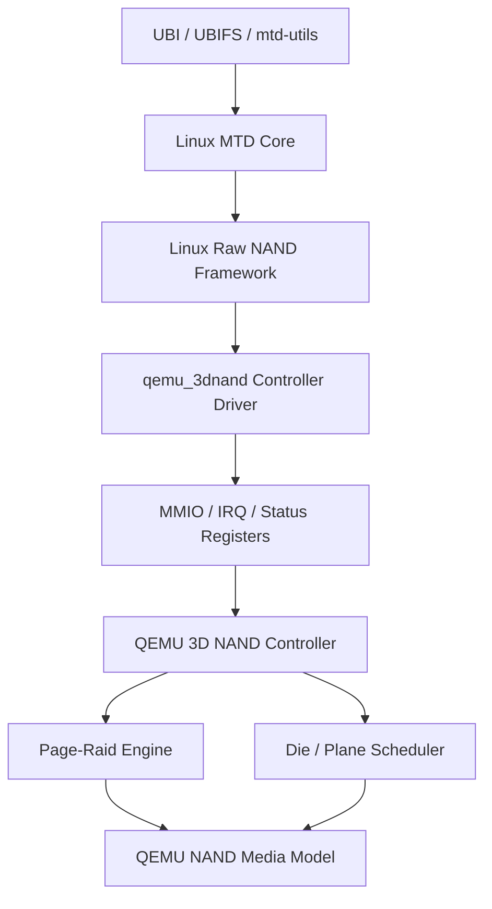

Linux 看到的是一个标准 NAND 设备：

| 层级 | Linux 是否感知 | 说明 |
| --- | --- | --- |
| MTD page | 是 | 标准读写单位 |
| MTD eraseblock | 是 | 标准擦除和坏块管理单位 |
| OOB | 是 | 由 raw NAND/MTD 使用 |
| die | 否 | QEMU 控制器内部调度 |
| plane | 否 | QEMU 控制器内部调度 |
| parity page | 否 | QEMU page-raid 内部使用 |
| stripe | 否 | QEMU page-raid 内部使用 |

## 2. 目标器件几何

本文档按以下指定几何设计 QEMU NAND media model：

| 参数 | 示例值 | 说明 |
| --- | ---: | --- |
| die 数量 | 2 | 用于模拟 die interleave |
| 每 die plane 数量 | 4 | 总计 8 条可并发访问的物理 lane |
| blocks per plane | 247 | 每个 plane 内的 block 数 |
| pages per block | 1600 | 每个 block 内的 page 数 |
| page size | 16 KiB | MTD 可见 main data |
| OOB size | 1 KiB | MTD 可见 OOB |
| 推荐 RAID stripe | 7 + 1 | 7 个 data page + 1 个 parity page，覆盖 8 条 lane |
| parity 算法 | XOR | parity = data0 ^ data1 ^ ... ^ data6 |

容量计算：

| 项 | 计算 | 结果 |
| --- | --- | ---: |
| lane 数量 | `2 dies * 4 planes` | 8 |
| physical block size | `1600 pages * 16KiB` | 25 MiB |
| raw main capacity | `8 lanes * 247 blocks * 1600 pages * 16KiB` | 48.24 GiB |
| MTD visible capacity | `7 data lanes * 247 blocks * 1600 pages * 16KiB` | 42.21 GiB |
| logical eraseblock size | `7 data lanes * 1600 pages * 16KiB` | 175 MiB |
| stripes per block group | `1600 pages/block` | 1600 |

## 3. Page-Raid 原理

Page-raid 是一种以 NAND page 为粒度的冗余保护方式。它把多个 data page 组成一个 stripe，并额外写入 parity page。后续如果 stripe 内某一个 data page 发生 ECC 不可纠错误，控制器可以用同 stripe 内其他 data page 和 parity page 还原损坏 page。

第一版建议使用最简单的 XOR RAID。以 7+1 stripe 为例：

```text
parity = data0 ^ data1 ^ data2 ^ data3 ^ data4 ^ data5 ^ data6
```

当 `data2` 损坏时：

```text
data2 = parity ^ data0 ^ data1 ^ data3 ^ data4 ^ data5 ^ data6
```

### 3.1 Stripe 组成

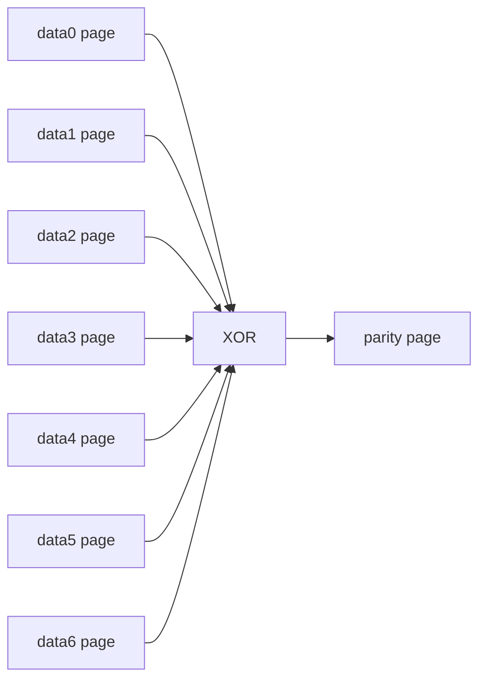

| 成员 | 是否对 MTD 可见 | 作用 |
| --- | --- | --- |
| data0 | 是 | 存放 MTD logical page |
| data1 | 是 | 存放 MTD logical page |
| data2 | 是 | 存放 MTD logical page |
| data3 | 是 | 存放 MTD logical page |
| data4 | 是 | 存放 MTD logical page |
| data5 | 是 | 存放 MTD logical page |
| data6 | 是 | 存放 MTD logical page |
| parity | 否 | 存放 XOR 校验数据 |

在本方案中，MTD 只看到 data page。parity page 是 QEMU 控制器内部页，不计入 Linux 可见容量。

### 3.2 写入原理

写入完整 stripe 时，控制器先收集 7 个 data page，然后计算 parity page，最后把 data 和 parity 写入 NAND media。

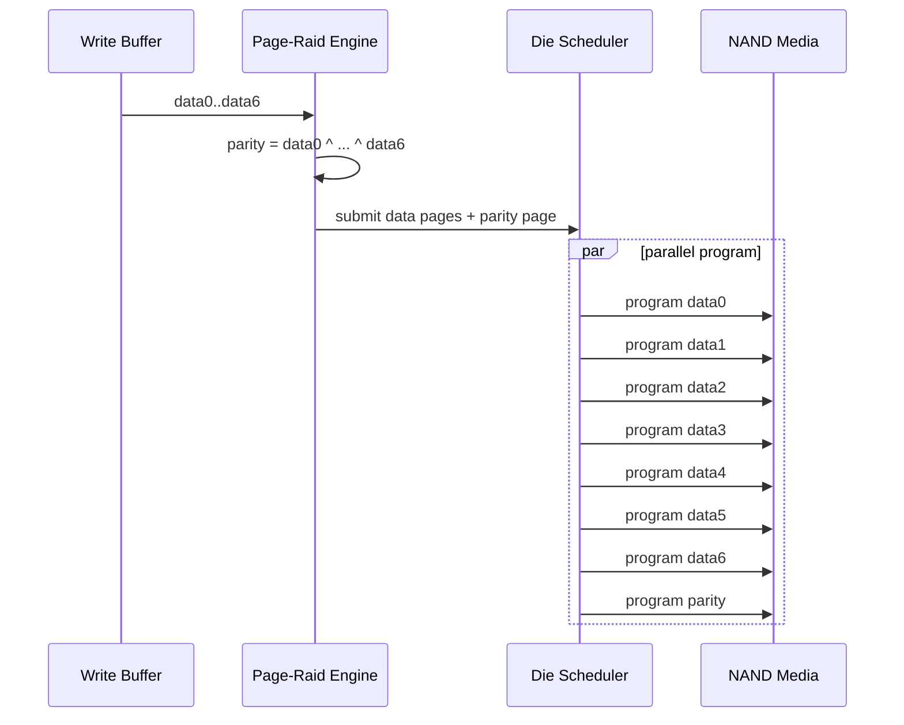

这种方式有一个明显代价：每写入 7 个 data page，需要额外写入 1 个 parity page。

```text
write_amplification = (data_pages + parity_pages) / data_pages
write_amplification = (7 + 1) / 7 = 1.143
```

### 3.3 恢复原理

读取某个 data page 时，控制器先尝试普通 ECC 校验。如果 ECC 可以纠正，则不需要 page-raid 参与。只有当 ECC 判断该 page 不可纠时，才进入 page-raid 恢复。

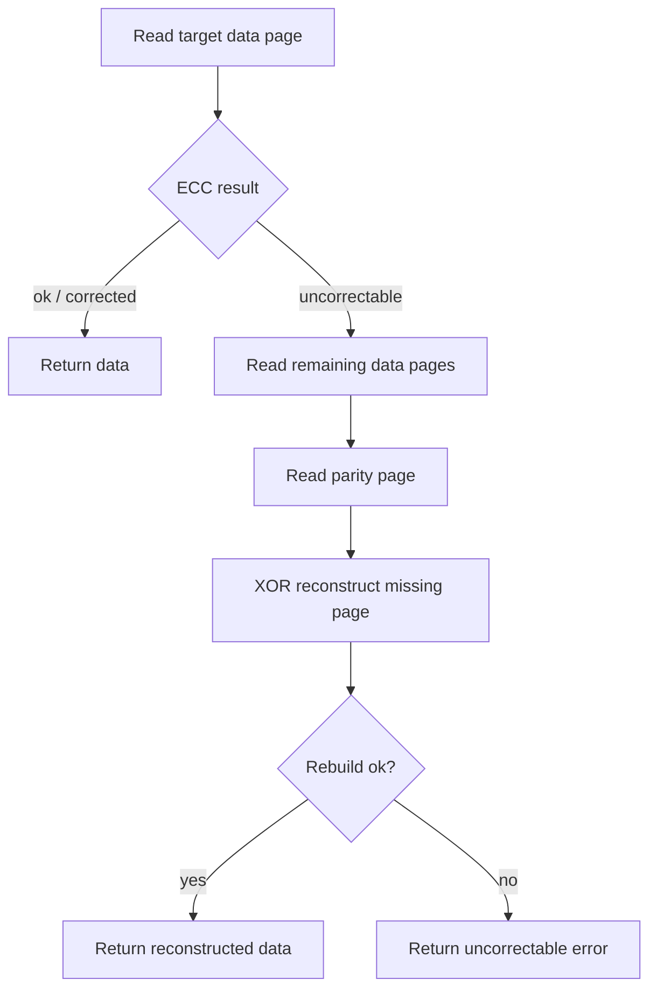

恢复示例：

| Page | 状态 | 恢复时是否读取 |
| --- | --- | --- |
| data0 | 正常 | 是 |
| data1 | 正常 | 是 |
| data2 | ECC 不可纠 | 否，作为待恢复目标 |
| data3 | 正常 | 是 |
| data4 | 正常 | 是 |
| data5 | 正常 | 是 |
| data6 | 正常 | 是 |
| parity | 正常 | 是 |

计算：

```text
recovered_data2 = parity ^ data0 ^ data1 ^ data3 ^ data4 ^ data5 ^ data6
```

### 3.4 与 ECC 的关系

Page-raid 不是 ECC 的替代品，而是 ECC 后面的恢复层。

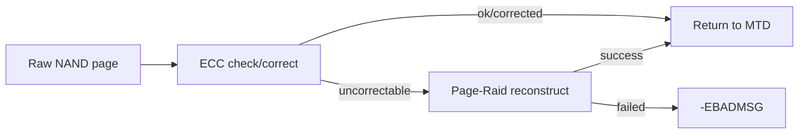

建议错误处理顺序：

| 场景 | 驱动/控制器行为 | MTD 语义 |
| --- | --- | --- |
| ECC 无错误 | 直接返回数据 | 成功 |
| ECC 可纠 | 返回数据和 corrected bit 数 | 成功，但更新 bitflip 统计 |
| ECC 不可纠，RAID 恢复成功 | 返回恢复后的数据，更新 RAID 统计 | 可视为恢复成功 |
| ECC 不可纠，RAID 恢复失败 | 返回错误 | `-EBADMSG` |

### 3.5 能力边界

7+1 XOR page-raid 只能恢复一个 page 失败。

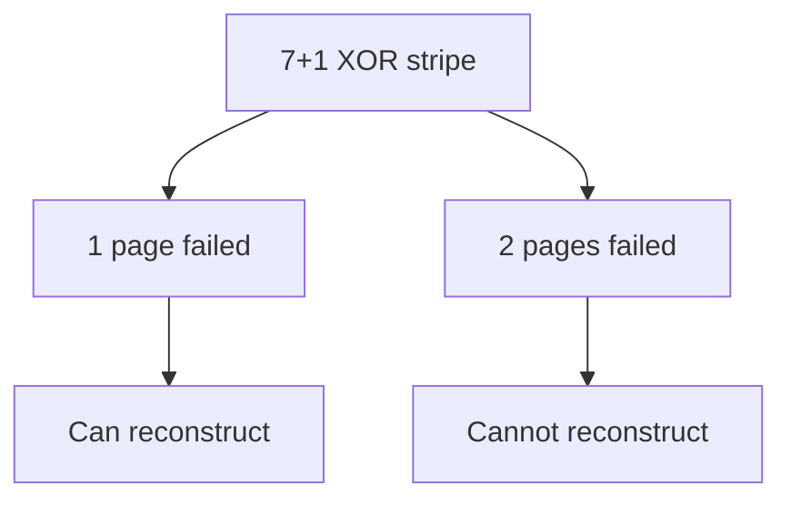

第一版限制：

| 限制 | 原因 |
| --- | --- |
| 只恢复单 page 失败 | XOR parity 只有一个独立校验页 |
| 不保护 OOB | 避免干扰 bad block marker 和 ECC layout；UBI EC/VID header 位于 main area，仍由 page-raid 保护 |
| stripe 不跨 eraseblock | 保持 MTD eraseblock 语义清晰 |
| 不做 partial stripe RAID 元数据持久化 | 未满 stripe 的 data page 必须持久化，但 `parity_valid` 等恢复元数据第一版不保证掉电恢复 |
| 不做动态坏块替换 | 避免第一版退化成 FTL |

## 4. 地址空间关系


核心计算关系：

```text
logical_page = logical_offset / page_size
stripe_index = logical_page / stripe_data_pages
stripe_slot  = logical_page % stripe_data_pages
```

其中：

```text
stripe_data_pages = 7
stripe_total_pages = 8
```

## 5. Stripe 到 Die/Plane 的映射

固定把某一个 plane 用作 parity 会浪费 2 die x 4 plane 的并发能力，也会让 parity plane 成为热点。推荐把每个 die/plane 组合看成一条 lane，并采用 7+1 rotating parity。

```text
lane_id = die_id * planes_per_die + plane_id
lane_id = die_id * 4 + plane_id
lane_count = die_count * planes_per_die = 8
parity_lane = stripe_index % lane_count
data lanes = all lanes except parity_lane
```

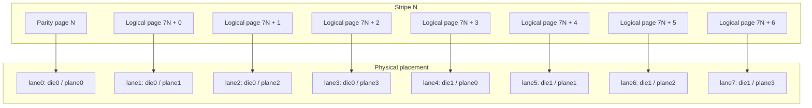

上图展示 `stripe_index % 8 == 0` 时的映射。下一条 stripe 会把 parity 轮转到 lane1，data 使用其他 7 条 lane。

| Stripe N parity lane | Data lanes | 说明 |
| ---: | --- | --- |
| 0 | 1,2,3,4,5,6,7 | parity 在 die0/plane0 |
| 1 | 0,2,3,4,5,6,7 | parity 在 die0/plane1 |
| 2 | 0,1,3,4,5,6,7 | parity 在 die0/plane2 |
| 3 | 0,1,2,4,5,6,7 | parity 在 die0/plane3 |
| 4 | 0,1,2,3,5,6,7 | parity 在 die1/plane0 |
| 5 | 0,1,2,3,4,6,7 | parity 在 die1/plane1 |
| 6 | 0,1,2,3,4,5,7 | parity 在 die1/plane2 |
| 7 | 0,1,2,3,4,5,6 | parity 在 die1/plane3 |

## 6. 逻辑 Eraseblock 与物理 Block Group

为了保持 MTD 语义，stripe 不应跨越逻辑 eraseblock。一个逻辑 eraseblock 对应一个物理 block group。

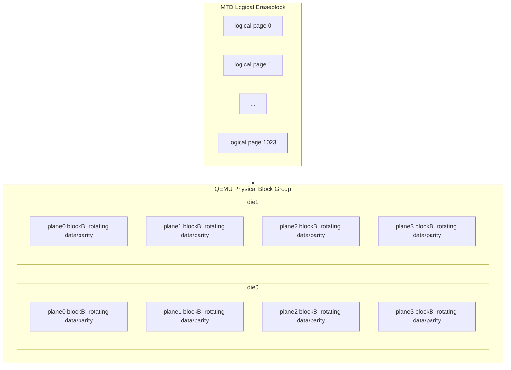

建议第一版约束：

| 项 | 约束 |
| --- | --- |
| stripe 边界 | 不跨逻辑 eraseblock |
| parity page | 不暴露给 MTD |
| erase 操作 | 擦除逻辑 eraseblock 时同步擦除 data blocks 和 parity block |
| bad block | 第一版由 QEMU 控制器隐藏或直接禁用动态坏块替换 |
| OOB | page-raid 不保护 OOB，只保护 main data |

## 7. 读路径

正常读只访问目标 data page。

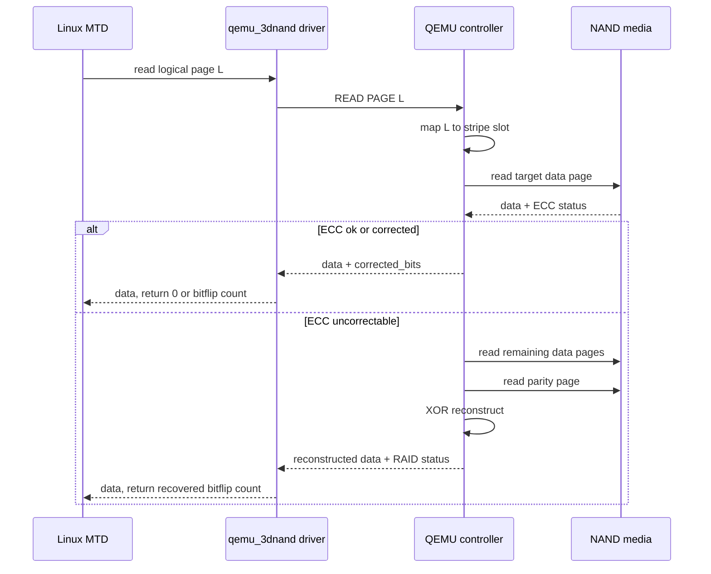

恢复计算：

```text
missing_data = parity ^ xor(all other data pages in the stripe)
```

恢复时跳过损坏的 data page，只 XOR 其他 data page 和 parity page。

## 8. 写路径

第一版不应把已返回成功的数据只保存在易失 stripe buffer 中。更稳妥的方式是：每次 `PROGRAM PAGE` 都立即写入对应 data page；控制器维护 stripe valid bitmap；当 stripe 内所有 data page 都已写入后，再计算并写入 parity page。

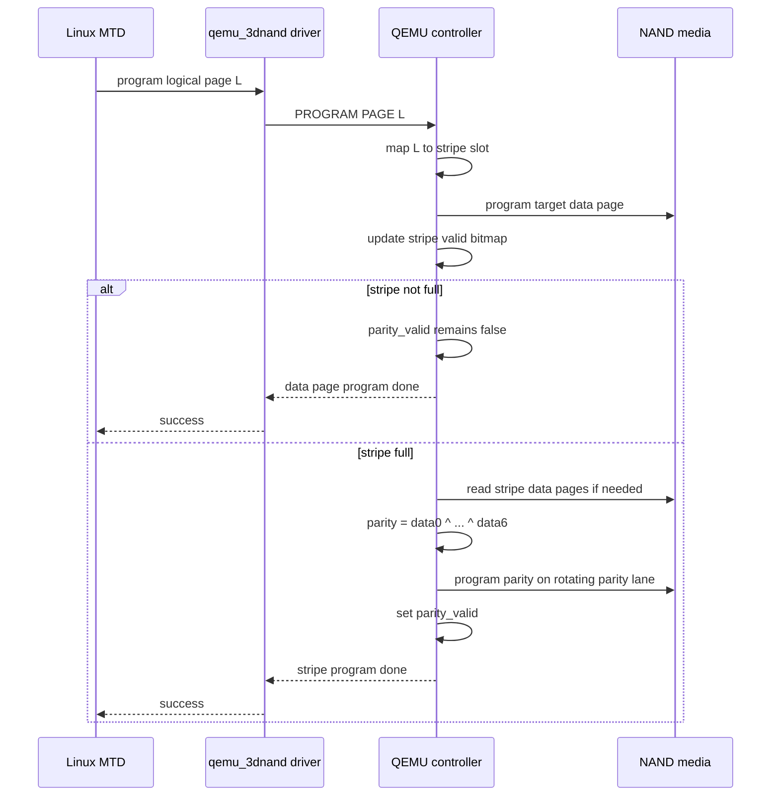

因此，第一版语义是：

| Stripe 状态 | 数据是否持久化 | RAID 是否可恢复 |
| --- | --- | --- |
| stripe 未满 | 已写入的 data page 已持久化 | 否，只能依赖 ECC |
| stripe 已满，parity 写入成功 | data page 和 parity page 均已持久化 | 是，可恢复单 page 失败 |
| parity 写入失败 | data page 已持久化 | 否，应上报或记录 parity invalid |

后续如果要支持掉电后一致恢复，需要把 `stripe valid bitmap` 和 `parity_valid` 做成持久化元数据；第一版可以先在 QEMU 内部状态中维护，并把掉电恢复列为非目标。

## 9. 擦除路径

MTD 发起一次逻辑 eraseblock 擦除，QEMU 内部转换成物理 block group 擦除。

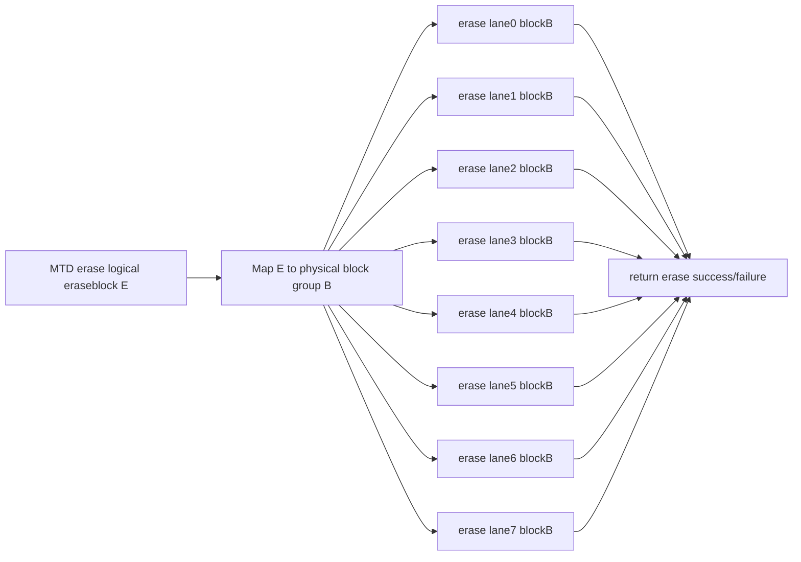

擦除延迟可按并发模型计算：

```text
erase_latency = max(block_erase_latency_per_die) + controller_overhead
```

## 10. 多 Die 并发延迟模型

```mermaid
gantt
    title Stripe Program Latency Model
    dateFormat X
    axisFormat %L

    section Serial
    data0 program :0, 800
    data1 program :800, 800
    data2 program :1600, 800
    data3 program :2400, 800
    data4 program :3200, 800
    data5 program :4000, 800
    data6 program :4800, 800
    parity program :5600, 800

    section Parallel
    data0 program :0, 800
    data1 program :0, 800
    data2 program :0, 800
    data3 program :0, 800
    data4 program :0, 800
    data5 program :0, 800
    data6 program :0, 800
    parity program :0, 800
    controller overhead :800, 80
```

示例：

| 操作 | 串行延迟 | 并发延迟 | 说明 |
| --- | ---: | ---: | --- |
| 7 page read | 700 us | 120 us | 8 lane 中 7 条 data lane 并发读 |
| 7+1 page program | 6400 us | 900 us | data + parity 并发写 |
| block group erase | 15 ms | 3.2 ms | 多 die/plane 并发擦 |
| RAID rebuild read | 700 us | 140 us | 读取剩余 6 个 data page + parity |

## 11. 控制器寄存器建议

Linux 驱动通过私有寄存器配置 QEMU 控制器能力，但 MTD 路径仍走 raw NAND `exec_op()`。

| 寄存器 | 字段 | 说明 |
| --- | --- | --- |
| `CAP0` | `die_count` | die 数量 |
| `CAP0` | `planes_per_die` | 每 die plane 数量 |
| `CAP1` | `raid_supported` | 是否支持 page-raid |
| `RAID_CTRL` | `enable` | 开启 page-raid |
| `RAID_CFG` | `data_pages` | data page 数，例如 7 |
| `RAID_CFG` | `parity_pages` | parity page 数，例如 1 |
| `DIE_CTRL` | `interleave_enable` | 开启 die interleave |
| `DIE_CTRL` | `multiplane_enable` | 开启 multi-plane |
| `ECC_STATUS` | `corrected_bits` | 最近一次读的纠错 bit 数 |
| `ECC_STATUS` | `uncorrectable` | ECC 不可纠 |
| `RAID_STATUS` | `reconstructed` | 最近一次读由 RAID 恢复 |
| `RAID_STATUS` | `reconstruct_failed` | RAID 恢复失败 |
| `PERF_LAST` | `cycles` | 最近一次操作模拟耗时 |

## 12. 示例映射表

假设 `stripe_data_pages = 7`，以下为前 14 个逻辑 page 的映射。

| Logical page | Stripe | Slot | Physical data page | Parity page |
| ---: | ---: | ---: | --- | --- |
| 0 | 0 | 0 | lane1 die0/plane1/block0/page0 | lane0 die0/plane0/block0/page0 |
| 1 | 0 | 1 | lane2 die0/plane2/block0/page0 | lane0 die0/plane0/block0/page0 |
| 2 | 0 | 2 | lane3 die0/plane3/block0/page0 | lane0 die0/plane0/block0/page0 |
| 3 | 0 | 3 | lane4 die1/plane0/block0/page0 | lane0 die0/plane0/block0/page0 |
| 4 | 0 | 4 | lane5 die1/plane1/block0/page0 | lane0 die0/plane0/block0/page0 |
| 5 | 0 | 5 | lane6 die1/plane2/block0/page0 | lane0 die0/plane0/block0/page0 |
| 6 | 0 | 6 | lane7 die1/plane3/block0/page0 | lane0 die0/plane0/block0/page0 |
| 7 | 1 | 0 | lane0 die0/plane0/block0/page1 | lane1 die0/plane1/block0/page1 |
| 8 | 1 | 1 | lane2 die0/plane2/block0/page1 | lane1 die0/plane1/block0/page1 |
| 9 | 1 | 2 | lane3 die0/plane3/block0/page1 | lane1 die0/plane1/block0/page1 |
| 10 | 1 | 3 | lane4 die1/plane0/block0/page1 | lane1 die0/plane1/block0/page1 |
| 11 | 1 | 4 | lane5 die1/plane1/block0/page1 | lane1 die0/plane1/block0/page1 |
| 12 | 1 | 5 | lane6 die1/plane2/block0/page1 | lane1 die0/plane1/block0/page1 |
| 13 | 1 | 6 | lane7 die1/plane3/block0/page1 | lane1 die0/plane1/block0/page1 |

## 13. MTD/UBI 约束与方案影响

本节从 Linux MTD 和 UBI 的视角检查本方案。约束来自当前内核树中的 MTD/UBI 实现，重点文件包括：

| 文件 | 相关内容 |
| --- | --- |
| `include/linux/mtd/mtd.h` | `mtd_info` 中的 `size`、`erasesize`、`writesize`、`writebufsize`、`oobsize`、`bitflip_threshold` |
| `drivers/mtd/ubi/build.c` | UBI attach 时对 PEB、min I/O、write buffer、VID/data offset 的检查 |
| `drivers/mtd/ubi/io.c` | UBI 对 MTD read/write 返回值、bitflip、ECC error 的解释 |
| `drivers/mtd/ubi/eba.c` | UBI 写入 LEB 数据时按 `min_io_size` 对齐 |

### 13.1 MTD/UBI 看到的设备模型

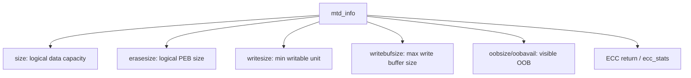

对本方案来说，Linux 可见容量必须只包含 data page，不包含 parity page。

| MTD 字段 | 推荐值 | 对 page-raid 的约束 |
| --- | --- | --- |
| `mtd->size` | 逻辑 data 容量 | 不能把 parity page 计入容量 |
| `mtd->erasesize` | 逻辑 eraseblock data 容量 | 必须对应一个完整 physical block group |
| `mtd->writesize` | 16 KiB | 暴露真实 NAND page，满足原生 raw NAND/UBI 假设 |
| `mtd->writebufsize` | 16 KiB | 与 `writesize` 相同，满足 UBI attach 检查 |
| `mtd->oobsize` | 每个 data page 的 OOB | parity page 的 OOB 不暴露 |
| `mtd->bitflip_threshold` | ECC threshold | RAID 恢复成功时应触发可观测统计 |

### 13.2 最小 I/O 单元约束

UBI attach 时使用 `mtd->writesize` 作为 `min_io_size`。当前 UBI 实现要求：

```text
min_io_size = mtd->writesize
min_io_size must be power of 2
writebufsize >= min_io_size
writebufsize % min_io_size == 0
writebufsize must be power of 2
```

在不修改 MTD/raw NAND/UBI 原生代码的前提下，本方案固定采用：

```text
mtd->writesize = 16KiB
mtd->writebufsize = 16KiB
UBI min_io_size = 16KiB
```

也就是说，MTD/UBI 看到真实 NAND page。7+1 page-raid stripe 是 QEMU 控制器内部恢复单元，不暴露为 UBI 最小 I/O 单元。

对 64KiB/112KiB super-page 的结论：

| 模型 | 在当前前提下是否采用 | 原因 |
| --- | --- | --- |
| 16KiB page-visible | 采用 | 最贴近 raw NAND，且不需要修改内核基础层 |
| 64KiB stripe-visible | 不采用 | 虽然是 2 的幂，但需要把 4 个物理 page 虚拟成 1 个 MTD page，偏离标准 raw NAND 控制器模型 |
| 112KiB stripe-visible | 不采用 | 7 data page 对应 112KiB，不满足 UBI 原生 2 的幂 `min_io_size` 假设 |

影响结论：**page-raid 不作为 MTD/UBI 可见的原子写入单元**。它只在完整 stripe 写满并生成 parity 后提供增强恢复能力；未满 stripe 的 page 仍必须立即持久化，但暂时没有 RAID 保护。

### 13.3 可选方案矩阵

在“不修改 MTD/raw NAND/UBI 原生代码”的前提下，可以把设计目标分成四类。它们的主要差异不是 QEMU 内部能不能并行，而是 **MTD/UBI 每次最小写入能否天然提供足够多的 page 给控制器并行调度，以及 parity 是跟随 data stripe 同步写入，还是写入独立的版本化 parity log block**。

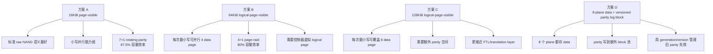

#### 13.3.1 方案 A：兼容优先，16KiB page-visible

这是当前推荐的第一版方案。

| 项 | 设计 |
| --- | --- |
| MTD 可见 page | 16KiB |
| `mtd->writesize` | 16KiB |
| `mtd->writebufsize` | 16KiB |
| UBI `min_io_size` | 16KiB |
| RAID stripe | 7 data page + 1 parity page |
| 物理 stripe 总大小 | `8 * 16KiB = 128KiB` |
| MTD 可见 data stripe | `7 * 16KiB = 112KiB`，但不暴露给 UBI |
| 容量效率 | `7 / 8 = 87.5%` |
| 小写行为 | 每个 16KiB page 立即持久化，stripe 未满时暂无 RAID 恢复 |
| 并行性能 | 依赖较大的连续 `mtd_write()` 或控制器内部聚合 |
| 内核基础层修改 | 不需要 |

要求：

| 要求 | 说明 |
| --- | --- |
| data page 立即落盘 | MTD 写返回成功后，16KiB 数据必须可读回 |
| stripe valid bitmap | QEMU 控制器记录哪些 data page 已写入 |
| parity 延迟生成 | 7 个 data page 都有效后生成 parity |
| parity 不暴露 | MTD 容量不包含 parity page |
| RAID 统计独立导出 | 通过 debugfs/sysfs 或私有寄存器暴露 |

限制：

| 限制 | 影响 |
| --- | --- |
| 16KiB 小写不能天然并行 | workload 如果长期单 page 同步写，性能接近单 lane |
| 未满 stripe 无 RAID 保护 | 只能依赖 ECC |
| open stripe 掉电恢复需要额外元数据 | 第一版可列为非目标 |
| UBI 不知道 stripe | UBI 无法主动按 stripe 边界调度 |

适用场景：

| 场景 | 适合度 |
| --- | --- |
| 验证标准 raw NAND/MTD 接入 | 高 |
| 验证 UBI/UBIFS 基本兼容 | 高 |
| 验证大块连续写的并行收益 | 中到高 |
| 验证 16KiB 小写低延迟并行 | 低 |

#### 13.3.2 方案 B：性能优先，64KiB logical-page-visible

这个方案让 MTD/UBI 看到一个控制器虚拟出来的 64KiB logical page。每个 logical page 由 4 个 16KiB physical data page 组成，控制器额外写 1 个隐藏 parity page。

| 项 | 设计 |
| --- | --- |
| MTD 可见 page | 64KiB logical page |
| `mtd->writesize` | 64KiB |
| `mtd->writebufsize` | 64KiB |
| UBI `min_io_size` | 64KiB |
| RAID stripe | 4 data page + 1 parity page |
| 物理 stripe 总大小 | `5 * 16KiB = 80KiB` |
| MTD 可见 data stripe | `4 * 16KiB = 64KiB` |
| 容量效率 | `4 / 5 = 80%` |
| 小写行为 | 每次 UBI 最小写天然填满 data stripe |
| 并行性能 | 单次最小写可并行 4 data page，并额外写 parity |
| 内核基础层修改 | 不需要，但驱动/QEMU 需要虚拟 logical page |

要求：

| 要求 | 说明 |
| --- | --- |
| 控制器虚拟 logical page | raw NAND scan 或驱动呈现 64KiB page geometry |
| OOB 映射重定义 | 需要定义 64KiB logical page 对应的 OOB 聚合方式 |
| ECC 汇总 | 4 个 physical page 的 ECC/RAID 状态要汇总成一次 MTD read 结果 |
| parity page 隐藏 | parity 不计入 MTD 容量 |
| bad block group 化 | 任一参与 lane 失败时映射到 logical bad block 策略 |

限制：

| 限制 | 影响 |
| --- | --- |
| 不再暴露真实 NAND page | 语义更像控制器虚拟 NAND geometry |
| 容量效率低于 7+1 | 80%，额外浪费 7.5 个百分点 |
| 8 lane 不能被单个 4+1 stripe 完全利用 | 每个 4+1 stripe 使用 5 条 lane，剩余 3 条 lane 需要靠多请求调度利用 |
| OOB/ECC 复杂度更高 | logical page 的 OOB 需要聚合或重新定义 |

适用场景：

| 场景 | 适合度 |
| --- | --- |
| 验证每次 UBI 最小写都触发并行 | 高 |
| 验证小写性能 | 高 |
| 保持真实 raw NAND page 语义 | 低 |
| 追求最高容量效率 | 中低 |

#### 13.3.3 方案 C：研究型，128KiB logical-page-visible

这个方案让 MTD/UBI 看到 128KiB logical page，即 8 个 16KiB data page。它满足 UBI 2 次幂 `min_io_size` 约束，但当前 8 lane 几何没有第 9 条 lane 容纳 parity。

| 项 | 设计 |
| --- | --- |
| MTD 可见 page | 128KiB logical page |
| `mtd->writesize` | 128KiB |
| UBI `min_io_size` | 128KiB |
| data pages | 8 |
| parity pages | 需要额外隐藏 page/row/block |
| 容量效率 | 取决于 parity 空间安排 |
| 内核基础层修改 | 不需要，但 QEMU/驱动映射复杂 |

可选 parity 空间：

| parity 位置 | 影响 |
| --- | --- |
| 额外 row | data row 和 parity row 分离，写放大增加 |
| 保留部分 block | 容量损失明显，坏块管理复杂 |
| 专用 parity region | 更像 FTL，需要元数据和恢复策略 |

限制：

| 限制 | 影响 |
| --- | --- |
| 8 lane 已全部用于 data | parity 必须放到额外物理位置 |
| 写放大更高 | 至少 8 data + 1 parity |
| 映射层复杂 | 需要 logical page 到 data/parity region 的转换 |
| 不适合第一版 | 已接近 translation layer/FTL 设计 |

#### 13.3.4 方案 D：8-plane data + versioned parity log block

这个方案保留 8 个 plane 的 data 并行能力，不再把某一条 lane 或某一个 page 位置固定用作 parity。247 个 block 中划分出一部分作为 data block pool，一部分作为 parity log block pool。parity block 中存放的是带版本号的 parity record，旧 parity 不原地更新，而是通过版本号失效，新 parity 追加写入新的 page。

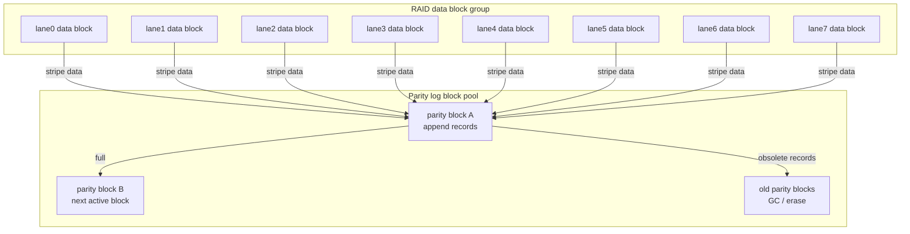

核心变化：

| 项 | 设计 |
| --- | --- |
| MTD 可见 page | 可保持 16KiB，或作为后续 profile 暴露 128KiB logical page |
| data lane | 8 条 lane 全部存 data |
| parity 位置 | 额外 parity log block pool |
| parity 写入方式 | append-only，新版本写到新 page |
| parity 失效方式 | 通过 data block generation 和 parity version 判断 |
| data block erase | 不要求同步 erase parity block |
| parity block erase | 由 QEMU 内部 GC 回收 |
| 内核基础层修改 | 不需要 |

版本化 parity record 建议格式：

```c
struct q3n_parity_record {
    uint64_t group_id;
    uint32_t stripe_index;
    uint32_t parity_version;
    uint32_t data_block_generation[8];
    uint32_t record_crc;
    uint8_t  valid_marker;
    uint8_t  parity_payload[16384];
};
```

其中 `data_block_generation[]` 是关键字段。每个 data block 被 erase 后，对应 generation 递增。旧 parity record 即使还留在 parity block 中，也会因为 generation 不匹配而自动失效。

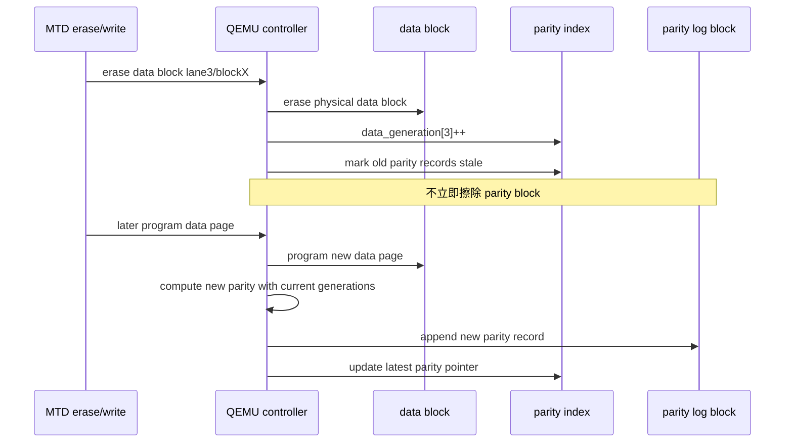

这种设计下，擦除 data block 后 parity 可能短暂处于 `STALE` 状态：

| parity 状态 | 含义 | 读恢复能力 |
| --- | --- | --- |
| `VALID` | parity record 的 generation 与当前 data blocks 匹配 | 可恢复同 stripe 单 page 失败 |
| `STALE` | 某个 data block 已 erase 或重写，旧 parity generation 不匹配 | 不能用于恢复当前数据 |
| `REBUILDING` | 控制器正在计算并追加新 parity record | 取决于是否已有旧 valid record |
| `LOST` | parity block 损坏或找不到有效版本 | 只能依赖 ECC |

要求：

| 要求 | 说明 |
| --- | --- |
| parity index | QEMU 需要维护 `(group_id, stripe_index) -> latest parity record` |
| generation 持久化 | 若要支持 QEMU 重启/掉电恢复，需要 checkpoint metadata |
| parity log GC | parity block 写满后，需要迁移仍有效 record 并 erase 旧 block |
| parity block reserve | 247 个 block 中必须预留 parity log、metadata/checkpoint、坏块替换空间 |
| recovery 状态上报 | RAID 恢复、stale parity、lost parity 需要独立统计和 debug 输出 |

优点：

| 优点 | 说明 |
| --- | --- |
| 8 个 plane 都能存 data | 不浪费固定 parity plane |
| parity 不原地更新 | 符合 NAND page append/program 约束 |
| data erase 不阻塞 parity erase | 擦除 data block 只递增 generation，旧 parity 后台 GC |
| parity 热点可轮转 | parity log block 可在 8 个 plane 的 block 池中轮转 |
| 适合验证并行性能 | data phase 可以覆盖 8 lane |

限制：

| 限制 | 影响 |
| --- | --- |
| 已接近轻量 FTL | 需要 version、index、GC、checkpoint |
| parity stale 窗口 | data generation 更新后，新 parity 追加前不能 RAID 恢复 |
| 元数据一致性复杂 | QEMU 崩溃/重启后需要重放 parity log 或读取 checkpoint |
| 写放大增加 | data write 之外还要追加 parity record，GC 也会产生额外写 |
| 坏块处理复杂 | data block、parity block、metadata block 坏块策略都要定义 |

容量规划示例：

| block 类型 | 示例数量/plane | 总 block 数 | 说明 |
| --- | ---: | ---: | --- |
| data block pool | 224 | 1792 | 主数据容量 |
| parity log block pool | 16 | 128 | 版本化 parity record |
| metadata/checkpoint block | 3 | 24 | generation、parity index checkpoint |
| bad block reserve | 4 | 32 | 模拟坏块和替换余量 |
| 合计 | 247 | 1976 | 当前几何总量 |

这个划分只是一个可调示例。QEMU 可以通过设备参数暴露：

```text
raid_profile=versioned-parity-log
data_blocks_per_plane=224
parity_log_blocks_per_plane=16
metadata_blocks_per_plane=3
reserve_blocks_per_plane=4
```

#### 13.3.5 方案选择建议

| 目标 | 建议方案 |
| --- | --- |
| 标准 MTD/raw NAND 兼容优先 | 方案 A：16KiB page-visible |
| 验证多 die/plane 对小写性能的提升 | 方案 B：64KiB logical-page-visible |
| 验证最大并行宽度和 super-page 模型 | 方案 C：128KiB logical-page-visible，仅作研究 |
| 验证 8 plane 全 data、parity 异步追加、版本化恢复 | 方案 D：versioned parity log block |
| 当前第一版实现 | 方案 A |
| 后续性能 profile | 方案 B |
| 后续高级可靠性/性能 profile | 方案 D |

建议第一版先实现方案 A，并在 QEMU/驱动能力稳定后增加方案 B 作为可切换 profile：

```text
raid_profile=compat-16k-7p1
raid_profile=perf-64k-4p1
raid_profile=versioned-parity-log
```

#### 13.3.6 各方案示例映射表

以下示例均使用当前 lane 编号：

| Lane | 物理位置 |
| ---: | --- |
| 0 | die0 / plane0 |
| 1 | die0 / plane1 |
| 2 | die0 / plane2 |
| 3 | die0 / plane3 |
| 4 | die1 / plane0 |
| 5 | die1 / plane1 |
| 6 | die1 / plane2 |
| 7 | die1 / plane3 |

##### 方案 A：16KiB page-visible，7+1 rotating parity

每个 MTD logical page 对应一个 16KiB physical data page。每 7 个 MTD logical page 组成一个内部 RAID stripe，parity lane 按 stripe 轮转。

| MTD logical page | Stripe | Slot | Physical data page | Hidden parity page |
| ---: | ---: | ---: | --- | --- |
| 0 | 0 | 0 | lane1 die0/plane1/block0/page0 | lane0 die0/plane0/block0/page0 |
| 1 | 0 | 1 | lane2 die0/plane2/block0/page0 | lane0 die0/plane0/block0/page0 |
| 2 | 0 | 2 | lane3 die0/plane3/block0/page0 | lane0 die0/plane0/block0/page0 |
| 3 | 0 | 3 | lane4 die1/plane0/block0/page0 | lane0 die0/plane0/block0/page0 |
| 4 | 0 | 4 | lane5 die1/plane1/block0/page0 | lane0 die0/plane0/block0/page0 |
| 5 | 0 | 5 | lane6 die1/plane2/block0/page0 | lane0 die0/plane0/block0/page0 |
| 6 | 0 | 6 | lane7 die1/plane3/block0/page0 | lane0 die0/plane0/block0/page0 |
| 7 | 1 | 0 | lane0 die0/plane0/block0/page1 | lane1 die0/plane1/block0/page1 |
| 8 | 1 | 1 | lane2 die0/plane2/block0/page1 | lane1 die0/plane1/block0/page1 |
| 9 | 1 | 2 | lane3 die0/plane3/block0/page1 | lane1 die0/plane1/block0/page1 |
| 10 | 1 | 3 | lane4 die1/plane0/block0/page1 | lane1 die0/plane1/block0/page1 |
| 11 | 1 | 4 | lane5 die1/plane1/block0/page1 | lane1 die0/plane1/block0/page1 |
| 12 | 1 | 5 | lane6 die1/plane2/block0/page1 | lane1 die0/plane1/block0/page1 |
| 13 | 1 | 6 | lane7 die1/plane3/block0/page1 | lane1 die0/plane1/block0/page1 |

##### 方案 B：64KiB logical-page-visible，4+1 grouped parity

每个 MTD logical page 对应 4 个 16KiB physical data page。为了让 8 条 lane 都有机会参与，示例采用两个 group 交替：

```text
group0 lanes = 0,1,2,3,4
group1 lanes = 4,5,6,7,0
```

其中每个 group 内 4 条 lane 存 data，1 条 lane 存 hidden parity。parity lane 在 group 内轮转，避免固定热点。

| MTD logical page | Group | Data physical pages | Hidden parity page |
| ---: | ---: | --- | --- |
| 0 | 0 | lane1 d0/p1/b0/p0; lane2 d0/p2/b0/p0; lane3 d0/p3/b0/p0; lane4 d1/p0/b0/p0 | lane0 d0/p0/b0/p0 |
| 1 | 1 | lane4 d1/p0/b0/p1; lane6 d1/p2/b0/p1; lane7 d1/p3/b0/p1; lane0 d0/p0/b0/p1 | lane5 d1/p1/b0/p1 |
| 2 | 0 | lane0 d0/p0/b0/p2; lane2 d0/p2/b0/p2; lane3 d0/p3/b0/p2; lane4 d1/p0/b0/p2 | lane1 d0/p1/b0/p2 |
| 3 | 1 | lane4 d1/p0/b0/p3; lane5 d1/p1/b0/p3; lane7 d1/p3/b0/p3; lane0 d0/p0/b0/p3 | lane6 d1/p2/b0/p3 |
| 4 | 0 | lane0 d0/p0/b0/p4; lane1 d0/p1/b0/p4; lane3 d0/p3/b0/p4; lane4 d1/p0/b0/p4 | lane2 d0/p2/b0/p4 |
| 5 | 1 | lane4 d1/p0/b0/p5; lane5 d1/p1/b0/p5; lane6 d1/p2/b0/p5; lane0 d0/p0/b0/p5 | lane7 d1/p3/b0/p5 |

说明：

| 项 | 说明 |
| --- | --- |
| MTD logical page size | 64KiB |
| 每行 data physical pages | 4 个 16KiB page |
| 每行 hidden parity | 1 个 16KiB page |
| parity 轮转 | group0 在 lane0/1/2/3/4 内轮转，group1 在 lane4/5/6/7/0 内轮转 |
| lane 复用 | lane0 和 lane4 同时参与两个 group，用于减少空闲 lane，但调度需避免同一时刻冲突 |

##### 方案 C：128KiB logical-page-visible，8+1 hidden parity

每个 MTD logical page 对应 8 个 16KiB physical data page，正好占满 8 条 lane。由于没有第 9 条 lane，parity 必须放到额外 row、额外 block 或专用 parity region。

下面示例使用“下一 row 的 lane0 作为 parity”展示映射。该策略只是研究示例，不建议第一版采用。

| MTD logical page | Data physical pages | Hidden parity page |
| ---: | --- | --- |
| 0 | lane0 d0/p0/b0/p0; lane1 d0/p1/b0/p0; lane2 d0/p2/b0/p0; lane3 d0/p3/b0/p0; lane4 d1/p0/b0/p0; lane5 d1/p1/b0/p0; lane6 d1/p2/b0/p0; lane7 d1/p3/b0/p0 | lane0 d0/p0/b0/p1 |
| 1 | lane1 d0/p1/b0/p1; lane2 d0/p2/b0/p1; lane3 d0/p3/b0/p1; lane4 d1/p0/b0/p1; lane5 d1/p1/b0/p1; lane6 d1/p2/b0/p1; lane7 d1/p3/b0/p1; lane0 d0/p0/b0/p2 | lane1 d0/p1/b0/p2 |
| 2 | lane2 d0/p2/b0/p2; lane3 d0/p3/b0/p2; lane4 d1/p0/b0/p2; lane5 d1/p1/b0/p2; lane6 d1/p2/b0/p2; lane7 d1/p3/b0/p2; lane0 d0/p0/b0/p3; lane1 d0/p1/b0/p3 | lane2 d0/p2/b0/p3 |

限制：

| 限制 | 说明 |
| --- | --- |
| data/parity row 交错 | 某些 physical row 同时被前后 logical page 使用，调度和恢复复杂 |
| parity 位置不自然 | 需要额外 metadata 记录或固定算法约束 |
| erase 一致性复杂 | parity 可能和 data 分布在不同 row，坏块/擦除语义更难维护 |
| 不适合第一版 | 更接近控制器内部 translation layer |

##### 方案 D：8-plane data + versioned parity log block

每个 stripe 使用 8 条 lane 存 data。parity 不占用同一 row 的 lane，而是追加写入 parity log block。下面示例中，data group 使用每条 lane 的 `block0`，parity log 使用 lane0 的 `block240` 和 lane1 的 `block240` 轮转；实际实现中 parity log block 应在所有 lane 上轮转，避免热点。

| Stripe | Data physical pages | Parity log record |
| ---: | --- | --- |
| 0 | lane0 d0/p0/b0/page0; lane1 d0/p1/b0/page0; lane2 d0/p2/b0/page0; lane3 d0/p3/b0/page0; lane4 d1/p0/b0/page0; lane5 d1/p1/b0/page0; lane6 d1/p2/b0/page0; lane7 d1/p3/b0/page0 | lane0 d0/p0/b240/page0, version 1 |
| 1 | lane0 d0/p0/b0/page1; lane1 d0/p1/b0/page1; lane2 d0/p2/b0/page1; lane3 d0/p3/b0/page1; lane4 d1/p0/b0/page1; lane5 d1/p1/b0/page1; lane6 d1/p2/b0/page1; lane7 d1/p3/b0/page1 | lane0 d0/p0/b240/page1, version 1 |
| 2 | lane0 d0/p0/b0/page2; lane1 d0/p1/b0/page2; lane2 d0/p2/b0/page2; lane3 d0/p3/b0/page2; lane4 d1/p0/b0/page2; lane5 d1/p1/b0/page2; lane6 d1/p2/b0/page2; lane7 d1/p3/b0/page2 | lane0 d0/p0/b240/page2, version 1 |
| 1600 | lane0 d0/p0/b1/page0; lane1 d0/p1/b1/page0; lane2 d0/p2/b1/page0; lane3 d0/p3/b1/page0; lane4 d1/p0/b1/page0; lane5 d1/p1/b1/page0; lane6 d1/p2/b1/page0; lane7 d1/p3/b1/page0 | lane1 d0/p1/b240/page0, version 1 |

data block erase 后的版本变化示例：

| 操作 | data generation | parity record 结果 |
| --- | --- | --- |
| 初始写 stripe0 | `[1,1,1,1,1,1,1,1]` | `b240/page0 version1 VALID` |
| erase lane3/block0 | `[1,1,1,2,1,1,1,1]` | `b240/page0 version1 STALE` |
| 重写 stripe0 | `[1,1,1,2,1,1,1,1]` | append `b240/page3 version2 VALID` |
| parity GC | 保留 version2 | version1 所在 page 不复制 |

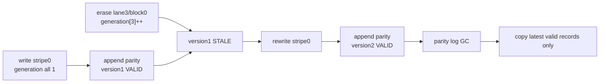

### 13.4 Eraseblock/PEB 约束

UBI 把 `mtd->erasesize` 当作 physical eraseblock，也就是 PEB 大小：

```text
ubi->peb_size = mtd->erasesize
ubi->peb_count = mtd->size / mtd->erasesize
```

方案 A/B/C 必须保证一个 MTD logical eraseblock 对应一个完整 QEMU physical block group。方案 D 不要求 parity block 与 data block 同步擦除，但必须保证 MTD 可见 eraseblock 的 data generation 更新与 QEMU 内部 parity index 一致。

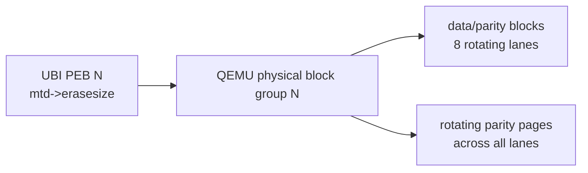

约束：

| 约束 | 对方案的影响 |
| --- | --- |
| `mtd->size` 应为 `mtd->erasesize` 的整数倍 | 逻辑容量计算必须丢掉 parity 容量 |
| stripe 不跨 PEB | 已在方案中要求，不需要改动 |
| erase PEB 时必须擦除 block group 内全部 data lane | QEMU erase 路径必须同步更新 data block generation |
| erase 成功返回前，physical block group 必须处于一致状态 | A/B/C 需要同步处理 data/parity；D 需要把旧 parity 标记为 stale |

影响结论：现有“logical eraseblock -> physical block group”的设计是正确的，但实现时必须把 8 条 lane 中的 rotating parity 视为同一个 PEB 的隐藏成员。按指定几何，7+1 映射下可见 eraseblock 大小为：

```text
logical_erasesize = physical_block_size * 7
physical_block_size = 1600 pages * 16KiB = 25MiB
logical_erasesize = 25MiB * 7 = 175MiB
```

UBI 不要求 `erasesize` 是 2 的幂，因此 175MiB 的 PEB 可以作为模拟目标。但这个 PEB 很大，会让 wear leveling、坏块保留和测试写入粒度变粗。第一版可以接受这个约束，以保证地址映射简单；若后续需要更小的 MTD eraseblock，需要在 QEMU 控制器内部把一个 physical block group 切成多个 logical erase regions，但这会让擦除、坏块和 parity 元数据语义复杂化。

#### 13.4.1 空间开销

7+1 rotating parity 的容量效率为：

```text
capacity_efficiency = data_lanes / total_lanes = 7 / 8 = 87.5%
parity_overhead = 1 / 8 = 12.5%
```

按指定几何：

| 项 | 值 |
| --- | ---: |
| Raw main capacity | 48.24 GiB |
| MTD visible capacity | 42.21 GiB |
| Hidden parity capacity | 6.03 GiB |
| Capacity efficiency | 87.5% |
| Parity overhead | 12.5% |

这部分空间浪费是 page-raid 冗余本身带来的，不是 MTD/UBI 2 次幂限制导致的。

在“不修改 MTD/UBI 原生代码”的前提下，另一个代价是 7 个 16KiB page 组成的 112KiB stripe 不能作为 UBI 可见 `min_io_size`。因此：

| 情况 | 结果 |
| --- | --- |
| stripe 已满并写入 parity | 具备 page-raid 恢复能力 |
| stripe 未满 | data page 已持久化，但暂时只能依赖 ECC |
| power cut 后需要恢复 open stripe RAID 状态 | 第一版不保证，除非额外持久化 stripe metadata |

这不是容量损失，而是恢复能力的时间窗口限制。

### 13.5 UBI EC/VID Header 布局约束

UBI 在每个 PEB 内写 EC header、VID header 和用户数据：


约束：

| 项 | UBI 约束 | 对 page-raid 的影响 |
| --- | --- | --- |
| EC header | 固定从 PEB offset 0 开始 | 该 page 也必须被 RAID 保护 |
| VID header | 默认在 EC 后按 header min I/O 对齐 | 不能因 stripe 映射改变可见 offset |
| data offset | 必须按 `min_io_size` 对齐 | `writesize=16KiB` 时天然对齐 |
| header CRC | UBI 会校验 header 内容 | RAID 恢复后必须返回原始字节 |

影响结论：文档前面“page-raid 只保护 main data，不保护 OOB”的说法与 UBI 是兼容的，因为 EC/VID header 位于 main area，不在 OOB。QEMU RAID 必须保护完整 main page，包括其中可能存放的 UBI header。

### 13.6 OOB 与坏块约束

raw NAND/MTD 使用 OOB 保存 ECC、坏块标记和可用 OOB 数据。UBI 本身主要使用 main area 中的 EC/VID header，不依赖 OOB 存储元数据。

```mermaid
flowchart TB
    PAGE["Visible data page"]
    MAIN["main area<br/>protected by page-raid"]
    OOB["OOB<br/>not protected by page-raid"]
    BBM["bad block marker"]
    ECCP["ECC parity / metadata"]

    PAGE --> MAIN
    PAGE --> OOB
    OOB --> BBM
    OOB --> ECCP
```

约束：

| 项 | 建议 |
| --- | --- |
| parity page OOB | 不暴露给 Linux |
| data page OOB | 保持标准 raw NAND OOB 语义 |
| bad block marker | 不参与 XOR parity |
| ECC parity | 不参与 page-raid XOR；由 ECC 模拟路径独立处理 |
| logical bad block | 第一版建议以 physical block group 为单位标坏 |

影响结论：现有方案“不保护 OOB”是合适的，但坏块粒度要从单个 physical block 提升为 block group。只要 group 内任一 data/parity block 不可用，第一版可以把整个 logical PEB 标为 bad。

### 13.7 Read/ECC 返回值约束

UBI 对 MTD 读返回值非常敏感：

```mermaid
flowchart TB
    READ["mtd_read"]
    OK["0<br/>clean read"]
    BIT["-EUCLEAN / bitflip<br/>UBI_IO_BITFLIPS"]
    BAD["-EBADMSG<br/>data integrity error"]
    IO["-EIO<br/>I/O error"]

    READ --> OK
    READ --> BIT
    READ --> BAD
    READ --> IO
```

建议映射：

| QEMU 结果 | 驱动应上报 | UBI 行为 |
| --- | --- | --- |
| ECC clean | success | 正常读取 |
| ECC corrected below threshold | success 或 bitflip count | 正常读取，统计 corrected |
| ECC corrected over threshold | `-EUCLEAN` 语义 | UBI 可能触发 scrub |
| ECC uncorrectable + RAID recovered | 建议按 `-EUCLEAN` 语义上报，并增加 RAID 统计 | 数据可用，但提示该 PEB 需要搬迁 |
| ECC uncorrectable + RAID failed | `-EBADMSG` | UBI 认为数据完整性错误 |
| 未读满请求长度 | 不应返回 `-EBADMSG` | UBI 会把这类行为视为驱动错误 |

影响结论：RAID 恢复成功时不要静默返回普通成功。更稳妥的方式是返回可纠错/bitflip 语义，让 UBI 有机会 scrub 或搬迁该 PEB。

### 13.8 写入同步性与 Stripe Buffer 风险

MTD 写操作返回成功后，上层会认为数据已经写入设备。UBI 还会在写入后回读 VID header 或数据进行校验。因此，控制器不能把已返回成功的数据只保存在易失 stripe buffer 中。

之前的第一版写路径中有如下简化：

```text
stripe not full -> program accepted -> return success
```

这对功能 smoke test 可以工作，但严格来说不满足持久化语义。

```mermaid
flowchart TB
    W0["MTD writes page0"]
    ACK["controller returns success"]
    BUF["page0 only in stripe buffer"]
    CUT["power cut / reset"]
    LOST["page0 lost or parity missing"]
    BAD["UBI sees corruption"]

    W0 --> ACK --> BUF --> CUT --> LOST --> BAD
```

可选修正方案：

| 方案 | 说明 | 是否推荐 |
| --- | --- | --- |
| A. 仅用于无掉电 smoke test | stripe 未满也可先缓存 | 只适合最早期验证 |
| B. 每 page 立即写 data，stripe 满后补写 parity | 简单，但 stripe 未满期间无法 RAID 恢复 | 推荐第一版采用，并明确限制 |
| C. 控制器维护持久化 open-stripe metadata | 可支持掉电恢复，但复杂度上升 | 第二阶段 |
| D. 内部日志/重映射支持 parity RMW | 接近 FTL，复杂 | 不建议第一版 |

第一版建议改为：

```text
每个 PROGRAM PAGE 立即写入对应 data page
控制器记录 stripe valid bitmap
当 stripe 内全部 data page 都有效时，计算并写入 parity page
只有 parity_valid 的 stripe 支持 RAID 恢复
未完成 stripe 只能依赖 ECC
```

```mermaid
sequenceDiagram
    participant MTD as MTD/UBI
    participant CTRL as QEMU controller
    participant NAND as NAND media

    MTD->>CTRL: program logical page L
    CTRL->>NAND: program data page immediately
    CTRL->>CTRL: update stripe valid bitmap
    alt stripe full
        CTRL->>CTRL: compute parity
        CTRL->>NAND: program parity page
        CTRL->>CTRL: set parity_valid
    else stripe not full
        CTRL->>CTRL: parity_valid remains false
    end
    CTRL-->>MTD: success after required physical writes
```

影响结论：需要修改前面的写路径假设。**不要把未落盘的 stripe buffer 当作已完成写入**。第一版允许未满 stripe 暂时没有 RAID 保护，但不能丢失已返回成功的数据。

### 13.9 对现有方案的总体影响

| 方案点 | 是否受影响 | 调整建议 |
| --- | --- | --- |
| page-raid 放在 QEMU 控制器内部 | 不受影响 | 仍然推荐 |
| 多 die 并发放在 QEMU 控制器内部 | 不受影响 | 仍然推荐 |
| parity 不暴露给 MTD | 不受影响 | 必须坚持 |
| `writesize=16KiB` | 需要明确 | 固定采用，避免修改 MTD/raw NAND/UBI 基础代码 |
| `writesize=64KiB` | 第一版不采用 | 可作为后续 performance profile，但需要虚拟 logical page |
| `writesize=112KiB` | 不采用 | 违反 UBI 原生 2 次幂 `min_io_size` 假设 |
| `writebufsize=16KiB` | 需要明确 | 与 `writesize` 一致 |
| stripe 不跨 eraseblock | 不受影响 | 必须坚持 |
| 固定 parity plane | 受影响 | 改为 8 lane rotating parity |
| page-raid 不保护 OOB | 不受影响 | 与 UBI 兼容；EC/VID header 在 main area，仍受保护 |
| stripe buffer 未满返回成功 | 受影响 | 改为 data page 立即持久化 |
| RAID 恢复成功返回 0 | 受影响 | 建议上报 bitflip/`-EUCLEAN` 语义 |
| 坏块粒度 | 受影响 | 第一版按 physical block group 标坏 |
| versioned parity log block | 第一版不采用 | 可作为后续方案 D profile；需要 generation、version、parity index、checkpoint 和 GC |

最终约束图：

```mermaid
flowchart TB
    MTD["MTD-visible contract"]
    QEMU["QEMU internal implementation"]
    OK["方案可行"]

    MTD -->|"16KiB writesize"| QEMU
    MTD -->|"logical eraseblock == PEB"| QEMU
    MTD -->|"parity hidden"| QEMU
    MTD -->|"OOB remains standard"| QEMU
    MTD -->|"read errors mapped correctly"| QEMU
    QEMU -->|"data persisted before success"| OK
    QEMU -->|"rotating parity valid only after full stripe"| OK
    QEMU -->|"block group erase/badblock"| OK
    QEMU -->|"optional versioned parity log profile"| OK
```

结论：现有总体分层可行，但写路径需要收紧。第一版应把 page-raid 定义为“完整 stripe 后生效的增强恢复能力”，而不是每个单页写入后立刻具有 RAID 保护。这样既符合 MTD/UBI 的同步写入和对齐约束，也避免第一阶段把 QEMU 控制器过早做成复杂 FTL。方案 D 可以作为后续 profile 引入，它有意接受更高的 QEMU 内部元数据复杂度，以换取 8 plane 全 data 和异步 parity log 能力。

## 14. 修改内核原生限制的代价

本节只作为后续研究方向。当前方案不采用这些修改。

### 14.1 MTD Core

MTD core 对非 2 次幂 `erasesize`/`writesize` 有一定支持。`mtd_div_by_eb()`、`mtd_mod_by_eb()`、`mtd_div_by_ws()`、`mtd_mod_by_ws()` 在 shift 不可用时会走除法路径。

主要代价不是 MTD core 本身，而是很多 MTD 用户和子系统没有统一使用 helper。

### 14.2 Raw NAND Framework

raw NAND 基础路径中存在默认 page size 为 2 次幂的写法，例如用：

```text
offset & (mtd->writesize - 1)
```

计算 page 内 column。若把 `mtd->writesize` 暴露成 112KiB，这类计算会错误。

需要改造：

| 改造项 | 代价 |
| --- | --- |
| 审计 raw NAND read/write/oob 路径 | 工作量中等，容易漏路径 |
| 替换位与为 helper 或除法取模 | 性能下降可接受，但需要全路径一致 |
| 确认 subpage、OOB、ECC layout | 风险较高 |
| 确认 nanddump/nandwrite 等工具行为 | 需要用户态一起验证 |

### 14.3 UBI

UBI 明确检查 `min_io_size` 和 `max_write_size` 必须是 2 的幂，并大量使用位与判断对齐：

```text
offset & (ubi->min_io_size - 1)
len & (ubi->min_io_size - 1)
ALIGN(x, ubi->min_io_size)
```

如果允许 112KiB `min_io_size`，需要改造为：

```text
offset % ubi->min_io_size
round_up_non_pow2(x, ubi->min_io_size)
round_down_non_pow2(x, ubi->min_io_size)
```

需要审计的区域：

| 文件 | 影响 |
| --- | --- |
| `drivers/mtd/ubi/build.c` | attach 检查、EC/VID/data offset 对齐 |
| `drivers/mtd/ubi/io.c` | header 读写、对齐断言、自检 |
| `drivers/mtd/ubi/cdev.c` | volume direct write、alignment 检查 |
| `drivers/mtd/ubi/kapi.c` | `ubi_leb_write/change` 对齐检查 |
| `drivers/mtd/ubi/eba.c` | LEB 写入长度对齐 |
| `drivers/mtd/ubi/upd.c` | volume update buffer 对齐 |
| `drivers/mtd/ubi/vtbl.c` / `vmt.c` | volume alignment 和 data_pad |
| `drivers/mtd/ubi/misc.c` | data length 计算 |

### 14.4 行为和兼容性风险

| 风险 | 说明 |
| --- | --- |
| UBI on-flash layout 变化 | EC/VID/data offset 仍可定义，但与常见 NAND 假设不同 |
| UBIFS 测试面扩大 | UBIFS 依赖 UBI LEB size/min I/O 语义，需要完整回归 |
| 用户态工具兼容性 | `ubiformat`、`ubiattach`、`ubinize`、`nandwrite` 等都要验证 |
| 上游接受难度高 | 这是 UBI/raw NAND 基础假设变更，不是普通驱动补丁 |
| 性能路径变化 | 位运算变除法/取模，影响不一定大，但要证明 |

结论：修改这些限制是可研究的，但它属于内核 MTD/UBI 子系统级改造。对当前目标，即“开发符合 MTD 规范的 raw NAND 控制器驱动，并在 QEMU 模拟 page-raid”，不应作为前置条件。

## 15. 第一版实现边界

```mermaid
mindmap
  root((第一版边界))
    固定几何
      2 die
      4 plane per die
      247 block per plane
      1600 pages per block
      8 lane
      7+1 rotating parity
    MTD透明
      parity不暴露
      stripe不暴露
      标准read/write/erase
    RAID限制
      只保护main data
      只恢复单page失败
      不做动态坏块替换
    性能模拟
      die并发延迟
      stripe program延迟
      rebuild延迟
    驱动接口
      raw NAND exec_op
      私有寄存器配置RAID
      debugfs导出统计
```

第一版目标不是完整 FTL，而是验证：

| 目标 | 验证方式 |
| --- | --- |
| MTD 规范兼容 | `/proc/mtd`、`mtdinfo`、`flash_erase`、`nandwrite`、`nanddump` |
| UBI/UBIFS 可用 | `ubiformat`、`ubiattach`、`ubimkvol`、`mount -t ubifs` |
| RAID 恢复路径 | QEMU 注入单 page ECC failure |
| 多 die 性能收益 | 对比开启/关闭 `interleave_enable` 的模拟延迟 |
| 错误上报正确性 | 检查 ECC/RAID 统计和 MTD 返回值 |
