# QEMU 3D NAND 方案 A 初步代码设计：四加一架构视图

> 本文中的“四加一视图”指代码架构设计的 4+1 View Model，不是 4 data + 1 parity 的 page-raid 比例。
>
> 当前实现说明：本文是早期方案 A 的代码视图设计，默认 page-raid 在 QEMU 内部。当前架构已经调整为 QEMU 只模拟基础 flash 器件和控制器，page-raid、parity 映射与恢复逻辑放在 Linux `qemu_3dnand` MTD 驱动中。需要看当前代码路径时，以方案 D 文档和 Linux 驱动实现为准。

## 1. 设计范围

本文基于 `qemu-3dnand-scheme-a-detailed-design.md` 中的方案 A：

- 不修改 Linux 原生 MTD/UBI 基础代码。
- Linux 侧实现一个符合 raw NAND / MTD 规范的控制器驱动。
- QEMU 侧实现 3D NAND 控制器模型、介质模型、page-raid、坏块和故障注入。
- 第一阶段不做多 die / 多 plane 并行调度，先实现最简单、最稳定的 block-local page-raid。
- MTD 可见 `writesize = 16KiB`。
- MTD 可见 `erasesize = 每个物理 block 内可用 data page 数量 * 16KiB`。
- 物理 block 固定为 `1600 pages * 16KiB = 25MiB`，其中一部分 page 作为 parity，由 QEMU 控制器内部隐藏。

目标几何如下：

| 项目 | 数值 |
| --- | ---: |
| die 数量 | 2 |
| 每 die plane 数量 | 4 |
| 总 plane 数量 | 8 |
| 每 plane block 数量 | 247 |
| 每 block page 数量 | 1600 |
| page data size | 16KiB |
| 单物理 block 容量 | 25MiB |
| 总物理 block 数 | 1976 |
| 总物理容量 | 48.24GiB |

page-raid 比例抽象为配置项：

| profile | data:parity | stripe pages | data pages/block | parity pages/block | MTD erasesize |
| --- | ---: | ---: | ---: | ---: | ---: |
| capacity | 7:1 | 8 | 1400 | 200 | 21.875MiB |
| reliability | 3:1 | 4 | 1200 | 400 | 18.75MiB |

## 2. 四加一视图总览

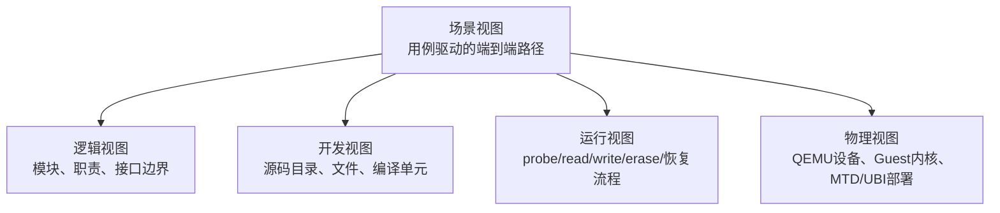

| 视图 | 回答的问题 | 本方案关注点 |
| --- | --- | --- |
| 逻辑视图 | 系统有哪些核心模块，各自负责什么 | Linux raw NAND 驱动、QEMU 控制器、page-raid 引擎、介质模型 |
| 开发视图 | 代码如何组织、如何编译、模块之间如何依赖 | QEMU `hw/mtd` 模型与 Linux `drivers/mtd/nand/raw` 驱动 |
| 运行视图 | 系统运行时的交互顺序和状态迁移 | probe、read/write/erase、RAID 恢复、坏块处理 |
| 物理视图 | 部署在哪些运行实体上，硬件/虚拟硬件如何连接 | QEMU 设备、MMIO、IRQ、Guest Linux、MTD/UBI |
| 场景视图 | 典型业务场景如何贯穿所有视图 | UBI attach、16KiB 写入、读恢复、erase、故障注入 |

## 3. 逻辑视图

### 3.1 分层结构

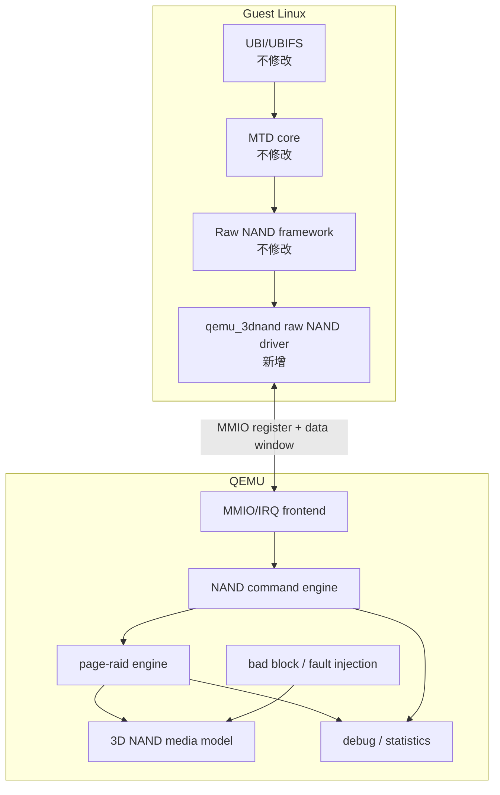

### 3.2 模块职责

| 模块 | 位置 | 职责 |
| --- | --- | --- |
| UBI/UBIFS | Linux 原生 | 使用 MTD 设备，不感知 QEMU 内部 parity |
| MTD core | Linux 原生 | 管理 `mtd_info`，提供 erase/read/write 接口 |
| Raw NAND framework | Linux 原生 | 提供 NAND chip 抽象、`exec_op` 框架、ECC hook |
| `qemu_3dnand` driver | Linux 新增 | 探测 QEMU NAND 控制器，注册 raw NAND/MTD 设备 |
| MMIO/IRQ frontend | QEMU 新增 | 暴露寄存器、数据窗口、中断给 Guest |
| NAND command engine | QEMU 新增 | 解释 NAND command/address/data 操作 |
| page-raid engine | QEMU 新增 | 根据 `data:parity` 配置写入 parity、读失败时恢复 |
| media model | QEMU 新增 | 保存 die/plane/block/page/OOB 数据 |
| fault injection | QEMU 新增 | 模拟坏块、bitflip、program fail、read fail、erase fail |
| debug/statistics | QEMU 新增 | 暴露 RAID 命中、恢复、失败、坏块统计 |

### 3.3 关键逻辑边界

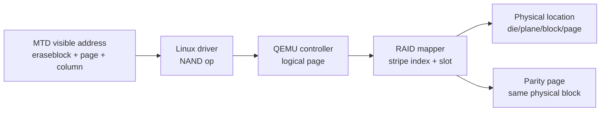

Linux 侧只看到普通 NAND：

- page size 是 16KiB。
- OOB 由驱动按 raw NAND 规范上报。
- eraseblock 是 QEMU 选择的逻辑 eraseblock，不等于完整 25MiB 物理 block。
- parity page、物理 1600 pages/block、RAID 恢复都隐藏在 QEMU 控制器内部。

QEMU 侧维护真实物理映射：

```text
logical_page_in_eraseblock
  -> stripe_index = logical_page / data_pages_per_stripe
  -> data_slot    = logical_page % data_pages_per_stripe
  -> physical_page = stripe_index * stripe_pages + data_slot
  -> parity_page   = stripe_index * stripe_pages + data_pages_per_stripe
```

## 4. 开发视图

### 4.1 建议源码布局

```text
linux环境搭建/
├── qemu/
│   ├── hw/mtd/q3n-nand.c
│   ├── hw/mtd/meson.build
│   ├── include/hw/mtd/q3n-nand.h
│   └── docs/system/devices/q3n-nand.rst
└── linux/
    ├── drivers/mtd/nand/raw/qemu_3dnand.c
    ├── drivers/mtd/nand/raw/Kconfig
    ├── drivers/mtd/nand/raw/Makefile
    └── Documentation/devicetree/bindings/mtd/qemu,3dnand.yaml
```

如果当前目录结构不是 `qemu/` 与 `linux/` 并列，可以保持现有源码目录，只保留相同的模块划分。

### 4.2 QEMU 编译单元

| 文件 | 职责 |
| --- | --- |
| `include/hw/mtd/q3n-nand.h` | 设备状态结构、寄存器定义、几何参数、RAID profile 定义 |
| `hw/mtd/q3n-nand.c` | 设备初始化、MMIO 读写、命令解释、介质读写、RAID 逻辑 |
| `hw/mtd/meson.build` | 将设备模型加入 QEMU 构建 |
| machine 相关文件 | 将 `q3n-nand` 设备挂到测试 machine 或 sysbus |
| `docs/system/devices/q3n-nand.rst` | QEMU 设备参数说明 |

QEMU 内部建议拆分为这些逻辑子模块，初期可放在一个 `.c` 文件内，后续再拆文件：

| 子模块 | 主要函数 |
| --- | --- |
| register frontend | `q3n_mmio_read()`、`q3n_mmio_write()`、`q3n_raise_irq()` |
| command engine | `q3n_exec_cmd()`、`q3n_set_addr()`、`q3n_transfer_data()` |
| address mapper | `q3n_logical_to_physical()`、`q3n_page_to_stripe()` |
| raid engine | `q3n_raid_update_parity()`、`q3n_raid_recover_page()` |
| media model | `q3n_media_read_page()`、`q3n_media_program_page()`、`q3n_media_erase_block()` |
| fault model | `q3n_should_fail_read()`、`q3n_mark_bad_block()` |
| debug stats | `q3n_update_stats()`、`q3n_dump_state()` |

### 4.3 Linux 驱动编译单元

| 文件 | 职责 |
| --- | --- |
| `drivers/mtd/nand/raw/qemu_3dnand.c` | 控制器驱动主体 |
| `drivers/mtd/nand/raw/Kconfig` | 新增 `CONFIG_MTD_NAND_QEMU_3DNAND` |
| `drivers/mtd/nand/raw/Makefile` | 编译 `qemu_3dnand.o` |
| DT binding | 描述 MMIO、IRQ、clock/reset 可选资源 |

Linux 驱动内部建议函数：

| 函数 | 职责 |
| --- | --- |
| `q3n_probe()` | 获取资源、初始化控制器、注册 NAND chip |
| `q3n_remove()` | 注销 MTD/NAND 设备 |
| `q3n_attach_chip()` | 设置 page/OOB/ecc/layout 等参数 |
| `q3n_exec_op()` | 将 raw NAND 操作翻译为 QEMU MMIO 操作 |
| `q3n_read_page_raw()` | 可选：调试 raw page 读取 |
| `q3n_irq()` | 处理中断完成和错误状态 |
| `q3n_wait_ready()` | 等待 QEMU 控制器 ready |
| `q3n_read_id()` | 读取模拟 ONFI/厂商 ID |

### 4.4 模块依赖

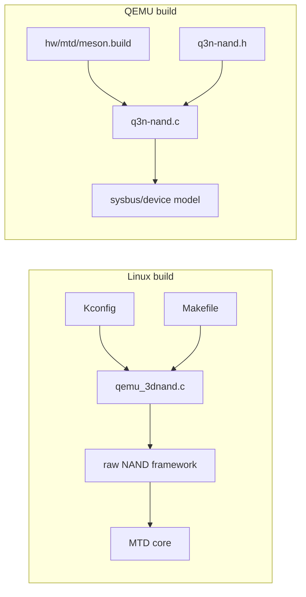

## 5. 运行视图

### 5.1 probe 流程

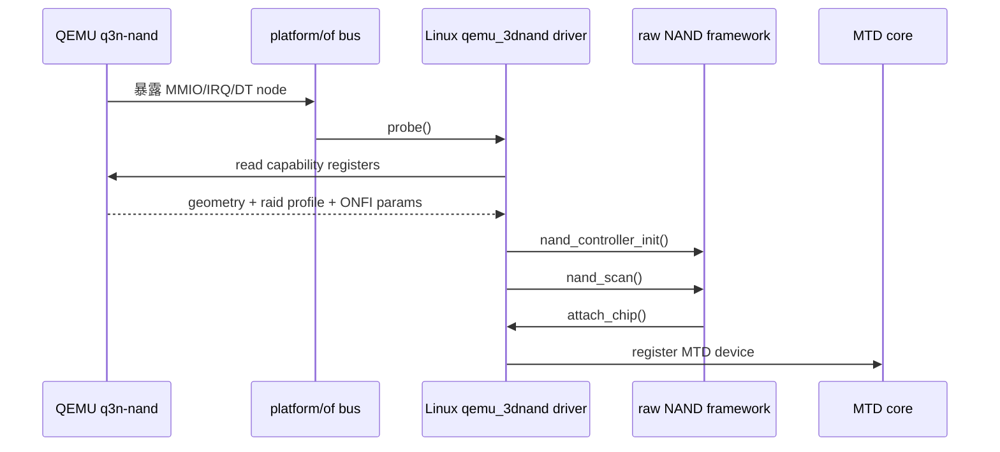

probe 之后，Guest 看到的是一个普通 raw NAND MTD 设备：

| 字段 | 示例 |
| --- | --- |
| `mtd->writesize` | 16KiB |
| `mtd->erasesize` | 21.875MiB 或 18.75MiB |
| `mtd->size` | profile 决定的总逻辑容量 |
| `mtd->oobsize` | QEMU 模拟值 |
| `mtd->type` | `MTD_NANDFLASH` |

### 5.2 写 page 流程

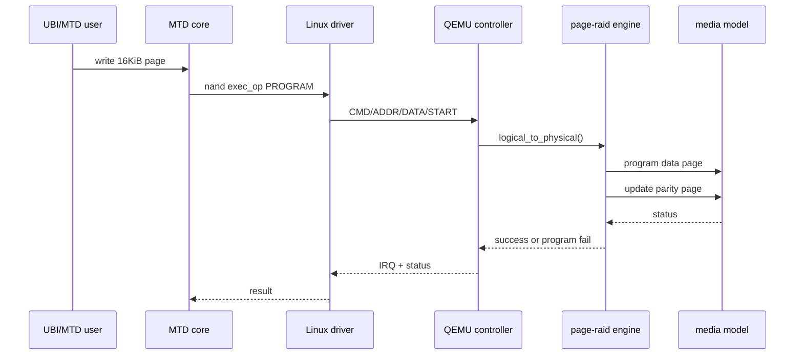

本方案第一阶段允许 UBI 每次只写 16KiB。QEMU 内部在对应 stripe 的 parity page 上更新校验。性能不是第一阶段目标，优先验证：

- MTD/UBI 兼容性。
- parity 映射正确性。
- read fail 时能恢复。
- 坏块和故障注入路径可控。

### 5.3 读 page 与恢复流程

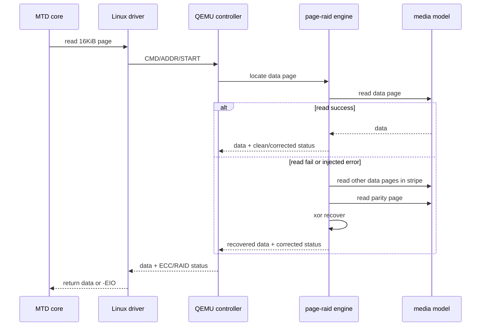

RAID 恢复状态建议映射为：

| QEMU 状态 | Linux 返回 |
| --- | --- |
| clean read | `0` |
| ECC corrected | `max_bitflips > 0` |
| RAID recovered | `max_bitflips > 0`，同时 debugfs 统计 `raid_recovered++` |
| unrecoverable | `-EBADMSG` 或 `-EIO`，由 raw NAND 语义决定 |

### 5.4 erase 流程

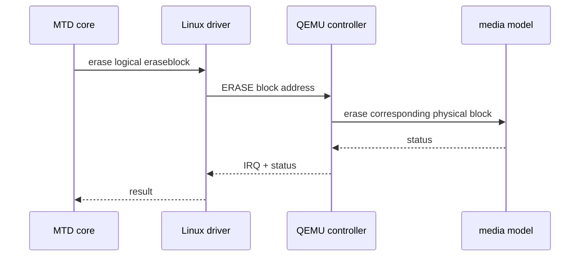

虽然 MTD 可见 erasesize 小于 25MiB，但 QEMU 内部仍建议以完整物理 block 为擦除单位。原因是 parity page 和 data page 位于同一个物理 block，擦除必须让整个 block 回到一致的空态。

## 6. 物理视图

### 6.1 部署关系

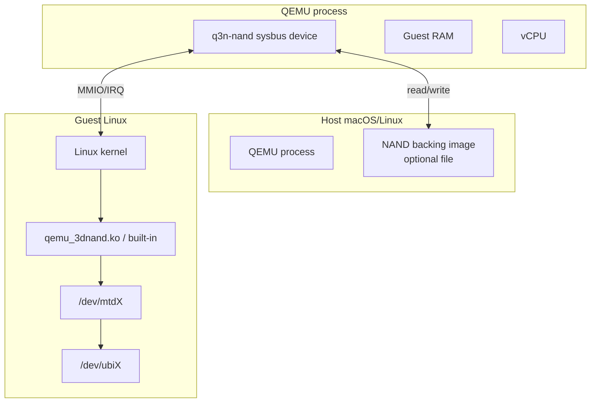

### 6.2 QEMU 设备资源

| 资源 | 用途 |
| --- | --- |
| MMIO region | 控制寄存器、状态寄存器、地址寄存器、数据窗口 |
| IRQ | 命令完成、错误、ready/busy 状态通知 |
| backing image | 可选，用于持久化 NAND 数据 |
| QEMU device properties | 配置 geometry、RAID profile、故障注入参数 |

### 6.3 Guest 设备树示例

```dts
q3n_nand: nand-controller@10000000 {
    compatible = "qemu,3dnand";
    reg = <0x0 0x10000000 0x0 0x10000>;
    interrupts = <0 42 4>;
    nand-ecc-mode = "hw";
};
```

设备树只描述控制器资源，不直接暴露 parity 几何。RAID profile 由 QEMU capability register 或 ONFI vendor parameter page 暴露给驱动调试使用，但不要求 UBI 理解。

## 7. 场景视图

### 7.1 场景一：UBI attach


设计要求：

| 要求 | 说明 |
| --- | --- |
| `writesize` 稳定 | 固定 16KiB，满足 NAND page 访问语义 |
| `erasesize` 稳定 | profile 选定后不可运行时变化 |
| 坏块标记可读 | QEMU 需要支持 OOB bad block marker 或等价机制 |
| 读失败语义清晰 | 可恢复返回 corrected，不可恢复返回错误 |

### 7.2 场景二：写入一个逻辑 eraseblock

以 `capacity 7:1` 为例：

| logical page | stripe | data slot | physical page | parity page |
| ---: | ---: | ---: | ---: | ---: |
| 0 | 0 | 0 | 0 | 7 |
| 1 | 0 | 1 | 1 | 7 |
| 2 | 0 | 2 | 2 | 7 |
| 3 | 0 | 3 | 3 | 7 |
| 4 | 0 | 4 | 4 | 7 |
| 5 | 0 | 5 | 5 | 7 |
| 6 | 0 | 6 | 6 | 7 |
| 7 | 1 | 0 | 8 | 15 |
| 8 | 1 | 1 | 9 | 15 |

以 `reliability 3:1` 为例：

| logical page | stripe | data slot | physical page | parity page |
| ---: | ---: | ---: | ---: | ---: |
| 0 | 0 | 0 | 0 | 3 |
| 1 | 0 | 1 | 1 | 3 |
| 2 | 0 | 2 | 2 | 3 |
| 3 | 1 | 0 | 4 | 7 |
| 4 | 1 | 1 | 5 | 7 |
| 5 | 1 | 2 | 6 | 7 |
| 6 | 2 | 0 | 8 | 11 |
| 7 | 2 | 1 | 9 | 11 |
| 8 | 2 | 2 | 10 | 11 |

### 7.3 场景三：单 page read fail 后恢复

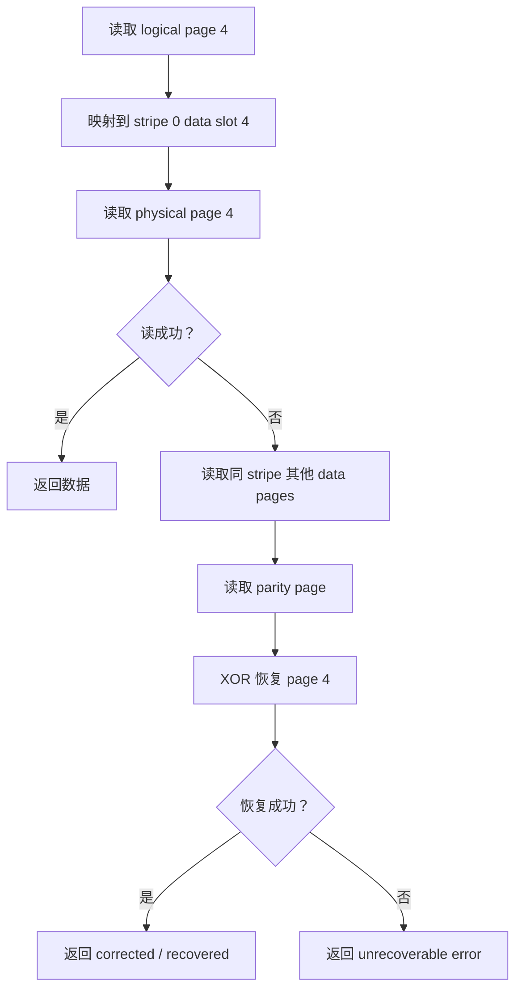

限制：

- 单 parity stripe 只能恢复同一 stripe 内一个 page 级失败。
- 同一 stripe 内两个及以上 page 同时不可读时，普通 XOR parity 无法恢复。
- 如果 parity page 本身损坏，但 data page 可读，不影响普通读取；如果 data page 和 parity page 同时损坏，则不可恢复。

### 7.4 场景四：坏块处理


第一阶段建议采用 block 级坏块模型：

| 策略 | 说明 |
| --- | --- |
| 一个物理 block 对应一个逻辑 eraseblock | 映射简单，坏块影响边界清晰 |
| parity 不跨 block | 避免跨 block 坏块导致复杂重建 |
| QEMU 不做隐藏 remap | 让 MTD/UBI 看到坏块，更符合 NAND 生态 |
| debug 参数控制坏块比例 | 方便测试 UBI attach 与 volume 创建 |

## 8. 接口定义设计

### 8.1 QEMU MMIO register 初稿

| offset | name | R/W | 说明 |
| ---: | --- | --- | --- |
| `0x0000` | `Q3N_REG_ID` | R | 设备 ID |
| `0x0004` | `Q3N_REG_CAP` | R | capability bit |
| `0x0008` | `Q3N_REG_CTRL` | R/W | 控制位，reset/start/irq enable |
| `0x000c` | `Q3N_REG_STATUS` | R | ready/busy/error 状态 |
| `0x0010` | `Q3N_REG_CMD` | R/W | NAND command |
| `0x0014` | `Q3N_REG_ADDR0` | R/W | row/column 地址低位 |
| `0x0018` | `Q3N_REG_ADDR1` | R/W | row/column 地址高位 |
| `0x001c` | `Q3N_REG_LEN` | R/W | 传输长度 |
| `0x0020` | `Q3N_REG_RAID_CFG` | R | data/parity profile |
| `0x0024` | `Q3N_REG_GEOM0` | R | page size、OOB size |
| `0x0028` | `Q3N_REG_GEOM1` | R | pages/block、blocks/plane |
| `0x002c` | `Q3N_REG_ECC_STATUS` | R | ECC/RAID 恢复状态 |
| `0x0030` | `Q3N_REG_IRQ_STATUS` | R/W1C | IRQ 状态 |
| `0x0040` | `Q3N_REG_DATA` | R/W | PIO 数据窗口 |

第一阶段建议使用 PIO 数据窗口，后续再扩展 DMA。PIO 方便验证 `exec_op` 与 RAID 逻辑，性能不是第一优先级。

### 8.2 RAID profile capability 编码

```c
struct q3n_raid_profile_desc {
	u8 data_pages_per_stripe;
	u8 parity_pages_per_stripe;
	u16 stripes_per_block;
	u16 data_pages_per_block;
	u16 parity_pages_per_block;
};
```

寄存器编码建议：

| 字段 | bit | 说明 |
| --- | --- | --- |
| `data_pages_per_stripe` | `[7:0]` | 每 stripe data page 数 |
| `parity_pages_per_stripe` | `[15:8]` | 每 stripe parity page 数，初期固定 1 |
| `profile_id` | `[23:16]` | `0=capacity`，`1=reliability` |
| `raid_enable` | `[31]` | 是否启用 page-raid |

### 8.3 Linux raw NAND 接口

```c
static const struct nand_controller_ops q3n_controller_ops = {
	.attach_chip = q3n_attach_chip,
	.exec_op = q3n_exec_op,
};
```

`q3n_exec_op()` 负责处理 raw NAND framework 下发的 instruction：

| instruction | 驱动动作 |
| --- | --- |
| `NAND_OP_CMD_INSTR` | 写 `Q3N_REG_CMD` |
| `NAND_OP_ADDR_INSTR` | 写 `Q3N_REG_ADDR0/1` |
| `NAND_OP_DATA_IN_INSTR` | 从 `Q3N_REG_DATA` 读数据 |
| `NAND_OP_DATA_OUT_INSTR` | 向 `Q3N_REG_DATA` 写数据 |
| `NAND_OP_WAITRDY_INSTR` | 轮询 status 或等待 IRQ |

## 9. 数据结构设计

### 9.1 QEMU 侧核心结构

```c
typedef struct Q3NNandState {
	SysBusDevice parent_obj;

	MemoryRegion mmio;
	qemu_irq irq;

	Q3NGeometry geom;
	Q3NRaidProfile raid;
	Q3NRegs regs;
	Q3NStats stats;

	uint8_t *data;
	uint8_t *oob;
	unsigned long *bad_block_bitmap;

	QemuMutex lock;
} Q3NNandState;
```

```c
typedef struct Q3NGeometry {
	uint8_t dies;
	uint8_t planes_per_die;
	uint16_t blocks_per_plane;
	uint16_t pages_per_block;
	uint32_t page_size;
	uint32_t oob_size;
} Q3NGeometry;
```

```c
typedef struct Q3NRaidProfile {
	uint8_t profile_id;
	uint8_t data_pages_per_stripe;
	uint8_t parity_pages_per_stripe;
	uint16_t stripes_per_block;
	uint16_t data_pages_per_block;
	uint16_t parity_pages_per_block;
} Q3NRaidProfile;
```

```c
typedef struct Q3NPhysicalAddr {
	uint8_t die;
	uint8_t plane;
	uint16_t block;
	uint16_t page;
	uint32_t column;
} Q3NPhysicalAddr;
```

### 9.2 Linux 侧核心结构

```c
struct q3n_nand {
	struct device *dev;
	void __iomem *regs;
	int irq;

	struct nand_controller controller;
	struct nand_chip chip;

	struct completion complete;
	spinlock_t irq_lock;

	struct q3n_raid_profile_desc raid;
	u32 page_size;
	u32 oob_size;
	u32 pages_per_block;
	u32 data_pages_per_block;
};
```

### 9.3 逻辑地址结构

```c
struct q3n_logical_addr {
	u32 eraseblock;
	u16 page;
	u32 column;
};
```

逻辑地址到物理地址的转换只放在 QEMU 中。Linux 驱动不应该自己计算 die/plane/block/page 的 parity 位置，否则会把模拟控制器内部策略泄漏给 MTD 层。

## 10. 代码实现顺序建议

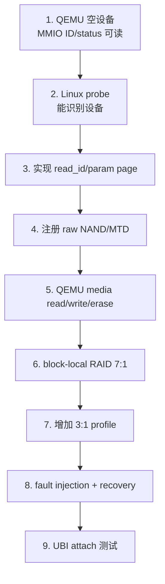

建议先跑通最小闭环：

| 阶段 | 验收标准 |
| --- | --- |
| MMIO 设备 | Guest 能读到 `Q3N_REG_ID` |
| 驱动 probe | `dmesg` 能看到 qemu_3dnand probe 成功 |
| MTD 注册 | `/proc/mtd` 出现设备 |
| 基础 IO | `mtd_debug read/write/erase` 成功 |
| RAID 写入 | QEMU debug 统计显示 parity update |
| RAID 恢复 | 注入单 page read fail 后读取成功 |
| UBI | `ubiattach` 成功，能创建 volume |

## 11. 主要限制和后续演进

| 限制 | 当前处理 | 后续演进 |
| --- | --- | --- |
| 不做多 die/plane 并行 | QEMU 串行执行命令 | 增加 QEMU 内部调度队列和 latency model |
| 不修改 MTD/UBI | 所有 RAID 细节隐藏在 QEMU | 若要暴露条带 page，需要重新评估 UBI mini I/O |
| parity 不跨 block | 坏块边界简单 | 后续可研究 block group RAID |
| 单 parity 只能恢复一个 page | 通过 3:1 profile 提高可靠性 | 可扩展双 parity，但复杂度明显上升 |
| PIO 数据窗口性能有限 | 第一阶段便于调试 | 增加 DMA descriptor ring |
| QEMU 不隐藏坏块 remap | 保持 NAND 语义 | 可增加可选 FTL/remap 模式，但不应默认启用 |
| 8 plane 全 data + parity log | 第一阶段不采用 | 后续作为 `versioned-parity-log` profile，在 QEMU 内部增加 generation、version、parity index 和 GC |

## 12. 本文设计结论

方案 A 的代码结构应把复杂性集中在 QEMU 控制器模型中，Linux 驱动保持标准 raw NAND 控制器驱动形态。这样做的好处是：

- MTD/UBI 不需要修改。
- Linux 驱动行为更接近真实 NAND 控制器。
- page-raid、坏块、故障注入都能在 QEMU 中快速迭代。
- 后续如果要验证多 die/plane 并行，可以在 QEMU runtime 调度层扩展，而不破坏第一阶段的 MTD 接口。

第一版推荐实现顺序是：先完成 `16KiB writesize + block-local configurable page-raid + UBI attach`，确认规范路径跑通，再增加性能模拟和并行访问模型。
