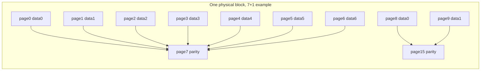
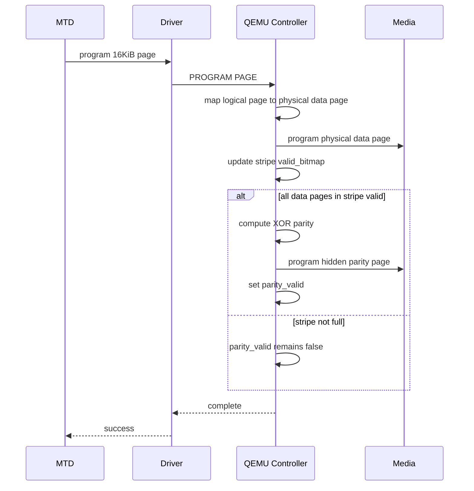
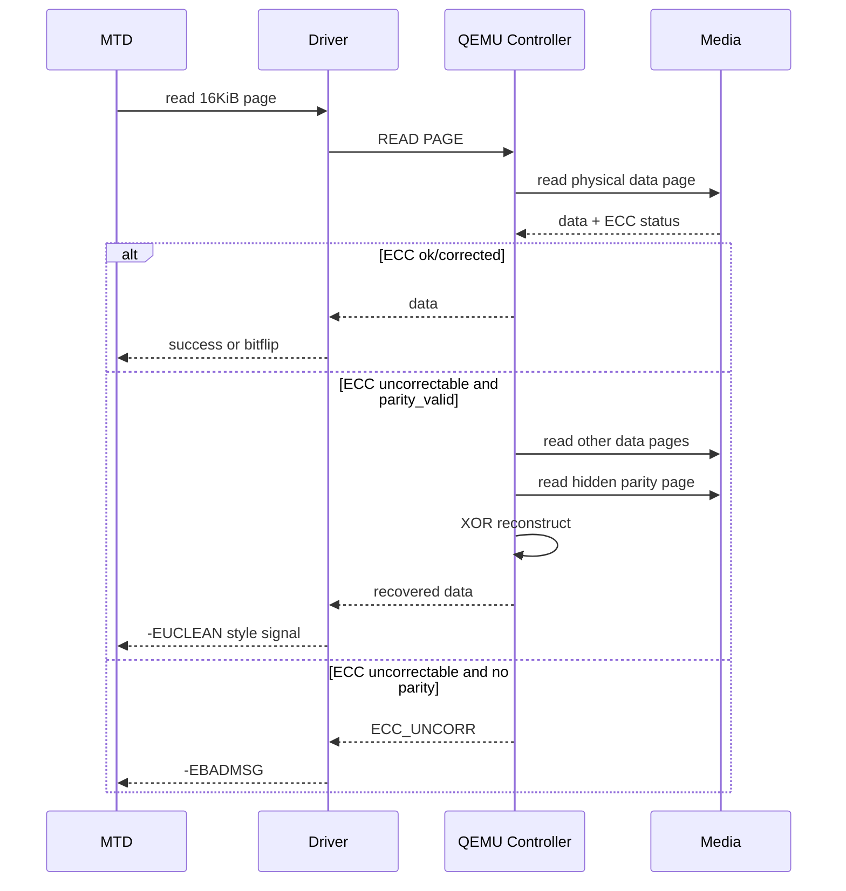
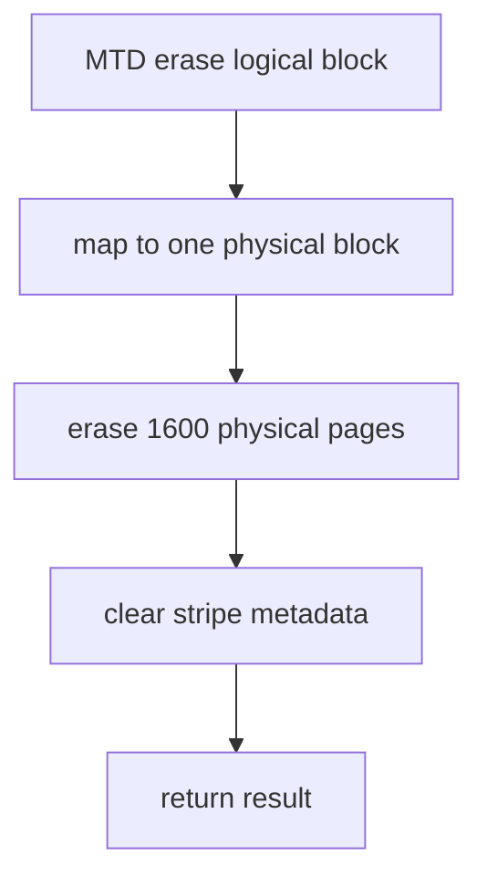

# QEMU 3D NAND 方案 A 详细设计

本文档定义方案 A 的简化版：`16KiB page-visible + 单 physical block 内可配置 page-raid`。该方案优先保证 MTD/UBI 语义清楚，暂不考虑多 die/multi-plane 并行性能。

## 1. 设计前提

| 前提 | 说明 |
| --- | --- |
| 不修改 MTD core | 不改 `include/linux/mtd/mtd.h`、`drivers/mtd/mtdcore.c` |
| 不修改 raw NAND framework | 不改 `drivers/mtd/nand/raw/*` 通用逻辑 |
| 不修改 UBI/UBIFS | 不改 `drivers/mtd/ubi/*` 和 UBIFS |
| MTD page 可见大小 | 16KiB |
| Page-raid 位置 | QEMU 控制器内部 |
| Page-raid 范围 | 单个 physical block 内部 |
| 并行访问 | 第一版不考虑 |
| 坏块处理 | physical block 级别 |

关键结论：

```text
physical block erase size = 1600 * 16KiB = 25MiB
MTD visible erasesize = data_pages_per_block * 16KiB
```

原因是每个 physical block 内同时存放 data page 和 hidden parity page。例如默认 7+1 profile 中：

```text
1400 data pages + 200 hidden parity pages = 1600 physical pages
```

如果 parity 隐藏在同一个 physical block 内，MTD 可见数据容量不能仍然是 1600 pages。否则没有地方存放 parity。

## 2. RAID 配置模型

Page-raid 比例抽象为：

```text
parity_pages_per_stripe : data_pages_per_stripe = 1 : N
```

第一版固定 `parity_pages_per_stripe = 1`，`data_pages_per_stripe` 可配置。常用 profile：

| Profile | Data:Parity | Stripe pages | Stripes/block | Data pages/block | Parity pages/block | MTD erasesize | Visible capacity | 容量效率 |
| --- | ---: | ---: | ---: | ---: | ---: | ---: | ---: | ---: |
| capacity | 7:1 | 8 | 200 | 1400 | 200 | 21.875MiB | 42.21GiB | 87.5% |
| reliability | 3:1 | 4 | 400 | 1200 | 400 | 18.75MiB | 36.18GiB | 75% |

通用公式：

```text
stripe_pages = data_pages_per_stripe + parity_pages_per_stripe
stripes_per_block = physical_pages_per_block / stripe_pages
data_pages_per_block = stripes_per_block * data_pages_per_stripe
parity_pages_per_block = stripes_per_block * parity_pages_per_stripe
unused_pages_per_block = physical_pages_per_block % stripe_pages
mtd_erasesize = data_pages_per_block * page_size
mtd_size = logical_eraseblocks * mtd_erasesize
```

约束：

| 约束 | 说明 |
| --- | --- |
| `physical_pages_per_block % stripe_pages == 0` | 第一版要求整除，避免 block 尾部 unused pages |
| `parity_pages_per_stripe == 1` | 第一版只支持单 parity page |
| `data_pages_per_stripe <= 7` | 单 parity XOR 只恢复一个 page；data 太多会降低可靠性 |
| `mtd->writesize = 16KiB` | 不随 RAID ratio 改变 |
| `mtd->erasesize` | 随 RAID ratio 改变 |

## 3. 目标几何

原始 NAND 几何：

| 参数 | 值 |
| --- | ---: |
| dies | 2 |
| planes per die | 4 |
| physical lanes | 8 |
| blocks per plane | 247 |
| pages per physical block | 1600 |
| physical page main size | 16KiB |
| OOB size | 1KiB |
| physical block main size | 25MiB |

方案 A 可见几何：

| 参数 | 值 |
| --- | ---: |
| MTD page size | 16KiB |
| MTD writebufsize | 16KiB |
| MTD OOB size | 1KiB |
| data pages per MTD eraseblock | 由 RAID profile 决定 |
| hidden parity pages per physical block | 由 RAID profile 决定 |
| MTD erasesize | 由 RAID profile 决定 |
| physical erase size | 25MiB |
| logical eraseblocks | `8 * 247 = 1976` |
| MTD visible capacity | 由 RAID profile 决定 |
| raw main capacity | 48.24GiB |
| hidden parity capacity | 由 RAID profile 决定 |

容量计算：

```text
physical_block_size = 1600 * 16KiB = 25MiB
logical_eraseblocks = 2 * 4 * 247 = 1976
raw_capacity = 1976 * 1600 * 16KiB = 48.24GiB
```

## 4. 物理 Block 内 Page-Raid 布局

每个 physical block 内部划分为若干 local stripe。

```text
1 local stripe = N data pages + 1 parity page
stripes_per_block = 1600 / (N + 1)
```

映射关系：

```text
stripe_in_block = logical_page_in_eraseblock / data_pages_per_stripe
slot = logical_page_in_eraseblock % data_pages_per_stripe

physical_page = stripe_in_block * stripe_pages + slot
parity_page = stripe_in_block * stripe_pages + data_pages_per_stripe
```

7+1 profile 示例：

| MTD page in eraseblock | Stripe | Slot | Physical data page | Hidden parity page |
| ---: | ---: | ---: | ---: | ---: |
| 0 | 0 | 0 | 0 | 7 |
| 1 | 0 | 1 | 1 | 7 |
| 2 | 0 | 2 | 2 | 7 |
| 3 | 0 | 3 | 3 | 7 |
| 4 | 0 | 4 | 4 | 7 |
| 5 | 0 | 5 | 5 | 7 |
| 6 | 0 | 6 | 6 | 7 |
| 7 | 1 | 0 | 8 | 15 |
| 8 | 1 | 1 | 9 | 15 |
| 9 | 1 | 2 | 10 | 15 |
| 10 | 1 | 3 | 11 | 15 |
| 11 | 1 | 4 | 12 | 15 |
| 12 | 1 | 5 | 13 | 15 |
| 13 | 1 | 6 | 14 | 15 |

3+1 profile 示例：

| MTD page in eraseblock | Stripe | Slot | Physical data page | Hidden parity page |
| ---: | ---: | ---: | ---: | ---: |
| 0 | 0 | 0 | 0 | 3 |
| 1 | 0 | 1 | 1 | 3 |
| 2 | 0 | 2 | 2 | 3 |
| 3 | 1 | 0 | 4 | 7 |
| 4 | 1 | 1 | 5 | 7 |
| 5 | 1 | 2 | 6 | 7 |
| 6 | 2 | 0 | 8 | 11 |
| 7 | 2 | 1 | 9 | 11 |
| 8 | 2 | 2 | 10 | 11 |

布局图：



Parity 计算：

```text
parity = data0 ^ data1 ^ data2 ^ data3 ^ data4 ^ data5 ^ data6
```

恢复示例：

```text
data2 = parity ^ data0 ^ data1 ^ data3 ^ data4 ^ data5 ^ data6
```

## 5. 逻辑地址到物理地址

MTD 逻辑地址：

```text
logical_page = logical_offset / 16KiB
logical_eraseblock = logical_page / data_pages_per_block
page_in_eraseblock = logical_page % data_pages_per_block
```

Physical block 选择：

```text
physical_block_linear = logical_eraseblock
lane = physical_block_linear / blocks_per_plane
block = physical_block_linear % blocks_per_plane
```

Lane 到 die/plane：

```text
die = lane / 4
plane = lane % 4
```

Page 选择：

```text
stripe_in_block = page_in_eraseblock / data_pages_per_stripe
slot = page_in_eraseblock % data_pages_per_stripe
physical_page = stripe_in_block * stripe_pages + slot
parity_page = stripe_in_block * stripe_pages + data_pages_per_stripe
```

完整映射：

```text
logical_offset
  -> logical_eraseblock
  -> lane/block
  -> stripe_in_block
  -> physical_page / parity_page
```

## 6. QEMU 设备接口

### 6.1 设备类型

```text
type: qemu-3dnand
bus: sysbus
mmio: 64KiB
irq: 1
```

第一版使用 MMIO PIO 数据窗口，不做 DMA。

### 6.2 MMIO 寄存器

| Offset | Name | R/W | 说明 |
| ---: | --- | --- | --- |
| `0x0000` | `CTRL` | RW | 控制寄存器 |
| `0x0004` | `STATUS` | RO | 状态寄存器 |
| `0x0008` | `INT_STATUS` | RW1C | 中断状态 |
| `0x000c` | `INT_ENABLE` | RW | 中断使能 |
| `0x0010` | `CMD` | RW | NAND/控制器命令 |
| `0x0014` | `ADDR0` | RW | 逻辑地址低 32 位 |
| `0x0018` | `ADDR1` | RW | 逻辑地址高 32 位 |
| `0x001c` | `COLUMN` | RW | page 内偏移 |
| `0x0020` | `LEN` | RW | 数据长度 |
| `0x0024` | `DATA_PORT` | RW | main data PIO 窗口 |
| `0x0028` | `OOB_PORT` | RW | OOB PIO 窗口 |
| `0x0030` | `ECC_STATUS` | RO | ECC 状态 |
| `0x0034` | `RAID_STATUS` | RO | page-raid 状态 |
| `0x0038` | `RAID_CTRL` | RW | page-raid 控制 |
| `0x003c` | `RAID_CFG` | RW | page-raid 参数 |
| `0x003d` | `RAID_PROFILE` | RW | RAID profile 选择，概念寄存器，可并入 `RAID_CFG` |
| `0x0040` | `GEOM0` | RO | die/plane/block 几何 |
| `0x0044` | `GEOM1` | RO | page/block 几何 |
| `0x0048` | `GEOM2` | RO | MTD 可见几何 |
| `0x0050` | `FAULT_CTRL` | RW | 错误注入控制 |
| `0x0054` | `FAULT_ADDR0` | RW | 错误注入地址低位 |
| `0x0058` | `FAULT_ADDR1` | RW | 错误注入地址高位 |
| `0x0060` | `STAT_RAID_RECOVERED` | RO | RAID 恢复次数 |
| `0x0064` | `STAT_RAID_FAILED` | RO | RAID 失败次数 |

`RAID_CFG`：

| Bits | Name | 值 |
| --- | --- | --- |
| 7:0 | `DATA_PAGES` | 3 或 7 |
| 15:8 | `PARITY_PAGES` | 1 |
| 31:16 | `STRIPES_PER_BLOCK` | 根据 profile 计算 |

Profile 编码建议：

| Profile ID | 名称 | DATA_PAGES | PARITY_PAGES | STRIPES_PER_BLOCK |
| ---: | --- | ---: | ---: | ---: |
| 0 | capacity | 7 | 1 | 200 |
| 1 | reliability | 3 | 1 | 400 |

## 7. NAND/ONFI 可见参数

QEMU 暴露给 Linux raw NAND 的是 MTD 可见逻辑几何。

| 字段 | 值 |
| --- | --- |
| page size | 16KiB |
| OOB size | 1KiB |
| pages per block | `data_pages_per_block` |
| block count | 1976 |
| block size | `data_pages_per_block * 16KiB` |
| total visible size | `1976 * data_pages_per_block * 16KiB` |

说明：

```text
physical pages per block = 1600
visible data pages per block = data_pages_per_block
hidden parity pages per block = parity_pages_per_block
```

如果 raw NAND core 或 ONFI 参数页对非典型 `pages_per_block` 兼容性不好，驱动可在 `nand_scan_ident()` 后、`nand_scan_tail()` 前修正 `mtd->erasesize` 和容量，但不修改 raw NAND framework。

## 8. QEMU 数据结构设计

### 8.1 RAID Profile

```c
struct q3n_raid_profile {
    const char *name;
    uint8_t data_pages_per_stripe;
    uint8_t parity_pages_per_stripe;
    uint16_t stripes_per_block;
    uint16_t data_pages_per_block;
    uint16_t parity_pages_per_block;
};
```

Profile 表：

```c
static const struct q3n_raid_profile q3n_profiles[] = {
    {
        .name = "capacity",
        .data_pages_per_stripe = 7,
        .parity_pages_per_stripe = 1,
        .stripes_per_block = 200,
        .data_pages_per_block = 1400,
        .parity_pages_per_block = 200,
    },
    {
        .name = "reliability",
        .data_pages_per_stripe = 3,
        .parity_pages_per_stripe = 1,
        .stripes_per_block = 400,
        .data_pages_per_block = 1200,
        .parity_pages_per_block = 400,
    },
};
```

### 8.2 几何

```c
struct q3n_geometry {
    uint32_t dies;
    uint32_t planes_per_die;
    uint32_t blocks_per_plane;
    uint32_t physical_pages_per_block;
    uint32_t page_size;
    uint32_t oob_size;
    const struct q3n_raid_profile *raid;
};
```

固定值：

```c
dies = 2;
planes_per_die = 4;
blocks_per_plane = 247;
physical_pages_per_block = 1600;
page_size = 16 * 1024;
oob_size = 1024;
```

### 8.3 物理页元数据

```c
enum q3n_page_state {
    Q3N_PAGE_ERASED = 0,
    Q3N_PAGE_PROGRAMMED,
    Q3N_PAGE_BAD,
};

struct q3n_page_meta {
    uint8_t state;
    uint16_t corrected_bits;
    bool ecc_uncorrectable;
    bool injected_error;
};
```

### 8.4 Block 元数据

```c
struct q3n_block_meta {
    bool factory_bad;
    bool runtime_bad;
    uint32_t erase_count;
};
```

第一版坏块粒度：

```text
一个 physical block 坏 -> 对应一个 MTD eraseblock 坏
```

### 8.5 Stripe 元数据

```c
struct q3n_stripe_meta {
    uint8_t valid_bitmap;    /* bit0..bitN-1 */
    bool parity_valid;
};
```

每个 physical block 的 stripe metadata 数量由 profile 决定。

### 8.6 Media

```c
struct q3n_media {
    struct q3n_geometry geom;
    uint8_t *main_area;
    uint8_t *oob_area;
    struct q3n_page_meta *page_meta;
    struct q3n_block_meta *block_meta;
    struct q3n_stripe_meta *stripe_meta;
};
```

物理页索引：

```c
phys_page_index =
    (((lane * blocks_per_plane) + block) * physical_pages_per_block) + page;
```

## 9. Linux 驱动数据结构设计

```c
struct q3n_raid_profile_desc {
    u8 data_pages_per_stripe;
    u8 parity_pages_per_stripe;
    u16 stripes_per_block;
    u16 data_pages_per_block;
    u16 parity_pages_per_block;
};

struct q3n_nand {
    struct device *dev;
    void __iomem *regs;
    int irq;
    struct completion done;
    struct nand_controller controller;
    struct nand_chip chip;
    struct mutex lock;
    u8 *data_buf;
    u8 *oob_buf;
    struct q3n_raid_profile_desc raid;
};
```

Controller ops：

```c
static const struct nand_controller_ops q3n_controller_ops = {
    .exec_op = q3n_exec_op,
};
```

Probe 流程：

```text
probe
  allocate q3n_nand
  ioremap MMIO
  request IRQ
  nand_controller_init()
  chip.controller = &q3n->controller
  q3n->controller.ops = &q3n_controller_ops
  nand_set_controller_data()
  read GEOM/RAID_CFG
  fill q3n->raid
  configure ECC
  nand_scan()
  verify or adjust mtd geometry according to q3n->raid
  mtd_device_register()
```

最终 MTD 几何：

```text
mtd->writesize = 16KiB
mtd->writebufsize = 16KiB
mtd->oobsize = 1KiB
mtd->erasesize = data_pages_per_block * 16KiB
mtd->size = 1976 * mtd->erasesize
```

## 10. 操作流程

### 10.1 写 Page



写返回成功前，data page 必须已经写入 physical block。未满 stripe 时没有 RAID 保护，但数据不能只留在易失 buffer 中。

### 10.2 读 Page



### 10.3 擦除 Block

MTD 擦除一个 logical eraseblock，QEMU 实际擦除对应的 25MiB physical block。



擦除后：

```text
1600 physical pages = 0xFF
visible data pages become erased
hidden parity pages become erased
stripe valid_bitmap = 0
parity_valid = false
```

## 11. ECC 与 RAID 返回语义

| QEMU 状态 | Linux 驱动返回 | UBI/MTD 语义 |
| --- | --- | --- |
| clean read | 0 | 正常 |
| ECC corrected below threshold | 0 或 corrected bit count | 正常 |
| ECC corrected over threshold | `-EUCLEAN` | 可触发 scrub |
| ECC uncorrectable + RAID recovered | `-EUCLEAN` | 数据已恢复，建议搬迁 |
| ECC uncorrectable + RAID failed | `-EBADMSG` | 数据不可恢复 |
| program/erase fail | `-EIO` | 操作失败 |

RAID 恢复成功不应静默返回普通成功。建议让 UBI 有机会 scrub 或迁移该 PEB。

## 12. 坏块策略

坏块粒度为单个 physical block：

```text
physical block bad -> corresponding MTD eraseblock bad
```

| 操作 | 行为 |
| --- | --- |
| block_isbad | 查询对应 physical block 的 bad 状态 |
| block_markbad | 标记对应 physical block runtime_bad |
| erase fail | 标记该 physical block bad |
| program fail | 标记该 physical block bad |

优点：

| 优点 | 说明 |
| --- | --- |
| 坏块语义简单 | 不会因为 8 lane block group 放大到 175MiB |
| MTD/UBI 容易理解 | 一个 MTD eraseblock 对应一个 physical block |
| 不需要 remap | 第一版避免 FTL |

代价：

| 代价 | 说明 |
| --- | --- |
| 不支持跨 die/plane RAID | 第一版不验证并行 |
| 每个 physical block 内部分 page 用作 parity | 容量效率由 profile 决定 |

## 13. 性能模型

第一版不考虑多 die/multi-plane 并行。

| 操作 | 模拟方式 |
| --- | --- |
| page read | 单 page 延迟 |
| page program | 单 page 延迟 |
| parity generation | stripe 满后额外读/计算/写 parity |
| block erase | 单 physical block 擦除延迟 |
| RAID rebuild | 读取其他 data page + 1 个 parity page，可先按串行模拟 |

建议延迟：

| 操作 | 延迟 |
| --- | ---: |
| page read | 100us |
| page program | 800us |
| parity program | 800us |
| block erase | 3ms |
| XOR compute | 可忽略或按 16KiB 线性模拟 |

## 14. 调试接口

建议通过 debugfs 暴露：

```text
/sys/kernel/debug/q3n/geometry
/sys/kernel/debug/q3n/raid_stats
/sys/kernel/debug/q3n/ecc_stats
/sys/kernel/debug/q3n/fault_inject
```

`raid_stats`：

| 字段 | 说明 |
| --- | --- |
| `stripe_full` | 写满的 stripe 数 |
| `parity_written` | parity 写入次数 |
| `raid_recovered` | RAID 恢复成功次数 |
| `raid_failed` | RAID 恢复失败次数 |
| `open_stripes` | 未完成 stripe 数 |
| `raid_profile` | 当前 RAID profile |

## 15. 错误注入

| 错误类型 | 预期行为 |
| --- | --- |
| correctable bitflip | 返回 corrected bits |
| data page uncorrectable, parity valid | RAID 恢复 |
| data page uncorrectable, parity invalid | `-EBADMSG` |
| parity page corruption | RAID 恢复失败 |
| program fail | `-EIO` 并可标坏 |
| erase fail | `-EIO` 并可标坏 |
| bad block | MTD eraseblock bad |

## 16. 测试计划

### 16.1 MTD 基础测试

```bash
cat /proc/mtd
mtdinfo /dev/mtd0
flash_erase /dev/mtd0 0 1
nanddump -f /tmp/page.bin /dev/mtd0
nandwrite /dev/mtd0 /tmp/page.bin
```

预期：

| 项 | 值 |
| --- | ---: |
| writesize | 16KiB |
| erasesize | profile 决定 |
| oobsize | 1KiB |
| size | profile 决定 |

### 16.2 UBI/UBIFS 测试

```bash
ubiformat /dev/mtd0
ubiattach -m 0
ubimkvol /dev/ubi0 -N test -s 1GiB
mount -t ubifs ubi0:test /mnt
dd if=/dev/zero of=/mnt/blob bs=1M count=128
sync
```

### 16.3 RAID 恢复测试

1. 写满一个 local stripe 的全部 data page。
2. 注入其中 1 个 data page ECC uncorrectable。
3. 读取该 logical page。
4. 预期通过 parity 恢复。
5. 检查 `raid_recovered` 增加。

### 16.4 未满 Stripe 测试

1. 只写 local stripe 的部分 data page。
2. 注入其中 1 个 data page ECC uncorrectable。
3. 读取该 logical page。
4. 预期返回 `-EBADMSG`。

### 16.5 坏块测试

1. 注入某 physical block bad。
2. 查询对应 MTD eraseblock bad。
3. 验证 UBI attach 跳过该 PEB。

## 17. 实现顺序

| 阶段 | 内容 |
| --- | --- |
| 1 | QEMU MMIO 设备骨架 |
| 2 | NAND media model 和几何参数 |
| 3 | READ ID / ONFI parameter page |
| 4 | Linux raw NAND controller driver `exec_op()` |
| 5 | 16KiB read/program/OOB |
| 6 | physical block erase -> logical eraseblock erase |
| 7 | block-local configurable page-raid |
| 8 | ECC/RAID 返回语义 |
| 9 | debugfs 和错误注入 |
| 10 | MTD/UBI/UBIFS 测试 |

## 18. 关键风险

| 风险 | 说明 | 缓解 |
| --- | --- | --- |
| `erasesize` 不是 25MiB | MTD 可见 data pages 少于 1600 | 文档明确 physical erase size 与 MTD erasesize 区别 |
| ONFI `pages_per_block` 非典型 | 某些路径可能假设常见 2 次幂或标准 NAND 参数 | 必要时驱动 scan 后修正 MTD 几何 |
| 未满 stripe 无 RAID 保护 | parity 只在 data pages 写满后生成 | 测试覆盖 open stripe 场景 |
| parity 写失败 | data 已落盘但 RAID 无效 | 标记 parity invalid，必要时返回错误 |
| 不验证并行性能 | 本方案先简化语义 | 后续单独设计跨 die/plane 并行方案 |

## 19. 与方案 D：versioned parity log block 的关系

方案 A 是第一阶段实现目标：parity page 位于同一个 physical block 内，data page 和 hidden parity page 共同决定 MTD 可见容量。它的优点是映射简单、坏块边界清楚、MTD/UBI 兼容路径容易验证。

方案 D 是后续高级 profile：8 个 plane 都存放 data，parity 不放在同一个 data block 内，而是写入额外的 parity log block pool。parity record 通过 `data_block_generation[]` 和 `parity_version` 管理有效性。data block erase 时不要求实时 erase parity block，只需要递增对应 data block generation，使旧 parity record 自动变成 stale；后续写入新 data 后，再追加写入新的 parity record。

两者差异如下：

| 项 | 方案 A | 方案 D |
| --- | --- | --- |
| parity 位置 | 同 physical block 内 hidden page | 独立 parity log block pool |
| data plane 利用 | 部分 page 用于 parity | 8 个 plane 都可存 data |
| data erase 行为 | erase physical block 后 data/parity 同时空闲 | erase data block 后 generation 递增，旧 parity stale |
| parity 更新 | stripe 写满后写固定 hidden parity page | append-only 写新 parity record |
| 元数据 | stripe valid bitmap、parity_valid | generation、version、parity index、checkpoint |
| GC | 不需要 parity GC | 需要 parity log GC |
| 实现复杂度 | 低 | 中到高，接近轻量 FTL |
| 第一阶段采用 | 是 | 否 |

方案 D 需要新增的数据结构方向：

```c
struct q3n_data_block_meta {
    uint32_t generation;
    bool bad;
};

struct q3n_parity_record_meta {
    uint64_t group_id;
    uint32_t stripe_index;
    uint32_t parity_version;
    uint32_t data_block_generation[8];
    struct q3n_physical_addr parity_addr;
    bool valid;
};

struct q3n_parity_log {
    struct q3n_physical_addr active_block;
    uint16_t next_page;
    uint32_t gc_watermark;
};
```

方案 D 的实现前置条件：

| 前置条件 | 原因 |
| --- | --- |
| 已完成标准 MTD/UBI 路径 | D 不能先于基础驱动语义验证 |
| 已有 QEMU fault injection | 需要验证 stale parity、lost parity、GC 中断等异常 |
| 已有 debug/statistics | 必须能观察 parity record、generation、GC 状态 |
| 已定义 checkpoint 策略 | 否则 QEMU 重启后无法恢复 parity index |

因此，代码实现上建议保留统一 RAID profile 抽象：

```text
raid_profile=block-local-7p1
raid_profile=block-local-3p1
raid_profile=versioned-parity-log
```

第一版只实现 `block-local-*`。`versioned-parity-log` 作为后续 profile 增加，不改变 Linux MTD/UBI 基础接口。
