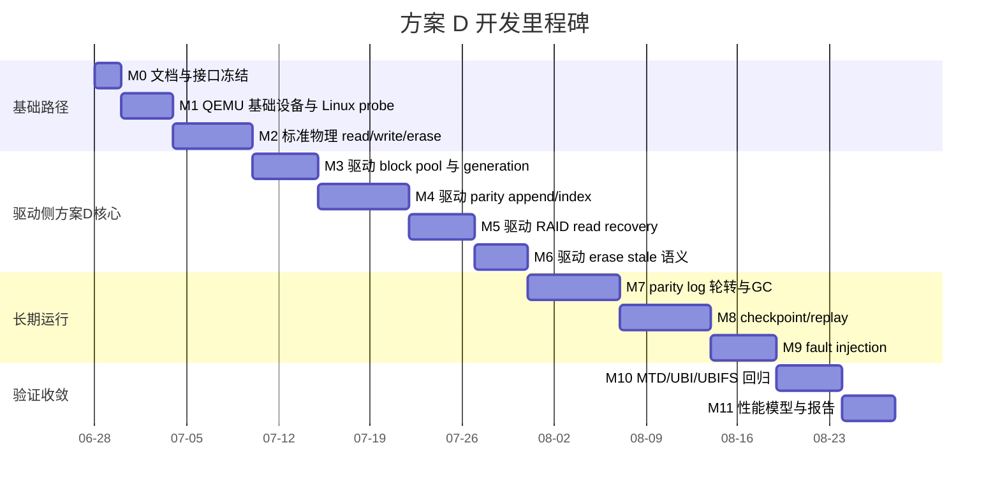

# 3D NAND 方案 D 开发计划

## 1. 计划目标

本文基于 `qemu-3dnand-scheme-d-versioned-parity-log-design.md`，给出方案 D 的分阶段开发计划。方案 D 的核心是：

```text
8-plane data + versioned parity log block
```

开发目标不是一次性实现完整 SSD/FTL，而是在“QEMU 基础 flash 仿真 + Linux MTD 驱动侧 page-raid”架构中逐步验证：

- 8 个 plane 全部作为 data lane。
- parity 写入独立 parity log block pool。
- data block erase 只递增 generation，不强制同步擦 parity block。
- parity record 使用 generation/version 判断有效性。
- parity log 写满后通过 GC 回收。
- Linux MTD/UBI 不感知 parity log，仍使用标准 raw NAND 语义。
- QEMU 不实现 RAID 策略，只提供物理 page/block 操作和故障注入。

## 2. 开发边界

### 2.1 本计划包含

| 项 | 说明 |
| --- | --- |
| QEMU 3D NAND 控制器模型 | 基础几何、block pool 暴露、media model、物理读写擦、fault injection |
| Linux MTD 控制器驱动 | MMIO/IRQ、MTD 注册、方案 D 映射、parity log、GC、debugfs |
| MTD/UBI 验证 | `mtd_debug`、`flash_erase`、`nandwrite`、`ubiattach`、UBIFS |
| 方案 D debug 能力 | 驱动侧 generation、parity index、GC、恢复统计 |

### 2.2 本计划不包含

| 项 | 原因 |
| --- | --- |
| 修改 MTD/UBI 原生代码 | 当前假设是不修改内核基础层 |
| 完整 FTL | 方案 D 只实现 page-raid log，不做通用 L2P 动态重映射 |
| 真实 NVDDR3 时序 | QEMU 先做功能和可观测性能模型 |
| 多 parity / RAID6 | 第一版只做 XOR 单 parity |
| 跨 QEMU 进程崩溃的强一致保证 | checkpoint/replay 在后期阶段实现 |

## 3. 里程碑总览



实际日期可按投入人力调整。上图表达依赖关系，不是硬性排期。

## 4. 模块拆分

### 4.1 QEMU 模块

| 模块 | 文件建议 | 责任 |
| --- | --- | --- |
| 设备前端 | `hw/mtd/q3n-nand.c` | sysbus、MMIO、IRQ、device properties |
| 几何与 block pool | `hw/mtd/q3n-nand.c` | lane/block/page 几何和 data/parity/meta/reserve 默认值暴露 |
| media model | `hw/mtd/q3n-nand.c` | physical page program/read、block erase、OOB 占位、坏页故障注入 |
| fault injection | `hw/mtd/q3n-nand.c` | physical page data-loss、read/program/erase 故障注入扩展点 |
| debug/statistics | `hw/mtd/q3n-nand.c` | QEMU 基础 media counters、trace events |

第一阶段可以先放在一个 `.c` 文件内实现，等功能稳定后再拆分。QEMU 模块边界只覆盖基础 flash 语义，不承载 RAID 策略。

### 4.2 Linux 驱动模块

| 模块 | 文件建议 | 责任 |
| --- | --- | --- |
| MTD 控制器驱动 | `drivers/mtd/nand/raw/qemu_3dnand.c` | probe/remove、MMIO 命令、MTD 注册 |
| register 定义 | 同文件或 `qemu_3dnand.h` | QEMU MMIO 寄存器、状态码 |
| 方案 D RAID | 驱动内部 | generation、parity record、parity index、恢复 |
| parity log GC | 驱动内部 | active log block、victim 选择、copy/discard、erase |
| checkpoint/replay | 驱动内部 | metadata 持久化、启动扫描、index 重建 |
| debugfs | 驱动内部 | RAID/GC/fault 统计 |
| Kconfig/Makefile | raw NAND 目录 | `CONFIG_MTD_NAND_QEMU_3DNAND` |

Linux 驱动实现方案 D 的地址映射和 page-raid 策略。它把策略产生的物理 page/block 操作传给 QEMU，并按 MTD 语义返回结果。

## 5. 阶段计划

### M0：文档与接口冻结

目标：

- 冻结方案 D 几何和容量规划：

```text
data_blocks_per_plane       = 208
parity_log_blocks_per_plane = 32
metadata_blocks_per_plane   = 3
reserve_blocks_per_plane    = 4
```

- 冻结第一版 MTD 可见参数：

```text
writesize  = 16KiB
erasesize  = 25MiB
oobsize    = QEMU 模拟值
size       = 1664 * 1600 * 16KiB = 40.625GiB
```

交付物：

| 交付物 | 验收 |
| --- | --- |
| register 草案 | 仅包含基础 flash 命令、几何、基础统计和故障注入 |
| device property 草案 | QEMU 启动参数可配置几何和 block pool 默认值 |
| trace/debug counter 列表 | 区分 QEMU 基础 media 统计和驱动 RAID 统计 |

### M1：QEMU 空设备与 Linux probe

目标：

- QEMU 暴露 `q3n-nand` sysbus/MMIO/IRQ 设备。
- Linux 驱动能 probe 到设备。
- 能读取 `ID/GEOM/POOL` 寄存器。

验收命令：

```bash
dmesg | grep -i q3n
cat /proc/iomem | grep -i q3n
```

验收标准：

| 项 | 标准 |
| --- | --- |
| QEMU device init | 启动无 crash |
| Linux probe | driver probe success |
| capability read | 几何和 block pool 与 QEMU 参数一致 |

### M2：标准 NAND read/write/erase

目标：

- 不启用 RAID 恢复，仅实现基础 NAND media。
- raw NAND framework 可以完成 scan。
- `/proc/mtd` 出现设备。
- `flash_erase`、`nandwrite`、`nanddump` 可用。

验收命令：

```bash
cat /proc/mtd
mtdinfo /dev/mtd0
flash_erase /dev/mtd0 0 1
nandwrite /dev/mtd0 /tmp/page.bin
nanddump -f /tmp/read.bin /dev/mtd0
cmp /tmp/page.bin /tmp/read.bin
```

退出条件：

- MTD 基础路径稳定。
- 不依赖 parity log 也能读写。
- erase 后 page 返回 erased pattern。

### M3：block pool 与 generation

目标：

- QEMU 通过寄存器暴露 208/32/3/4 block pool 默认划分。
- Linux 驱动按该划分建立 data/parity/meta/reserve pool。
- 每个 data block 有驱动侧 generation。
- data erase 后驱动侧 generation 递增。
- generation 可通过驱动 debug 接口查看。

核心结构：

```c
struct q3n_data_block_meta {
    uint32_t generation;
    bool bad;
    bool erased;
};
```

验收：

| 场景 | 预期 |
| --- | --- |
| 初始格式化 | generation 从 1 开始 |
| erase data block | generation++ |
| program page | generation 不变 |
| bad data block | MTD 可见 bad block 或内部标记 |

### M4：parity record append 与 parity index

目标：

- 满 8-lane stripe 后由 Linux 驱动计算 XOR parity。
- 驱动将 parity record 通过 QEMU physical page program append 到 active parity log block。
- 驱动更新内存 parity index。
- parity record 包含 generation/version/sequence/CRC。

核心结构：

```c
struct q3n_parity_index_key {
    uint64_t group_id;
    uint32_t stripe_index;
};

struct q3n_parity_index_entry {
    struct q3n_physical_addr parity_addr;
    uint32_t parity_version;
    uint32_t data_block_generation[8];
    uint64_t sequence;
    enum q3n_parity_state state;
};
```

验收：

| 场景 | 预期 |
| --- | --- |
| 写满 stripe | `parity_appends++` |
| 读取 parity index | 指向最新 parity record |
| 重复 generation 下更新 | sequence 增大，latest 替换旧 record |
| CRC 注入错误 | record 不进入 valid index |

### M5：RAID read recovery

目标：

- 注入单个 data page uncorrectable。
- Linux 驱动查找 latest valid parity record。
- Linux 驱动通过 QEMU 读取其他 7 个 data pages 和 parity page。
- Linux 驱动 XOR 恢复缺失 page。
- Linux 驱动返回 corrected/bitflip 语义。

验收：

```text
write 8 pages
inject failure on lane3/pageX
read lane3/pageX
expect recovered data
raid_recovered++
```

失败场景：

| 场景 | 预期 |
| --- | --- |
| parity missing | 返回 uncorrectable |
| parity stale | 返回 uncorrectable |
| 两个 data page 同时失败 | 返回 uncorrectable |
| parity page 损坏 | 返回 uncorrectable |

### M6：erase stale 语义

目标：

- data block erase 不擦 parity log block。
- erase 成功后 generation++。
- 旧 parity record 自动变为 stale。
- 后续重写 stripe 后 append 新 parity record。

验收表：

| 操作 | 预期 |
| --- | --- |
| 写满 stripe0 | version1 valid |
| erase lane3/block0 | generation[3]++，version1 stale |
| 读取 lane3/block0/page0 | erased data 或按 MTD 语义返回 |
| 重写 stripe0 | version2 valid |
| 注入单 page failure | 使用 version2 恢复 |

### M7：parity log block 轮转与 GC

目标：

- active parity log block 写满后切换新 block。
- free parity block 低于阈值后启动 GC。
- GC 只复制 latest valid record。
- obsolete/stale record 丢弃。

验收：

| 场景 | 预期 |
| --- | --- |
| active block full | active 切换 |
| stale record 多 | GC discard 计数增加 |
| valid record 被复制 | index 更新到新地址 |
| victim erase fail | victim 标坏，reserve 替换 |

### M8：checkpoint/replay

目标：

- checkpoint 保存 generation table、active log block、index 摘要。
- 驱动重新加载或 QEMU restart 后可重建 parity index。
- checkpoint 损坏时可扫描 parity log blocks 重建。

验收：

```text
write data + parity
write checkpoint
reload driver or restart QEMU
read recovered page
expect parity index restored
```

阶段性妥协：

- M8 之前允许 parity index 只在内存中存在。
- M8 完成后再声明支持驱动重新加载或 QEMU 重启后的 RAID 状态恢复。

### M9：fault injection

目标：

支持以下故障：

| 故障 | 注入点 | 预期 |
| --- | --- | --- |
| data read uncorrectable | data page | RAID 恢复或失败 |
| parity read fail | parity log page | RAID 失败 |
| parity append fail | parity log program | data 保持成功，parity missing |
| data erase fail | data block erase | MTD erase 返回错误或标坏 |
| parity block bad | parity pool | QEMU 内部移除/替换 |
| checkpoint corruption | metadata block | replay 或全量扫描 |

### M10：MTD/UBI/UBIFS 回归

目标：

- 验证方案 D 不破坏 Linux 标准 MTD/UBI 路径。
- 验证 parity log 对 UBI 透明。

测试命令：

```bash
flash_erase /dev/mtd0 0 4
nandwrite /dev/mtd0 /tmp/blob.bin
nanddump -f /tmp/read.bin /dev/mtd0

ubiformat /dev/mtd0
ubiattach -m 0
ubimkvol /dev/ubi0 -N test -s 1GiB
mount -t ubifs ubi0:test /mnt
dd if=/dev/zero of=/mnt/blob bs=1M count=256
sync
```

验收：

| 项 | 预期 |
| --- | --- |
| `/proc/mtd` | 容量和 erasesize 正确 |
| UBI attach | 成功 |
| UBIFS mount | 成功 |
| 大文件写入 | 成功 |
| RAID counters | parity append/recover/GC 可观测 |

### M11：性能模型与报告

目标：

- 对比方案 A 与方案 D。
- 模拟 8-plane data 并行收益。
- 统计 write amplification、GC amplification、recovery latency。

指标：

| 指标 | 说明 |
| --- | --- |
| data program latency | 8 plane 并行时的 data phase 延迟 |
| parity append latency | parity log 写入延迟 |
| GC amplification | GC copy records / user data writes |
| recovery latency | 读其他 7 page + parity page + XOR |
| stale window ratio | parity stale 的时间/写入比例 |

## 6. 接口冻结清单

### 6.1 QEMU properties

QEMU 只暴露基础 flash 几何和 block pool 默认划分，不暴露 RAID profile、GC 或 checkpoint 策略开关。

| property | 默认值 |
| --- | --- |
| `data-blocks-per-plane` | `208` |
| `parity-log-blocks-per-plane` | `32` |
| `metadata-blocks-per-plane` | `3` |
| `reserve-blocks-per-plane` | `4` |
| `page-size` | `16KiB` |
| `pages-per-block` | `1600` |

### 6.2 Driver policy constants

| constant | 当前值 |
| --- | --- |
| `Q3N_RAID_LANES` | `8` |
| parity profile | single XOR parity page |
| checkpoint | off，M8 后再设计 |
| GC low watermark | M7 后再设计 |

### 6.3 Debug counters

| counter | 说明 |
| --- | --- |
| `Q3N_REG_STAT_PAGE_PROGRAMS` | QEMU physical page program 次数 |
| `Q3N_REG_STAT_BLOCK_ERASES` | QEMU physical block erase 次数 |
| `Q3N_REG_STAT_PAGE_READ_ERRORS` | QEMU physical page read error 次数 |
| `faults_injected` | QEMU fault injection 次数 |
| `generation_updates` | generation 递增次数 |
| `parity_written` | parity page append 次数 |
| `parity_stale` | stale parity 次数 |
| `raid_recovered` | RAID 恢复成功次数 |
| `raid_failed` | RAID 恢复失败次数 |
| `gc_runs` | M7 后增加 |
| `gc_copied_records` | M7 后增加 |
| `gc_discarded_records` | M7 后增加 |

## 7. 风险与缓解

| 风险 | 影响 | 缓解 |
| --- | --- | --- |
| parity log 空间不足 | 无法持续 append parity | 使用 208/32/3/4 容量规划，保留 48 block log/GC 余量 |
| stale parity 窗口过大 | RAID 保护覆盖率下降 | 统计 stale ratio，必要时后台 rebuild |
| GC 复杂度高 | 长期运行 bug 风险 | M7 单独开发，先不和 checkpoint 混合 |
| checkpoint/replay 不一致 | 重启后恢复错误 | sequence + CRC + full scan fallback |
| 坏块策略退化成完整 FTL | 范围膨胀 | data bad block 先暴露给 MTD，parity/meta bad block 内部隐藏 |
| QEMU 理解过多 RAID 细节 | 破坏分层 | RAID 映射只放 Linux 驱动，QEMU 只做基础 flash/controller |

## 7.1 当前实现进度

| 里程碑 | 当前状态 |
| --- | --- |
| M1 QEMU 基础设备与 Linux probe | 已实现 PCI `q3n-nand-pci` 与 Linux probe |
| M2 标准物理 read/write/erase | 已实现 QEMU physical page/block 命令和 MTD 回调 |
| M3 block pool 与 generation | 已实现驱动侧 data block generation，erase 后递增 |
| M4 parity append/index | 已实现内存 parity index，并记录 generation/version/sequence |
| M5 RAID read recovery | 已实现单 page data loss 后 XOR 恢复 |
| M6 erase stale 语义 | 已实现 generation mismatch 驱动 stale parity 失效 |
| M7 parity log GC | 未实现 |
| M8 checkpoint/replay | 未实现 |

## 8. 推荐执行顺序

最稳妥的开发顺序是：

```text
M1 -> M2 -> M3 -> M4 -> M5 -> M6 -> M7 -> M8 -> M9 -> M10 -> M11
```

其中必须设置三个硬门槛：

| 门槛 | 条件 |
| --- | --- |
| 进入 M4 前 | MTD 基础 read/write/erase 稳定 |
| 进入 M7 前 | parity append/index/recovery 已通过 fault injection |
| 进入 M10 前 | GC 和 checkpoint 的最小异常路径已验证 |

## 9. 最小可交付版本

如果需要先交付一个可演示版本，建议范围为 M1 到 M6：

| 能力 | 是否包含 |
| --- | --- |
| Linux MTD 设备注册 | 是 |
| 标准 read/write/erase | 是 |
| 8-plane data group | 是 |
| generation | 是 |
| parity record append | 是 |
| 单 page RAID 恢复 | 是 |
| erase 后 stale parity | 是 |
| parity log GC | 否 |
| checkpoint/replay | 否 |
| 长期稳定运行 | 否 |

这个最小版本可以证明方案 D 的核心逻辑成立，但不能证明长期空间回收和掉电恢复。
