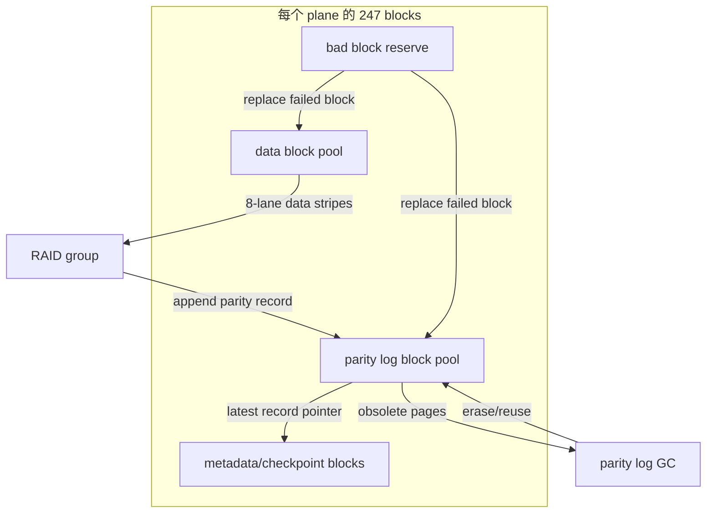
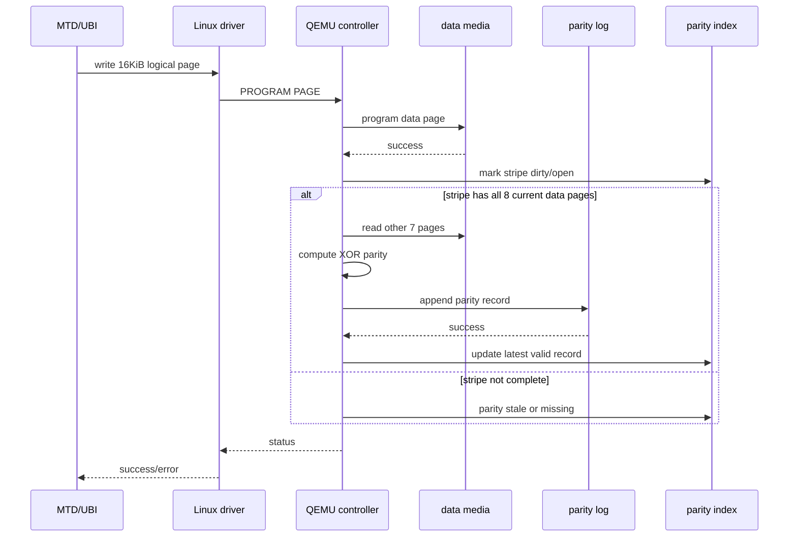
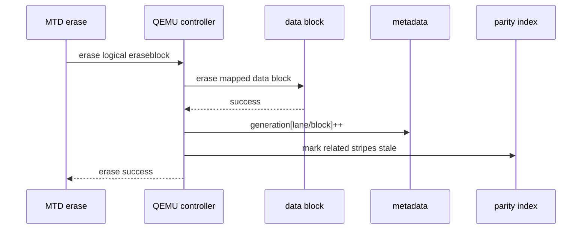
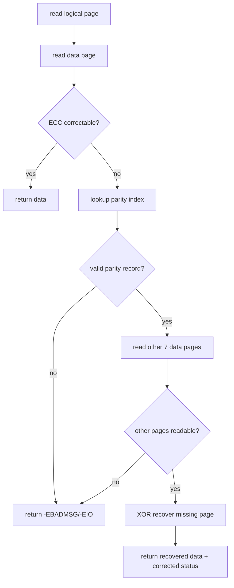
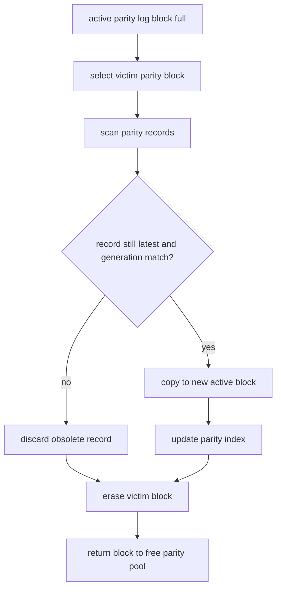
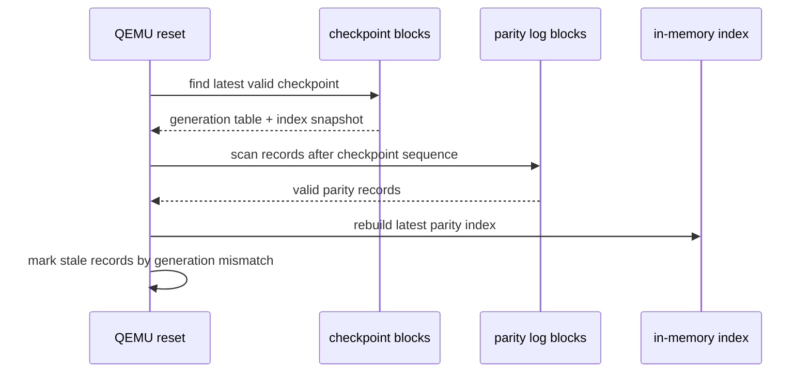

# QEMU 3D NAND 方案 D 详细设计：8-plane data + versioned parity log block

配套开发计划见 `qemu-3dnand-scheme-d-development-plan.md`。

## 1. 设计目标

方案 D 的目标是在不修改 Linux 原生 MTD/raw NAND/UBI 基础代码的前提下，在 QEMU 控制器内部验证一种更接近真实控制器/轻量 FTL 的 page-raid 方案：

- 8 个 plane 全部用于 data page 写入。
- parity 不占用固定 plane，也不放在 data block 内固定 page。
- parity 写入额外的 parity log block pool。
- parity record 使用 generation/version 管理有效性。
- data block erase 时不要求同步 erase parity block。
- 旧 parity 通过 generation 不匹配自动失效。
- 新 parity 使用 append-only 方式写入新的 parity log page。
- Linux MTD/UBI 仍只看到标准 NAND 设备，不感知 parity log、generation、GC。

方案 D 不是第一阶段最简实现。它适合在方案 A 已经跑通 MTD/UBI 基础路径后，用于验证：

| 目标 | 说明 |
| --- | --- |
| 8-plane data 并行 | 单个 stripe 可以覆盖全部 8 条 lane |
| parity 不浪费固定 plane | parity block 在 block pool 中轮转 |
| NAND append-only parity | parity 不原地覆盖，符合 NAND program 约束 |
| erase/parity 解耦 | data erase 只更新 generation，不强制擦 parity block |
| 更真实的控制器行为 | 引入 parity index、checkpoint、GC、故障恢复 |

## 2. 目标几何

当前 NAND 几何固定为：

| 项目 | 数值 |
| --- | ---: |
| die 数量 | 2 |
| 每 die plane 数量 | 4 |
| 总 lane/plane 数 | 8 |
| 每 plane block 数量 | 247 |
| 每 block page 数量 | 1600 |
| page data size | 16KiB |
| OOB | 另算 |
| 单物理 block data 容量 | 25MiB |
| 总物理 block 数 | 1976 |
| 总物理容量 | 48.24GiB |

lane 编号：

| Lane | 物理位置 |
| ---: | --- |
| 0 | die0 / plane0 |
| 1 | die0 / plane1 |
| 2 | die0 / plane2 |
| 3 | die0 / plane3 |
| 4 | die1 / plane0 |
| 5 | die1 / plane1 |
| 6 | die1 / plane2 |
| 7 | die1 / plane3 |

## 3. 总体结构

方案 D 把 247 个 block 分成四类：



推荐初始容量划分：

| block 类型 | 每 plane block 数 | 总 block 数 | 说明 |
| --- | ---: | ---: | --- |
| data block pool | 208 | 1664 | MTD 可见主数据 |
| parity log block pool | 32 | 256 | 版本化 parity record |
| metadata/checkpoint block | 3 | 24 | generation、parity index、active log checkpoint |
| bad block reserve | 4 | 32 | 坏块替换和测试余量 |
| 合计 | 247 | 1976 | 当前几何全部 block |

这个划分满足 `data:parity = 8:1` 的完整覆盖要求，并给 versioned parity log 和 GC 留出空间：

```text
base_parity_blocks = data_blocks_total / 8
                   = 1664 / 8
                   = 208 blocks

extra_parity_log_blocks = parity_log_blocks_total - base_parity_blocks
                        = 256 - 208
                        = 48 blocks
```

可见容量按 data block pool 计算：

```text
visible_size = data_blocks_total * pages_per_block * page_size
             = 1664 * 1600 * 16KiB
             = 40.625GiB
```

这个容量规划是可调参数，不是硬编码。QEMU device property 可以提供：

```text
raid_profile=versioned-parity-log
data_blocks_per_plane=208
parity_log_blocks_per_plane=32
metadata_blocks_per_plane=3
reserve_blocks_per_plane=4
```

## 4. MTD 可见语义

方案 D 推荐第一版对 Linux 暴露：

| MTD 字段 | 推荐值 | 说明 |
| --- | ---: | --- |
| `writesize` | 16KiB | 保持真实 NAND page 语义 |
| `writebufsize` | 16KiB | 不要求 UBI 一次写满 8-plane stripe |
| `erasesize` | 25MiB | 一个 MTD eraseblock 对应一个 data physical block |
| `size` | data block pool 容量 | 不包含 parity/meta/reserve block |
| `oobsize` | 模拟 NAND OOB | parity log OOB 不暴露 |

也就是说，MTD/UBI 看到的是普通 NAND：

```text
logical eraseblock N -> 一个 data physical block
logical page P       -> 一个 16KiB data physical page
```

QEMU 内部把多个 data block 组织成 RAID group，并在后台维护 parity log：

```text
RAID group = 同一 group_id 下的 8 个 data blocks
stripe     = 8 个 data blocks 中相同 page index 的 8 个 data pages
parity     = XOR(data_lane0_page ^ ... ^ data_lane7_page)
```

注意：MTD 不知道 stripe，UBI 也不需要按 8-plane stripe 对齐写入。未写满或 generation 不匹配的 stripe 可以暂时没有 RAID 保护。

## 5. 地址映射

### 5.1 Logical eraseblock 到 data block

MTD logical eraseblock 先映射到 data block pool：

```text
logical_eraseblock = LEB

data_block_index = LEB
lane             = data_block_index % 8
group_id         = data_block_index / 8
block_in_lane    = data_block_index / 8
```

示例：

| LEB | group_id | lane | data block |
| ---: | ---: | ---: | --- |
| 0 | 0 | 0 | lane0/block0 |
| 1 | 0 | 1 | lane1/block0 |
| 2 | 0 | 2 | lane2/block0 |
| 3 | 0 | 3 | lane3/block0 |
| 4 | 0 | 4 | lane4/block0 |
| 5 | 0 | 5 | lane5/block0 |
| 6 | 0 | 6 | lane6/block0 |
| 7 | 0 | 7 | lane7/block0 |
| 8 | 1 | 0 | lane0/block1 |

### 5.2 Stripe 映射

同一个 `group_id` 的 8 个 data blocks 组成一个 RAID group。每个 page index 构成一个 stripe：

```text
stripe_id = group_id * pages_per_block + page_index

data pages:
  lane0 / block_in_lane / page_index
  lane1 / block_in_lane / page_index
  ...
  lane7 / block_in_lane / page_index
```

示例：

| stripe_id | data pages | parity record |
| ---: | --- | --- |
| 0 | lane0..lane7 / block0 / page0 | parity log append page |
| 1 | lane0..lane7 / block0 / page1 | parity log append page |
| 1599 | lane0..lane7 / block0 / page1599 | parity log append page |
| 1600 | lane0..lane7 / block1 / page0 | parity log append page |

## 6. Versioned parity log

### 6.1 Parity record

parity log block 中每个 page 存一个 parity record：

```c
#define Q3N_LANE_COUNT 8
#define Q3N_PAGE_SIZE  16384

struct q3n_parity_record_header {
    uint32_t magic;
    uint16_t header_version;
    uint16_t header_size;
    uint64_t group_id;
    uint32_t stripe_index;
    uint32_t parity_version;
    uint32_t data_block_generation[Q3N_LANE_COUNT];
    uint64_t sequence;
    uint32_t payload_crc;
    uint32_t header_crc;
    uint8_t  state;
    uint8_t  reserved[63];
};

struct q3n_parity_record {
    struct q3n_parity_record_header hdr;
    uint8_t parity_payload[Q3N_PAGE_SIZE];
};
```

`state` 建议取值：

| 状态 | 含义 |
| --- | --- |
| `EMPTY` | page 未写入 |
| `VALID` | header/payload 完整，generation 匹配当前 data blocks |
| `STALE` | generation 已落后，不能用于当前数据恢复 |
| `REBUILDING` | QEMU 内部正在计算并追加新 record |
| `LOST` | parity block 或 record 损坏 |

### 6.2 Data block generation

每个 data block 维护一个 generation：

```c
struct q3n_data_block_meta {
    uint32_t generation;
    bool bad;
    bool erased;
};
```

规则：

| 操作 | generation 行为 |
| --- | --- |
| 初次格式化 | generation 初始化为 1 |
| program page | generation 不变 |
| erase data block 成功 | generation++ |
| data block 标坏 | generation 不再用于新映射 |
| reserve block 替换 | 新物理 block 继承 logical block generation 或 generation++ |

generation 是判断 parity 是否过期的核心。只要 parity record 中记录的 `data_block_generation[lane]` 与当前 generation 不一致，该 record 就不能用于当前 stripe 恢复。

### 6.3 最新 parity index

QEMU 内存中维护：

```c
struct q3n_parity_index_key {
    uint64_t group_id;
    uint32_t stripe_index;
};

struct q3n_parity_index_entry {
    struct q3n_physical_addr parity_addr;
    uint32_t parity_version;
    uint32_t data_block_generation[Q3N_LANE_COUNT];
    uint64_t sequence;
    enum q3n_parity_state state;
};
```

索引规则：

```text
(group_id, stripe_index) -> latest valid parity record
```

选择 latest record 时，优先级：

1. `header_crc` 和 `payload_crc` 正确。
2. `state == VALID`。
3. `data_block_generation[]` 与当前 group 一致。
4. `sequence` 最大。

## 7. 写入流程

### 7.1 单 page 写入

MTD 写一个 16KiB page 时：



最重要的同步语义：

| 要求 | 说明 |
| --- | --- |
| data page 必须先落盘 | MTD 写成功后，data 必须可读回 |
| parity 可以延后 | parity 是增强恢复能力，不是 MTD 写成功的前置条件 |
| parity 失败要记录 | `parity_missing` 或 `parity_stale` 统计增加 |
| 不把数据只留在 stripe buffer | 否则违反 MTD 同步写语义 |

### 7.2 满 stripe 写入

当同一 stripe 的 8 条 lane 都有当前 generation 下的有效 data page：

```text
parity = data_lane0 ^ data_lane1 ^ ... ^ data_lane7
```

然后追加 parity record：

```text
active_parity_log_block[next_page] = parity_record
next_page++
parity_index[(group_id, stripe_index)] = new_record
```

### 7.3 覆写限制

raw NAND 不允许 page 原地覆写。方案 D 仍然遵守 NAND 语义：

- 同一个 data page 在 erase 前只能 program 一次。
- parity record 可以重复追加新版本，因为每次都写到新的 parity log page。
- data block erase 后，旧 data 全部变成 erased state，旧 parity record 因 generation 不匹配而失效。

## 8. Erase 流程

data block erase 不同步擦 parity block：



erase 后的状态：

| 项 | 结果 |
| --- | --- |
| data block | 变成 erased state |
| data generation | 递增 |
| old parity record | 不擦除，但 generation 不匹配，视为 stale |
| parity log block | 等 GC 时统一回收 |
| MTD 返回 | data block erase 成功即可返回 |

## 9. 读取与 RAID 恢复

普通读取：



恢复公式：

```text
missing_data = parity ^ xor(all other readable data pages in stripe)
```

恢复条件：

| 条件 | 要求 |
| --- | --- |
| parity record 有效 | generation 匹配，CRC 正确 |
| 同一 stripe 只有一个 data page 不可读 | XOR 单 parity 只能恢复一个失败 |
| 其他 7 个 data page 可读 | 否则无法恢复 |
| parity payload 可读 | parity log page 自身不能损坏 |

## 10. Parity log GC

parity log block 是 append-only，会不断写满。需要 GC：



GC 触发条件：

| 触发项 | 建议阈值 |
| --- | --- |
| active parity log block 写满 | 立即切换新 active block |
| free parity log block 少于阈值 | 启动 GC |
| stale record 比例高 | 后台 GC |
| checkpoint 周期到达 | 写 checkpoint 后可回收旧 log |

GC 风险：

| 风险 | 缓解 |
| --- | --- |
| GC 中断导致 index 不一致 | 使用 checkpoint + log replay |
| valid record copy 失败 | 保留旧 block，不 erase victim |
| parity block erase fail | 标坏并从 reserve pool 替换 |
| GC 写放大 | debugfs 暴露 GC copy/discard 统计 |

## 11. Checkpoint 与重建

如果只在内存中维护 parity index，QEMU 重启后无法知道最新 parity record。因此方案 D 至少需要 checkpoint 或启动扫描。

推荐两级机制：

| 机制 | 作用 |
| --- | --- |
| checkpoint block | 周期性保存 data generation、active log block、parity index 摘要 |
| log replay | 从 checkpoint sequence 之后扫描 parity log records，重建 latest index |

checkpoint header：

```c
struct q3n_checkpoint_header {
    uint32_t magic;
    uint16_t version;
    uint16_t header_size;
    uint64_t checkpoint_sequence;
    uint64_t last_replayed_sequence;
    uint32_t data_block_count;
    uint32_t parity_index_count;
    uint32_t crc;
};
```

启动恢复流程：



第一版如果不需要 QEMU 进程重启后保持 RAID 状态，可以把 checkpoint 标为非目标；但完整方案 D 必须把 checkpoint 纳入设计。

## 12. 坏块策略

方案 D 有三类坏块：

| 坏块类型 | 处理策略 |
| --- | --- |
| data block bad | 对应 MTD eraseblock 标坏，或用 reserve block 内部替换 |
| parity log block bad | 不暴露给 MTD，从 parity pool 移除并使用 reserve |
| metadata/checkpoint block bad | 使用下一个 metadata block，必要时全量扫描 parity log 重建 |

第一版建议：

- data block bad 直接暴露为 MTD bad block。
- parity/meta block bad 由 QEMU 内部隐藏。
- 不做 data block 内部 remap，避免过早变成完整 FTL。
- debugfs 暴露 data/parity/meta bad block 数量。

## 13. QEMU 接口设计

### 13.1 Device properties

| property | 示例 | 说明 |
| --- | --- | --- |
| `raid-profile` | `versioned-parity-log` | 启用方案 D |
| `data-blocks-per-plane` | `208` | 每 plane data block 数 |
| `parity-log-blocks-per-plane` | `32` | 每 plane parity log block 数 |
| `metadata-blocks-per-plane` | `3` | checkpoint block 数 |
| `reserve-blocks-per-plane` | `4` | reserve block 数 |
| `checkpoint-enable` | `on` | 是否持久化 checkpoint |
| `gc-low-watermark` | `4` | parity free block 低水位 |

### 13.2 Registers

在已有 NAND 控制器寄存器基础上增加：

| register | 说明 |
| --- | --- |
| `RAID_PROFILE` | 当前 RAID profile ID |
| `RAID_STATUS` | parity valid/stale/lost/recovered 状态 |
| `PLOG_ACTIVE_BLOCK` | 当前 active parity log block |
| `PLOG_FREE_BLOCKS` | 剩余 parity log block |
| `PLOG_GC_STATUS` | GC 状态 |
| `RAID_RECOVERED_COUNT` | RAID 恢复成功次数 |
| `RAID_STALE_COUNT` | stale parity 次数 |
| `RAID_GC_COUNT` | GC 次数 |

Linux MTD 驱动不需要理解这些寄存器才能正常工作。它们主要用于调试和验证。

## 14. 数据结构设计

```c
struct q3n_scheme_d {
    struct q3n_data_block_meta *data_meta;
    struct q3n_parity_log plog;
    struct q3n_parity_index parity_index;
    struct q3n_checkpoint checkpoint;
    struct q3n_gc_state gc;
};
```

```c
struct q3n_parity_log {
    struct q3n_physical_addr active_block;
    uint16_t next_page;
    uint32_t free_blocks;
    uint64_t next_sequence;
};
```

```c
struct q3n_gc_state {
    bool running;
    struct q3n_physical_addr victim_block;
    uint32_t copied_records;
    uint32_t discarded_records;
};
```

```c
struct q3n_stats {
    uint64_t data_programs;
    uint64_t data_erases;
    uint64_t parity_appends;
    uint64_t parity_stale;
    uint64_t parity_recovered;
    uint64_t parity_failed;
    uint64_t gc_runs;
    uint64_t gc_copied_records;
    uint64_t gc_discarded_records;
};
```

## 15. 性能模型

写入一个满 8-lane stripe：

```text
phase 1: program 8 data pages in parallel
phase 2: read/collect data if needed
phase 3: append 1 parity record
```

如果 QEMU 内部能在 write buffer 中同时看到 8 个 data pages，可以避免再次读取 data pages：

| 模式 | 行为 | 延迟模型 |
| --- | --- | --- |
| no aggregation | 每个 16KiB page 单独写，stripe 满后读其他 7 pages 计算 parity | 写延迟低，parity 生成滞后 |
| short aggregation | 控制器短时间聚合相邻 lane 写入 | 可减少 parity 计算读放大 |
| full super-page | 上层一次写满 8 pages | data 并行最高，parity 追加一次 |

方案 D 的性能收益主要来自：

- 8 个 plane 都用于 data。
- parity block 不固定占用某个 plane。
- parity append 可异步化。
- GC 可后台运行。

代价：

- parity append 带来写放大。
- GC 带来额外读写。
- checkpoint/log replay 增加元数据写入。

## 16. 一致性与掉电风险

| 风险点 | 影响 | 缓解 |
| --- | --- | --- |
| data program 成功，parity append 未完成 | data 可读但没有 RAID 保护 | 标记 parity stale/missing |
| data erase 成功，generation checkpoint 未写 | 重启后 generation 可能回退 | checkpoint 或 erase journal |
| parity record 写一半 | record CRC 失败，忽略 |
| GC copy 后 victim erase 前掉电 | 可能存在重复 valid record | 使用 sequence 最大者 |
| checkpoint 损坏 | 需要扫描 parity log 重建 |

完整方案 D 应把以下写入顺序作为约束：

```text
data program/erase durable first
metadata generation update second
parity append/checkpoint third
```

这样即使 parity 失败，也不会破坏 MTD 已确认的数据。

## 17. 测试计划

| 测试 | 步骤 | 预期 |
| --- | --- | --- |
| MTD 基础 | `flash_erase`、`nandwrite`、`nanddump` | data 可读写 |
| UBI attach | `ubiformat`、`ubiattach`、`ubimkvol` | UBI 可用 |
| 满 stripe parity | 写满同一 group 的 8 个 page | 追加 parity record |
| 单 page 恢复 | 注入一个 data page uncorrectable | RAID recovered |
| stale parity | erase 一个 data block 后读取旧 stripe | 不使用旧 parity |
| parity log GC | 写满 parity log block | GC 迁移 latest record |
| parity block bad | 注入 parity block bad | QEMU 内部替换或移除 |
| checkpoint replay | 重启 QEMU 后扫描恢复 index | latest parity index 正确 |

## 18. 实现顺序

建议不要一次实现完整方案 D，而是分阶段：

| 阶段 | 内容 |
| --- | --- |
| 1 | 在 QEMU 中增加 block pool 划分 |
| 2 | 实现 data block generation |
| 3 | 实现 parity record append |
| 4 | 实现内存 parity index |
| 5 | 实现 read fail RAID recovery |
| 6 | 实现 erase 后 stale parity 判断 |
| 7 | 实现 parity log block 轮转 |
| 8 | 实现 GC |
| 9 | 实现 checkpoint/log replay |
| 10 | 增加 fault injection 和 debugfs/statistics |

第一阶段最小可验证闭环：

```text
write 8 data pages -> append parity record -> inject 1 page failure -> recover
```

第二阶段再验证：

```text
erase data block -> generation++ -> old parity stale -> rewrite -> new parity valid
```

第三阶段验证：

```text
parity log full -> GC -> checkpoint -> QEMU restart -> replay
```

## 19. 结论

方案 D 是可行的，但它不是简单 page-raid，而是 QEMU 控制器内部的版本化 parity 日志方案。它的核心价值是：

- 让 8 个 plane 全部承担 data 写入。
- parity 不固定占用某个 plane。
- data block erase 不强制同步 erase parity block。
- 通过 generation/version 支持旧 parity 自动失效。
- 通过 parity log GC 支持长期运行。

它的代价也明确：

- QEMU 内部需要 parity index、generation、checkpoint、GC。
- stale parity 窗口需要被明确建模。
- 坏块和掉电恢复比方案 A 复杂。
- 实现边界已经接近轻量 FTL。

因此建议：

```text
第一阶段：实现方案 A，验证 MTD/UBI 标准路径。
第二阶段：实现方案 D 的最小闭环，验证 8-plane data + parity log。
第三阶段：补齐 GC、checkpoint、fault injection，作为高级可靠性/性能 profile。
```
