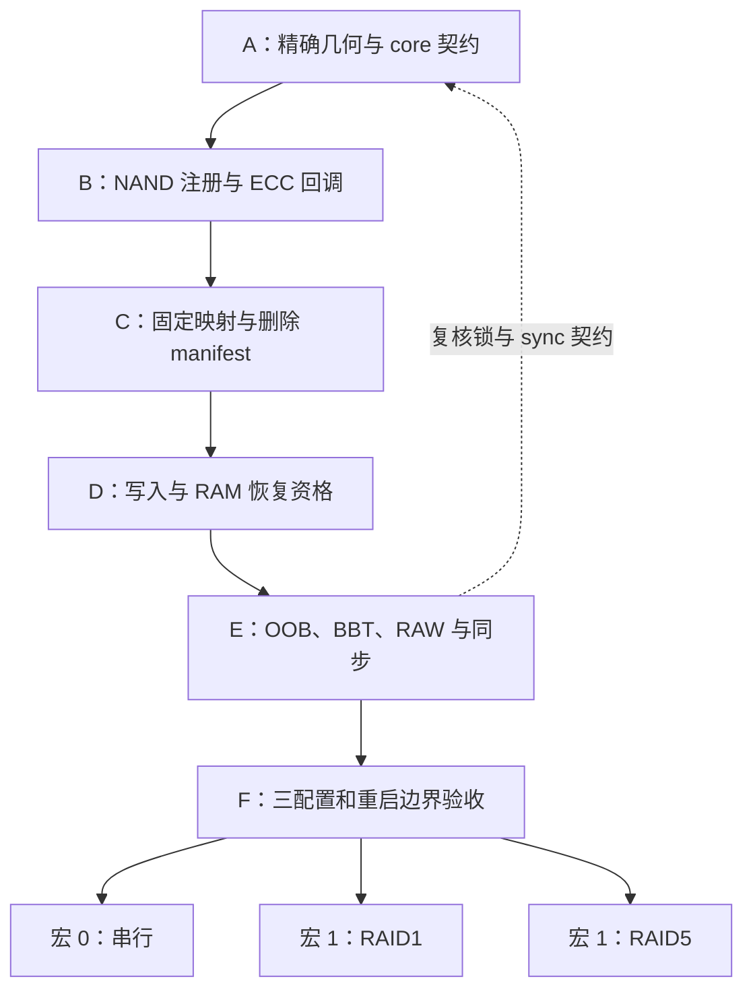

# Page-RAID1/RAID5：ECC 接口与无 manifest 迁移清单

修订日期：2026-09-12。

**状态：多-plane RAID1/RAID5 已实现并验收。**
实现已从 direct MTD/manifest 迁移到 NAND core `ecc.*`、固定映射和标准
RAM BBT。按最终范围，宏 0 只保留原串行代码的构建回退，不再扩展串行
RAID 验收；交付重点为宏 1 的同 die、多 plane RAID1/RAID5。

规范：[ECC 回调与固定页映射设计](../specs/2026-08-30-multiplane-page-raid1-raid5-design.md)。

## 0. 实施结果

| 阶段 | 结果 | 验证 |
| --- | --- | --- |
| A 精确几何/core 契约 | 完成 | 真实 Linux core 补丁应用、重复应用、非二次幂地址与 BBT 单测 |
| B NAND/ECC 接入 | 完成 | 默认内核构建、`nand_scan_with_ids()` 启动与 MTD 注册 |
| C 固定映射/无 manifest | 完成 | KUnit 映射轮转及源码残留检查 |
| D 多-plane RAID1/5 | 完成 | RAID1、RAID5 单故障恢复与双故障拒绝 smoke |
| E OOB/BBT/生命周期 | 完成 | 跨重启数据摘要与 BBM/BBT 重建 smoke |
| F 串行回退 | 仅构建 | 按最终范围不扩展或验收串行 RAID；宏 0 保留编译回退 |

下方复选项保留为原实施分解与审查追溯，不再作为最终范围状态；最终结果
以本表、设计文档第 13 节及实际测试输出为准。

实施前先按规范第 1 节确认 MTD 接口覆盖：普通读写、OOB、擦除、坏块查询、
标坏、同步及 RAW 的支持/拒绝边界。MTD 入口由核心提供，驱动挂接
ecc.*、legacy 命令及 block_bad/block_markbad 回调和新增 sync hook；
后续任务均以这张接口责任表为范围基准，不直接实现或覆盖 MTD I/O 回调。

## 1. 固定约束

- 分支 `codex/multiplane-page-raid1-raid5`。
- `Q3N_ENABLE_MULTIPLANE_RAID=0|1` 默认 1，两种配置均接入 NAND core。
- 宏 0 保留串行地址、容量、后台 parity 与调度，不保留旧清单解析。
- 宏 1 为同 die 多-plane RAID1/RAID5，`raid_level=1|5` 默认 5。
- parity / mirror 位置由代码公式计算，不写入介质映射表。
- 取消 RAID manifest、软件 CRC、持久化 generation 和 OOB commit。
- 保留控制器 LDPC、BBM 与标准 RAM BBT，不以其他持久化日志替代 manifest。
- 恢复资格仅存 RAM；重启后 UNKNOWN，不能自动恢复不可纠的数据成员。
- 不承诺掉电原子性；旧介质不自动转换，验收默认使用隔离 fresh NAND。
- 不修改用户已有的 `.vscode/`。

## 2. 依赖流程

## 3. Task A：精确几何与 core 扩展

拟涉及：Linux patches、补丁应用脚本、core/BBT 测试。

- [ ] 审阅参考分支 `4d2726b` 的 exact-geometry 补丁，不整体照搬 profile。
- [ ] 核对 Linux 7.0.12 读写、OOB、擦除、target、BBT 的除法与取模。
- [ ] 支持 16384/49152 writesize、1400/1600 pages/block，保留二次幂快路径。
- [ ] 新增默认关闭的 markbad 免前置擦除选项；legacy.block_markbad 不足以替代。
- [ ] 定义默认 NULL 的 NAND chip sync 扩展；它由本次 core 补丁新增。
- [ ] 明确 OOB-only BBM 写入后的 RAM BBT 更新契约。
- [ ] 验证默认设备行为不变、补丁可重复应用且失败中止。

验收：最后页/块、跨块、越界、BBT、免擦除 opt-in 与默认设备回归。

## 4. Task B：NAND 注册与 ECC 回调

拟涉及：main.c、priv.h、新 controller.c/ecc.c/page.c、构建配置。

- [ ] 使用 nand_chip/controller 和 nand_to_mtd；移除直接赋值 MTD I/O 回调。
- [ ] scan 前选择 profile、准备逻辑 ID/几何，只扫描一个逻辑 target。
- [ ] 必须走 nand_scan 完整路径；自定义 ID 表使用等价的 nand_scan_with_ids，
  不设置 NAND_SKIP_BBTSCAN，由 nand_scan_tail → nand_create_bbt 创建核心 RAM BBT。
- [ ] 不启用 NAND_BBT_USE_FLASH，不另建私有 BBT；扫描前配置好逻辑几何、
  BBM 标记页与 OOB 读取路径，扫描成功后才注册 MTD。
- [ ] RAID1 两成员、RAID5 四成员的物理 BBM 合成逻辑 BBM：任一坏即组坏；
  传输错误使扫描失败，不依赖 main ECC 或条带恢复资格。
- [ ] 验证出厂坏块、任意 plane 坏标记、全好块、BBM 读取失败、BBT 分配失败、
  最后逻辑块和重启重建；block_isbad/markbad 使用 NAND core 而非 MTD 私有回调。
- [ ] 不注册 controller.ops->exec_op，保留 controller/attach_chip；scan 前
  安装 cmdfunc、waitfunc、select_chip、read_byte/read_buf 及实际需要的数据 hooks。
- [ ] legacy 路径支持逻辑 READID、STATUS、RESET；审计默认 helper 对
  cmd_ctrl/write_buf 等的依赖，不把未实现命令伪装为成功。
- [ ] ERASE1 保存并校验逻辑块地址，ERASE2 发起一次 multi-plane 擦除；
  waitfunc 汇总成员 NAND 状态或返回负 errno，不采用逐成员串行擦除。
- [ ] 为 void cmdfunc 保存本次操作错误，经 waitfunc 返回；验证无 ERASE1
  的 ERASE2、地址非法、成员失败、超时、RESET 和旧完成状态隔离。
- [ ] 验证真实 nand_erase → nand_erase_op → cmdfunc/waitfunc 调用链，
  精确几何补丁覆盖两处擦除页号计算；免前置擦除和 worker 同步要求不变。
- [ ] attach_chip 设置 ecc.read_page/write_page 及 OOB/RAW 回调。
- [ ] 按规范第 3.3 节注册 legacy.block_bad / legacy.block_markbad，
  与 ecc.read_oob/write_oob 共用成员映射和 BBM helper；不替换 MTD 坏块回调。
- [ ] 验证初始化 BBT 扫描经过 ecc.read_oob 而非 block_bad；有 BBT 的查询
  直接查核心表，无 BBT 的底层 BBM 查询才使用 block_bad。
- [ ] 验证 block_markbad 广播全部成员标记、错误不被吞掉、核心更新 BBT；
  回调不递归调用 MTD、不重复获取设备锁，也不自行修改核心 BBT。
- [ ] 覆盖标坏部分失败与重启重扫；保留免前置擦除 opt-in 和用户 OOB 写后
  BBT 同步依赖，不以 NAND_BBT_NO_OOB_BBM 绕过物理标记写入。
- [ ] RAID5 始终读取完整 48 KiB 逻辑页；关闭 subpage 读写。
- [ ] 正常读取返回最大 bitflips，恢复成功提升到阈值。
- [ ] 不可恢复时每逻辑页增加一次 failed，由 core 生成 EBADMSG；
  传输错误直接返回负 errno，retlen 由 core 管理。
- [ ] 宏 0 不要求 multi-plane capability；宏 1 缺能力明确失败。
- [ ] 验证 scan/register/cleanup 的资源回滚，不增加未要求的 read-retry。

验收：三配置 scan、完整 buffer、部分用户读、errno/retlen/ECC 统计。

## 5. Task C：固定映射与移除介质清单

拟涉及：map.c、raid.c、mp.c、映射 KUnit。

- [ ] 按规范第 5 节固化串行 D0..D6,P、RAID1 镜像对、RAID5 轮转公式。
- [ ] RAID5 使用 stripe_id = leb * 1600 + page_row，
  parity_plane = stripe_id % 4；其余 plane 按升序装载 D0/D1/D2。
- [ ] 测试全部 parity 轮转、die/块边界和 64 位溢出检查。
- [ ] 删除新旧 RAID manifest、软件 CRC、持久化 generation 和清单扫描。
- [ ] 删除 RAID OOB commit 阶段；不改 QEMU 自身镜像文件格式头。
- [ ] OOB[1..127] 不用于 RAID，不解析旧值，不保存映射或提交标记。
- [ ] 保留串行物理地址、容量与 scheduler，不删除原串行验收入口。

验收：映射可纯函数计算；没有 RAID 元数据写命令或启动清单扫描。

## 6. Task D：写入与 RAM 恢复资格

拟涉及：page.c、raid.c、sched.c、故障测试。

- [ ] 初始化每组资格为 UNKNOWN，维护仅 RAM 的 UNKNOWN/UNPROTECTED/PROTECTED。
- [ ] 写入前清除资格；多-plane 一次 main PROGRAM 全部成功后才设 PROTECTED。
- [ ] 任何部分失败或超时保持 UNPROTECTED，返回失败，不推进成功 retlen。
- [ ] 串行记录本次运行 D0..D6 成功位；全部数据及后台 parity 成功后才受保护。
- [ ] D6 后 parity 排队失败不撤销已经成功的数据写入，但不能授予恢复资格。
- [ ] 健康数据可读；不可纠时仅 PROTECTED 可尝试镜像或 XOR 恢复。
- [ ] UNKNOWN/UNPROTECTED 不因 parity 非全 FF 或各成员 LDPC 正常而升级。
- [ ] 单成员恢复需所有必要源正常；多个故障、可见镜像冲突明确失败。
- [ ] 重启/重载全部归 UNKNOWN，不用持久化位图或外部文件暗中替代 manifest。

验收：完整写、部分失败、异步 parity、单/双故障、干净重启与掉电后边界。
健康页读成功不等于证明整组事务提交；上层仍负责事务有效性。

## 7. Task E：OOB、BBT、RAW 与生命周期

拟涉及：ecc.c/controller.c、sched.c、core sync/BBT hooks、可选 raw ABI。

- [ ] 串行公开 OOB 128 B，多-plane 仅 1 B BBM；两者 oobavail=0。
- [ ] OOB 读合成组 BBM，允许的 BBM 写广播；不写其余 OOB 或 LDPC。
- [ ] markbad 使用免前置擦除 opt-in，更新标准 RAM BBT。
- [ ] 多-plane raw main 返回 EOPNOTSUPP；raw OOB 限于 BBM。
- [ ] 串行真正 raw main 需要 capability 协商，不把普通 ECC 回调别名为 raw；
  缺能力明确拒绝，具体命令号仅在实施阶段分配。
- [ ] 保留 P0>P1>P2 调度；通过新增 sync hook 排空 worker，包括 close 路径。
- [ ] 遵守 core 锁 → 状态锁 → MMIO；worker 不拿 core 锁，
  等待 worker 时不持有它需要的状态锁。
- [ ] erase/markbad/remove 阻止新工作并正确排空或取消；清理相关恢复资格。
- [ ] raw 修改使资格失效；故障注入清除页缓存但保留受测组资格，
  以便实际验证单成员恢复而非命中旧缓存。

验收：BBM-only/markbad 保持 main、其他 OOB、LDPC 不变；
BBT 即时与重启一致，并发 sync/erase/markbad/remove 无死锁。

## 8. Task F：回归与交付

- [ ] 用独立介质覆盖宏 0、宏 1 RAID1、宏 1 RAID5。
- [ ] 执行规范第 13 节验收，记录命令、errno、retlen、数据摘要与统计。
- [ ] 验证当前运行受保护组的恢复成功，以及重启后健康页可读、
  不可纠目标因资格 UNKNOWN 而拒绝恢复。
- [ ] 验证 parity 本身可为全 FF，不以其内容推断提交。
- [ ] 验证没有 OOB commit，普通 RAID 写不改 BBM/其他 logical OOB。
- [ ] 验证串行地址/容量/调度兼容，不宣称继承旧清单保护状态。
- [ ] 检查 kernel oops、lockdep、RCU stall，不只判断成功 marker。
- [ ] 仅在实施并验收后将 README 当前行为改为无 manifest；
  在全部相关验收完成前保留未完成项和当前实现限制说明。
