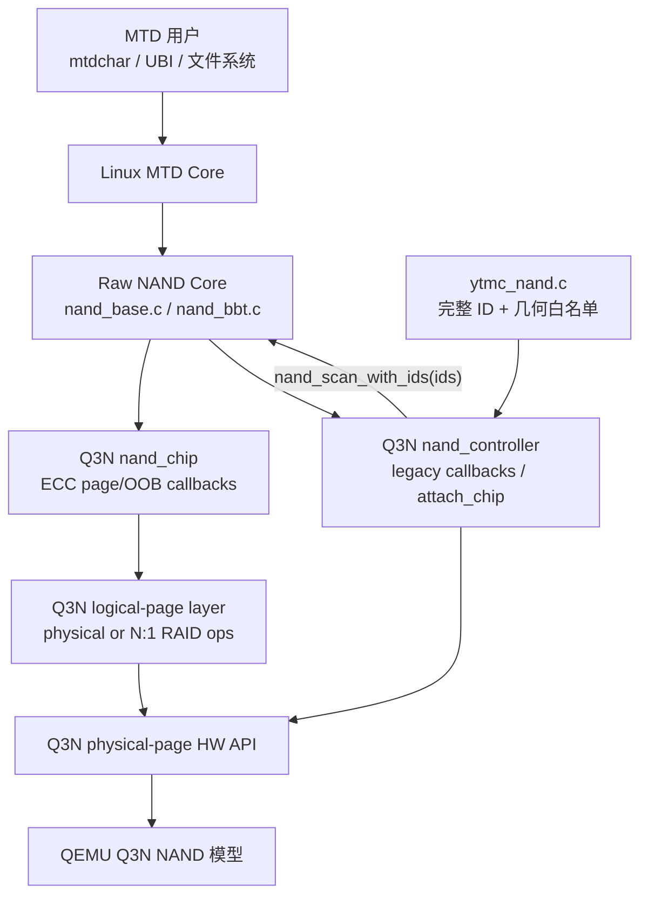
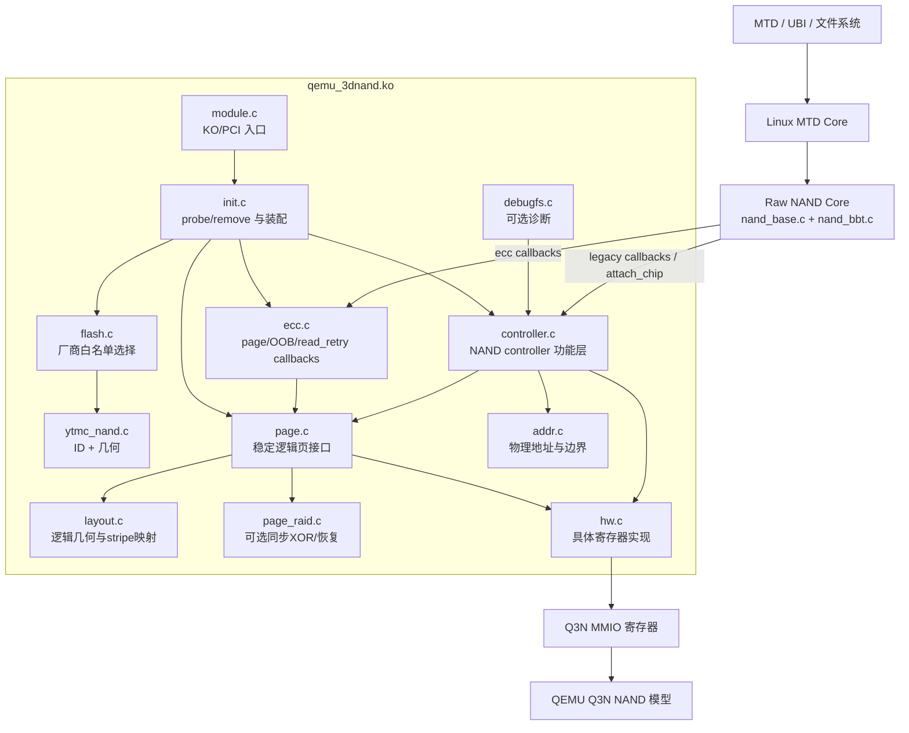
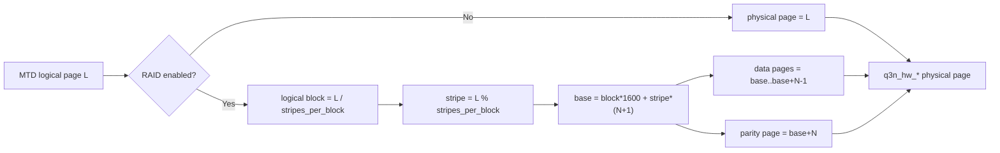
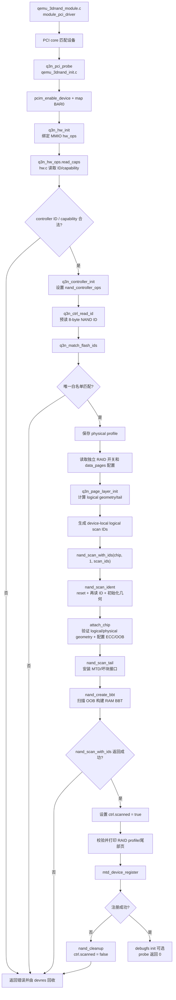
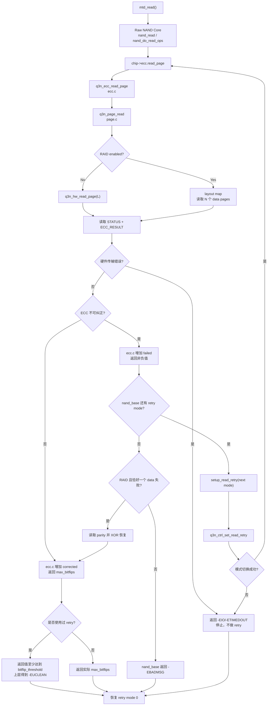
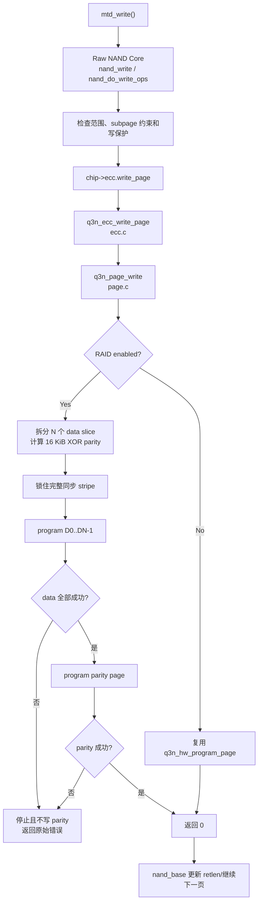
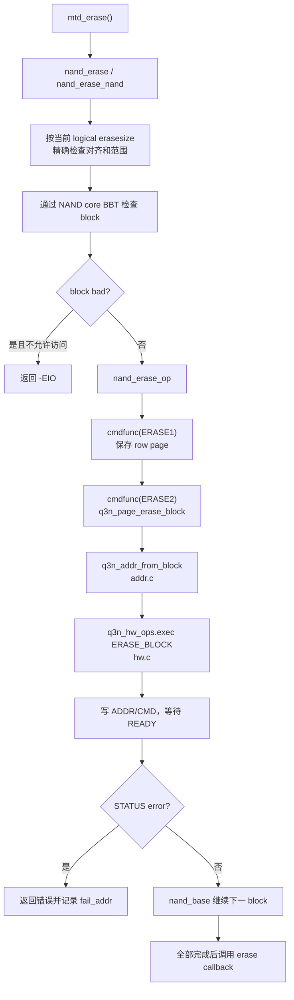
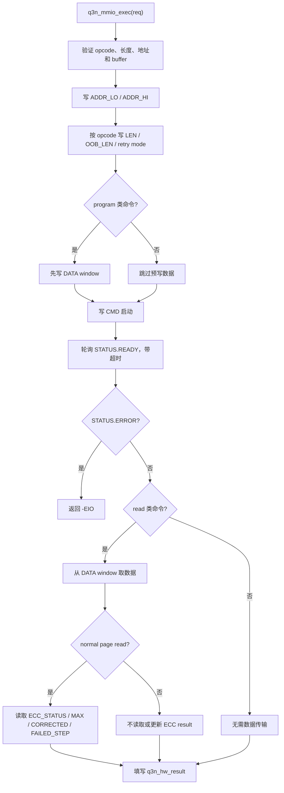
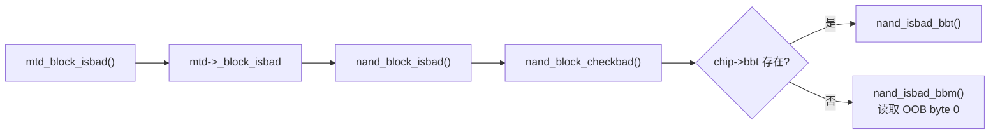
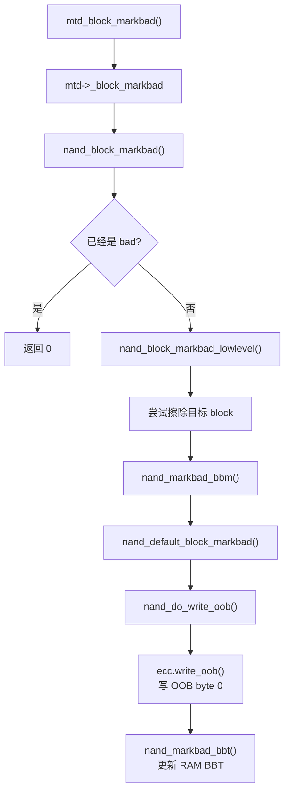

# Q3N 基于 NAND Core 的 ECC、Read Retry 与非二次幂支持设计

日期：2026-07-28

目标分支：`codex/nand-core-ecc-read-retry`

适用内核基线：Linux 7.0.12

状态：NAND Core/ECC/read-retry/legacy callback 基础已实现并验证；可配置
Page RAID 扩展已确认，待实现

## 0. 实现记录

本设计已在 `codex/nand-core-ecc-read-retry` 分支实现。生产 KO 由下列 8 个
对象组成：

```text
qemu_3dnand_module.o
qemu_3dnand_init.o
qemu_3dnand_flash.o
ytmc_nand.o
qemu_3dnand_controller.o
qemu_3dnand_ecc.o
qemu_3dnand_addr.o
qemu_3dnand_hw.o
```

旧 `main/map/raid/sched` 对象不再复制或链接。实现结果如下：

- probe 预读完整 ID `9c d7 98 a6 51 33 4e 44`，精确命中
  `ytmc_nand.c` 后，把对应的 sentinel-terminated `ids` 表传给
  `nand_scan_with_ids(&chip, 1, ids)`；
- MTD 报告 writesize 16384、oobsize 1024、erasesize 26214400、
  size 43620761600，共 1664 个可见擦除块；
- KO 不定义 MTD `_read/_write/_erase/_block_isbad/_block_markbad`
  回调，也不维护私有 BBT；编译产物只引用 NAND Core scan/cleanup 和
  MTD registration；
- ECC 层实现 page、raw page、OOB 回调和 4 个 read-retry mode；
- QEMU read retry 增益为 0/8/16/24 bit，raw read 不更新 ECC result；
- NAND Core 标坏会先擦除目标块，再通过 OOB byte 0 写入 BBM；重启后
  由标准 416-byte RAM BBT 重新扫描得到坏块状态；
- 当前生产对象尚未包含 Page RAID；已批准的后续扩展使用新的同步逻辑页层，
  不恢复旧 raid/scheduler/debugfs 实现。

可配置 Page RAID 的详细规范记录在
`2026-07-29-q3n-configurable-page-raid-logical-page-design.md`。本文后续章节
已合并其总体架构、几何、接口、流程和验证要求。当前实现记录描述无 RAID
基线；Page RAID 相关内容描述下一阶段目标，不能误读为已经交付。

Linux patch 必须按文件名顺序应用：

1. `0001-mtd-rawnand-add-exact-geometry-helpers.patch`；
2. `0002-mtd-rawnand-use-exact-geometry-in-io-paths.patch`；
3. `0003-mtd-rawnand-use-exact-geometry-in-bbt.patch`。

`scripts/apply-linux-patches.sh` 对每个 patch 先做 forward check；已应用时
通过 reverse check 识别并跳过；两种检查都失败则立即停止。禁止手工修改
`work/linux/linux-7.0.12` 作为交付方式。

已完成的验证包括 host 边界/契约测试、真实 Linux 7.0.12 KO 与 bzImage
构建、QEMU 11.0.2 构建、guest NAND Core probe/MTD 注册、读写擦、OOB
BBM 以及跨重启 BBT 持久化。read-retry 的 40/41/49/57/65 bit 边界在
QEMU 模型和驱动 callback 测试中确定性覆盖；当前未提供 guest 内的 fault
注入用户接口，因此不把 guest read-retry 注入列为已完成验收项。

扩展新器件时，只在对应 `<vendor>_nand.c` 中增加完整 ID 与几何表项，再把
provider 接入 `qemu_3dnand_flash.c`。不得在 controller/hw 层硬编码厂商 ID，
也不得对前缀 ID 做模糊匹配。

## 1. 背景

原分支的 `qemu_3dnand` Linux 驱动直接持有 `struct mtd_info`，并自行实现
`mtd->_read_oob`、`mtd->_write_oob`、`mtd->_erase`、`mtd->_sync`、
`mtd->_block_isbad`、`mtd->_block_markbad` 等接口。这个结构绕过了 raw NAND
core 的扫描、页读写、ECC 统计、坏块管理和 read retry 流程。

新实现要回到 Linux raw NAND 的标准分层：

1. 驱动注册 `struct nand_chip` 和 `struct nand_controller`；
2. 通过 `nand_scan_with_ids()` 完成 NAND 识别并初始化 MTD；
3. 驱动实现 `nand_ecc_ctrl` 的页、OOB 和 raw 回调，并使用传统
   `cmdfunc`、`waitfunc`、`read_byte` 等 legacy callbacks 处理命令；
4. MTD 的读写、擦除和坏块入口由 `nand_base.c` 提供；
5. read retry 由 NAND core 统一调度，驱动只负责切换 retry mode 和报告
   单次读取结果。

Q3N 当前几何不是二次幂：

- 每页：16 KiB；
- 每块：1600 页；
- 每擦除块：25 MiB；
- 每 plane：247 块；
- 2 die × 4 plane × 247 块，共 1976 个物理块。

Linux raw NAND 的部分历史代码用移位和掩码表示擦除块、target 和页边界，
不能直接正确处理 1600 页/块和非二次幂 target 容量。因此本设计允许修改
Linux `nand_base` 相关代码，但修改必须以版本化 patch 交付，不能直接把
改动混入或手工留在 Linux 源码树中。

## 2. 设计目标

### 2.1 本期目标

- 使用 `nand_scan_with_ids()` 初始化 `nand_chip` 和 MTD；
- 把厂商 NAND ID、几何和 ECC requirement 独立保存在
  `ytmc_nand.c`；
- 先按完整 NAND ID 白名单选择厂商 `ids` 表，再把该表传给
  `nand_scan_with_ids()`；
- 不在 Q3N 驱动中直接实现 MTD `_read`、`_write`、`_erase` 等入口；
- `mtd->_block_isbad`、`mtd->_block_markbad` 和
  `mtd->_block_isreserved` 使用 `nand_base.c` 安装的标准实现；
- 坏块表由 raw NAND core 扫描、查询和更新，Q3N 驱动不维护私有 BBT；
- 实现 `ecc->read_page`、`ecc->write_page`、raw 页读写和 OOB 回调；
- 使用传统 `cmdfunc`、`waitfunc` 和 staging read callbacks 实现 NAND
  reset、read ID、status 和 erase，不注册 `exec_op`；
- 实现 NAND core 驱动的 read retry；
- 保留 16 KiB × 1600 页/块的非二次幂擦除块几何；
- 通过 Linux patch 修正 raw NAND core 和 legacy raw NAND BBT 中的
  非二次幂假设；
- 保持现有二次幂 NAND 设备的快速路径和行为不变；
- 建立 patch 的生成、应用、重复检测、验证和回退流程。
- 增加独立的 Page RAID 功能开关和独立的 data page 数配置；
- RAID 开启时，把 `N` 个 16 KiB 物理 data page 聚合为一个逻辑页，由
  Linux 驱动计算一个 16 KiB XOR parity 并写入第 `N+1` 个物理页；
- 首期支持 2:1、4:1、8:1，`N` 必须是二次幂；
- 新增逻辑页层屏蔽 page size、OOB size 和逻辑到物理 stripe 映射；
- RAID 关闭时完整保留一个逻辑页对应一个物理页的现有路径；
- stripe 不跨物理 block，初始化必须明确输出完整 stripe 数和尾部废弃页；
- read retry 耗尽后，使用 parity 恢复恰好一个不可纠 data page。

### 2.2 本期不实现

- 不恢复旧 parity block pool、parity log、RAID scheduler 或后台
  workqueue；
- 不实现 parity metadata、commit marker、generation 或 parity CRC；
- 不保证掉电后的 `N+1` 页全有或全无；
- 不实现 QEMU batch transaction、journal 或 rollback；
- 不跨物理 block 放置 RAID stripe；
- 不保护 OOB，Page RAID 只保护 main data；
- 不在恢复后自动回写损坏的 data page；
- 不支持运行时切换 RAID 开关或比例；
- 不实现 Q3N 私有 `_block_isbad`、`_block_markbad` 或坏块索引；
- 不使用 `Q3N_CMD_GET_BLOCK_STATUS` 代替 NAND core 的 OOB/BBT
  坏块判断；
- 不声明支持非二次幂的多 target 或多 LUN；
- 不修改通用 MTD core；
- 不直接修改、提交或依赖 `work/linux/linux-7.0.12` 中的工作副本；
- 不保证旧 page RAID 介质镜像可以被新布局直接挂载。

## 3. 设计原则

### 3.1 分层原则



MTD core 负责 MTD 公共语义，raw NAND core 负责跨逻辑页循环、ECC 统计、
坏块处理和 read retry。逻辑页层在 RAID 关闭时直接复用单物理页接口；RAID
开启时负责逻辑页拆分、XOR parity、地址映射和结果汇总。硬件层与 QEMU
始终只处理单个物理页。

### 3.2 Linux 修改原则

Linux 改动采用显式 opt-in。只有设置 Q3N 非二次幂选项的 NAND 芯片进入
精确乘除路径，其他 NAND 芯片继续使用现有移位/掩码快速路径。这样可以：

- 限制回归面；
- 保留现有驱动性能；
- 使补丁意图清晰；
- 避免把一次设备适配变成全 raw NAND 行为重构。

### 3.3 介质几何原则

物理器件始终使用真实的 1600 页/块和 25 MiB 擦除块，不通过裁剪为 1024
页/块或 2048 页/块规避问题。RAID 开启后，一个逻辑 eraseblock 仍一一
对应一个完整物理 block，但 MTD 可见 writesize、oobsize、pages/block、
erasesize 和 size 由选定 profile 计算。尾部不足一个完整 stripe 的物理页
保留为不可映射页。

## 4. 目标容量与地址空间

首期只向 MTD 暴露 Q3N data pool：

- data blocks per plane：208；
- lane 数：2 die × 4 plane = 8；
- 可见擦除块数：208 × 8 = 1664；
- 每擦除块：1600 × 16 KiB = 25 MiB；
- 可见页数：1664 × 1600 = 2,662,400；
- MTD 容量：1664 × 25 MiB = 41,600 MiB，即 40.625 GiB。

RAID 关闭时 NAND 表现为：

- `max_chips = 1`；
- 1 target；
- 每 target 1 LUN；
- 1 plane 的标准 raw NAND 抽象，QEMU 内部仍可按既有 lane 映射保存介质；
- logical block 0..1663 直接映射到 data pool 的 physical block 0..1663；
- 不访问 parity、metadata 和 reserve pool。

Page RAID 逻辑几何：

```text
stripe_pages        = data_pages + 1
stripes_per_block   = floor(1600 / stripe_pages)
tail_pages          = 1600 - stripes_per_block * stripe_pages
logical_writesize   = data_pages * 16384
logical_oobsize     = data_pages * 1024
logical_erasesize   = logical_writesize * stripes_per_block
logical_size        = logical_erasesize * 1664
```

| Profile | 逻辑页 | 逻辑 OOB | Stripe/块 | 尾部页 | 逻辑擦除块 | 可见容量 |
| --- | ---: | ---: | ---: | ---: | ---: | ---: |
| RAID 关闭 | 16 KiB | 1 KiB | 1600 | 0 | 25 MiB | 40.625 GiB |
| 2:1 | 32 KiB | 2 KiB | 533 | 1 | 17,465,344 B | 27.06640625 GiB |
| 4:1 | 64 KiB | 4 KiB | 320 | 0 | 20 MiB | 32.5 GiB |
| 8:1 | 128 KiB | 8 KiB | 177 | 7 | 23,199,744 B | 35.953125 GiB |

`ytmc_nand.c` 只描述完整 ID、ECC requirement 和真实物理几何。probe 匹配
物理 profile 后，由逻辑页层生成设备私有、带 sentinel 的逻辑
`nand_flash_dev` scan 表，再把它传给 `nand_scan_with_ids()`。RAID 关闭时
该表保持 pagesize 16384、oobsize 1024、erasesize 26214400 和 chipsize
41600 MiB。

## 5. 驱动对象模型

`struct qemu_3dnand` 是单个 PCI NAND controller 实例的根对象。控制器运行
状态进一步封装到 `struct q3n_controller`，避免所有字段继续堆积在
`qemu_3dnand_main.c`：

```c
struct qemu_3dnand {
	struct pci_dev *pdev;
	struct nand_chip chip;
	struct q3n_controller ctrl;
	const struct nand_flash_dev *physical_ids;
	struct nand_flash_dev scan_ids[2];
	struct q3n_page_profile page_profile;
	const struct q3n_page_ops *page_ops;
	u8 *parity_scratch;
	struct q3n_stats stats;
};
```

不再嵌入独立的 `struct mtd_info`。需要 MTD 时通过
`nand_to_mtd(&q3n->chip)` 取得。

### 5.1 Controller ID 与 NAND Flash ID

Q3N 有两个不同的 ID，不能混用：

- `Q3N_REG_ID` 返回 `Q3N_ID_VALUE`，用于确认 PCI/MMIO 控制器是 Q3N；
- NAND READ ID 命令返回 NAND flash 的字节序列，用于选择
  `struct nand_flash_dev` 白名单和初始化 MTD。

通过 `Q3N_REG_ID` 只能证明控制器类型正确，不能据此选择 flash 几何。
`nand_scan_with_ids()` 的第三个参数必须由 NAND READ ID 白名单匹配结果
派生，不能来自 controller capability 或全局 fallback 表。

### 5.2 `ytmc_nand.c` 器件描述

首个厂商器件表放在独立文件：

```text
linux/drivers/mtd/nand/raw/
├── qemu_3dnand_init.c
├── qemu_3dnand_priv.h
├── qemu_3dnand_flash.c
├── qemu_3dnand_flash.h
├── ytmc_nand.c
└── ytmc_nand.h
```

职责划分：

- `ytmc_nand.c`：保存 YTMC 完整 ID 白名单、几何、option 和 ECC
  requirement，并实现白名单匹配；
- `ytmc_nand.h`：只声明匹配接口，不保存几何常量；
- `qemu_3dnand_flash.c`：维护厂商 matcher 注册表，提供统一
  `q3n_match_flash_ids()`；首期注册 YTMC matcher；
- `qemu_3dnand_flash.h`：声明通用 matcher/provider 接口；
- `qemu_3dnand_init.c`：读取 NAND ID、通过通用白名单选择 `ids` 表并调用
  `nand_scan_with_ids()`；
- `nand_base.c`：再次读取 ID、在传入表中匹配并初始化
  `nand_chip`/`mtd_info`。

`ytmc_nand.c` 首期表项是只读的物理器件模板，采用项目内假设 ID，不代表
真实 JEDEC 厂商编号：

```c
static struct nand_flash_dev ytmc_nand_ids[] = {
	{
		.name = "YTMC Q3N 41600MiB",
		.id = { 0x9c, 0xd7, 0x98, 0xa6,
			0x51, 0x33, 0x4e, 0x44 },
		.pagesize = SZ_16K,
		.chipsize = 41600,
		.erasesize = 25 * SZ_1M,
		.options = NAND_NO_SUBPAGE_WRITE |
			   NAND_NON_POWER_OF_2_GEOMETRY,
		.id_len = 8,
		.oobsize = 1024,
		.ecc = NAND_ECC_INFO(40, SZ_1K),
	},
	{ .name = NULL },
};
```

其中 `0x51 0x33 0x4e 0x44` 对应项目标识 `Q3ND`。第三个字节 `0x98`
使 Linux full-ID 解析得到 3 bit/cell。QEMU READ ID 必须返回完全相同的
8 字节。

表必须以 `{ .name = NULL }` 结束，因为 `nand_scan_with_ids()` 会从传入
指针开始遍历到该终止项。Linux 驱动中的权威物理 ID、几何、ECC
requirement 和 options 只在 `ytmc_nand.c` 保留一份，main/controller
不得再硬编码一份。QEMU 仍保存硬件模型自身的物理几何并通过 capability
寄存器上报，`attach_chip` 负责验证两者一致。

首期匹配接口为：

```c
struct nand_flash_dev *
ytmc_nand_match_ids(const u8 *id, size_t len);
```

匹配规则：

- 必须至少取得 8 字节 ID；
- 必须按 `id_len` 完整比较，不能只比较 manufacturer ID 或 device ID；
- 任一字节不匹配返回 `NULL`；
- 匹配成功返回包含该器件且以空项结尾的物理 `ytmc_nand_ids` 模板表首
  地址；
- 接口返回可写类型是因为 Linux 7.0.12
  `nand_scan_with_ids()` 参数不是 `const`；调用方仍不得修改 YTMC 模板
  本身。

probe 匹配成功后，`q3n_build_scan_ids()` 在设备根对象中生成两项
device-local 表：

```text
scan_ids[0] = matched YTMC physical template
scan_ids[0].pagesize/erasesize/oobsize/chipsize = selected logical profile
scan_ids[1].name = NULL
```

ID、`id_len`、ECC requirement 和 `NAND_NON_POWER_OF_2_GEOMETRY` option
从物理模板原样复制；只有 NAND Core 应看到的逻辑几何字段按 profile
改写。RAID 关闭时逻辑几何等于物理几何，仍统一走同一构建路径。
`nand_scan_with_ids()` 接收的是 `q3n->scan_ids`，不是可被共享修改的
`ytmc_nand_ids`。这份运行时派生表不构成第二份器件 source of truth。

同一厂商增加器件时，在 `ytmc_nand.c` 表中增加 full-ID 项即可。以后支持
其他厂商时，为每个厂商建立独立 `<vendor>_nand.c`，probe 的白名单选择器
通过 `qemu_3dnand_flash.c` 按厂商 matcher 顺序查询；probe 无需新增厂商
判断分支。不把私有器件追加到 Linux 全局
`nand_flash_ids[]`。

由于 `0x9c` 是项目内假设值，首期不向 Linux 全局 manufacturer 表注册
YTMC manufacturer ID。NAND core 的 manufacturer 字段可显示为 Unknown，
器件 model 仍使用 `ytmc_nand.c` 中的 `"YTMC Q3N 41600MiB"`。替换为真实
器件 ID 时，需要同时更新 QEMU READ ID 和该 full-ID 表项。

### 5.3 ID 白名单探测与 Probe 流程

1. 分配并初始化 `struct qemu_3dnand`；
2. 映射 MMIO、取得中断和其他平台资源；
3. 读取 `Q3N_REG_ID`，验证 Q3N controller ID；
4. `nand_controller_init(&q3n->ctrl.base)`；
5. 设置 `q3n->ctrl.base.ops = &q3n_controller_ops`；
6. 设置 `q3n->chip.controller = &q3n->ctrl.base` 和
   `q3n->chip.ops.setup_read_retry`；
7. 使用 scan 前可用的底层 Q3N READ ID helper 读取 8 字节 NAND ID；
8. 调用 `q3n_match_flash_ids()`；通用选择器再调用
   `ytmc_nand_match_ids()` 选择白名单物理模板；
9. 未匹配则返回 `-ENODEV`，不回退到 Linux 全局 ID 表或 ONFI/JEDEC
   自动探测；
10. 读取 RAID 开关和独立比例配置，计算并验证 logical page profile；
11. 由物理模板和逻辑 profile 构造设备私有 `scan_ids[2]`；
12. 调用 `nand_scan_with_ids(&q3n->chip, 1, q3n->scan_ids)`；
13. 从 `nand_to_mtd()` 取得 MTD，验证最终几何并设置名称和 owner；
14. 打印完整 profile 后调用 `mtd_device_register()`。

伪代码：

```c
ret = q3n_ctrl_read_id(q3n, id, sizeof(id));
if (ret)
	return ret;

physical_ids = q3n_match_flash_ids(id, sizeof(id));
if (!physical_ids)
	return dev_err_probe(dev, -ENODEV,
			     "unsupported NAND flash ID\n");

ret = q3n_page_layer_init(q3n, physical_ids);
if (ret)
	return ret;

ret = q3n_build_scan_ids(q3n, physical_ids, &q3n->page_profile);
if (ret)
	return ret;

ret = nand_scan_with_ids(&q3n->chip, 1, q3n->scan_ids);
if (ret)
	return ret;
```

scan 前的 READ ID 只用于选择厂商白名单和派生逻辑 scan 表，不能直接填写
或覆写 MTD。进入
`nand_scan_with_ids()` 后，`nand_base.c` 会执行 reset、读取前两个 ID
字节、再次读取完整 ID，并在传入的 `ids` 表中进行 full-ID 匹配。匹配后
由 core 按当前 profile 填充：

- `mtd->writesize = logical_writesize`；
- `mtd->erasesize = logical_erasesize`；
- `mtd->oobsize = logical_oobsize`；
- target size = `logical_size`；
- pages per eraseblock = `stripes_per_block`，RAID 关闭时为 1600；
- ECC requirement = 40 bit/1024 B；
- `NAND_NON_POWER_OF_2_GEOMETRY` 等器件 options。

预探测和 NAND core 的再次读取构成双重校验。如果预探测匹配，但 scan
读取到不同 ID，scan 必须失败且不得注册 MTD。驱动只能在 `attach_chip`
中分别验证物理模板与 Q3N capability、逻辑 scan 结果与 page profile，
不能用 capability 寄存器直接覆盖 ID 表给出的逻辑几何。

### 5.4 Remove 和失败回退

注册成功后，remove 顺序必须为：

1. `mtd_device_unregister(mtd)`；
2. `nand_cleanup(&q3n->chip)`；
3. 释放平台资源。

只有 `nand_scan_with_ids()` 已成功、随后步骤失败时才调用
`nand_cleanup()`。`nand_scan_with_ids()` 会清理自身 ident/attach/tail
失败产生的部分状态，调用方不得在 scan 返回错误后再次 cleanup。所有路径
均要把 read retry 模式恢复为 0。

### 5.5 源文件拆分方案选择

针对现有 `qemu_3dnand_main.c` 过度集中的问题，评估三种拆分方式：

| 方案 | 特点 | 结论 |
|---|---|---|
| 保留单一 `main.c` | 改动文件少，但 probe、NAND core、ECC 和 MMIO 继续耦合 | 不采用 |
| 仅拆成入口、初始化、controller、hardware 四个文件 | 满足最低分层，但厂商 ID、ECC 和地址规则仍会持续膨胀 controller | 不采用 |
| 入口、生命周期、flash 白名单、NAND controller、ECC、地址、MMIO 分层 | 文件较多，但每层职责单一，可独立扩展和测试 | 采用 |

新 KO 不再编译旧的 `qemu_3dnand_main.o`、
`qemu_3dnand_raid.o`、`qemu_3dnand_sched.o`。page RAID 旧代码仍保留在原
分支历史中，不复制进新模块。可配置 Page RAID 使用新的
`qemu_3dnand_page.o`、`qemu_3dnand_layout.o` 和条件编译的
`qemu_3dnand_page_raid.o`，不复用旧异步实现。

### 5.6 目标源文件和职责

#### 5.6.1 必需 `.c` 文件

| 文件 | 层次 | 主要职责 | 明确不负责 |
|---|---|---|---|
| `qemu_3dnand_module.c` | KO 入口 | PCI ID table、`struct pci_driver`、`module_pci_driver()`、模块元信息 | probe 细节、寄存器、MTD |
| `qemu_3dnand_init.c` | KO/设备初始化 | `probe`/`remove`、资源申请、各层装配、ID 预探测、scan/register、错误回退 | 页读写算法、寄存器序列 |
| `qemu_3dnand_flash.c` | Flash 白名单选择 | 维护 vendor provider 列表，统一调用各厂商 full-ID matcher | 保存具体厂商几何 |
| `ytmc_nand.c` | 厂商器件表 | YTMC full-ID、几何、options、ECC requirement、厂商内匹配 | MMIO、probe、MTD 回调 |
| `qemu_3dnand_controller.c` | 控制器功能层 | `nand_controller_ops.attach_chip`、legacy 命令状态机、`cmdfunc/waitfunc/read_byte/read_buf/write_buf/select_chip`、controller 串行化 | 直接 `readl()`/`writel()` |
| `qemu_3dnand_ecc.c` | NAND ECC/OOB 适配层 | `ecc->read_page` 等 callbacks、OOB layout、ECC 统计契约、`setup_read_retry` | MTD `_read`、BBT、直接寄存器 |
| `qemu_3dnand_page.c` | 逻辑页入口 | 对 ECC/controller 提供稳定 page/OOB/erase 接口，选择 physical 或 RAID ops | 直接寄存器、私有 BBT |
| `qemu_3dnand_layout.c` | RAID 几何与映射 | profile 计算、logical page 到连续 `N+1` 物理页的纯映射、尾部页校验 | XOR、MMIO |
| `qemu_3dnand_page_raid.c` | 同步 Page RAID | XOR parity、`D0..DN-1,P` 同步读写、单页恢复和结果汇总 | QEMU parity、异步队列、掉电事务 |
| `qemu_3dnand_addr.c` | 物理地址层 | 物理 page/block/column 到 Q3N byte address 的精确换算、边界检查 | 逻辑 RAID 映射、MMIO |
| `qemu_3dnand_hw.c` | 控制器实现层 | 操作具体寄存器、提交命令、数据窗口传输、等待完成、读取状态/ECC 结果 | NAND core 和 MTD 语义 |

#### 5.6.2 可选但建议的 `.c` 文件

| 文件 | 职责 |
|---|---|
| `qemu_3dnand_debugfs.c` | 只读暴露 controller、ECC、retry 和 `raid_recovered_pages` 统计；不得触发异步 RAID |
| `qemu_3dnand_kunit.c` | 测试 ID matcher、物理地址、RAID layout、legacy 命令状态机、ECC 返回契约和调用层边界 |

不创建 `qemu_3dnand_bbt.c`。坏块接口和 BBT 已由
`nand_base.c`/raw NAND `nand_bbt.c` 提供，新增同名功能会产生第二套真值。

#### 5.6.3 头文件边界

| 头文件 | 内容 |
|---|---|
| `qemu_3dnand_regs.h` | Q3N 寄存器 offset、bit、command、capability；不包含 MTD 类型 |
| `qemu_3dnand_priv.h` | KO 内部共享结构、跨 `.c` 的内部函数声明 |
| `qemu_3dnand_hw.h` | `struct q3n_hw`、`q3n_hw_ops`、request/result 接口 |
| `qemu_3dnand_flash.h` | `q3n_flash_provider` 和通用 ID 白名单 matcher |
| `ytmc_nand.h` | YTMC matcher 声明；不暴露具体几何数组 |
| `qemu_3dnand_page.h` | ECC/controller 使用的稳定逻辑 page/OOB/erase 接口 |
| `qemu_3dnand_layout.h` | physical/logical profile、stripe map 和纯映射接口 |
| `qemu_3dnand_page_raid.h` | 条件编译的同步 RAID ops 初始化接口 |

原 `qemu_3dnand.h` 中的寄存器定义迁移到
`qemu_3dnand_regs.h`。所有几何、ECC 和 pool capability 仍由硬件寄存器
上报并与 `ytmc_nand.c` 的 scan 结果交叉验证。

#### 5.6.4 Makefile 组成

```make
obj-$(CONFIG_MTD_NAND_QEMU_3DNAND) += qemu_3dnand.o

qemu_3dnand-y := \
	qemu_3dnand_module.o \
	qemu_3dnand_init.o \
	qemu_3dnand_flash.o \
	ytmc_nand.o \
	qemu_3dnand_controller.o \
	qemu_3dnand_ecc.o \
	qemu_3dnand_page.o \
	qemu_3dnand_layout.o \
	qemu_3dnand_addr.o \
	qemu_3dnand_hw.o

qemu_3dnand-$(CONFIG_MTD_NAND_QEMU_3DNAND_PAGE_RAID) += \
	qemu_3dnand_page_raid.o
qemu_3dnand-$(CONFIG_DEBUG_FS) += qemu_3dnand_debugfs.o
```

`qemu_3dnand_page.c` 必须通过 `IS_ENABLED()` 或头文件 inline stub 隔离
RAID ops 选择，保证 `PAGE_RAID=n` 的链接产物不引用
`qemu_3dnand_page_raid.o` 中的符号。比例配置只在 RAID enabled 分支读取。

KUnit/host target 单独链接可纯测试的 flash、layout、address 和状态机
对象，不链接旧 RAID/scheduler 对象。

#### 5.6.5 KO 之外需要涉及的 `.c` 文件

| 文件 | 计划 |
|---|---|
| `qemu/hw/mtd/q3n-nand.c` | 保持 READ ID、raw-read、retry mode 和物理单页命令；不计算 parity |
| `qemu/hw/mtd/q3n-media.c` | 保持物理 page/OOB/bitflip overlay 存储职责；不加入 RAID profile 或 stripe 状态 |
| `qemu/hw/mtd/q3n-pci.c` | PCI wrapper 原则上不改；仅在 BAR/IRQ contract 改变时调整 |
| Linux `nand_base.c` | 由 patch 修改精确非二次幂 I/O、erase、坏块和 retry 相关路径 |
| Linux raw NAND `nand_bbt.c` | 由 patch 修改精确 BBT block/offset/page 计算 |

QEMU `q3n-nand.c` 是设备模型，不属于 KO controller hardware 层。
Linux `qemu_3dnand_hw.c` 操作寄存器，QEMU `q3n-nand.c` 实现这些寄存器的
设备端行为，两者通过 `qemu_3dnand_regs.h`/QEMU 寄存器 contract 对齐。

### 5.7 文件依赖和逻辑视图



依赖规则：

- `module.c` 只依赖 `init.c` 暴露的 probe/remove；
- `init.c` 是 composition root，负责把其他层连接起来；
- `nand_base.c` 只能看到标准 `nand_chip`/`nand_controller` 接口；
- `ecc.c` 只调用逻辑页接口，不能直接决定物理 stripe 或读写寄存器；
- `page.c` 屏蔽 physical-page 和 Page RAID 两种实现；
- `layout.c` 是无 MMIO、无全局状态的纯几何与 stripe 映射层；
- `page_raid.c` 只通过现有 `q3n_hw_*` 单物理页接口访问介质；
- `controller.c` 只能通过 `q3n_hw_ops` 调用硬件实现；
- `hw.c` 不包含 `mtd_info`、`nand_chip` 或 BBT 逻辑；
- `addr.c` 是无 MMIO、无全局状态的物理地址换算层；
- `ytmc_nand.c` 不依赖 controller 和硬件；
- 下层错误可以向上传递，下层不得直接修改 MTD ECC/BBT 统计。

新增厂商时只增加 `<vendor>_nand.c` 并在 `qemu_3dnand_flash.c` 注册 provider；
新增 MMIO controller revision 时优先新增或替换 `q3n_hw_ops` 实现；调整
NAND core 接口时集中修改 `controller.c`/`ecc.c`；调整 RAID 比例或映射时
集中修改 `layout.c`/`page_raid.c`。

#### 5.7.1 I/O 逻辑地址视图



Linux 始终看到连续的 1664 个逻辑 eraseblocks。RAID 关闭时逻辑页直接等于
物理页。RAID 开启时，一个逻辑页映射为 `N` 个连续 data pages 和一个隐藏
parity page；尾部不足完整 stripe 的物理页不可映射。die、plane 和 lane
定位仍属于 QEMU 介质模型。parity、尾部页、metadata pool 和 reserve pool
均不出现在 MTD 地址空间。

### 5.8 关键数据结构

以下为职责级定义，字段可在实施时按内核 API 微调，但不能破坏层次边界。

#### 5.8.1 根对象

```c
struct qemu_3dnand {
	struct pci_dev *pdev;
	struct nand_chip chip;
	struct q3n_controller ctrl;
	const struct nand_flash_dev *physical_ids;
	struct nand_flash_dev scan_ids[2];
	struct q3n_page_profile page_profile;
	const struct q3n_page_ops *page_ops;
	u8 *parity_scratch;
	struct q3n_stats stats;
};
```

- 生命周期由 `qemu_3dnand_init.c` 管理；
- `nand_to_mtd(&q3n->chip)` 是唯一 MTD 对象；
- `physical_ids` 指向 `ytmc_nand.c` 中只读物理模板，`scan_ids` 是当前设备
  传给 NAND Core 的逻辑几何派生表；
- 不保存私有 BBT、RAID metadata、data page 副本或 parity workqueue；
- `parity_scratch` 仅在 RAID 同步调用内保存一个 16 KiB XOR 结果。

#### 5.8.2 控制器功能对象

```c
struct q3n_controller {
	struct nand_controller base;
	struct mutex io_lock;
	struct q3n_hw hw;
	struct q3n_geometry physical_geometry;
	struct q3n_geometry logical_geometry;
	u8 selected_target;
	u8 retry_mode;
	bool scanned;
	bool mtd_registered;
};
```

- `base` 对接 NAND core；
- `io_lock` 在 RAID 关闭时覆盖一个完整物理事务，在 RAID 开启时可由逻辑
  页层一次持有并覆盖完整多页同步序列；
- 首期只允许 `selected_target = 0`；
- `retry_mode` 在每页结束和 reset 后必须为 0；
- 生命周期布尔值只用于严格错误回退，不替代 devres 状态。

#### 5.8.3 硬件对象和操作表

```c
struct q3n_hw {
	struct device *dev;
	void __iomem *regs;
	resource_size_t regs_size;
	const struct q3n_hw_ops *ops;
};

struct q3n_hw_ops {
	int (*read_caps)(struct q3n_hw *hw, struct q3n_geometry *geometry);
	int (*exec)(struct q3n_hw *hw,
		    const struct q3n_hw_request *req,
		    struct q3n_hw_result *result);
};
```

`qemu_3dnand_hw.c` 提供默认 MMIO ops。controller 功能层不使用任何
`Q3N_REG_*` 宏。

#### 5.8.4 几何与地址

```c
struct q3n_geometry {
	u32 page_size;
	u32 oob_size;
	u32 pages_per_block;
	u32 blocks_per_plane;
	u32 data_blocks;
	u32 ecc_step_size;
	u32 ecc_strength;
	u64 visible_size;
};

struct q3n_address {
	u32 block;
	u32 page;
	u32 column;
	u64 byte_addr;
};
```

物理 `q3n_geometry` 是 capability 快照；逻辑几何由 page profile 计算并
生成设备私有 scan ID 表，不由 probe 直接填写 MTD。`q3n_address` 由
`addr.c` 对物理页做精确乘除；禁止存储 shift/mask 近似值。

#### 5.8.5 逻辑页 Profile、映射和操作表

```c
struct q3n_page_profile {
	bool raid_enabled;
	u32 data_pages;
	u32 parity_pages;
	u32 stripe_pages;
	u32 stripes_per_block;
	u32 tail_pages;
	struct q3n_geometry physical;
	struct q3n_geometry logical;
	u64 logical_size;
};

struct q3n_page_map {
	u32 logical_block;
	u32 stripe_in_block;
	u32 first_data_page;
	u32 parity_page;
};

struct q3n_page_result {
	u32 max_bitflips;
	u32 corrected_bits;
	u32 failed_data_pages;
	bool parity_failed;
	bool recovered;
};

struct q3n_page_ops {
	int (*read_page)(struct q3n *q3n, u32 logical_page,
			 void *data, void *oob, bool raw,
			 struct q3n_page_result *result);
	int (*write_page)(struct q3n *q3n, u32 logical_page,
			  const void *data, const void *oob);
	int (*read_oob)(struct q3n *q3n, u32 logical_page, void *oob);
	int (*write_oob)(struct q3n *q3n, u32 logical_page,
			 const void *oob);
	int (*erase_block)(struct q3n *q3n, u32 logical_block);
};
```

RAID 关闭时 ops 直接调用原 `q3n_hw_*`。RAID 开启时 ops 把一个逻辑页拆为
`N` 个 data pages 和一个 parity page。`q3n_page_result` 汇总当前 retry
mode 的物理 ECC 结果，供 `ecc.c` 决定 NAND Core 统计和最终恢复语义。
`q3n_hw_*` 的单物理页语义不改变。

#### 5.8.6 硬件请求和结果

```c
enum q3n_hw_opcode {
	Q3N_HW_RESET,
	Q3N_HW_READ_ID,
	Q3N_HW_STATUS,
	Q3N_HW_READ_PAGE,
	Q3N_HW_PROGRAM_PAGE,
	Q3N_HW_READ_OOB,
	Q3N_HW_PROGRAM_OOB,
	Q3N_HW_ERASE_BLOCK,
	Q3N_HW_SET_READ_RETRY,
};

struct q3n_hw_request {
	enum q3n_hw_opcode opcode;
	struct q3n_address addr;
	void *data;
	size_t data_len;
	void *oob;
	size_t oob_len;
	u8 retry_mode;
	bool raw;
};

struct q3n_hw_result {
	u32 controller_status;
	struct q3n_ecc_result ecc;
	size_t data_done;
	size_t oob_done;
};
```

request/result 只表达一次同步硬件事务。不得在 `hw.c` 中实现 read retry
循环、跨页循环或 BBT 更新。

#### 5.8.7 ECC 与统计

```c
struct q3n_ecc_result {
	u32 max_bitflips;
	u32 corrected_bits;
	u32 failed_step;
	bool uncorrectable;
};

struct q3n_stats {
	atomic64_t read_ops;
	atomic64_t program_ops;
	atomic64_t erase_ops;
	atomic64_t retry_attempts;
	atomic64_t retry_recovered;
	atomic64_t retry_exhausted;
	atomic64_t raid_recovered_pages;
	atomic64_t controller_errors;
};
```

`q3n_ecc_result` 是硬件层到 ECC adapter 的中间结果；只有 `ecc.c` 按
NAND core 契约更新 `mtd->ecc_stats`。`q3n_stats` 仅用于诊断，不能影响
MTD 返回语义。

#### 5.8.8 Flash provider

```c
struct q3n_flash_provider {
	const char *name;
	struct nand_flash_dev *(*match)(const u8 *id, size_t len);
};
```

`qemu_3dnand_flash.c` 按 provider 顺序调用 `match()`。匹配结果必须是以
空项结束的 vendor `ids` 表；多个 provider 同时匹配视为配置错误并拒绝
probe，避免白名单顺序改变设备解释。

### 5.9 KO 初始化调用流程



Remove 调用顺序固定为：

```text
q3n_pci_remove()
  -> q3n_debugfs_exit()
  -> mtd_device_unregister()
  -> q3n_controller_force_retry_mode0()
  -> nand_cleanup()
  -> 清除 drvdata；其余资源由 devres 回收
```

## 6. Controller 接口

### 6.1 `attach_chip`

`attach_chip` 在 scan 获得逻辑几何后完成以下工作：

- 验证 logical page/OOB/erase size 与当前 profile 一致；
- 交叉验证物理 page 为 16 KiB、物理 OOB 为 1024 B、物理 block 为
  1600 pages；
- RAID 开启时验证 stripe、尾部页和逻辑容量；
- 验证只有 1 target 和每 target 1 LUN；
- 配置 ECC engine type 和全部 ECC 回调；
- 配置 OOB layout；
- 验证 QEMU 能力寄存器与 ID 表一致。

任一条件不满足时返回明确错误，不能静默改写几何。

### 6.2 传统 `cmdfunc`/`waitfunc`

controller 不注册 `exec_op`。NAND core 在 scan 和运行期使用的命令由下列
legacy callbacks 提供：

- `cmdfunc`：RESET、READ ID、STATUS、ERASE1/ERASE2，以及 page/OOB
  sequencing；
- `waitfunc`：优先传播 `cmdfunc` 保存的负 errno，否则读取 NAND status；
- `read_byte/read_buf`：读取 READ ID 和 STATUS staging；
- `write_buf`：本数据路径不使用，意外调用返回 pending
  `-EOPNOTSUPP`；
- `select_chip`：只接受 target 0 和 deselect -1。

页读写和 OOB 操作仍由 ECC callbacks 调用逻辑页层，不通过 legacy
`read_buf/write_buf` 搬运逻辑页。

### 6.3 Controller 功能层接口

`qemu_3dnand_controller.c` 负责 legacy 命令和 controller attach。page、
OOB、raw 和 erase 数据路径通过逻辑页层提供稳定接口：

```c
int q3n_page_read(struct q3n *q3n, u32 logical_page,
		  void *data, void *oob, bool raw,
		  struct q3n_page_result *result);
int q3n_page_write(struct q3n *q3n, u32 logical_page,
		   const void *data, const void *oob);
int q3n_page_read_oob(struct q3n *q3n, u32 logical_page, void *oob);
int q3n_page_write_oob(struct q3n *q3n, u32 logical_page,
		       const void *oob);
int q3n_page_erase_block(struct q3n *q3n, u32 logical_block);
```

这些接口负责：

- 参数、profile 和逻辑范围验证；
- 选择 physical-page 或 Page RAID ops；
- 把逻辑页拆分为物理页并调用原 `q3n_hw_*`；
- RAID 写入期间计算 XOR 并保护完整同步 stripe；
- 汇总多个物理页的 ECC 结果；
- 把 transport/controller status 保留为负 errno。

`qemu_3dnand_hw.c` 的 `q3n_hw_read_page/program_page/read_oob/program_oob/
erase_block` 接口保持单物理页语义。最终 `mtd->ecc_stats`、
`-EUCLEAN/-EBADMSG` 和 retry iteration 仍由 `ecc.c` 与 NAND Core 负责。

### 6.4 读接口调用流程



跨逻辑页循环只存在于 `nand_do_read_ops()`。`q3n_page_read()` 只处理一个
逻辑页；RAID ops 可以在该调用内读取同 stripe 的 `N` 个 data pages 和按需
读取 parity，但 hardware 层仍一次只处理一个物理页。

### 6.5 写接口调用流程



normal 和 raw write 都由 QEMU controller 生成隐藏 LDPC。`write_page_raw`
的 raw 只影响 Linux 可见数据/OOB 处理方式，不允许 guest 提交隐藏 LDPC。
RAID raw write 仍计算 parity 以保持 stripe 布局完整。parity 由 Linux
驱动计算，QEMU 不计算。

### 6.6 擦除接口调用流程



一个逻辑 eraseblock 始终对应同编号的真实 25 MiB physical block。
`q3n_page_erase_block()` 复用 `q3n_hw_erase_block()`；逻辑 erasesize 只
描述 MTD 可见 data 容量，一次物理擦除同时清除 data、parity 和尾部页。

### 6.7 OOB、Read ID、Status 和 Reset

| NAND core 入口 | Controller 功能接口 | Hardware opcode |
|---|---|---|
| `ecc.read_oob[_raw]` | `q3n_page_read_oob()` | `Q3N_HW_READ_OOB` |
| `ecc.write_oob[_raw]` | `q3n_page_write_oob()` | `Q3N_HW_PROGRAM_OOB` |
| READ ID `cmdfunc` + `read_byte` | `q3n_hw_read_id()` | `Q3N_HW_READ_ID` |
| STATUS `cmdfunc` + `read_byte/waitfunc` | `q3n_hw_read_status()` | `Q3N_HW_STATUS` |
| RESET `cmdfunc` | `q3n_hw_reset()` | `Q3N_HW_RESET` |
| `setup_read_retry` | `q3n_ctrl_set_read_retry()` | `Q3N_HW_SET_READ_RETRY` |

OOB-only 读写和正常页读写共享 controller 串行化，但使用不同 hardware
opcode，避免为了写 BBM 而读改写整页。RAID 关闭时逻辑 OOB 对应一个物理
OOB；RAID 开启时逻辑 OOB 顺序映射到 `N` 个 data page OOB，parity OOB
不暴露且保持 `0xff`。RESET 成功后，hardware 和
`q3n_controller.retry_mode` 必须同时归零。

### 6.8 `hw.c` 寄存器实现流程

只有 `qemu_3dnand_hw.c` 可以包含 `readl()`、`writel()`、
`readl_poll_timeout()` 和 `Q3N_REG_*`。建议在静态检查中拒绝其他 driver
`.c` 文件出现这些符号。

一次硬件事务的公共骨架：



各 opcode 的寄存器顺序：

| Opcode | 命令前 | 启动 | 完成后 |
|---|---|---|---|
| `READ_ID` | 设置返回长度 | 写 READ_ID command | 等 READY，读取 DATA |
| `STATUS` | 无数据准备 | 读取或提交 STATUS | 返回 NAND status byte |
| `RESET` | 无 | 写 RESET command | 等 READY，确认 retry mode 0 |
| `READ_PAGE` | ADDR、LEN、foreground class | 写 READ_PAGE command | 等 READY，读 DATA 和 ECC regs |
| `PROGRAM_PAGE` | ADDR、LEN、写 DATA | 写 PROGRAM_PAGE command | 等 READY，检查 error |
| `READ_OOB` | ADDR、OOB_LEN | 写 READ_PAGE_OOB command | 等 READY，读 DATA |
| `PROGRAM_OOB` | ADDR、OOB_LEN、写 DATA | 写 PROGRAM_PAGE_OOB command | 等 READY，检查 error |
| `ERASE_BLOCK` | block first-page address、25 MiB LEN | 写 ERASE_BLOCK command | 等 READY，检查 error |
| `SET_READ_RETRY` | 写 retry mode register | 必要时写 apply command | 回读或检查状态 |

DATA window 使用显式 little-endian 和 unaligned helper，不能把任意 `u8 *`
强制转换成 `u32 *`。所有长度必须由 request 给出并与 capability 校验，
不能在 `hw.c` 重新硬编码 16 KiB/1024 B。

## 7. ECC 与 OOB 设计

### 7.1 ECC 参数

Q3N 单个物理页的 LDPC 参数：

- ECC step：1024 字节；
- strength：40 bit/step；
- 每个物理页 step 数：16；
- 控制器内部 LDPC 数据：96 字节/step，共 1536 字节/物理页；
- 物理 OOB：1024 字节/页。

RAID 关闭时，Linux 逻辑页与上述物理页相同。RAID 开启时，一个逻辑页由
`N` 个物理 data page 拼接，因此：

```text
logical writesize = N * 16384
logical oobsize   = N * 1024
logical ECC steps = N * 16
```

每个物理 data page 仍独立执行 LDPC，逻辑页层只汇总结果；parity page
也使用相同物理 ECC 能力，但不增加 Linux 可见 OOB 或 ECC step。

LDPC 数据由控制器内部维护，不占 Linux 可见 OOB，因此配置为：

- `engine_type = NAND_ECC_ENGINE_TYPE_ON_HOST`；
- `ecc.size = 1024`；
- `ecc.strength = 40`；
- `ecc.bytes = 0`。

`ecc.bytes` 不能填写 96，否则 NAND core 会把隐藏 LDPC 数据与逻辑 OOB
比较并拒绝设备。该约束对 RAID 关闭及 2:1、4:1、8:1 profile 均成立。

### 7.2 OOB layout

- logical OOB byte 0：坏块标记，保留；
- logical OOB byte 1..`logical_oobsize - 1`：free region；
- 不暴露 ECC region。

RAID 开启时，逻辑 OOB 是 `N` 个 data page OOB 的顺序拼接：

```text
logical_oob[i * 1024 .. (i + 1) * 1024 - 1]
    <-> data_page[i].physical_oob[0 .. 1023]
```

只有整个 logical OOB 的 byte 0 是 BBM，即第一个 data page 的物理 OOB
byte 0。parity OOB 不暴露、不参与 OOB layout，也不被 Page RAID 保护。
BBT 和 `block_markbad` 仍由 NAND core 通过 logical OOB byte 0 实现。

### 7.3 ECC callbacks

至少实现：

- `read_page`；
- `read_page_raw`；
- `write_page`；
- `write_page_raw`；
- `read_oob`；
- `read_oob_raw`；
- `write_oob`；
- `write_oob_raw`。

正常页读返回控制器纠错后的主数据，并按本次最大 bitflip 数更新统计。raw
页读返回介质 bitflip overlay 后的原始主数据，不执行 ECC、不刷新 ECC
结果寄存器。raw 页写仍由 QEMU 生成隐藏 LDPC，因为 guest 不具备提供
1536 字节内部校验数据的接口。

所有 callback 只调用 `q3n_page_*` 稳定接口。RAID 关闭时该接口直接复用
单物理页 hardware API；RAID 开启时 normal/raw page callback 分别拼接
`N` 个物理 data page。raw read 不读取 parity、不执行 read retry 或 RAID
恢复；raw write 仍由驱动计算并写入 parity，避免制造已知不一致的 stripe。

### 7.4 坏块接口与坏块表

Q3N 驱动不设置任何 MTD 坏块函数指针。`nand_scan_with_ids()` 进入
`nand_scan_tail()` 后，由 `nand_base.c` 安装：

```c
mtd->_block_isreserved = nand_block_isreserved;
mtd->_block_isbad = nand_block_isbad;
mtd->_block_markbad = nand_block_markbad;
```

Q3N 也不覆盖 `chip->legacy.block_bad` 或
`chip->legacy.block_markbad`。驱动只提供标准 `read_oob`、
`read_oob_raw`、`write_oob` 和 `write_oob_raw`，供 NAND core 读取和写入
logical OOB byte 0 的坏块标记。RAID 开启时该字节映射到 stripe 中第一个
data page 的物理 OOB byte 0；parity page 和 block 尾部页不参与 BBM。

#### 7.4.1 BBT 初始化

首期采用 raw NAND core 的默认 RAM-based BBT：

- 不设置 `NAND_SKIP_BBTSCAN`；
- 不设置 `NAND_BBT_USE_FLASH`；
- 不设置 `NAND_BBT_NO_OOB_BBM`；
- 不设置 `NAND_NO_BBM_QUIRK`；
- OOB byte 0 是唯一持久化坏块标记；
- RAM BBT 是运行期查询缓存，不是另一份持久化介质格式。

`nand_scan_tail()` 在完成 MTD 回调安装后调用
`nand_create_bbt(chip)`。该函数位于
`drivers/mtd/nand/raw/nand_bbt.c`，属于 `nand_base` 所使用的 raw NAND
core BBT 实现。它遍历全部 1664 个可见擦除块，通过标准
`mtd_read_oob()` 路径检查 logical OOB byte 0，并建立 2 bit/block 的 RAM
BBT。Page RAID 只改变每块的逻辑页数和逻辑 OOB 大小，不改变可见 block
数量及 RAM BBT 长度。

本期 BBT 的精确长度为：

```text
DIV_ROUND_UP(1664 blocks × 2 bits, 8) = 416 bytes
```

如果 OOB 扫描出现普通 ECC bitflip 或 `-EBADMSG`，BBM 检查沿用 NAND core
允许的处理；控制器超时、非法访问等非 ECC 错误必须使 scan 失败，不能把
无法读取的 block 默认当成 good。

#### 7.4.2 `block_isbad` 调用链



正常完成 BBT scan 后 `chip->bbt` 必须存在，因此运行期查询以 NAND core
的 RAM BBT 为准。如果 BBT 尚未建立，`nand_block_checkbad()` 才回退到
`nand_isbad_bbm()` 直接读取 OOB 标记。

Q3N 驱动不得在这条调用链中读取私有坏块 bitmap，也不得以
`Q3N_CMD_GET_BLOCK_STATUS` 的结果覆盖 NAND core BBT。QEMU 如果保留该
调试命令，其状态必须由 OOB byte 0 派生，不能成为第二个坏块真值来源。

#### 7.4.3 `block_markbad` 调用链



标准 NAND core 流程负责：

1. 检查目标 block 是否已经为 bad；
2. 尝试擦除目标 block；
3. 通过 OOB-only write 把 BBM 写为 `0x00`；
4. 更新 RAM BBT entry 为 worn bad；
5. 返回第一次发生的实际错误。

因此新实现不再承诺 markbad 后保留目标 block 的主数据；NAND core 在写
BBM 前会尝试擦除整个 block。重复 markbad 由 core 识别为已坏并返回成功。
重启后不依赖旧 RAM BBT，`nand_create_bbt()` 会从持久化 OOB BBM 重新构建。

#### 7.4.4 驱动和 QEMU 的底层责任

Q3N 只需保证：

- `read_oob[_raw]` 能读取当前 profile 的完整逻辑 OOB；
- `write_oob[_raw]` 能进行 OOB-only program；
- OOB-only program 不意外改写同一页主数据；
- logical OOB byte 0 从 `0xff` 编程为 `0x00` 后可持久化；
- RAID 开启时 logical OOB byte 0 只映射到第一个 data page 的物理 OOB
  byte 0；
- parity OOB 不暴露并保持 `0xff`；
- erase 将该 block 的 data、parity、尾部页、OOB 和隐藏 LDPC 恢复到
  erased state；
- 非二次幂地址换算把 BBM 定位到正确的 25 MiB block；
- controller reset 和 read retry 不改变坏块状态。

坏块策略、BBT entry 编码、查询语义、重复 markbad 和 MTD 函数指针均由
raw NAND core 负责。

## 8. Read Retry

### 8.1 职责划分

read retry 循环由 `nand_base.c` 负责。Q3N 驱动不在 `read_page()` 内部
自行循环，否则会绕开 NAND core 的统计保存、模式复位和最终错误语义。
RAID 开启时，每次 `read_page()` 按当前 retry mode 读取该逻辑页的全部
`N` 个 data page；整个逻辑页是否进入下一 mode 仍由 NAND core 决定。

驱动设置：

```c
chip->read_retries = 4;
chip->ops.setup_read_retry = q3n_setup_read_retry;
```

mode 为 0..3：

| Mode | 等效额外纠错收益 | 可恢复 bitflip 范围 |
|---|---:|---:|
| 0 | 0 bit | 0..40 |
| 1 | 8 bit | 41..48 |
| 2 | 16 bit | 49..56 |
| 3 | 24 bit | 57..64 |

65 bit 及以上在全部模式尝试后仍失败。

### 8.2 `read_page()` 返回契约

Linux 7.0.12 的 NAND core 只有在发现 `mtd->ecc_stats.failed` 增加时才进入
下一 retry mode。因此：

- 可纠正：增加 `corrected`，返回最大 bitflip 数；
- ECC 不可纠正：增加 `failed`，返回非负值；
- 控制器、DMA、超时等硬件错误：返回负 errno，例如 `-EIO`；
- ECC 不可纠正时不得直接从 `read_page()` 返回 `-EBADMSG`。

NAND core 在 retry 前保存并恢复 ECC 统计。最终所有模式失败后，由 core
对上层返回 `-EBADMSG`。

retry 后成功的页必须让最终返回值至少达到 `mtd->bitflip_threshold`，使上层
得到 `-EUCLEAN`/scrub 提示，而不是把依赖 retry 的读取当成健康页。

RAID 开启时增加以下最终模式契约：

1. 非最终 retry mode 只汇总 data page 的 ECC 结果；存在不可纠 data page
   时增加一次逻辑页 `failed`，触发 NAND core 进入下一 mode；
2. 最终 retry mode 中全部 data page 可纠时按普通 retry 成功处理；
3. 最终 mode 恰好一个 data page 不可纠时读取 parity page，并使用 parity
   与其他 data page XOR 重建缺失 slice；
4. parity 可纠且重建成功时不保留本次 `failed` 增量，返回值至少为
   `mtd->bitflip_threshold`，并增加 `raid_recovered_pages`；
5. 两个及以上 data page 不可纠、parity 不可纠或 parity 读取出现负
   transport errno 时不恢复，最终由 NAND core 返回 `-EBADMSG` 或原始
   transport errno；
6. raw read 不执行 retry，也不进行 RAID 恢复。

RAID 恢复只发生在所有标准 read retry mode 耗尽之后，不能代替或内嵌一套
私有 retry 循环。恢复出的数据本期只返回给上层，不自动写回介质。

### 8.3 模式复位

- 每页读取结束后恢复 mode 0；
- 硬件错误路径也恢复 mode 0；
- QEMU RESET 命令强制恢复 mode 0；
- 下一页读取前可断言当前 mode 为 0。

### 8.4 统计

除标准 `mtd->ecc_stats` 外，Q3N debug 统计至少包括：

- retry attempts；
- retry recovered pages；
- retry exhausted pages；
- RAID recovered logical pages；
- setup retry failures；
- retry mode reset failures。

标准 MTD ECC 统计只反映最终读取结果，不能累计被后续 retry 恢复的中间失败。
RAID 恢复成功同样不保留最终 `failed`，但必须返回 scrub 提示并更新私有
`raid_recovered_pages`。

## 9. 非二次幂几何的 Linux Patch 设计

### 9.1 为什么需要 patch

通用 MTD core 已经能处理非二次幂 `erasesize`：

- `mtd_div_by_eb()` 在没有 `erasesize_shift` 时使用除法；
- `mtd_mod_by_eb()` 在没有 `erasesize_shift` 时使用取模；
- `mtdcore` 对非二次幂擦除块将 `erasesize_shift` 设为 0。

因此不修改 `drivers/mtd/mtdcore.c`。

问题集中在 legacy raw NAND 层。Linux 7.0.12 的 `nand_base.c` 和
`nand_bbt.c` 多处把下列量视为二次幂：

- `phys_erase_shift`；
- `chip_shift`；
- `pagemask`；
- `bbt_erase_shift`；
- `1 << shift` 得到擦除块大小或每块页数；
- `offset >> shift` 得到 block/target；
- `page & pagemask` 得到 target 内页号。

1600 页/块和 25 MiB 擦除块不能由这些移位精确表示，必须增加精确乘除路径。
Page RAID 开启后，NAND core 看到的是当前 profile 的逻辑几何，这些几何
同样需要精确路径：

| Profile | 逻辑页/块 | 逻辑擦除块 |
|---|---:|---:|
| RAID 关闭 | 1600 | 26,214,400 B |
| 2:1 | 533 | 17,465,344 B |
| 4:1 | 320 | 20,971,520 B |
| 8:1 | 177 | 23,199,744 B |

因此 Linux patch 不能只对固定 25 MiB 做特判；helper 必须以
`mtd->writesize`、`mtd->erasesize`、精确 pages-per-eraseblock 和
chipsize 工作。RAID profile 的物理 stripe 映射留在 Q3N driver，不进入
`nand_base.c`。

### 9.2 Opt-in 标志

Linux 7.0.12 的 `BIT(15)` 未被现有 NAND option 使用。在
`include/linux/mtd/rawnand.h` 增加：

```c
#define NAND_NON_POWER_OF_2_GEOMETRY BIT(15)
```

`ytmc_nand.c` 的物理 profile 设置该标志；初始化根据当前 Page RAID profile
生成 device-local `nand_flash_dev` scan ID 表时复制该 option，并写入当前
逻辑 pagesize、oobsize、erasesize 和 chipsize。`nand_base.c` 完成 full-ID
匹配时，通过 `chip->options |= type->options` 把它并入 chip。probe 不再
单独写入同一标志。patch 应包含编译期或静态检查，防止后续基线移植时与新
option bit 冲突。

该标志的首期契约：

- page size 仍必须是二次幂；
- pages per eraseblock、eraseblock size 和 target size 可以不是二次幂；
- 只支持 1 target、每 target 1 LUN；
- 其他器件的 ID 表项不设置该标志，继续走原有逻辑。

如果设置标志但 target/LUN 数量超出本期范围，scan 必须失败并打印清晰错误。

### 9.3 共享精确几何 helpers

在 `drivers/mtd/nand/raw/internals.h` 增加 raw NAND 内部 helper，供
`nand_base.c` 和 `nand_bbt.c` 共同使用。helper 名称可在实施时按内核命名
规范调整，但语义必须统一：

- 取得精确 eraseblock size；
- 取得精确 pages per eraseblock；
- 取得精确 pages per target；
- 取得精确 target size；
- byte offset 转 target index 和 target-relative offset；
- absolute page 转 target index 和 target-relative page；
- block index 转 byte offset；
- byte offset 转 block index；
- block index 转 first page；
- page index 转 block index；
- 判断 offset 是否对齐擦除块；
- 计算精确 eraseblock 数；
- 计算 BBT 2-bit entry 数组长度。

非二次幂路径使用 `div64_u64_rem()`、`div_u64()`、乘法和 overflow 检查；
默认路径保留现有移位/掩码实现。

任何调用点不得自行复制一套“近似 shift”算法。精确几何换算必须经过共享
helper，避免 NAND I/O 和 BBT 对同一地址产生不同解释。

### 9.4 `nand_base.c` 修改范围

以下语义必须改为使用 helper：

1. `check_offs_len()` 的擦除块对齐检查；
2. 第一页/最后一页坏块标记位置；
3. byte offset 到 target 的选择；
4. absolute page 到 target 内 page 的换算；
5. `nand_erase_op()` 中 eraseblock 到 row page 的换算；
6. `nand_do_read_ops()` 的跨页和跨 target 边界；
7. `nand_do_read_oob()` 的页号和剩余长度；
8. `nand_do_write_ops()` 和 OOB write 的页号换算；
9. erase 循环中的 pages-per-block、block index、长度递减和边界；
10. `block_isbad`、`block_markbad` 的 offset/block/page 换算；
11. `nand_detect()` 对非二次幂几何的验证和缓存字段初始化；
12. row address cycle 数的计算。

非二次幂模式下，row address cycle 数应依据
`fls64(pages_per_target - 1)` 计算，而不是通过
`chip_shift - page_shift` 推导。

`page_shift` 可以继续使用，因为 RAID 关闭时的 16 KiB 以及 RAID 开启时的
32/64/128 KiB 逻辑 page size 均是二次幂。
`phys_erase_shift`、`chip_shift`、`pagemask` 在 opt-in 路径中不得再作为
真实几何来源；如果为 ABI 或旧代码兼容保留字段，只能用于未进入精确路径的
调用。

### 9.5 `nand_bbt.c` 修改范围

raw NAND legacy BBT 必须同步改造，不能简单设置 `NAND_SKIP_BBTSCAN` 绕过：

1. block index 到 byte offset；
2. byte offset 到 block index；
3. block index 到 first page；
4. page index 到 block index；
5. 每 target 的 block 数和 BBT 搜索范围；
6. eraseblock 缓冲区长度；
7. eraseblock 对齐；
8. 2 bit/block BBT 内存长度；
9. per-chip BBT mask 和 target 选择；
10. memory BBT scan 的步长；
11. bad/reserved/markbad entry 的索引；
12. 第一块和最后一块等边界判断。

BBT 内存长度按真实擦除块数计算：

```text
bbt_bytes = DIV_ROUND_UP(number_of_eraseblocks * 2, 8)
```

不能再从 `size >> (bbt_erase_shift + 2)` 推导。

通用 `drivers/mtd/nand/bbt.c` 已使用 `nanddev_neraseblocks()` 等精确组织信息，
本期不修改。修改对象是 `drivers/mtd/nand/raw/nand_bbt.c`。

### 9.6 Generic NAND row 编码边界

`nanddev_pos_to_row()` 对 LUN/eraseblock/page 字段使用按位拼接。对于 1600
页/块，这种编码会在相邻块之间留下 row 空洞。Q3N 首期不依赖该函数表达
多 LUN 或多 target 地址：

- read/write 路径使用 patch 后的线性页号 helper；
- erase 路径使用 `block * pages_per_eraseblock`；
- 仅允许 1 target、1 LUN；
- Q3N 控制器接收连续线性 row。

如果后续需要多 LUN 或多 target 非二次幂支持，应单独设计 generic NAND
position/row 编码扩展，不能把本期 flag 的能力描述扩大到该场景。

## 10. Patch 交付与 Linux 源码隔离

### 10.1 仓库结构

计划在 Q3N 代码仓库跟踪：

```text
patches/linux/
├── series
├── 0001-mtd-rawnand-add-exact-geometry-helpers.patch
├── 0002-mtd-rawnand-use-exact-geometry-in-io-paths.patch
└── 0003-mtd-rawnand-use-exact-geometry-in-bbt.patch

scripts/
└── apply-linux-patches.sh
```

可能修改的 Linux 文件白名单：

- `include/linux/mtd/rawnand.h`；
- `drivers/mtd/nand/raw/internals.h`；
- `drivers/mtd/nand/raw/nand_base.c`；
- `drivers/mtd/nand/raw/nand_bbt.c`；
- 与该功能直接相关的 KUnit 测试文件。

Linux 测试代码如果需要修改，也必须包含在 patch series 中。

### 10.2 Source of truth

patch 文件是 Linux 改动的唯一 source of truth。实施时可以在临时、可丢弃
的 Linux git worktree 中制作和验证 commit，再通过 `git format-patch`
导出到 `patches/linux/`。不能把临时 Linux worktree 中的已应用状态当作
交付物。

`qemu_3dnand_module.c`、`qemu_3dnand_init.c`、
`qemu_3dnand_flash.c`、`qemu_3dnand_controller.c`、
`qemu_3dnand_ecc.c`、`qemu_3dnand_page.c`、
`qemu_3dnand_layout.c`、条件编译的 `qemu_3dnand_page_raid.c`、
`qemu_3dnand_addr.c`、`qemu_3dnand_hw.c`、`ytmc_nand.c` 及其内部头文件
属于 Q3N 项目 driver overlay，直接在本仓库跟踪；`nand_base.c`、raw
NAND `nand_bbt.c` 和 `rawnand.h` 等原生 Linux 文件仍只能通过
`patches/linux/` 修改。

仓库中的 `work/linux/linux-7.0.12` 仅是构建产物或外部源码副本：

- 不直接手工修改；
- 不提交其中的差异；
- 不要求开发者保留已应用 patch 的副本；
- 删除并重新准备该目录后，构建结果必须可以由 patch series 重现。

### 10.3 应用流程

`scripts/apply-linux-patches.sh` 必须：

1. 验证目标是支持的 Linux 7.0.12 基线；
2. 验证 `series` 中每个 patch 文件存在；
3. 按 `series` 顺序处理；
4. 先执行 reverse check，能反向检查通过表示 patch 已应用，跳过；
5. 否则执行正向 check；
6. 只有正向 check 通过才实际应用；
7. 任一 patch 不匹配立即失败，不使用 fuzz，不忽略 reject；
8. 输出已应用、已跳过和失败的具体 patch。

等价检查流程：

```text
git apply --reverse --check <patch>  -> 成功：已应用，跳过
git apply --check <patch>            -> 失败：停止
git apply <patch>                    -> 应用
```

构建入口在复制 Q3N driver/QEMU overlay 之前调用该脚本，使 pristine Linux
源码和重复构建均得到确定结果。

### 10.4 回退流程

首选回退方式是删除临时 Linux 构建树，并从 pristine Linux 7.0.12 重新
准备。需要就地回退时：

1. 按 `series` 逆序；
2. 对每个 patch 执行 `git apply --reverse --check`；
3. 检查通过后执行 `git apply --reverse`；
4. 任一步失败立即停止。

禁止通过手工编辑 Linux 文件来“回退”。

### 10.5 Patch CI 约束

CI 至少检查：

- patch 能干净应用到 pristine Linux 7.0.12；
- patch 应用第二次不会重复修改；
- patch 能按逆序干净回退；
- 回退后 Linux tree 与 pristine 基线一致；
- patch 只修改白名单文件；
- `series` 顺序完整且无重复；
- Linux raw NAND/MTD 相关构建通过；
- 二次幂参考 NAND 的行为没有变化。

## 11. 可配置 Page RAID

Page RAID 是构建期可选的逻辑页 profile，不改变 `q3n_hw_*` 单物理页接口，
也不改变 QEMU MMIO ABI。详细设计另见
`2026-07-29-q3n-configurable-page-raid-logical-page-design.md`；本节给出整体
架构必须遵守的接口和介质契约。

### 11.1 独立配置

```text
CONFIG_MTD_NAND_QEMU_3DNAND_PAGE_RAID
CONFIG_MTD_NAND_QEMU_3DNAND_PAGE_RAID_DATA_PAGES
```

- `PAGE_RAID=n`：不链接 `qemu_3dnand_page_raid.o`，选择现有
  physical-page ops，比例配置不参与任何计算；
- `PAGE_RAID=y`：链接 RAID 实现，初始化时读取 data page 数 `N`；
- `N` 首期只允许 2、4、8，必须由 `is_power_of_2()` 再次校验；
- parity page 数固定为 1；
- 配置在编译期确定，MTD 注册后不可运行时切换。

初始化必须明确打印 RAID enabled/disabled、data:parity 比例、物理页与逻辑
页/OOB 大小、每块 stripe 数、每块已用物理页、尾部页、逻辑擦除块和可见
容量。配置非法、计算溢出、RAID 对象未编译、scratch 分配失败或 scan 后
几何不一致时拒绝注册 MTD。

### 11.2 逻辑几何和地址映射

设物理 `P=16 KiB`、`O=1024 B`、`B=1600 pages/block`，
`N=data_pages`：

```text
stripe_pages        = N + 1
stripes_per_block   = floor(B / stripe_pages)
tail_pages          = B - stripes_per_block * stripe_pages
logical_writesize   = N * P
logical_oobsize     = N * O
logical_erasesize   = logical_writesize * stripes_per_block
logical_size        = logical_erasesize * 1664
```

逻辑页 `L` 的映射：

```text
logical_block = L / stripes_per_block
stripe        = L % stripes_per_block
physical_base = logical_block * 1600 + stripe * (N + 1)
data_page[i]  = physical_base + i
parity_page   = physical_base + N
```

一个 stripe 永不跨物理 block。2:1 的最后 1 页和 8:1 的最后 7 页是不可
映射尾部页；4:1 无尾部页。一个 logical eraseblock 始终对应同编号的一个
physical block，物理擦除仍覆盖完整 25 MiB。

RAID 关闭时不套用上述 stripe 映射：

```text
logical page L = physical page L
logical eraseblock = physical block
```

### 11.3 写入和 parity

上层只提供一个逻辑页 data。驱动把它拆成 `N` 个 16 KiB slice，并计算：

```text
parity = data[0] XOR data[1] XOR ... XOR data[N-1]
```

一次写调用的固定顺序为 `D0..DN-1,P`：

1. 清零 16 KiB `parity_scratch` 并 XOR 全部 data slice；
2. 在同一同步锁区间内依次 program data pages；
3. 任一 data page program 失败立即停止，不写 parity；
4. data pages 全部成功后 program parity page；
5. parity 成功后才向上返回成功。

normal 和 raw write 都计算 parity。parity OOB 保持 `0xff`，本期不写
parity metadata。已成功写入的物理页不回滚；任一中途失败后，该逻辑页所在
物理 block 必须 erase 后才能重新使用。

### 11.4 读取、read retry 和恢复

normal read 在每个 NAND core retry mode 中读取全部 `N` 个 data page 并
汇总 ECC 结果。标准 read retry 全部耗尽后：

- 恰好一个 data page 不可纠且 parity 可纠：使用 parity 和其他 data page
  XOR 恢复缺失 slice；
- 两个及以上 data page 不可纠：不恢复；
- parity 不可纠：不恢复；
- transport/MMIO 负错误：保留原错误，不转成 RAID 恢复；
- 恢复成功返回至少 `mtd->bitflip_threshold` 并增加
  `raid_recovered_pages`，不自动回写介质。

raw read 只拼接 `N` 个 data page，不读取 parity、不执行 ECC retry 或 RAID
恢复。

### 11.5 OOB、BBM 和 BBT

- logical OOB 是 `N` 个 data page OOB 的顺序拼接；
- logical OOB byte 0 映射到第一个 data page 的物理 OOB byte 0；
- parity OOB 不暴露且保持 `0xff`；
- Page RAID 不保护 OOB，OOB-only program 不重新计算 main-data parity；
- `_block_isbad`、`_block_markbad`、`_block_isreserved` 和 RAM BBT 继续
  完全由 raw NAND core 提供；
- parity page 和尾部页不参与 BBM，不新增私有 BBT。

### 11.6 明确不保证的能力

- 不实现 parity metadata、commit marker、generation 或 parity CRC；
- 不保证掉电后的 `N+1` 个物理页全有或全无；
- 不实现 QEMU transaction、journal、copy-on-write 或 rollback；
- 不跨物理 block 放置 stripe；
- 不保护逻辑 OOB；
- 不自动写回恢复数据；
- 不支持运行时切换 profile；
- 不保证不同 profile 或旧 page RAID image 的介质兼容。

RAID 开关或比例变化后必须使用全新或完整擦除的 NAND image。

## 12. 错误处理与并发

- NAND 操作序列由 `nand_controller.lock` 串行化；
- RAID 逻辑页调用进入 `q3n_controller.io_lock` 后，锁覆盖完整
  `D0..DN-1,P` 写序列或同一 mode 的整组 data read；
- hardware 层提供仅供已持锁调用的内部 helper，并用 lockdep 断言
  `io_lock` 已持有，不能在每个物理页上重复获取同一 mutex；
- RAID 关闭时同一锁仍只覆盖一次单物理页 MMIO 事务；
- 固定加锁顺序为 `nand_controller.lock` 后 `io_lock`，不得反向获取；
- debugfs 若触发硬件动作，必须经过 controller 功能接口和 `io_lock`；
- `read_page()` 只完成一次指定 mode 的读取；
- retry mode 是控制器全局状态时，切换、读取和复位必须在同一锁域；
- timeout、非法状态和 MMIO 错误返回 `-EIO`/`-ETIMEDOUT`；
- ECC 不可纠正只通过 `ecc_stats.failed` 报告给 NAND core；
- raw read 不改变 ECC 统计；
- OOB-only 操作不得意外改写主数据；
- RAID 写入固定 data 在前、parity 在后，返回成功前不允许其他 Q3N 请求
  插入该 stripe；
- 同步命令原子性不等于掉电原子性；中途失败不回滚已 program 的物理页；
- 任一失败路径不得把 retry mode 留在非 0 状态；
- scan 和 remove 期间不允许并发 MTD I/O。

## 13. 验证方案

### 13.1 Patch 与构建验证

- 对 pristine Linux 7.0.12 应用全部 patch；
- 重复应用，确认全部被识别为已应用；
- 逆序回退并比较源码树；
- 编译 `drivers/mtd/nand/raw` 和 Q3N driver；
- 对 power-of-two 参考 NAND 运行现有测试。

### 13.2 源文件和层间边界

- Makefile 固定链接 module、init、flash、YTMC、controller、ECC、page、
  layout、address 和 hardware 对象；
- `PAGE_RAID=n` 时不链接 `qemu_3dnand_page_raid.o`；
- `PAGE_RAID=y` 时链接 `qemu_3dnand_page_raid.o`；
- 两种配置均不链接旧 `qemu_3dnand_main.o` 或旧 RAID scheduler 对象；
- `module.c` 只有 PCI/KO 注册和模块元信息；
- `init.c` 覆盖 probe 每个失败点的逆序回退测试；
- 只有 `hw.c` 出现 `readl`、`writel`、`readl_poll_timeout` 和
  `Q3N_REG_*`；
- `hw.c` 不引用 `mtd_info`、`nand_chip`、`ecc_stats` 或 BBT API；
- `ecc.c` 不直接访问 MMIO；
- `ecc.c` 只调用 `q3n_page_*`，不计算 stripe 地址；
- `layout.c` 不访问 MMIO，2:1、4:1、8:1 可用 host/KUnit 直接测试；
- `page_raid.c` 只复用单物理页 `q3n_hw_*`，QEMU 不计算 parity；
- `addr.c` 的 KUnit 不需要 PCI device 或 MMIO；
- 通过 fake `q3n_hw_ops` 验证 controller operation parser 和错误映射；
- `q3n_match_flash_ids()` 正确转发到 YTMC provider；
- 两个 provider 同时匹配时 probe 被拒绝；
- `qemu_3dnand_bbt.c` 和私有 BBT 结构不存在；
- 不存在 parity metadata、异步 stripe cache、RAID scheduler 或 workqueue；
- 静态调用图与文档中的依赖方向一致。

### 13.3 扫描与基本 MTD

- `Q3N_REG_ID` 只验证 controller，不参与 flash table 选择；
- QEMU READ ID 返回
  `9c d7 98 a6 51 33 4e 44`；
- `ytmc_nand_match_ids()` 对完整 8 字节匹配成功并返回终止完整的 ids 表；
- `q3n_match_flash_ids()` 唯一匹配到 YTMC provider 并返回同一 ids 表；
- ID 任一字节不同、ID 长度不足或未知厂商均返回 `NULL`；
- 白名单未命中时 probe 返回 `-ENODEV`，不调用
  `nand_scan_with_ids()`；
- 白名单未命中时不回退到全局 ID、ONFI 或 JEDEC 探测；
- 预探测 ID 与 NAND core 再读 ID 不一致时 scan 失败；
- READ ID 返回期望 ID；
- 确认传给 `nand_scan_with_ids()` 的第三个参数是
  当前设备私有、以 `ytmc_nand` physical profile 为来源的 logical scan
  ID 表，并成功完成 scan；
- MTD 几何来自 YTMC physical profile、page profile 和 NAND core
  初始化，不是 probe 直接填写 MTD；
- RAID 关闭时 MTD 报告 16 KiB writesize、1024 B oobsize、25 MiB
  erasesize 和 41,600 MiB 容量；
- 2:1、4:1、8:1 时分别报告第 4 节表格中的逻辑 page/OOB/erase/capacity；
- RAID enabled/disabled、比例、stripe、尾部页和可见容量初始化日志完整；
- MTD `_read`、`_write`、`_erase` 指向 NAND core，而不是 Q3N 自定义入口；
- MTD `_block_isbad`、`_block_markbad` 和 `_block_isreserved` 由
  `nand_scan_tail()` 安装，不指向 Q3N 私有实现；
- program/read/erase/OOB 均通过。

### 13.4 非二次幂与映射边界

- block 0 page 1599 与 block 1 page 0 不混淆；
- RAID 关闭时 page 1599 到 page 1600 的跨块连续读写正确；
- 2:1、4:1、8:1 的最后一个逻辑页与下一 block 第一个逻辑页映射正确；
- 2:1 的 1 个尾部页和 8:1 的 7 个尾部页不可映射；
- 4:1 的 1600 个物理页全部被 320 个 stripe 使用；
- 完整擦除一个 25 MiB block；
- MTD erase 按当前逻辑 erasesize 对齐，底层仍发出一个完整 25 MiB
  physical block erase；
- block 1663 的第一页和最后一页正确；
- MTD 最后一个字节可读写，越界一字节被拒绝；
- BBT 第一项和最后一项正确；
- `block_markbad` 只改变目标 block；
- BBT scan 步长恰好为当前 logical erasesize，block index 仍与 physical
  block 一一对应；
- pages-per-block、block count 和 BBT buffer 长度无截断；
- 不访问 1600..2047 这类由二次幂 row 编码产生的空洞。

### 13.5 坏块与 BBT

- `chip->options` 不包含 `NAND_SKIP_BBTSCAN` 或 `NAND_NO_BBM_QUIRK`；
- `chip->bbt_options` 不包含 `NAND_BBT_USE_FLASH` 或
  `NAND_BBT_NO_OOB_BBM`；
- 空白介质 scan 后建立 416-byte RAM BBT；
- scan 前把某 block 的 OOB byte 0 写为 `0x00`，scan 后
  `mtd_block_isbad()` 返回 bad；
- RAID 开启时 BBM 只位于该 block 第一个 logical page 的第一个 data page
  OOB byte 0，parity 和尾部页不参与；
- 首块、末块及跨 1600-page 边界的坏块索引正确；
- `mtd_block_markbad()` 尝试擦除目标 block、写 OOB byte 0 并更新 RAM
  BBT；
- markbad 后再次 `mtd_block_isbad()` 不重新访问私有状态即可返回 bad；
- 对同一 block 重复 markbad 返回成功且不产生第二套状态；
- 重启并重新 scan 后，RAM BBT 能从 OOB BBM 恢复；
- OOB-only callback 单独验证不改写主数据；但完整 markbad 测试不要求保留
  主数据，因为 NAND core 会先尝试擦除；
- 一个 block 的 markbad 不改变其他 block 的 BBM/BBT entry；
- BBT scan 的非 ECC OOB 读取错误使 `nand_scan_with_ids()` 失败；
- `Q3N_CMD_GET_BLOCK_STATUS` 不参与 MTD isbad/markbad 调用链；
- `nand_cleanup()` 释放 RAM BBT，不残留驱动私有坏块内存。

### 13.6 ECC 与 raw

- 无 bitflip 正常读取；
- 1、40 bit 可在 mode 0 修复；
- raw read 能看到 bitflip overlay；
- normal read 返回纠正后的数据；
- raw read 不更新 ECC 统计；
- OOB byte 0 坏块标记可持久化；
- RAID 关闭时 OOB 1..1023 可正常读写；
- RAID 开启时 logical OOB 顺序映射 `N` 个 data OOB，parity OOB 始终
  隐藏并保持 `0xff`；
- raw read 不读取 parity 或执行 RAID 恢复；
- raw write 仍计算并写入 parity；
- hidden LDPC 不占用逻辑 OOB。

### 13.7 Read Retry

- 41 bit：mode 1 恢复；
- 49 bit：mode 2 恢复；
- 57 bit：mode 3 恢复；
- 65 bit：全部模式失败并最终返回 `-EBADMSG`；
- retry 恢复的页返回 `-EUCLEAN`/达到 bitflip threshold；
- 中间失败不污染最终标准 ECC 统计；
- 每页结束后 mode 为 0；
- setup retry 失败和 mode reset 失败可观察；
- retry 后紧接着读取健康页，结果不受前一页 mode 影响。

### 13.8 Page RAID

- RAID 关闭是严格 identity mapping，介质行为与当前实现一致；
- `N=2/4/8` 的逻辑几何、容量、首尾页、跨块页和尾部页 literal 全部匹配；
- 非二次幂、0、1、3、越界比例和算术溢出在初始化时被拒绝；
- 固定输入 XOR 得到预期 parity；
- program 顺序严格为 `D0..DN-1,P`；
- 任一 data program 失败后不写 parity，parity program 失败向上报错；
- 一个完整逻辑页写期间没有其他 Q3N 请求插入；
- 单 data page 在标准 retry 耗尽后由 parity 恢复并报告 scrub；
- 双 data page failure、parity failure 均最终返回 `-EBADMSG`；
- transport error 不进入 RAID 恢复；
- 成功或失败后均不残留 data 副本、pending stripe 或 metadata；
- QEMU 构建和现有物理 page/ECC/read-retry 测试无需修改即可通过。

### 13.9 上层验证

- RAID 关闭、4:1、8:1 分别执行 `mtd_debug` 跨多个逻辑 eraseblock 读写；
- 各 profile 执行 bad block 标记与重新扫描；
- 各 profile 执行 UBI attach、格式化、读写和 detach；
- 同一 profile 重启 QEMU 后 data、OOB、parity 和坏块状态一致；
- RAID profile 改变时只使用全新或完整擦除的 image；
- 不出现 Page RAID 线程、异步任务或 parity metadata 介质访问。

## 14. 实施顺序

NAND Core、legacy callback、精确几何 patch、ECC/read retry 和 BBT 基础
实现已经按以下顺序完成：

1. 建立 Linux patch 制作、应用和回退框架；
2. patch 1：opt-in flag 与精确几何 helpers；
3. patch 2：`nand_base.c` I/O、erase、坏块和 scan 路径；
4. patch 3：`nand_bbt.c` 精确 block/BBT 计算；
5. 为非二次幂边界增加内核测试；
6. 建立新 Makefile 对象列表、内部头文件和关键数据结构；
7. 实现纯 `addr.c` 及非二次幂地址 KUnit；
8. 实现 `hw.c`/`q3n_hw_ops` 和 fake hardware 测试；
9. 新增 `qemu_3dnand_flash.c`、`ytmc_nand.c` 及 full-ID 白名单测试；
10. 调整 QEMU READ ID，并增加 raw-read 和 read-retry 寄存器语义；
11. 实现 `controller.c` 的 legacy 命令状态机、传统 callbacks 和 controller tests；
12. 实现 `module.c`、`init.c`、probe/remove 和逐阶段错误回退；
13. 接入 `nand_scan_with_ids(ids)` 并验证 capability 与 ID 几何；
14. 实现 `ecc.c` 的 page/OOB/raw callbacks 和 read retry；
15. 接入 NAND core 的 isbad/markbad 和默认 RAM BBT；
16. 增加可选非 RAID debugfs 统计；
17. 完成 MTD、BBT、UBI、层间边界和 power-of-two 回归验证。

可配置 Page RAID 按以下新增依赖顺序实施：

18. 增加两个独立 Kconfig 和两种 Makefile 对象组合的契约测试；
19. 实现 `qemu_3dnand_layout.c/.h` 的 profile 计算、溢出校验和纯映射测试；
20. 实现 `qemu_3dnand_page.c/.h` 稳定接口及 RAID 关闭 identity ops；
21. 由 YTMC physical profile 生成 device-local logical scan ID 表，并校验
    2:1、4:1、8:1 初始化几何和日志；
22. 实现 `qemu_3dnand_page_raid.c/.h` 的 XOR、同步写序和失败语义；
23. 把 ECC page/OOB/raw callbacks 和 erase 路径切换到 `q3n_page_*`；
24. 接入最终 retry mode 的单 data page parity 恢复；
25. 验证 logical OOB、BBM、RAM BBT、尾部页和完整物理块 erase；
26. 完成 RAID 关闭、2:1、4:1、8:1 的 host、KO、guest、UBI 和持久化回归。

步骤 18 至 26 必须以测试先行方式逐项落地。RAID 关闭回归是每一步的门禁；
不允许通过改变 `q3n_hw_*` 为多页语义来缩短实施路径。

## 15. 评审结论项

本设计提交评审时，需要明确确认：

- 接受始终暴露 1664 个 logical eraseblocks，RAID 关闭时容量为
  40.625 GiB，RAID 开启时容量按 2:1、4:1、8:1 profile 计算；
- 接受本期非二次幂支持限定为 1 target、1 LUN；
- 接受首期假设 full ID 为 `9c d7 98 a6 51 33 4e 44`；
- 接受通过 `ytmc_nand.c` 白名单预探测选择传给
  `nand_scan_with_ids()` 的设备私有 logical scan ID 表；
- 接受新 KO 按 module/init/flash/vendor/controller/ECC/page/layout/
  address/hardware 分层，并按配置增加 page_raid，不再编译旧
  `qemu_3dnand_main.o`；
- 接受只有 `qemu_3dnand_hw.c` 操作具体 Q3N 寄存器，其他层只能调用
  `q3n_hw_ops` 或 controller 功能接口；
- 接受 `q3n_hw_*` 保持单物理页接口，parity 由 Linux 驱动计算，QEMU 不
  计算 parity；
- 接受 `_block_isbad`、`_block_markbad`、`_block_isreserved` 和 BBT
  完全使用 raw NAND core，不保留 Q3N 私有坏块实现；
- 接受首期使用 OOB BBM 重建的 RAM BBT，不启用 flash-based BBT；
- 接受标准 `nand_block_markbad_lowlevel()` 会先尝试擦除目标 block，因此
  markbad 不承诺保留主数据；
- 接受 Linux 修改以三段 patch series 交付；
- 接受 retry 成功向上层报告 scrub 提示；
- 接受 Page RAID 开关和 data:parity 比例是两个独立配置，首期比例为
  2:1、4:1、8:1；
- 接受 stripe 不跨 block，尾部不足完整 stripe 的物理页不可见；
- 接受 raw write 仍生成 parity，raw read 不执行 RAID 恢复；
- 接受 parity metadata、掉电原子性、rollback、自动修复写回和运行时
  profile 切换均不在本期范围；
- 接受 RAID 开关或比例变化后使用全新或完整擦除的 image，不承诺旧
  Page RAID image 或跨 profile 兼容。
