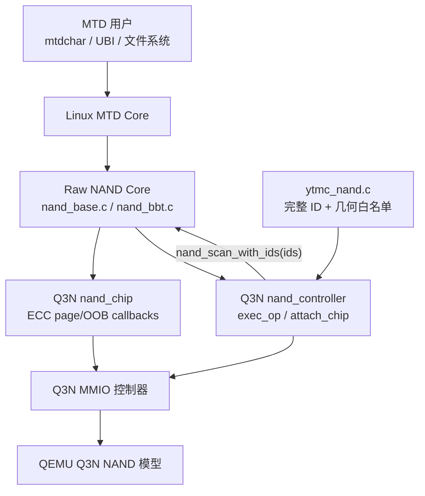

# Q3N 基于 NAND Core 的 ECC、Read Retry 与非二次幂支持设计

日期：2026-07-28

目标分支：`codex/nand-core-ecc-read-retry`

适用内核基线：Linux 7.0.12

状态：待评审

## 1. 背景

当前 `qemu_3dnand` Linux 驱动直接持有 `struct mtd_info`，并自行实现
`mtd->_read_oob`、`mtd->_write_oob`、`mtd->_erase`、`mtd->_sync`、
`mtd->_block_isbad`、`mtd->_block_markbad` 等接口。这个结构绕过了 raw NAND
core 的扫描、页读写、ECC 统计、坏块管理和 read retry 流程。

新实现要回到 Linux raw NAND 的标准分层：

1. 驱动注册 `struct nand_chip` 和 `struct nand_controller`；
2. 通过 `nand_scan_with_ids()` 完成 NAND 识别并初始化 MTD；
3. 驱动实现 `nand_ecc_ctrl` 的页、OOB 和 raw 回调，以及控制器
   `exec_op`；
4. MTD 的读写、擦除和坏块入口由 `nand_base.c` 提供；
5. read retry 由 NAND core 统一调度，驱动只负责切换 retry mode 和报告
   单次读取结果。

Q3N 当前几何不是二次幂：

- 每页：16 KiB；
- 每块：1600 页；
- 每擦除块：25 MiB；
- 每 plane：247 块；
- 2 die × 4 plane × 247 块，共 1976 个物理块。

Linux raw NAND 的部分历史代码用移位和掩码表示擦除块、target 和页边界，
不能直接正确处理 1600 页/块和非二次幂 target 容量。因此本设计允许修改
Linux `nand_base` 相关代码，但修改必须以版本化 patch 交付，不能直接把
改动混入或手工留在 Linux 源码树中。

## 2. 设计目标

### 2.1 本期目标

- 使用 `nand_scan_with_ids()` 初始化 `nand_chip` 和 MTD；
- 把厂商 NAND ID、几何和 ECC requirement 独立保存在
  `ytmc_nand.c`；
- 先按完整 NAND ID 白名单选择厂商 `ids` 表，再把该表传给
  `nand_scan_with_ids()`；
- 不在 Q3N 驱动中直接实现 MTD `_read`、`_write`、`_erase` 等入口；
- 实现 `ecc->read_page`、`ecc->write_page`、raw 页读写和 OOB 回调；
- 使用 controller `exec_op` 实现 NAND reset、read ID、status 和 erase；
- 实现 NAND core 驱动的 read retry；
- 保留 16 KiB × 1600 页/块的非二次幂擦除块几何；
- 通过 Linux patch 修正 raw NAND core 和 legacy raw NAND BBT 中的
  非二次幂假设；
- 保持现有二次幂 NAND 设备的快速路径和行为不变；
- 建立 patch 的生成、应用、重复检测、验证和回退流程。

### 2.2 本期不实现

- 不实现 page RAID；
- 不实现 parity block 分配、校验、恢复或 RAID 调度；
- 不实现后台 workqueue、异步优先级或并行 page RAID；
- 不声明支持非二次幂的多 target 或多 LUN；
- 不修改通用 MTD core；
- 不直接修改、提交或依赖 `work/linux/linux-7.0.12` 中的工作副本；
- 不保证旧 page RAID 介质镜像可以被新布局直接挂载。

## 3. 设计原则

### 3.1 分层原则



MTD core 负责 MTD 公共语义，raw NAND core 负责跨页循环、ECC 统计、坏块
处理和 read retry；Q3N 驱动只负责把一次 NAND 操作翻译为控制器命令。

### 3.2 Linux 修改原则

Linux 改动采用显式 opt-in。只有设置 Q3N 非二次幂选项的 NAND 芯片进入
精确乘除路径，其他 NAND 芯片继续使用现有移位/掩码快速路径。这样可以：

- 限制回归面；
- 保留现有驱动性能；
- 使补丁意图清晰；
- 避免把一次设备适配变成全 raw NAND 行为重构。

### 3.3 介质几何原则

不通过裁剪为 1024 页/块或 2048 页/块来规避问题。Linux 和驱动均使用
真实的 1600 页/块、25 MiB 擦除块几何。

## 4. 目标容量与地址空间

首期只向 MTD 暴露 Q3N data pool：

- data blocks per plane：208；
- lane 数：2 die × 4 plane = 8；
- 可见擦除块数：208 × 8 = 1664；
- 每擦除块：1600 × 16 KiB = 25 MiB；
- 可见页数：1664 × 1600 = 2,662,400；
- MTD 容量：1664 × 25 MiB = 41,600 MiB，即 40.625 GiB。

首期 NAND 表现为：

- `max_chips = 1`；
- 1 target；
- 每 target 1 LUN；
- 1 plane 的标准 raw NAND 抽象，QEMU 内部仍可按既有 lane 映射保存介质；
- logical block 0..1663 直接映射到 data pool 的 physical block 0..1663；
- 不访问 parity、metadata 和 reserve pool。

`ytmc_nand.c` 中的 ID 表项必须描述上述精确容量和几何。`chipsize` 使用
MiB 表示时为 41600，能够精确表示本期可见容量。probe 不直接把这些值写入
MTD，而是把匹配到的 `ids` 表传给 `nand_scan_with_ids()`，由 NAND core
完成初始化。

## 5. 驱动对象模型

`struct qemu_3dnand` 调整为至少包含：

```c
struct qemu_3dnand {
	struct device *dev;
	void __iomem *regs;
	struct nand_controller controller;
	struct nand_chip chip;
	/* 锁、统计和故障状态 */
};
```

不再嵌入独立的 `struct mtd_info`。需要 MTD 时通过
`nand_to_mtd(&q3n->chip)` 取得。

### 5.1 Controller ID 与 NAND Flash ID

Q3N 有两个不同的 ID，不能混用：

- `Q3N_REG_ID` 返回 `Q3N_ID_VALUE`，用于确认 PCI/MMIO 控制器是 Q3N；
- NAND READ ID 命令返回 NAND flash 的字节序列，用于选择
  `struct nand_flash_dev` 白名单和初始化 MTD。

通过 `Q3N_REG_ID` 只能证明控制器类型正确，不能据此选择 flash 几何。
`nand_scan_with_ids()` 的第三个参数必须来自 NAND READ ID 白名单匹配结果。

### 5.2 `ytmc_nand.c` 器件描述

首个厂商器件表放在独立文件：

```text
linux/drivers/mtd/nand/raw/
├── qemu_3dnand_main.c
├── qemu_3dnand_priv.h
├── ytmc_nand.c
└── ytmc_nand.h
```

职责划分：

- `ytmc_nand.c`：保存 YTMC 完整 ID 白名单、几何、option 和 ECC
  requirement，并实现白名单匹配；
- `ytmc_nand.h`：只声明匹配接口，不保存几何常量；
- `qemu_3dnand_main.c`：读取 NAND ID、选择 `ids` 表并调用
  `nand_scan_with_ids()`；
- `nand_base.c`：再次读取 ID、在传入表中匹配并初始化
  `nand_chip`/`mtd_info`。

`ytmc_nand.c` 首期表项采用项目内假设 ID，不代表真实 JEDEC 厂商编号：

```c
static struct nand_flash_dev ytmc_nand_ids[] = {
	{
		.name = "YTMC Q3N 41600MiB",
		.id = { 0x9c, 0xd7, 0x98, 0xa6,
			0x51, 0x33, 0x4e, 0x44 },
		.pagesize = SZ_16K,
		.chipsize = 41600,
		.erasesize = 25 * SZ_1M,
		.options = NAND_NO_SUBPAGE_WRITE |
			   NAND_NON_POWER_OF_2_GEOMETRY,
		.id_len = 8,
		.oobsize = 128,
		.ecc = NAND_ECC_INFO(40, SZ_1K),
	},
	{ .name = NULL },
};
```

其中 `0x51 0x33 0x4e 0x44` 对应项目标识 `Q3ND`。第三个字节 `0x98`
使 Linux full-ID 解析得到 3 bit/cell。QEMU READ ID 必须返回完全相同的
8 字节。

表必须以 `{ .name = NULL }` 结束，因为 `nand_scan_with_ids()` 会从传入
指针开始遍历到该终止项。Linux 驱动中用于 MTD 初始化的器件描述只在
`ytmc_nand.c` 保留一份，main 不得再复制一份。QEMU 仍保存硬件模型自身
的几何并通过 capability 寄存器上报，`attach_chip` 负责验证两者一致。

首期匹配接口为：

```c
struct nand_flash_dev *
ytmc_nand_match_ids(const u8 *id, size_t len);
```

匹配规则：

- 必须至少取得 8 字节 ID；
- 必须按 `id_len` 完整比较，不能只比较 manufacturer ID 或 device ID；
- 任一字节不匹配返回 `NULL`；
- 匹配成功返回包含该器件且以空项结尾的 `ytmc_nand_ids` 表首地址；
- 接口返回可写类型是因为 Linux 7.0.12
  `nand_scan_with_ids()` 参数不是 `const`，调用方不得修改表内容。

同一厂商增加器件时，在 `ytmc_nand.c` 表中增加 full-ID 项即可。以后支持
其他厂商时，为每个厂商建立独立 `<vendor>_nand.c`，probe 的白名单选择器
按厂商 matcher 顺序查询；不把私有器件追加到 Linux 全局
`nand_flash_ids[]`。

由于 `0x9c` 是项目内假设值，首期不向 Linux 全局 manufacturer 表注册
YTMC manufacturer ID。NAND core 的 manufacturer 字段可显示为 Unknown，
器件 model 仍使用 `ytmc_nand.c` 中的 `"YTMC Q3N 41600MiB"`。替换为真实
器件 ID 时，需要同时更新 QEMU READ ID 和该 full-ID 表项。

### 5.3 ID 白名单探测与 Probe 流程

1. 分配并初始化 `struct qemu_3dnand`；
2. 映射 MMIO、取得中断和其他平台资源；
3. 读取 `Q3N_REG_ID`，验证 Q3N controller ID；
4. `nand_controller_init(&q3n->controller)`；
5. 设置 `controller.ops = &q3n_controller_ops`；
6. 设置 `chip.controller` 和 `chip.ops.setup_read_retry`；
7. 使用 scan 前可用的底层 Q3N READ ID helper 读取 8 字节 NAND ID；
8. 调用 `ytmc_nand_match_ids()` 选择白名单 `ids`；
9. 未匹配则返回 `-ENODEV`，不回退到 Linux 全局 ID 表或 ONFI/JEDEC
   自动探测；
10. 调用 `nand_scan_with_ids(&q3n->chip, 1, ids)`；
11. 从 `nand_to_mtd()` 取得 MTD，设置名称和 owner；
12. 调用 `mtd_device_register()`。

伪代码：

```c
ret = q3n_hw_read_flash_id(q3n, id, sizeof(id));
if (ret)
	return ret;

ids = ytmc_nand_match_ids(id, sizeof(id));
if (!ids)
	return dev_err_probe(dev, -ENODEV,
			     "unsupported NAND flash ID\n");

ret = nand_scan_with_ids(&q3n->chip, 1, ids);
if (ret)
	return ret;
```

scan 前的 READ ID 只用于选择厂商白名单，不能初始化或覆写 MTD。进入
`nand_scan_with_ids()` 后，`nand_base.c` 会执行 reset、读取前两个 ID
字节、再次读取完整 ID，并在传入的 `ids` 表中进行 full-ID 匹配。匹配后
由 core 填充：

- `mtd->writesize = 16 KiB`；
- `mtd->erasesize = 25 MiB`；
- `mtd->oobsize = 128 B`；
- target size = 41,600 MiB；
- pages per eraseblock = 1600；
- ECC requirement = 40 bit/1024 B；
- `NAND_NON_POWER_OF_2_GEOMETRY` 等器件 options。

预探测和 NAND core 的再次读取构成双重校验。如果预探测匹配，但 scan
读取到不同 ID，scan 必须失败且不得注册 MTD。驱动只能在 `attach_chip`
中验证 scan 结果与 Q3N capability 寄存器一致，不能用 capability
寄存器覆盖 ID 表给出的几何。

### 5.4 Remove 和失败回退

注册成功后，remove 顺序必须为：

1. `mtd_device_unregister(mtd)`；
2. `nand_cleanup(&q3n->chip)`；
3. 释放平台资源。

probe 在 `nand_scan_with_ids()` 之后失败时也必须调用 `nand_cleanup()`。
未完成 scan 时不得调用 cleanup。所有路径均要把 read retry 模式恢复为 0。

## 6. Controller 接口

### 6.1 `attach_chip`

`attach_chip` 在 scan 获得几何后完成以下工作：

- 验证 page size 为 16 KiB；
- 验证 pages per eraseblock 为 1600；
- 验证 OOB size 为 128 字节；
- 验证只有 1 target 和每 target 1 LUN；
- 配置 ECC engine type 和全部 ECC 回调；
- 配置 OOB layout；
- 验证 QEMU 能力寄存器与 ID 表一致。

任一条件不满足时返回明确错误，不能静默改写几何。

### 6.2 `exec_op`

`exec_op` 至少支持 NAND core 在 scan 和运行期使用的操作：

- RESET；
- READ ID；
- STATUS；
- ERASE。

每个 pattern 同时支持 `check_only = true`。检查模式只判断能否执行，不访问
硬件、不改变控制器状态。

页读写和 OOB 操作由 ECC callbacks 直接调用 Q3N 页级命令；本期不要求把
所有数据流操作都重新编码成通用 NAND operation parser。

## 7. ECC 与 OOB 设计

### 7.1 ECC 参数

Q3N LDPC 参数：

- ECC step：1024 字节；
- strength：40 bit/step；
- 每页 step 数：16；
- 控制器内部 LDPC 数据：96 字节/step，共 1536 字节/页；
- Linux 可见 OOB：128 字节/页。

LDPC 数据由控制器内部维护，不占 Linux 可见 OOB，因此配置为：

- `engine_type = NAND_ECC_ENGINE_TYPE_ON_HOST`；
- `ecc.size = 1024`；
- `ecc.strength = 40`；
- `ecc.bytes = 0`。

`ecc.bytes` 不能填写 96，否则 NAND core 会将 1536 字节 ECC 数据与 128
字节逻辑 OOB 比较并拒绝设备。

### 7.2 OOB layout

- OOB byte 0：坏块标记，保留；
- OOB byte 1..127：free region；
- 不暴露 ECC region。

BBT 和 `block_markbad` 仍由 NAND core 通过 OOB byte 0 实现。Q3N 驱动必须
保证 raw OOB 访问可以可靠读写该字节。

### 7.3 ECC callbacks

至少实现：

- `read_page`；
- `read_page_raw`；
- `write_page`；
- `write_page_raw`；
- `read_oob`；
- `read_oob_raw`；
- `write_oob`；
- `write_oob_raw`。

正常页读返回控制器纠错后的主数据，并按本次最大 bitflip 数更新统计。raw
页读返回介质 bitflip overlay 后的原始主数据，不执行 ECC、不刷新 ECC
结果寄存器。raw 页写仍由 QEMU 生成隐藏 LDPC，因为 guest 不具备提供
1536 字节内部校验数据的接口。

## 8. Read Retry

### 8.1 职责划分

read retry 循环由 `nand_base.c` 负责。Q3N 驱动不在 `read_page()` 内部
自行循环，否则会绕开 NAND core 的统计保存、模式复位和最终错误语义。

驱动设置：

```c
chip->read_retries = 4;
chip->ops.setup_read_retry = q3n_setup_read_retry;
```

mode 为 0..3：

| Mode | 等效额外纠错收益 | 可恢复 bitflip 范围 |
|---|---:|---:|
| 0 | 0 bit | 0..40 |
| 1 | 8 bit | 41..48 |
| 2 | 16 bit | 49..56 |
| 3 | 24 bit | 57..64 |

65 bit 及以上在全部模式尝试后仍失败。

### 8.2 `read_page()` 返回契约

Linux 7.0.12 的 NAND core 只有在发现 `mtd->ecc_stats.failed` 增加时才进入
下一 retry mode。因此：

- 可纠正：增加 `corrected`，返回最大 bitflip 数；
- ECC 不可纠正：增加 `failed`，返回非负值；
- 控制器、DMA、超时等硬件错误：返回负 errno，例如 `-EIO`；
- ECC 不可纠正时不得直接从 `read_page()` 返回 `-EBADMSG`。

NAND core 在 retry 前保存并恢复 ECC 统计。最终所有模式失败后，由 core
对上层返回 `-EBADMSG`。

retry 后成功的页必须让最终返回值至少达到 `mtd->bitflip_threshold`，使上层
得到 `-EUCLEAN`/scrub 提示，而不是把依赖 retry 的读取当成健康页。

### 8.3 模式复位

- 每页读取结束后恢复 mode 0；
- 硬件错误路径也恢复 mode 0；
- QEMU RESET 命令强制恢复 mode 0；
- 下一页读取前可断言当前 mode 为 0。

### 8.4 统计

除标准 `mtd->ecc_stats` 外，Q3N debug 统计至少包括：

- retry attempts；
- retry recovered pages；
- retry exhausted pages；
- setup retry failures；
- retry mode reset failures。

标准 MTD ECC 统计只反映最终读取结果，不能累计被后续 retry 恢复的中间失败。

## 9. 非二次幂几何的 Linux Patch 设计

### 9.1 为什么需要 patch

通用 MTD core 已经能处理非二次幂 `erasesize`：

- `mtd_div_by_eb()` 在没有 `erasesize_shift` 时使用除法；
- `mtd_mod_by_eb()` 在没有 `erasesize_shift` 时使用取模；
- `mtdcore` 对非二次幂擦除块将 `erasesize_shift` 设为 0。

因此不修改 `drivers/mtd/mtdcore.c`。

问题集中在 legacy raw NAND 层。Linux 7.0.12 的 `nand_base.c` 和
`nand_bbt.c` 多处把下列量视为二次幂：

- `phys_erase_shift`；
- `chip_shift`；
- `pagemask`；
- `bbt_erase_shift`；
- `1 << shift` 得到擦除块大小或每块页数；
- `offset >> shift` 得到 block/target；
- `page & pagemask` 得到 target 内页号。

1600 页/块和 25 MiB 擦除块不能由这些移位精确表示，必须增加精确乘除路径。

### 9.2 Opt-in 标志

Linux 7.0.12 的 `BIT(15)` 未被现有 NAND option 使用。在
`include/linux/mtd/rawnand.h` 增加：

```c
#define NAND_NON_POWER_OF_2_GEOMETRY BIT(15)
```

`ytmc_nand.c` 的匹配表项设置该标志；`nand_base.c` 完成 full-ID 匹配时，
通过 `chip->options |= type->options` 把它并入 chip。probe 不再单独写入同一
标志。patch 应包含编译期或静态检查，防止后续基线移植时与新 option bit
冲突。

该标志的首期契约：

- page size 仍必须是二次幂；
- pages per eraseblock、eraseblock size 和 target size 可以不是二次幂；
- 只支持 1 target、每 target 1 LUN；
- 其他器件的 ID 表项不设置该标志，继续走原有逻辑。

如果设置标志但 target/LUN 数量超出本期范围，scan 必须失败并打印清晰错误。

### 9.3 共享精确几何 helpers

在 `drivers/mtd/nand/raw/internals.h` 增加 raw NAND 内部 helper，供
`nand_base.c` 和 `nand_bbt.c` 共同使用。helper 名称可在实施时按内核命名
规范调整，但语义必须统一：

- 取得精确 eraseblock size；
- 取得精确 pages per eraseblock；
- 取得精确 pages per target；
- 取得精确 target size；
- byte offset 转 target index 和 target-relative offset；
- absolute page 转 target index 和 target-relative page；
- block index 转 byte offset；
- byte offset 转 block index；
- block index 转 first page；
- page index 转 block index；
- 判断 offset 是否对齐擦除块；
- 计算精确 eraseblock 数；
- 计算 BBT 2-bit entry 数组长度。

非二次幂路径使用 `div64_u64_rem()`、`div_u64()`、乘法和 overflow 检查；
默认路径保留现有移位/掩码实现。

任何调用点不得自行复制一套“近似 shift”算法。精确几何换算必须经过共享
helper，避免 NAND I/O 和 BBT 对同一地址产生不同解释。

### 9.4 `nand_base.c` 修改范围

以下语义必须改为使用 helper：

1. `check_offs_len()` 的擦除块对齐检查；
2. 第一页/最后一页坏块标记位置；
3. byte offset 到 target 的选择；
4. absolute page 到 target 内 page 的换算；
5. `nand_erase_op()` 中 eraseblock 到 row page 的换算；
6. `nand_do_read_ops()` 的跨页和跨 target 边界；
7. `nand_do_read_oob()` 的页号和剩余长度；
8. `nand_do_write_ops()` 和 OOB write 的页号换算；
9. erase 循环中的 pages-per-block、block index、长度递减和边界；
10. `block_isbad`、`block_markbad` 的 offset/block/page 换算；
11. `nand_detect()` 对非二次幂几何的验证和缓存字段初始化；
12. row address cycle 数的计算。

非二次幂模式下，row address cycle 数应依据
`fls64(pages_per_target - 1)` 计算，而不是通过
`chip_shift - page_shift` 推导。

`page_shift` 可以继续使用，因为 Q3N page size 16 KiB 是二次幂。
`phys_erase_shift`、`chip_shift`、`pagemask` 在 opt-in 路径中不得再作为
真实几何来源；如果为 ABI 或旧代码兼容保留字段，只能用于未进入精确路径的
调用。

### 9.5 `nand_bbt.c` 修改范围

raw NAND legacy BBT 必须同步改造，不能简单设置 `NAND_SKIP_BBTSCAN` 绕过：

1. block index 到 byte offset；
2. byte offset 到 block index；
3. block index 到 first page；
4. page index 到 block index；
5. 每 target 的 block 数和 BBT 搜索范围；
6. eraseblock 缓冲区长度；
7. eraseblock 对齐；
8. 2 bit/block BBT 内存长度；
9. per-chip BBT mask 和 target 选择；
10. memory BBT scan 的步长；
11. bad/reserved/markbad entry 的索引；
12. 第一块和最后一块等边界判断。

BBT 内存长度按真实擦除块数计算：

```text
bbt_bytes = DIV_ROUND_UP(number_of_eraseblocks * 2, 8)
```

不能再从 `size >> (bbt_erase_shift + 2)` 推导。

通用 `drivers/mtd/nand/bbt.c` 已使用 `nanddev_neraseblocks()` 等精确组织信息，
本期不修改。修改对象是 `drivers/mtd/nand/raw/nand_bbt.c`。

### 9.6 Generic NAND row 编码边界

`nanddev_pos_to_row()` 对 LUN/eraseblock/page 字段使用按位拼接。对于 1600
页/块，这种编码会在相邻块之间留下 row 空洞。Q3N 首期不依赖该函数表达
多 LUN 或多 target 地址：

- read/write 路径使用 patch 后的线性页号 helper；
- erase 路径使用 `block * pages_per_eraseblock`；
- 仅允许 1 target、1 LUN；
- Q3N 控制器接收连续线性 row。

如果后续需要多 LUN 或多 target 非二次幂支持，应单独设计 generic NAND
position/row 编码扩展，不能把本期 flag 的能力描述扩大到该场景。

## 10. Patch 交付与 Linux 源码隔离

### 10.1 仓库结构

计划在 Q3N 代码仓库跟踪：

```text
patches/linux/
├── series
├── 0001-mtd-rawnand-add-exact-geometry-helpers.patch
├── 0002-mtd-rawnand-use-exact-geometry-in-io-paths.patch
└── 0003-mtd-rawnand-use-exact-geometry-in-bbt.patch

scripts/
└── apply-linux-patches.sh
```

可能修改的 Linux 文件白名单：

- `include/linux/mtd/rawnand.h`；
- `drivers/mtd/nand/raw/internals.h`；
- `drivers/mtd/nand/raw/nand_base.c`；
- `drivers/mtd/nand/raw/nand_bbt.c`；
- 与该功能直接相关的 KUnit 测试文件。

Linux 测试代码如果需要修改，也必须包含在 patch series 中。

### 10.2 Source of truth

patch 文件是 Linux 改动的唯一 source of truth。实施时可以在临时、可丢弃
的 Linux git worktree 中制作和验证 commit，再通过 `git format-patch`
导出到 `patches/linux/`。不能把临时 Linux worktree 中的已应用状态当作
交付物。

`qemu_3dnand_main.c`、`ytmc_nand.c` 和 `ytmc_nand.h` 属于 Q3N 项目驱动
overlay，直接在本仓库跟踪；`nand_base.c`、raw NAND `nand_bbt.c` 和
`rawnand.h` 等原生 Linux 文件仍只能通过 `patches/linux/` 修改。

仓库中的 `work/linux/linux-7.0.12` 仅是构建产物或外部源码副本：

- 不直接手工修改；
- 不提交其中的差异；
- 不要求开发者保留已应用 patch 的副本；
- 删除并重新准备该目录后，构建结果必须可以由 patch series 重现。

### 10.3 应用流程

`scripts/apply-linux-patches.sh` 必须：

1. 验证目标是支持的 Linux 7.0.12 基线；
2. 验证 `series` 中每个 patch 文件存在；
3. 按 `series` 顺序处理；
4. 先执行 reverse check，能反向检查通过表示 patch 已应用，跳过；
5. 否则执行正向 check；
6. 只有正向 check 通过才实际应用；
7. 任一 patch 不匹配立即失败，不使用 fuzz，不忽略 reject；
8. 输出已应用、已跳过和失败的具体 patch。

等价检查流程：

```text
git apply --reverse --check <patch>  -> 成功：已应用，跳过
git apply --check <patch>            -> 失败：停止
git apply <patch>                    -> 应用
```

构建入口在复制 Q3N driver/QEMU overlay 之前调用该脚本，使 pristine Linux
源码和重复构建均得到确定结果。

### 10.4 回退流程

首选回退方式是删除临时 Linux 构建树，并从 pristine Linux 7.0.12 重新
准备。需要就地回退时：

1. 按 `series` 逆序；
2. 对每个 patch 执行 `git apply --reverse --check`；
3. 检查通过后执行 `git apply --reverse`；
4. 任一步失败立即停止。

禁止通过手工编辑 Linux 文件来“回退”。

### 10.5 Patch CI 约束

CI 至少检查：

- patch 能干净应用到 pristine Linux 7.0.12；
- patch 应用第二次不会重复修改；
- patch 能按逆序干净回退；
- 回退后 Linux tree 与 pristine 基线一致；
- patch 只修改白名单文件；
- `series` 顺序完整且无重复；
- Linux raw NAND/MTD 相关构建通过；
- 二次幂参考 NAND 的行为没有变化。

## 11. Page RAID 边界

本期不创建任何 page RAID 数据结构或命令：

- 每个 MTD 页直接对应一个 data-pool NAND 页；
- 不计算 parity；
- 不读取 parity block；
- 不进行降级恢复；
- 不注册 page RAID debugfs；
- 不保留“空实现”调度线程。

为避免旧布局被误识别，新驱动测试应使用全新的 NAND image。物理 page/OOB
格式虽然没有因本设计改变，但旧分支写入的数据可能包含 page RAID 的地址
裁剪、parity 和 metadata 语义，不能承诺直接迁移。

## 12. 错误处理与并发

- 控制器命令序列由 controller lock 串行化；
- `read_page()` 只完成一次指定 mode 的读取；
- retry mode 是控制器全局状态时，切换、读取和复位必须在同一锁域；
- timeout、非法状态和 MMIO 错误返回 `-EIO`/`-ETIMEDOUT`；
- ECC 不可纠正只通过 `ecc_stats.failed` 报告给 NAND core；
- raw read 不改变 ECC 统计；
- OOB-only 操作不得意外改写主数据；
- 任一失败路径不得把 retry mode 留在非 0 状态；
- scan 和 remove 期间不允许并发 MTD I/O。

## 13. 验证方案

### 13.1 Patch 与构建验证

- 对 pristine Linux 7.0.12 应用全部 patch；
- 重复应用，确认全部被识别为已应用；
- 逆序回退并比较源码树；
- 编译 `drivers/mtd/nand/raw` 和 Q3N driver；
- 对 power-of-two 参考 NAND 运行现有测试。

### 13.2 扫描与基本 MTD

- `Q3N_REG_ID` 只验证 controller，不参与 flash table 选择；
- QEMU READ ID 返回
  `9c d7 98 a6 51 33 4e 44`；
- `ytmc_nand_match_ids()` 对完整 8 字节匹配成功并返回终止完整的 ids 表；
- ID 任一字节不同、ID 长度不足或未知厂商均返回 `NULL`；
- 白名单未命中时 probe 返回 `-ENODEV`，不调用
  `nand_scan_with_ids()`；
- 白名单未命中时不回退到全局 ID、ONFI 或 JEDEC 探测；
- 预探测 ID 与 NAND core 再读 ID 不一致时 scan 失败；
- READ ID 返回期望 ID；
- 确认传给 `nand_scan_with_ids()` 的第三个参数是
  `ytmc_nand_ids`，并成功完成 scan；
- MTD 几何来自 `ytmc_nand.c` 表和 NAND core 初始化，不是 probe 手工赋值；
- MTD 报告 16 KiB writesize、128 B oobsize、25 MiB erasesize；
- MTD 报告 41,600 MiB 容量；
- MTD `_read`、`_write`、`_erase` 指向 NAND core，而不是 Q3N 自定义入口；
- program/read/erase/OOB/markbad/isbad 均通过。

### 13.3 非二次幂边界

- block 0 page 1599 与 block 1 page 0 不混淆；
- page 1599 到 page 1600 的跨块连续读写正确；
- 完整擦除一个 25 MiB block；
- 非 25 MiB 对齐的 erase 被拒绝；
- block 1663 的第一页和最后一页正确；
- MTD 最后一个字节可读写，越界一字节被拒绝；
- BBT 第一项和最后一项正确；
- `block_markbad` 只改变目标 block；
- BBT scan 步长恰好为 25 MiB；
- pages-per-block、block count 和 BBT buffer 长度无截断；
- 不访问 1600..2047 这类由二次幂 row 编码产生的空洞。

### 13.4 ECC 与 raw

- 无 bitflip 正常读取；
- 1、40 bit 可在 mode 0 修复；
- raw read 能看到 bitflip overlay；
- normal read 返回纠正后的数据；
- raw read 不更新 ECC 统计；
- OOB byte 0 坏块标记可持久化；
- OOB 1..127 可正常读写；
- hidden LDPC 不占用逻辑 OOB。

### 13.5 Read Retry

- 41 bit：mode 1 恢复；
- 49 bit：mode 2 恢复；
- 57 bit：mode 3 恢复；
- 65 bit：全部模式失败并最终返回 `-EBADMSG`；
- retry 恢复的页返回 `-EUCLEAN`/达到 bitflip threshold；
- 中间失败不污染最终标准 ECC 统计；
- 每页结束后 mode 为 0；
- setup retry 失败和 mode reset 失败可观察；
- retry 后紧接着读取健康页，结果不受前一页 mode 影响。

### 13.6 上层验证

- `mtd_debug` 跨多个 25 MiB block 读写；
- bad block 标记与重新扫描；
- UBI attach、格式化、读写和 detach；
- 重启 QEMU 后数据、OOB 和坏块状态一致；
- page RAID 相关线程、统计和介质访问均不存在。

## 14. 实施顺序

设计批准后，实施计划按以下依赖顺序拆分：

1. 建立 Linux patch 制作、应用和回退框架；
2. patch 1：opt-in flag 与精确几何 helpers；
3. patch 2：`nand_base.c` I/O、erase、坏块和 scan 路径；
4. patch 3：`nand_bbt.c` 精确 block/BBT 计算；
5. 为非二次幂边界增加内核测试；
6. 新增 `ytmc_nand.c`/`.h`、full-ID 白名单测试并接入 Makefile；
7. 调整 QEMU READ ID 为假设的 YTMC full ID；
8. 重构 Q3N 驱动为 `nand_chip`/`nand_controller`；
9. 实现预探测、`ytmc_nand_match_ids()` 和
   `nand_scan_with_ids(ids)` 数据流；
10. 实现 ECC page/OOB/raw callbacks；
11. 增加 QEMU raw-read 和 read-retry mode；
12. 接入 NAND core read retry；
13. 完成 MTD、BBT、UBI 和回归验证。

驱动重构依赖 Linux patch 已可稳定应用；read retry 依赖标准 page read
返回契约完成；任何 page RAID 工作不进入本期实施计划。

## 15. 评审结论项

本设计提交评审时，需要明确确认：

- 接受只暴露 1664 个 data-pool blocks、40.625 GiB MTD；
- 接受本期非二次幂支持限定为 1 target、1 LUN；
- 接受首期假设 full ID 为 `9c d7 98 a6 51 33 4e 44`；
- 接受通过 `ytmc_nand.c` 白名单预探测选择传给
  `nand_scan_with_ids()` 的 ids 表；
- 接受 Linux 修改以三段 patch series 交付；
- 接受旧 page RAID image 不做兼容承诺；
- 接受 retry 成功向上层报告 scrub 提示；
- 接受本期不包含任何 page RAID 空实现。
