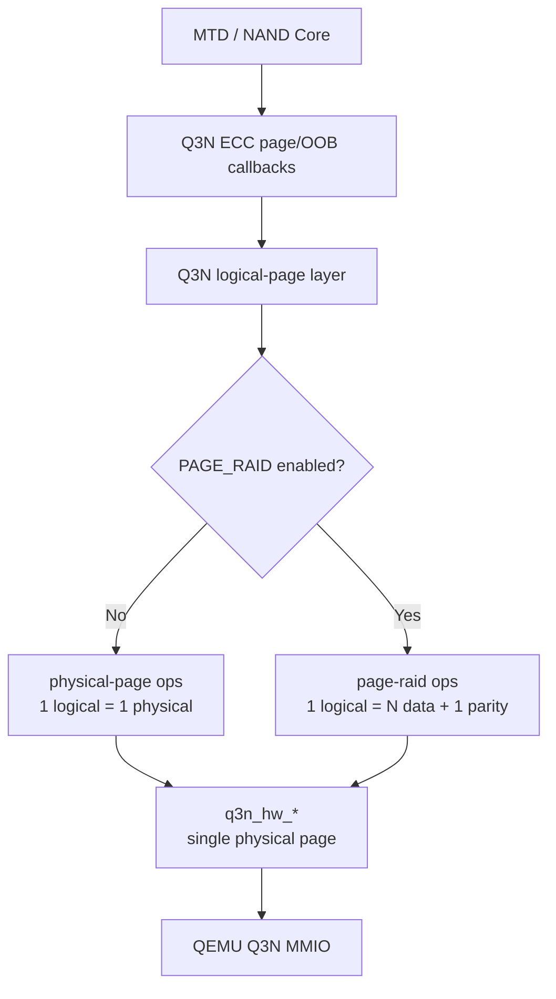
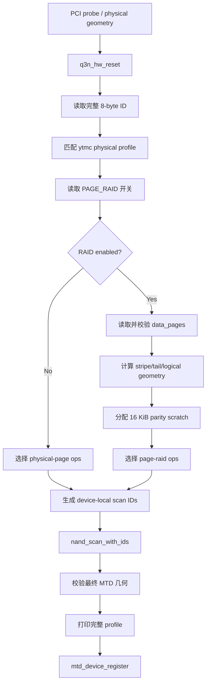
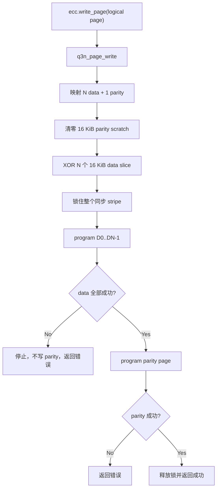
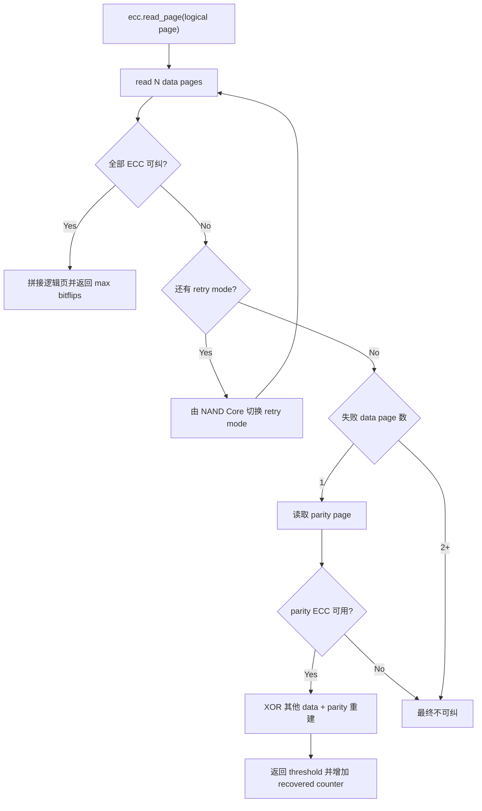

# Q3N 可配置 Page RAID 逻辑页设计

日期：2026-07-29

目标分支：`codex/nand-core-ecc-read-retry`

基线设计：

- `2026-07-28-q3n-nand-core-ecc-read-retry-design.md`；
- `2026-07-29-q3n-legacy-cmdfunc-waitfunc-design.md`。

状态：已实现并验证

## 0. 实现证据

- host layout/page/ECC 测试覆盖 RAID 关闭、2:1、4:1、8:1，包含非法
  `N=3`、精确几何、同步 `D0..DN-1,P`、全 `0xff` 物理 program 跳过、
  OOB-only 保存、read retry 后单页恢复和双页失败；
- Linux 7.0.12 分别生成 RAID 关闭、2:1、4:1、8:1 的
  `qemu_3dnand.ko`；关闭配置不含 RAID 对象/符号，三个启用配置均含
  `qemu_3dnand_page_raid.o`；
- 默认 4:1 guest 报告 65536/4096/20971520/34896609280，完成 page/OOB、
  跨 logical block、完整 block erase、markbad、模块重载 BBT rescan 和
  两次启动持久化；
- 8:1 guest 报告 131072/8192/23199744/38604374016，初始化日志明确
  `stripes/block=177`、`used pages/block=1593`、`tail pages/block=7`，
  最后一个 logical page 可访问而 MTD 末端地址被拒绝；
- guest 没有 read-retry/page-recovery fault-injection 用户接口，因此
  fault injection 只在 QEMU/controller/page host tests 中验收，不声明
  guest fault-injection 已完成。

## 1. 目标

在现有 NAND Core、legacy `cmdfunc/waitfunc`、ECC page/OOB callbacks 和
read retry 架构上增加可配置的驱动侧 Page RAID：

- 上层只提交逻辑 data；
- Linux Q3N 驱动计算 XOR parity；
- 一个逻辑页由 `N` 个 16 KiB 物理 data page 组成；
- parity 固定占用紧随 data pages 的第 `N+1` 个物理页；
- `N` 必须是二次幂，首期支持 2、4、8；
- Page RAID 开关与 data:parity 比例使用两个独立 Kconfig；
- RAID 关闭时完整保留现有一个逻辑页对应一个物理页的路径；
- 新增逻辑页层屏蔽 MTD/ECC 上层看到的页大小和地址映射差异；
- `q3n_hw_*` 继续只处理单个物理页，QEMU 不计算 parity；
- `N+1` 个物理页在一次同步驱动调用中顺序写入，不实现异步 stripe cache。

## 2. 本期不实现

- 不实现 parity metadata、commit marker、generation 或 parity CRC；
- 不保证掉电后的 `N+1` 页全有或全无；
- 不实现 QEMU batch transaction、journal 或 copy-on-write rollback；
- 不跨物理 block 放置 stripe；
- 不使用尾部不足一个完整 stripe 的物理页；
- 不保护逻辑 OOB，Page RAID 只保护 main data；
- 不自动回写 RAID 恢复出的 data page；
- 不支持运行时切换 RAID 开关或比例；
- 不保证不同 Page RAID profile 之间的介质兼容；
- 不修改 QEMU MMIO ABI，也不把 parity 计算下沉到 QEMU。

## 3. 配置

增加两个独立 Kconfig：

```text
CONFIG_MTD_NAND_QEMU_3DNAND_PAGE_RAID
CONFIG_MTD_NAND_QEMU_3DNAND_PAGE_RAID_DATA_PAGES
```

### 3.1 功能开关

`CONFIG_MTD_NAND_QEMU_3DNAND_PAGE_RAID` 是独立布尔开关：

- `n`：不编译 Page RAID 实现对象，选择现有 physical-page ops；
- `y`：编译 Page RAID 实现，初始化时读取 data page 比例。

### 3.2 比例配置

`CONFIG_MTD_NAND_QEMU_3DNAND_PAGE_RAID_DATA_PAGES` 单独定义每个 stripe
的 data page 数：

- 首期配置范围为 2 到 8；
- 初始化必须使用 `is_power_of_2()` 再次校验；
- 首期有效值为 2、4、8；
- parity page 数固定为 1；
- RAID 关闭时比例值不参与几何、地址或容量计算；
- 后续增加 16、32 等 profile 时不改变逻辑页层接口。

配置在编译期确定，完成 `nand_scan_with_ids()` 后不可改变。

## 4. 物理器件与逻辑几何

`ytmc_nand.c` 继续保存完整 ID 和真实物理几何：

```text
ID                   = 9c d7 98 a6 51 33 4e 44
physical page        = 16384 bytes
physical OOB         = 1024 bytes
physical pages/block = 1600
physical blocks      = 1664
physical eraseblock  = 26214400 bytes
physical capacity    = 43620761600 bytes
```

RAID 开启时，设：

```text
N = data_pages
P = 16384
O = 1024
B = 1600
C = 1664
```

逻辑几何计算：

```text
stripe_pages        = N + 1
stripes_per_block   = floor(B / stripe_pages)
tail_pages          = B - stripes_per_block * stripe_pages

logical_writesize   = N * P
logical_oobsize     = N * O
logical_pages/block = stripes_per_block
logical_erasesize   = logical_writesize * stripes_per_block
logical_size        = logical_erasesize * C
```

首期 profile：

| Profile | 逻辑页 | 逻辑 OOB | Stripe/块 | 使用物理页/块 | 尾部页 | MTD 擦除块 | 可见容量 |
| --- | ---: | ---: | ---: | ---: | ---: | ---: | ---: |
| RAID 关闭 | 16 KiB | 1 KiB | 1600 | 1600 | 0 | 25 MiB | 40.625 GiB |
| 2:1 | 32 KiB | 2 KiB | 533 | 1599 | 1 | 17,465,344 B | 27.06640625 GiB |
| 4:1 | 64 KiB | 4 KiB | 320 | 1600 | 0 | 20 MiB | 32.5 GiB |
| 8:1 | 128 KiB | 8 KiB | 177 | 1593 | 7 | 23,199,744 B | 35.953125 GiB |

逻辑页大小始终是二次幂。逻辑擦除块可以不是二次幂，继续由现有
`NAND_NON_POWER_OF_2_GEOMETRY` 和三段 Linux patch 支持。

## 5. 分层



依赖规则：

- MTD/NAND Core 不知道物理 stripe 和 parity page；
- ECC callbacks 只调用逻辑页层，不再直接决定物理页映射；
- 逻辑页层选择 physical 或 RAID ops；
- RAID ops 负责拆分、XOR、物理页顺序和结果汇总；
- `qemu_3dnand_addr.c` 继续提供物理 page/block 换算；
- 新 layout 层只负责逻辑页到物理 stripe 的纯映射；
- `qemu_3dnand_hw.c` 继续只访问寄存器和单个物理页；
- QEMU 只模拟物理 NAND 和现有 ECC/read-retry 行为。

## 6. 文件设计

### 6.1 新增文件

| 文件 | 职责 |
| --- | --- |
| `qemu_3dnand_page.c` | 逻辑页统一入口、ops 选择和现有单物理页分支 |
| `qemu_3dnand_page.h` | ECC/controller 可见的稳定逻辑页接口 |
| `qemu_3dnand_layout.c` | profile 几何计算和逻辑页到物理 stripe 的纯映射 |
| `qemu_3dnand_layout.h` | profile、map 结构和无 MMIO 映射接口 |
| `qemu_3dnand_page_raid.c` | XOR parity、同步 `D0..DN-1,P` 写入和恢复 |
| `qemu_3dnand_page_raid.h` | RAID ops 初始化接口 |
| `tests/test_q3n_layout.c/.sh` | 2:1、4:1、8:1 几何、边界和尾部页测试 |
| `tests/test_q3n_page_raid.c/.sh` | XOR、写入顺序、错误、重试和恢复测试 |

### 6.2 修改文件

| 文件 | 变化 |
| --- | --- |
| `Kconfig.qemu_3dnand` | 增加独立 RAID 开关和 data page 数配置 |
| `Makefile.qemu_3dnand` | page/layout 始终编译；RAID 对象按开关编译 |
| `qemu_3dnand_priv.h` | 保存 physical/logical geometry、profile、ops 和 scratch |
| `qemu_3dnand_flash.c/.h` | 由物理 ID profile 生成设备私有 scan ID 表 |
| `ytmc_nand.c/.h` | 继续只保存物理 ID、物理几何和 ECC requirement |
| `qemu_3dnand_init.c` | scan 前初始化 page layer，scan 后校验和打印 profile |
| `qemu_3dnand_ecc.c` | page/OOB/raw callbacks 改用逻辑页接口 |
| `qemu_3dnand_controller.c` | erase 通过逻辑页层，legacy callback ABI 不变 |
| `tests/test_q3n_nand_core_contract.sh` | 验证两种对象组合和 NAND Core 所有权 |
| `scripts/smoke-test.sh` | 加入 layout 和 RAID 行为测试 |

QEMU 文件和寄存器定义不修改。

## 7. 关键数据结构

```c
struct q3n_page_profile {
	bool raid_enabled;
	u32 data_pages;
	u32 parity_pages;
	u32 stripe_pages;
	u32 stripes_per_block;
	u32 tail_pages;

	struct q3n_geometry physical;
	struct q3n_geometry logical;
	u64 logical_size;
};

struct q3n_page_map {
	u32 logical_block;
	u32 stripe_in_block;
	u32 first_data_page;
	u32 parity_page;
};

struct q3n_page_result {
	u32 max_bitflips;
	u32 corrected_bits;
	u32 failed_data_pages;
	bool parity_failed;
	bool recovered;
};

struct q3n_page_ops {
	int (*read_page)(struct q3n *q3n, u32 logical_page,
			 void *data, void *oob, bool raw,
			 struct q3n_page_result *result);
	int (*write_page)(struct q3n *q3n, u32 logical_page,
			  const void *data, const void *oob);
	int (*read_oob)(struct q3n *q3n, u32 logical_page, void *oob);
	int (*write_oob)(struct q3n *q3n, u32 logical_page,
			 const void *oob);
	int (*erase_block)(struct q3n *q3n, u32 logical_block);
};
```

`struct q3n` 增加：

```c
struct q3n_page_profile page_profile;
const struct q3n_page_ops *page_ops;
u8 *parity_scratch;
u64 raid_recovered_pages;
```

`parity_scratch` 固定为 16 KiB，只在一次同步调用内保存计算中的 parity。
它不是 stripe cache，也不保存 data page 副本。

## 8. 逻辑页接口

ECC/controller 使用以下稳定入口：

```c
int q3n_page_layer_init(struct q3n *q3n,
			const struct q3n_geometry *physical);

int q3n_page_read(struct q3n *q3n, u32 logical_page,
		  void *data, void *oob, bool raw,
		  struct q3n_page_result *result);

int q3n_page_write(struct q3n *q3n, u32 logical_page,
		   const void *data, const void *oob);

int q3n_page_read_oob(struct q3n *q3n, u32 logical_page, void *oob);
int q3n_page_write_oob(struct q3n *q3n, u32 logical_page,
		       const void *oob);
int q3n_page_erase_block(struct q3n *q3n, u32 logical_block);
```

RAID 关闭时接口直接复用：

- `q3n_hw_read_page()`；
- `q3n_hw_program_page()`；
- `q3n_hw_read_oob()`；
- `q3n_hw_program_oob()`；
- `q3n_hw_erase_block()`。

不得把 `q3n_hw_read_page()` 或 `q3n_hw_program_page()` 改成逻辑页语义。

## 9. 地址映射

逻辑页 `L`：

```text
logical_block = L / stripes_per_block
stripe        = L % stripes_per_block

physical_base = logical_block * 1600 +
                stripe * (data_pages + 1)

data_page[i]  = physical_base + i
parity_page   = physical_base + data_pages
```

### 9.1 4:1

```text
L0   -> D0,D1,D2,D3,P4
L1   -> D5,D6,D7,D8,P9
L319 -> D1595,D1596,D1597,D1598,P1599
L320 -> next block D1600,D1601,D1602,D1603,P1604
```

### 9.2 8:1

```text
L176 -> D1584..D1591,P1592
physical pages 1593..1599 -> unused tail
L177 -> next block D1600..D1607,P1608
```

### 9.3 2:1

```text
L532 -> D1596,D1597,P1598
physical page 1599 -> unused tail
L533 -> next block D1600,D1601,P1602
```

映射函数必须拒绝：

- 越界 logical page/block；
- data page 数不是二次幂；
- `stripes_per_block == 0`；
- 任何乘法或加法溢出；
- 任何结果进入另一个物理 block；
- 对尾部页的直接映射。

## 10. 初始化



物理 ID profile 不被逻辑几何覆盖。驱动在 `struct q3n` 中保存一个设备私有、
带 sentinel 的 `nand_flash_dev` scan 表，将其 pagesize、oobsize、
erasesize 和 chipsize 设置为逻辑视图后传给 `nand_scan_with_ids()`。

初始化日志至少包含：

```text
page-raid: enabled
profile: 8 data + 1 parity
physical page: 16384
logical page: 131072
logical oob: 8192
stripes/block: 177
used physical pages/block: 1593
unused tail pages/block: 7
logical eraseblock: 23199744
logical capacity: 38604374016
```

RAID 关闭时明确输出：

```text
page-raid: disabled
profile: 1 logical page = 1 physical page
```

任一配置或最终几何不一致时拒绝注册 MTD。

## 11. 写入



XOR：

```c
memset(q3n->parity_scratch, 0, Q3N_PHYSICAL_PAGE_SIZE);

for (i = 0; i < profile->data_pages; i++)
	xor_into(q3n->parity_scratch,
		 logical_data + i * Q3N_PHYSICAL_PAGE_SIZE,
		 Q3N_PHYSICAL_PAGE_SIZE);
```

写入约束：

- 持有 `q3n->lock` 直到 `D0..DN-1,P` 全部结束；
- 每个 data page 的完整 16 KiB main buffer 全为 `0xff` 时，不发出
  main-data PROGRAM；若其 OOB 含任一非 `0xff` byte，仍发出 OOB-only
  PROGRAM，否则整页跳过；
- parity 仍先从全部 data slice 计算；计算结果完整 16 KiB 全为
  `0xff` 时跳过 parity main-data PROGRAM，非全 `0xff` 时仍作为最后
  一个 main-data PROGRAM；
- parity OOB 保持擦除态，因此 parity main 被跳过时没有额外 OOB program；
- 任一 data program 失败后立即停止，不写 parity；
- parity program 失败时整个逻辑页写失败；
- 不回滚已经成功 program 的 data page；
- 失败逻辑页所在物理块必须先 erase 才能重新使用；
- parity OOB 保持擦除态 `0xff`；
- 不写 parity metadata；
- 成功只表示本次同步调用的所有命令成功，不表示掉电原子性。

## 12. 读取、Read Retry 与恢复



行为：

- 每次 ECC callback 按当前 retry mode 读取全部 data pages；
- 任何负 transport/MMIO 错误立即返回，不转为 RAID 恢复；
- 中间 retry mode 的 failed 统计继续触发 NAND Core 标准重试；
- NAND Core 会在下一模式前恢复该逻辑页进入读取前的 ECC stats；
- 最后 retry mode 恰好一个 data page 不可纠时才读取 parity；
- parity 使用最后一个 retry mode 读取；
- parity ECC 不可纠时不恢复；
- 两个及以上 data page 不可纠时不恢复；
- 恢复成功不保留最终 `mtd->ecc_stats.failed` 增量；
- 恢复成功返回 `mtd->bitflip_threshold`，使上层有机会 scrub；
- 驱动增加 `raid_recovered_pages` 私有计数；
- 不自动 program 修复数据。

重建：

```text
missing_data = parity XOR data[0] XOR ... XOR data[N-1]
```

计算时跳过不可纠的 data slice。

## 13. Raw、OOB、坏块和擦除

### 13.1 Raw page

- `read_page_raw` 读取并拼接 `N` 个物理 data page；
- raw read 不执行 ECC read retry 或 RAID 恢复；
- parity page 不通过 raw MTD page 接口暴露；
- `write_page_raw` 仍根据 main data 计算和写入 parity，保持布局完整。

### 13.2 OOB

- 逻辑 OOB 是 `N` 个 data page OOB 的顺序拼接；
- `logical_oob[i * 1024 ... (i + 1) * 1024 - 1]`
  映射到 `data_page[i]` 的物理 OOB；
- parity OOB 不暴露，保持 `0xff`；
- Page RAID 不保护 OOB；
- OOB-only program 不重新计算 main parity。

### 13.3 BBM 和 BBT

- 一个逻辑 eraseblock 始终对应一个物理 block；
- NAND Core block index 与物理 block index 一一对应；
- `logical OOB[0]` 映射到物理 block 第一个 data page 的 OOB byte 0；
- `_block_isbad`、`_block_markbad` 和 RAM BBT 继续由 NAND Core 提供；
- parity page 和尾部页不参与 BBM；
- 不新增私有 BBT。

### 13.4 擦除

- `q3n_page_erase_block(logical_block)` 直接映射到同编号 physical block；
- 继续复用 `q3n_hw_erase_block()`；
- 一次擦除会同时清除 data、parity 和尾部页；
- 逻辑 erase size 只表示可见 data 容量，不改变物理 25 MiB 擦除事务。

## 14. 并发和原子性边界

本期保证：

- 一个逻辑页的 data 和 parity program 不与其他 Q3N 请求交错；
- 所有 `N+1` 个物理命令成功后才向上返回成功；
- parity 总是最后写入；
- 同步调用期间不保留 data 副本或异步状态。

本期不保证：

- 掉电后 `N+1` 页全部存在或全部不存在；
- data program 部分成功后的自动 rollback；
- parity program 失败后的介质自动修复；
- 使用不同 profile 重新加载旧介质。

介质 profile 发生变化时必须使用全新或已完整擦除的介质。

## 15. 错误处理

错误优先级：

1. 无效配置、逻辑页或映射：`-EINVAL/-ERANGE`；
2. MMIO timeout/controller error：保留原始负 errno；
3. 任一 data/parity program 失败：逻辑页 write 失败；
4. 两个及以上 data page 不可纠：最终不可纠；
5. parity page 不可纠：最终不可纠；
6. 单 data page 在最后 retry mode 失败且 parity 可用：RAID 恢复成功。

初始化必须拒绝：

- data page 数为 0、1、3、5、6、7 或大于首期上限；
- `stripe_pages > physical_pages_per_block`；
- `stripes_per_block == 0`；
- 逻辑几何或容量计算溢出；
- scan 后 MTD 几何与 profile 不一致；
- RAID 开启但 RAID 对象未编译或 scratch 分配失败。

## 16. 测试

### 16.1 Layout host tests

- RAID 关闭 identity mapping；
- 2:1、4:1、8:1 的完整几何 literal；
- 每个 profile 的第一个、最后一个和下一 block 第一个 logical page；
- 2:1 的 1 个尾部页不可映射；
- 8:1 的 7 个尾部页不可映射；
- 3:1、0、越界值和溢出拒绝；
- 逻辑 block 到物理 block 一一对应。

### 16.2 RAID behavior host tests

- 固定输入 XOR 得到手工计算的 parity；
- 任一 data slice 改变时 parity 改变；
- 写入顺序严格为 `D0..DN-1,P`；
- data 写失败后停止且不写 parity；
- parity 写失败返回错误；
- 成功后不保存 data 副本或 pending stripe；
- data/parity main 全 `0xff` 时跳过物理 main program，data OOB 非
  `0xff` 时仍由 OOB-only program 保存；
- 单 data ECC failure 在 read retry 耗尽后恢复；
- 两个 data failure 不恢复；
- parity failure 不恢复；
- transport error 不进入 RAID；
- raw read 不恢复；
- OOB 按 data page 顺序拼接；
- BBM 只映射第一个 data page OOB byte 0。

### 16.3 编译契约

- RAID 关闭时生产模块不链接 `qemu_3dnand_page_raid.o`；
- RAID 开启时链接 page/layout/RAID 对象；
- 两种配置都不定义 direct MTD 或私有 BBT；
- 两种配置都不注册 `exec_op`；
- 两种配置都继续使用 `nand_scan_with_ids`、legacy callbacks 和 NAND
  Core bad-block/BBT；
- 只有 `qemu_3dnand_hw.c` 访问寄存器。

### 16.4 Linux/QEMU/guest

- RAID 关闭：完整现有 smoke、Linux build 和 persistence 回归；
- 2:1、4:1、8:1：分别完成 Linux KO 构建和初始化几何检查；
- 4:1：guest page/OOB read/write、erase、markbad、BBT rescan；
- 8:1：guest page/OOB read/write、erase和尾部页不可见检查；
- read retry 后的单 data page RAID recovery；
- 双 data page failure 返回 `-EBADMSG`；
- QEMU 构建和已有物理页/ECC测试保持通过。

## 17. 验收标准

1. RAID 开关与 data page 数是两个独立 Kconfig。
2. RAID 关闭时原单物理页路径、几何和介质行为不变。
3. RAID 开启时 MTD page size 为 `N * 16 KiB`。
4. 每个逻辑页固定映射为连续 `N` 个 data page 和第 `N+1` 个 parity page。
5. stripe 不跨物理 block，尾部页在初始化日志中明确并不可访问。
6. parity 由 Linux 驱动 XOR 计算，QEMU 不计算。
7. `q3n_hw_*` 继续保持单物理页接口。
8. `N+1` 页在一个同步锁区间内顺序写入，parity 最后写。
9. 物理 main 全 `0xff` 时跳过 main-data PROGRAM；data OOB 非擦除内容
   仍由 OOB-only PROGRAM 保存，parity 仍按全部 data slice 计算。
10. 不实现 parity metadata 和掉电原子性。
11. read retry 耗尽后只恢复一个失败 data page。
12. OOB、BBM、坏块和 BBT 语义保持明确。
13. `nand_scan_with_ids()` 使用完整 ID 白名单和当前 profile 的设备私有逻辑
    scan ID 表。
14. RAID 关闭、4:1 和 8:1 guest 验证通过。
