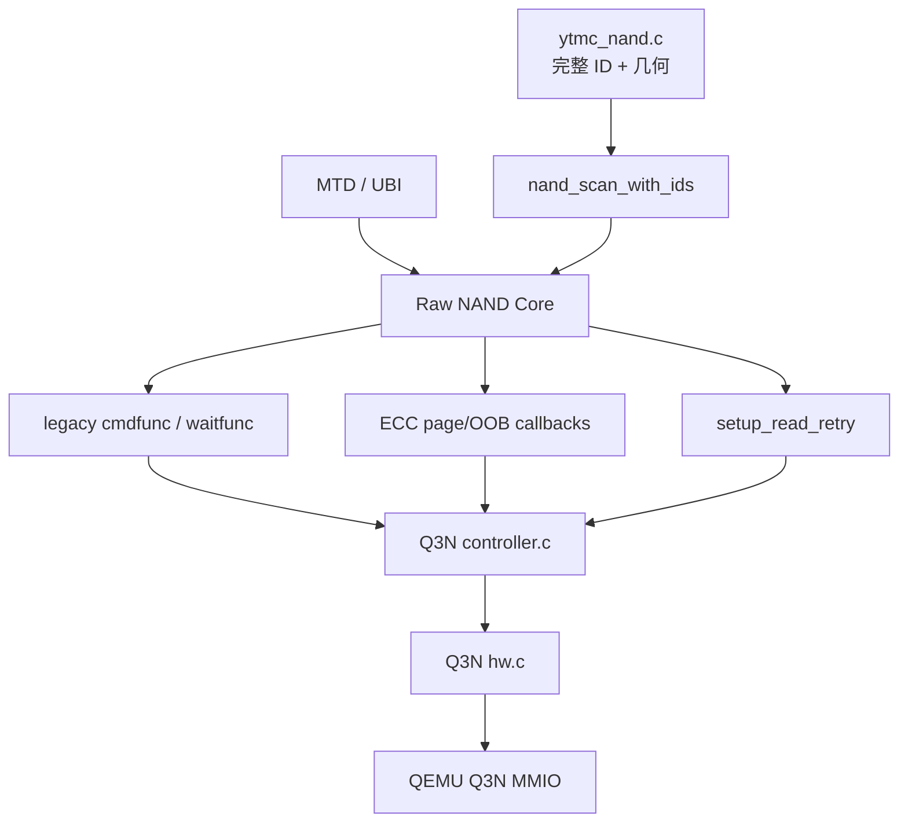
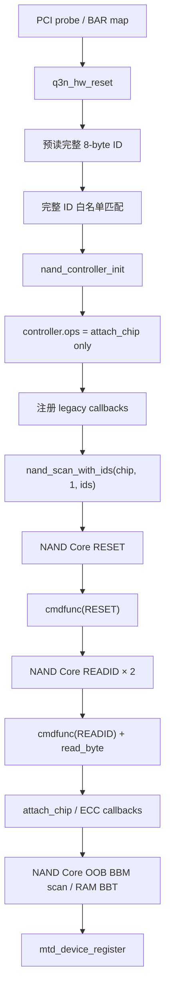
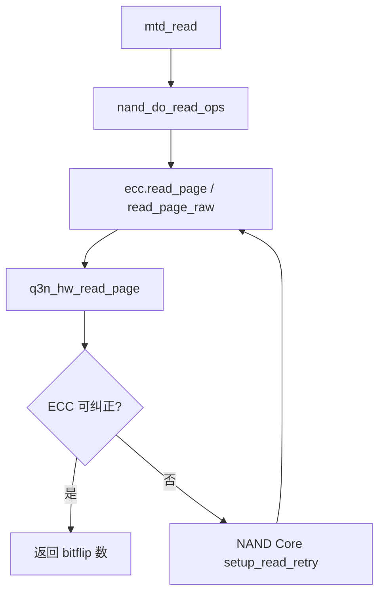
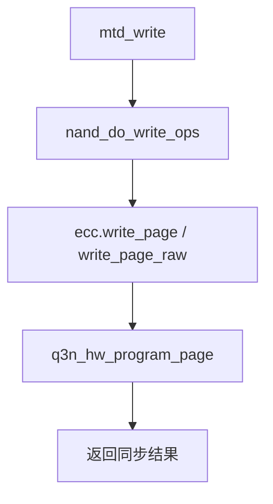
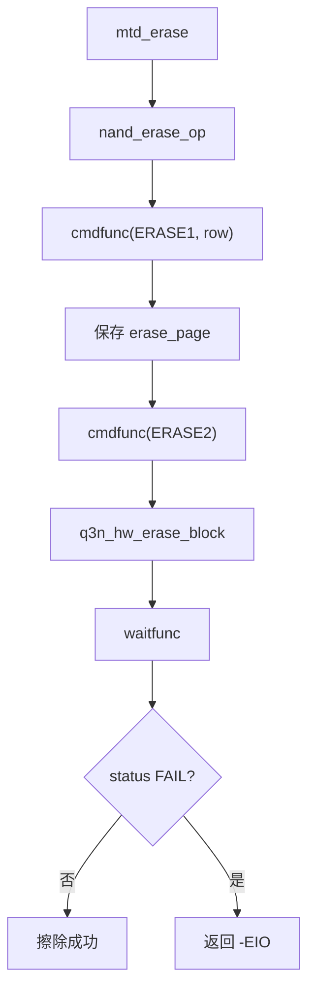

# Q3N 传统 cmdfunc/waitfunc 控制器接口设计

日期：2026-07-29

目标分支：`codex/nand-core-ecc-read-retry`

基线：

- Linux 7.0.12；
- QEMU 11.0.2；
- `2026-07-28-q3n-nand-core-ecc-read-retry-design.md`。

状态：已实现并通过 Linux 7.0.12 + QEMU 11.0.2 验证

## 1. 变更目标

Q3N 继续通过 `nand_scan_with_ids()` 初始化 NAND Core 和 MTD，但不再注册
`nand_controller_ops.exec_op`。控制器命令改用 Linux Raw NAND 的传统接口：

- `chip->legacy.cmdfunc`；
- `chip->legacy.waitfunc`；
- `chip->legacy.read_byte`；
- `chip->legacy.read_buf`；
- `chip->legacy.select_chip`。

page、raw page、OOB 和 read retry 保持现有分层：

- page/OOB 数据仍由 `chip->ecc.read_page`、`write_page`、
  `read_page_raw`、`write_page_raw`、`read_oob` 和 `write_oob` 处理；
- read retry 仍由 NAND Core 迭代，并通过
  `chip->ops.setup_read_retry` 切换模式；
- MTD read/write/erase、坏块回调和 RAM BBT 仍由 NAND Core 提供；
- 非二次幂几何仍由现有三段 Linux patch 支持；
- 本期仍不实现 Page RAID。

## 2. 方案选择

### 2.1 采用方案

在 `qemu_3dnand_controller.c` 中直接实现完整的 Q3N legacy callback
适配层。`nand_controller_ops` 只保留 `attach_chip`，不设置 `exec_op`。

采用原因：

- 完全符合传统 `cmdfunc + waitfunc` 模式；
- 不保留 `nand_operation` parser 或 `check_only` 语义；
- Q3N 是命令级 MMIO 控制器，不需要模拟 CLE/ALE 总线；
- page/OOB ECC 数据路径无需退回 `read_buf/write_buf` 搬运大页数据。

### 2.2 不采用的方案

不使用以下方式：

- 用 `cmdfunc` 包装现有 `nand_operation` parser；
- 注册 `cmd_ctrl` 并依赖 NAND Core 默认 `nand_command_lp()`；
- 同时注册 `exec_op` 和 legacy callbacks；
- 把 page/OOB 数据搬运重新实现到通用 `read_buf/write_buf`。

## 3. 逻辑分层



只有 `qemu_3dnand_hw.c` 可以直接访问 BAR 和寄存器。

## 4. Legacy 状态

`struct q3n` 增加一个专用 legacy transaction 状态：

```c
struct q3n_legacy_state {
	u8 data[8];
	u8 data_len;
	u8 data_pos;
	u32 erase_page;
	int error;
	bool erase_pending;
};
```

字段语义：

- `data/data_len/data_pos`：保存 READID 或 STATUS 的返回数据；
- `erase_page`：保存 ERASE1 传入的 row page；
- `erase_pending`：表示已经收到合法 ERASE1，等待 ERASE2；
- `error`：保存无法通过 `void cmdfunc()` 直接返回的负 errno。

每条新命令开始时只清理与该命令冲突的 staging 状态，不得提前清除尚未由
`waitfunc` 消费的错误。存在 pending error 时，后续命令不再发起新的硬件
事务，避免覆盖根因。RESET 成功后清空 staging、pending erase 和 retry
mode；RESET 失败保留错误，后续 `read_byte` 返回 `0xff`，或由
`waitfunc` 返回该错误。

legacy state 和每次 MMIO 事务都在现有 `q3n->lock` 保护下完成。不得跨
ERASE1/ERASE2 两次 `cmdfunc` 调用长期持锁；NAND Core 已负责上层 NAND
设备串行化，驱动锁只保护单次状态变化和硬件事务。

## 5. 回调契约

### 5.1 `select_chip`

只接受：

- `0`：选择唯一 target；
- `-1`：取消选择。

其他值写入 `legacy.error = -EINVAL`。首期仍只支持 1 target、1 LUN。

### 5.2 `cmdfunc`

命令矩阵：

| NAND 命令 | 行为 |
| --- | --- |
| `NAND_CMD_RESET` | 调用 `q3n_hw_reset()`，清理成功后的 legacy/retry 状态 |
| `NAND_CMD_READID` | 要求 `column == 0`，读取完整 8-byte ID 到 staging |
| `NAND_CMD_STATUS` | 调用 `q3n_hw_read_status()`，把一个 status byte 放入 staging |
| `NAND_CMD_ERASE1` | 校验 row page 对齐和范围，仅保存 row，不执行擦除 |
| `NAND_CMD_ERASE2` | 要求已有 ERASE1，再调用 `q3n_hw_erase_block()` |
| `NAND_CMD_READ0` | 接受为 page-read/status-exit sequencing，不搬运数据 |
| `NAND_CMD_READOOB` | 接受为 OOB sequencing，不搬运数据 |
| `NAND_CMD_SEQIN` | 接受为 page/OOB program sequencing，不缓存大页数据 |
| `NAND_CMD_PAGEPROG` | 接受为 program completion sequencing，不重复编程 |
| `NAND_CMD_RNDOUT/RNDIN` | 当前 page/OOB callback 不使用；若 NAND Core 调用则记录 `-EOPNOTSUPP` |
| 其他命令 | 记录 `-EOPNOTSUPP` |

page/OOB 的实际硬件事务已经在 ECC callbacks 内同步完成，因此
`READ0/READOOB/SEQIN/PAGEPROG` 不得再次触发 MMIO page transaction。

### 5.3 `read_byte`

- staging 中仍有数据时返回下一字节并推进 `data_pos`；
- staging 已耗尽或前序命令失败时返回 `0xff`；
- 不清除 `legacy.error`。

NAND Core 的传统 READID 和 STATUS 路径均通过此回调读取结果。

### 5.4 `read_buf`

循环调用 `read_byte()` 填充目标 buffer。它只服务于小型传统命令数据，不
承担 16 KiB page 或 1024 B OOB 传输。

### 5.5 `write_buf`

注册一个受限 callback，避免 NAND Core 安装依赖空 `IO_ADDR_W` 的默认实现：

- 当前设计不使用它传输 page/OOB；
- 若被意外调用，记录 `-EOPNOTSUPP`；
- 不访问 MMIO 数据窗口。

### 5.6 `waitfunc`

执行顺序：

1. 若 `legacy.error < 0`，返回并清除该错误；
2. 调用 `q3n_hw_read_status()`；
3. 硬件访问失败时返回负 errno；
4. 成功时返回 NAND status byte。

status byte 必须包含：

- `NAND_STATUS_READY`；
- `NAND_STATUS_WP`；
- 控制器错误时的 `NAND_STATUS_FAIL`。

## 6. 初始化

probe 的关键顺序：



`nand_scan_with_ids()` 的第三个参数仍必须来自完整 ID 白名单，不能回退到
前缀匹配、全局 NAND ID 或 ONFI/JEDEC 自动识别。

## 7. 关键流程

### 7.1 读取



page read 不依赖 `cmdfunc` 搬运数据。NAND Core 若发送 READ0 sequencing，
`cmdfunc` 只接受命令，不重复读页。

### 7.2 写入



SEQIN/PAGEPROG 仅作为传统 sequencing 命令接受；ECC callback 是唯一实际
page program 入口。

### 7.3 擦除



ERASE1 不得改变介质；缺少 ERASE1 的 ERASE2 必须失败。

### 7.4 坏块和 BBT

`mtd->_block_isbad`、`mtd->_block_markbad`、OOB BBM 和 RAM BBT 流程不
改变。NAND Core markbad 仍先通过传统 erase 命令擦除块，再调用
`ecc.write_oob` 把 OOB byte 0 编程为 `0x00`。

## 8. 错误处理

- `cmdfunc` 是 `void`，所有同步硬件错误写入 `legacy.error`；
- erase/program completion 错误由 `waitfunc` 返回；
- READID 命令错误使 `read_byte` 返回 `0xff`，最终由 ID 比对使 scan 失败；
- legacy RESET 路径本身没有错误返回值；RESET 错误保留到后续 READID 或
  waitfunc，不得被新命令静默覆盖；
- probe 在 `nand_scan_with_ids()` 前的完整 ID 预读仍直接返回硬件错误；
- unsupported legacy command 不触发硬件操作；
- 每次成功 RESET 和每页 read retry 结束后，retry mode 必须为 0；
- `nand_cleanup()` 路径不保留 pending command 或 staging 状态。

## 9. 文件变化

| 文件 | 变化 |
| --- | --- |
| `qemu_3dnand_controller.c` | 删除 `nand_operation/exec_op` parser；实现 legacy callbacks |
| `qemu_3dnand_controller.h` | 导出 callback 初始化入口和可测试的状态接口 |
| `qemu_3dnand_priv.h` | 增加 `q3n_legacy_state` |
| `qemu_3dnand_init.c` | scan 前注册 legacy callbacks；controller ops 不再包含 exec_op |
| `tests/test_q3n_legacy.c` | 覆盖命令、staging、erase 两阶段和 wait/error 契约 |
| `tests/test_q3n_nand_core_contract.sh` | 编译/符号级确认无 exec_op，仍使用 NAND Core |
| 设计、README、实施计划 | 所有 controller 流程改为 cmdfunc/waitfunc |

QEMU 寄存器模型、ECC callbacks、flash 白名单、非二次幂 Linux patches 不因
本迁移修改。

## 10. 测试与验收

实现验证日期：2026-07-29。

### 10.1 Host RED/GREEN 测试

- READID staging 支持 NAND Core 先读 2 byte、再读完整 8 byte；
- STATUS 返回 READY/WP，并能返回 FAIL；
- read buffer 越界部分为 `0xff`；
- ERASE1 不访问介质，ERASE2 只执行一次；
- 未配对 ERASE2、非 1600-page 对齐 row、越界 row 被拒绝；
- RESET 清理 pending erase、staging 和 retry mode；
- unsupported command 不产生硬件副作用；
- waitfunc 传播并清除负错误；
- select target 只接受 0/-1。

### 10.2 编译契约

- `q3n_controller_ops.exec_op == NULL`；
- Q3N module 中不存在 `q3n_exec_op` 或 NAND operation parser 符号；
- module 仍引用 `nand_scan_with_ids`、`nand_cleanup` 和 MTD registration；
- 生产对象仍为既定 8 个，不恢复 Page RAID。

### 10.3 集成验证

- Linux 7.0.12 KO、bzImage、vmlinux 和 modules 构建通过；
- QEMU 11.0.2 x86_64 既有构建继续使用相同 MMIO ABI；
- guest MTD 输出保持 size `0xa28000000`、erase size `0x01900000`；
- page/OOB read/write、raw read、erase 通过；
- markbad、BBM、RAM BBT 重扫和坏块写擦拒绝通过；
- host read-retry 40/41/49/57/65 bit 边界保持通过；
- guest persistence prepare/verify 两轮通过，BBM 为 `00`，main digest
  跨重启一致；
- 编译模块存在 `q3n_cmdfunc`、`q3n_waitfunc`、`q3n_read_byte`、
  `q3n_read_buf`、`q3n_write_buf`、`q3n_select_chip`，不存在
  `q3n_exec_op`。

## 11. 不变项和限制

- 不直接实现 MTD read/write/erase/bad-block callbacks；
- 不修改 `nand_scan_with_ids()` 的 ID 白名单语义；
- 不修改现有非二次幂 Linux patch 范围；
- 不实现 Page RAID；
- 不新增多 target、多 LUN；
- 不把 legacy 接口扩展为通用异步命令队列；
- 不承诺支持未列入命令矩阵的 ONFI/JEDEC/feature 命令。
