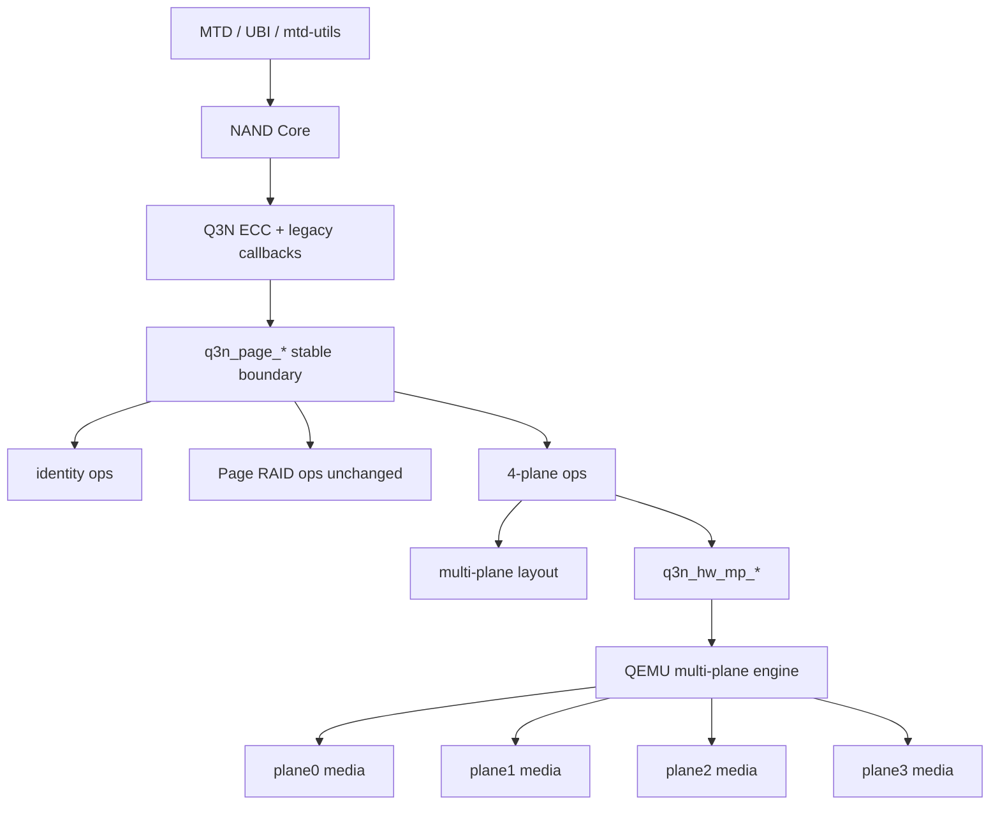
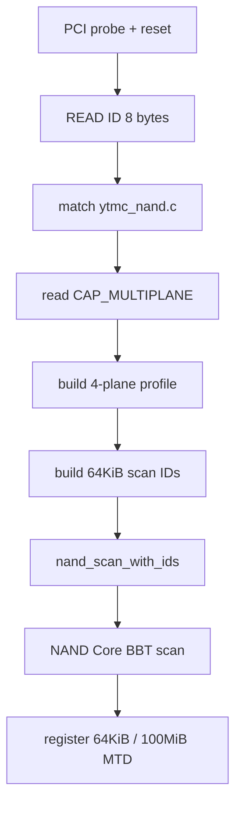
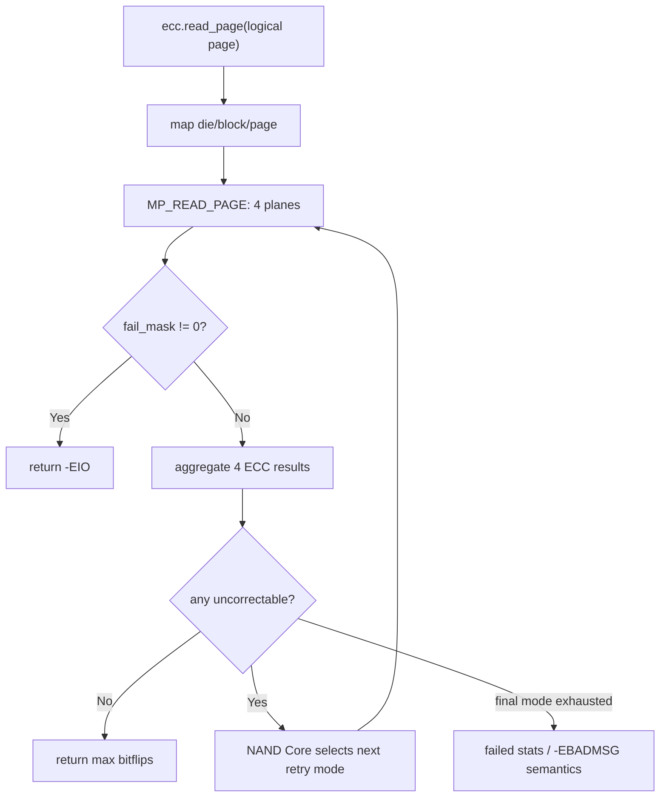
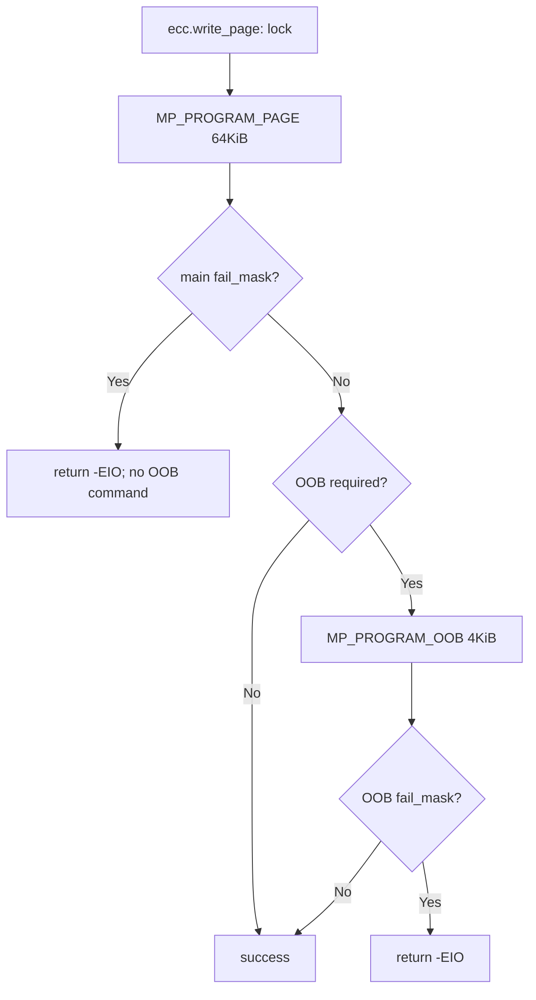
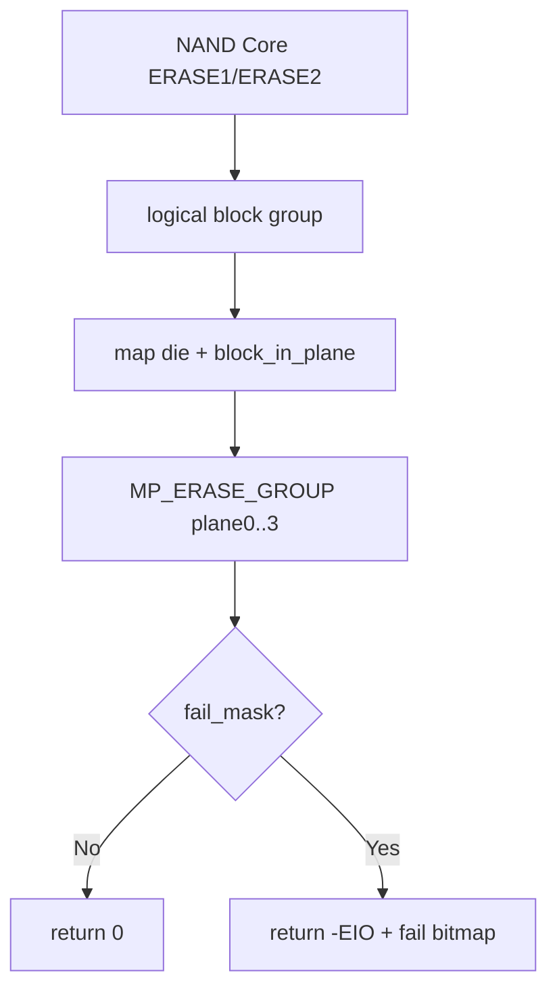

# Q3N 同 Die 四 Plane 访问设计

日期：2026-08-01
状态：设计已确认，尚未实现

## 1. 目的与当前缺口

Q3N 物理模型声明 `2 die × 4 plane × 247 blocks/plane`，但当前 Linux
驱动和 QEMU MMIO ABI 仍按单物理页、单物理块执行：

- Linux `q3n_hw_*()` 每次只提交一个 16 KiB page 或一个 25 MiB block；
- QEMU 把地址解码为线性 `block/page`，没有显式 die/plane group 命令；
- `q3n->lock` 使一个逻辑操作内部的物理命令串行执行；
- NAND Core 看到 `1 target / 1 LUN / 1-plane` 的逻辑抽象；
- Page RAID 的连续物理页布局不保证成员位于同一 die 的不同 plane。

本设计增加一个独立的 4-plane 存储模式。开启后，一个 NAND Core 逻辑页
固定对应同一 die、同一 block/page row 的 plane0..3 四个物理页；一个逻辑
擦除块固定对应同一 die 的四个 physical block。Linux 通过新的 QEMU
multi-plane MMIO 命令一次提交完整 group。

本设计是 QEMU 控制器的功能性 group-access ABI，不模拟 ONFI
`80h/81h/11h/10h` 的逐周期总线时序，也不声明性能加速。

## 2. 已确认的设计决策

1. 首期实现端到端 multi-plane：Linux driver、MMIO ABI、QEMU controller
   和 media 调用链都识别完整 4-plane group。
2. 一次命令只覆盖同一 die 的四个 plane；两个 die 分开操作，不实现 die
   interleave。
3. READ、PROGRAM、OOB-only READ/PROGRAM 和 ERASE 全部提供 multi-plane
   命令。
4. multi-plane 与 Page RAID 互斥；Page RAID 实现文件和旧单页接口保留。
5. multi-plane 开启后，MTD 报告 64 KiB page、4 KiB OOB、100 MiB
   eraseblock、416 blocks，总容量保持 40.625 GiB。
6. multi-plane 模式固定访问 plane0..3，不提供 plane mask，不回退旧单页
   命令。
7. multi-plane PROGRAM 总是提交四个 16 KiB slice，不做逐 plane 全
   `0xff` 跳写。identity 和 Page RAID 继续保留现有全 `0xff` 优化。
8. QEMU 允许 group 内部分 plane 成功，并返回 success/fail bitmap；不做
   rollback，也不提供掉电原子性。
9. 任一 plane block 的 BBM 非 `0xff`，整个 logical block group 为坏块；
   标坏时写四个 plane 的 BBM。
10. BBT、`mtd->_block_isbad` 和 `mtd->_block_markbad` 仍由 NAND Core
    提供，驱动不维护私有 BBT、不在 program/erase 失败时自动标坏。
11. multi-plane 使用新的介质镜像；旧 identity/Page RAID 镜像不迁移、
    不删除，也不要求兼容。

## 3. 目标与非目标

### 3.1 目标

- 继续通过完整 8-byte ID 白名单选择 `ytmc_nand.c` 中的器件信息；
- 在 `nand_scan_with_ids()` 前根据存储模式生成设备私有 scan IDs；
- 不直接实现 MTD `_read/_write/_erase` 等入口；
- 复用现有 ECC page/OOB/raw callbacks、read-retry 和 legacy
  `cmdfunc/waitfunc` 框架；
- 在独立映射层中表达 die、plane、block 和 page；
- 保持旧 QEMU 单页命令 ABI 可用；
- 提供每 plane media 状态和 ECC 状态；
- 对 identity、Page RAID 和 multi-plane 三种构建组合做回归验证。

### 3.2 首期不实现

- Page RAID 与 multi-plane 组合；
- 跨 die interleave；
- 2-plane 降级、plane 子集或单页 fallback；
- 运行时切换存储模式；
- DMA descriptor、异步队列或多请求并发；
- ONFI 命令周期、真实 NAND bus timing 或性能模型；
- 四 plane 的全有/全无原子性、rollback 或掉电恢复；
- 自动标坏、动态坏块替换或 FTL；
- 旧镜像格式探测、迁移或兼容挂载；
- 修改通用 MTD 入口、UBI 或 UBIFS。

## 4. 配置与镜像

### 4.1 Kconfig

把当前 Page RAID bool 改为一个存储模式 `choice`，默认保持 identity：

```text
Q3N storage mode
  CONFIG_MTD_NAND_QEMU_3DNAND_IDENTITY       (default)
  CONFIG_MTD_NAND_QEMU_3DNAND_PAGE_RAID
  CONFIG_MTD_NAND_QEMU_3DNAND_MULTIPLANE
```

要求：

- 保留现有 `CONFIG_MTD_NAND_QEMU_3DNAND_PAGE_RAID` 符号名；
- `CONFIG_MTD_NAND_QEMU_3DNAND_PAGE_RAID_DATA_PAGES` 仅在 RAID 模式
  可见；
- multi-plane 固定四个 plane，不增加 plane 数配置；
- RAID 和 multi-plane 对象在链接阶段互斥；
- identity 继续使用 `qemu_3dnand_page.c` 中的旧单物理页 ops。

### 4.2 镜像

| 模式 | 默认/建议镜像 | 规则 |
| --- | --- | --- |
| identity / 既有 Page RAID | `work/media/q3n-nand.raw` 或用户当前显式路径 | 保留，不删除、不迁移 |
| multi-plane | `work/media/q3n-nand-multiplane.raw` | 新建 sparse image |

`scripts/run-qemu.sh` 增加显式 mode/image 选择，并保留现有
`--nand-image` 覆盖能力。驱动不根据镜像内容自动推断模式；启动所用内核
配置必须和镜像选择一致。

## 5. 器件信息与初始化

### 5.1 `ytmc_nand.c`

器件白名单继续保存在独立厂商文件中。为便于扩展，厂商条目除
`struct nand_flash_dev` 外增加驱动私有 topology：

```c
struct q3n_flash_topology {
	u32 dies;
	u32 planes_per_die;
	u32 blocks_per_plane;
	u32 data_blocks_per_plane;
	u32 pages_per_block;
};

struct q3n_flash_info {
	struct nand_flash_dev nand;
	struct q3n_flash_topology topology;
};
```

首个假设器件保持完整 ID：

```text
9c d7 98 a6 51 33 4e 44
```

物理 topology：

```text
dies                  = 2
planes_per_die        = 4
blocks_per_plane      = 247
data_blocks_per_plane = 208
pages_per_block       = 1600
physical_page         = 16384
physical_oob          = 1024
```

multi-plane probe 还必须读取 `Q3N_REG_CAP` 并要求
`Q3N_CAP_MULTIPLANE`。ID/topology/capability 任一不满足时返回
`-EOPNOTSUPP` 或 `-ENODEV`，不得降级为 identity。

### 5.2 scan ID

multi-plane profile 生成以下 scan ID，并传给
`nand_scan_with_ids(&q3n->chip, 1, q3n->scan_ids)`：

```text
pagesize  = 65536
oobsize   = 4096
erasesize = 104857600
chipsize  = 41600 MiB
```

`nand_scan_with_ids()` 仍负责初始化 `nand_chip` 和 MTD；Q3N 不安装私有
MTD read/write/erase/bad-block callbacks。

初始化日志必须明确输出：

```text
mode=multiplane dies=2 planes/group=4
physical-page=16384 logical-page=65536 logical-oob=4096
pages/block=1600 logical-erasesize=104857600 logical-blocks=416
logical-size=43620761600 image-mode=multiplane
```

## 6. 几何与地址映射

### 6.1 容量

```text
logical_page_size       = 4 × 16 KiB = 64 KiB
logical_oob_size        = 4 × 1 KiB  = 4 KiB
logical_pages_per_block = 1600
logical_erasesize       = 1600 × 64 KiB = 100 MiB
logical_blocks          = 2 × 208 = 416
logical_pages           = 416 × 1600 = 665600
logical_size            = 416 × 100 MiB = 43620761600 bytes
```

### 6.2 映射公式

```text
logical_block   = logical_page / 1600
page_in_block   = logical_page % 1600
die_id          = logical_block % 2
block_in_plane  = logical_block / 2

for plane_id = 0..3:
    lane_id        = die_id * 4 + plane_id
    physical_block = lane_id * 247 + block_in_plane
    physical_page  = physical_block * 1600 + page_in_block
```

映射示例：

| Logical block | Die | Block in plane | Lanes | Physical blocks |
| ---: | ---: | ---: | --- | --- |
| 0 | 0 | 0 | 0,1,2,3 | 0,247,494,741 |
| 1 | 1 | 0 | 4,5,6,7 | 988,1235,1482,1729 |
| 2 | 0 | 1 | 0,1,2,3 | 1,248,495,742 |
| 3 | 1 | 1 | 4,5,6,7 | 989,1236,1483,1730 |
| 414 | 0 | 207 | 0,1,2,3 | 207,454,701,948 |
| 415 | 1 | 207 | 4,5,6,7 | 1195,1442,1689,1936 |

不变量：

- group 的四个成员必须有相同 die、block-in-plane 和 page-in-block；
- plane 必须恰好覆盖 0..3；
- 只使用每个 plane 的 data blocks 0..207；
- 逻辑 page 范围为 0..665599，逻辑 block 范围为 0..415；
- 所有换算使用精确乘除和取模，不用 plane/block 二次幂掩码。

## 7. 分层架构



### 7.1 Linux 文件职责

| 文件 | 职责 |
| --- | --- |
| `Kconfig.qemu_3dnand` | 三模式互斥 choice |
| `Makefile.qemu_3dnand` | 按模式链接 RAID 或 multi-plane 对象 |
| `ytmc_nand.c/.h` | 完整 ID、物理 NAND 几何和 topology |
| `qemu_3dnand_flash.c/.h` | 根据模式构造 scan IDs |
| `qemu_3dnand_init.c` | capability 检查、profile 初始化、日志 |
| `qemu_3dnand_page.c` | 稳定入口和模式路由 |
| `qemu_3dnand_page_raid.c/.h` | 保持现有实现 |
| `qemu_3dnand_multiplane.c/.h` | logical page/OOB/block group 操作和结果汇总 |
| `qemu_3dnand_multiplane_layout.c/.h` | 纯 geometry/mapping helper |
| `qemu_3dnand_hw_multiplane.c/.h` | MP MMIO、PIO 和 per-plane result |
| `qemu_3dnand_ecc.c` | 继续通过 page layer 调用、汇总 NAND Core 统计，并为 MP 安装四段 OOB free layout |
| `qemu_3dnand_controller.c` | legacy erase 继续通过 page layer |

### 7.2 QEMU 文件职责

| 文件 | 职责 |
| --- | --- |
| `q3n-nand.c` | MMIO register dispatch、command entry、能力位 |
| `q3n-multiplane.c/.h` | group validation、四 plane 执行、mask/ECC 数组 |
| `q3n-media.c/.h` | 保持单 physical page/block 持久化 API，由 MP engine 调用 |

QEMU MP engine 可以在进程内依次调用四次 media API，但对 Linux 表现为一次
group command、一次 READY 和一次 IRQ。由于当前没有 timing model，不能用该
实现声明真实时延收益。

## 8. 关键数据结构

```c
enum q3n_storage_mode {
	Q3N_MODE_IDENTITY,
	Q3N_MODE_PAGE_RAID,
	Q3N_MODE_MULTIPLANE,
};

struct q3n_multiplane_profile {
	u32 dies;
	u32 planes_per_group;
	u32 blocks_per_plane;
	u32 data_blocks_per_plane;
	u32 pages_per_block;
	struct q3n_geometry physical;
	struct q3n_geometry logical;
	u64 logical_size;
};

struct q3n_mp_addr {
	u32 die;
	u32 block_in_plane;
	u32 page_in_block;
};

struct q3n_mp_plane_result {
	int status;
	struct q3n_ecc_result ecc;
};

struct q3n_mp_result {
	u8 done_mask;
	u8 fail_mask;
	struct q3n_mp_plane_result plane[4];
};
```

`struct q3n_page_result` 增加 `failed_plane_mask`。multi-plane read 把
`failed_data_pages` 设为该 mask 的 popcount，使现有 ECC 汇总规则可以继续
工作；identity 和 Page RAID 的现有字段语义不变。

## 9. MMIO ABI

### 9.1 能力与命令

新增能力：

```c
#define Q3N_CAP_MULTIPLANE BIT(4)
```

保留命令 0..8，新增：

| Code | Command | Transfer |
| ---: | --- | --- |
| 9 | `Q3N_CMD_MP_READ_PAGE` | 输出 65536 B main |
| 10 | `Q3N_CMD_MP_PROGRAM_PAGE` | 输入 65536 B main |
| 11 | `Q3N_CMD_MP_READ_OOB` | 输出 4096 B OOB |
| 12 | `Q3N_CMD_MP_PROGRAM_OOB` | 输入 4096 B OOB |
| 13 | `Q3N_CMD_MP_ERASE_GROUP` | 无数据 |

### 9.2 寄存器

使用当前空闲的 `0x00c4..0x00e8`：

| Offset | Register | Access | Meaning |
| ---: | --- | :---: | --- |
| `0x00c4` | `Q3N_REG_MP_DIE` | RW | 0..1 |
| `0x00c8` | `Q3N_REG_MP_BLOCK` | RW | 0..207 |
| `0x00cc` | `Q3N_REG_MP_PAGE` | RW | 0..1599 |
| `0x00d0` | `Q3N_REG_MP_DONE_MASK` | RO | 成功 plane bitmap |
| `0x00d4` | `Q3N_REG_MP_FAIL_MASK` | RO | 失败 plane bitmap |
| `0x00d8` | `Q3N_REG_MP_ECC_SELECT` | RW | 选择 plane 0..3 |
| `0x00dc` | `Q3N_REG_MP_ECC_STATUS` | RO | selected plane ECC status |
| `0x00e0` | `Q3N_REG_MP_ECC_MAX_BITFLIPS` | RO | selected plane max bitflips |
| `0x00e4` | `Q3N_REG_MP_ECC_CORRECTED_BITS` | RO | selected plane corrected total |
| `0x00e8` | `Q3N_REG_MP_ECC_FAILED_STEP` | RO | selected plane first failed step |

`Q3N_REG_LEN` 和 `Q3N_REG_OOB_LEN` 继续复用：

```text
MP main command: LEN = 65536
MP OOB command:  OOB_LEN = 4096
```

现有 `Q3N_REG_DATA` 流式窗口按 plane0、plane1、plane2、plane3 顺序传输。
QEMU staging buffer 扩展到至少 65536 B；main 和 OOB 是两条独立命令，
不要求同时暂存 69632 B。

### 9.3 命令规则

1. driver 写 `MP_DIE/MP_BLOCK/MP_PAGE`；
2. 设置 main/OOB length 并按需传输 PIO buffer；
3. 写 `CMD=Q3N_CMD_MP_*`；
4. QEMU 在访问 media 前一次性验证 group 地址和长度；
5. 合法命令依次执行 plane0..3，并锁存每 plane 结果；
6. 所有 plane 结束后只产生一次 READY/completion IRQ；
7. Linux 读取 done/fail mask 和按 selector 读取 ECC 数组。

结果不变量：

```text
valid completed command:
    done_mask | fail_mask == 0x0f
    done_mask & fail_mask == 0

pre-validation failure:
    done_mask == 0
    fail_mask == 0
    no media mutation
```

ECC uncorrectable 不进入 `fail_mask`；它通过 per-plane ECC status 报告。
READ media I/O 失败的 slice 预填 `0xff` 并设置对应 fail bit。

每条 MP command 开始时清零旧 done/fail mask。`MP_READ_PAGE` 另外清零并
重新生成四组 ECC result；OOB-only、PROGRAM 和 ERASE 不修改已经锁存的
ECC result。RESET 清除全部 MP state。

部分 program/erase 失败时 QEMU 同时设置全局 `Q3N_STATUS_ERROR` 和
`MP_FAIL_MASK`。新的 `q3n_hw_mp_*` wait helper 必须先等 READY，再读取
done/fail mask，最后才把 group 失败转换为 `-EIO`；不能直接复用会在看到
全局 ERROR 后立即丢失详细状态的旧 wait 返回路径。ECC uncorrectable 只设置
`Q3N_STATUS_ECC_UNCORRECTABLE` 和 per-plane ECC status，不设置普通 ERROR。

## 10. 关键流程

### 10.1 初始化



### 10.2 READ 与 read-retry



每个 retry mode 都重读完整 4-plane logical page。retry gain 同时应用于
四个 plane；不做单 plane retry，也不进入 RAID recovery。raw read 不执行
ECC 统计和 read retry。

聚合规则：

```text
max_bitflips      = max(plane[0..3].max_bitflips)
corrected_bits    = sum(plane[0..3].corrected_bits)
failed_plane_mask = bit for every uncorrectable plane
```

### 10.3 PROGRAM



- main program 固定提交四个 slice，包括全 `0xff` slice；
- raw write 复用同一路径；
- 部分成功不 rollback；
- main 失败后不再尝试 OOB；
- driver 不因失败自动调用 markbad。

### 10.4 OOB、BBM 和 BBT

普通 OOB 的布局：

```text
logical_oob[0..1023]       = plane0 OOB
logical_oob[1024..2047]    = plane1 OOB
logical_oob[2048..3071]    = plane2 OOB
logical_oob[3072..4095]    = plane3 OOB
```

四个 physical block 各自使用所属 plane slice 的 byte 0 作为 BBM。因此
multi-plane 模式的 OOB layout 必须保留以下四个位置：

```text
reserved BBM offsets = 0, 1024, 2048, 3072
```

multi-plane 使用独立的 `mtd_ooblayout_ops`，把其余字节报告为四个 free
section：

| Section | Offset | Length |
| ---: | ---: | ---: |
| 0 | 1 | 1023 |
| 1 | 1025 | 1023 |
| 2 | 2049 | 1023 |
| 3 | 3073 | 1023 |

所以 `mtd->oobsize = 4096`，`mtd->oobavail = 4092`。identity 和 Page RAID
继续使用原有 OOB layout，不因 multi-plane 改变。

读取 block 首页 OOB 后：

```text
logical_oob[0] = plane0_bbm & plane1_bbm & plane2_bbm & plane3_bbm
```

因此任一 BBM 非 `0xff`，NAND Core 都把整个 logical block group 识别为
bad。其他 plane slice 中的原始 BBM byte 保持可见。

写 block 首页 OOB 前，multi-plane page layer 对 offsets
`0/1024/2048/3072` 做按位 AND，并把结果复制回四个位置，再执行一次
`MP_PROGRAM_OOB`。这既覆盖 NAND Core 只写 logical byte 0 的 markbad，
也保证 raw OOB 写入任一 physical BBM 时整个 group 的四个 BBM 一致。该
归一化使用每设备 4096-byte scratch，不在 kernel stack 保存完整 OOB。
非 block 首页不执行 BBM 归一化。OOB-only 命令不得修改 main/LDPC。

RAM BBT 每个 logical block group 使用一个 entry。416 个 block、每 block
两 bit 时，BBT 数据为 104 bytes。驱动不维护另一份坏块表。

`MEMSETBADBLOCK` 的 generic NAND Core 路径由
`nand_block_markbad_lowlevel()` 实现；它会在写 BBM/更新 BBT 前调用
`nand_erase_nand()`。因此 multi-plane 验收不把 markbad 后的 main 保持作为
契约：应验证四个 BBM、重载后的 BBT 与物理 group 的擦除态。这个规则不改变
普通 OOB-only program 不修改 main 的约束。

### 10.5 ERASE



一次逻辑擦除清除同一 die 的四个 physical block。NAND Core 仍在调用前
负责 BBT/坏块检查；QEMU media 对坏 physical block 的拒绝可以造成部分
成功，driver 只上报失败，不自动标坏。

## 11. 同步和原子性

- `q3n->lock` 覆盖一次完整 logical operation；PROGRAM main 与随后的 OOB
  不允许被其他请求插入；
- QEMU group command 同步执行，在四个 plane 都到达终态后置 READY；
- 一次 group command 只有一个 completion IRQ；
- per-plane status 必须在下一条 MP command 前保持可读；
- RESET 清除 MP 地址、mask、ECC selector/array 和 staging 状态；
- 允许部分 program/erase 成功；不保证四个 plane 全有或全无；
- 本期不考虑掉电，也不实现介质事务日志。

## 12. Linux 非二次幂补丁

multi-plane 的 page size 64 KiB 是二次幂，但 pages/block 仍是 1600，
eraseblock 为 100 MiB，仍不能使用 `page_shift/phys_erase_shift` 或掩码代替
精确除法。

继续复用并扩展现有 Linux patch 验证，不直接修改或提交 Linux 工作副本：

- `nand_base.c` 的 page/block、erase、OOB、cached-page 和 row 换算继续走
  opt-in 精确算术；
- `nand_bbt.c` 按 416 logical block group 计算 104-byte BBT；
- 现有二次幂 NAND 快速路径保持不变；
- patch application 继续要求严格、幂等和可重复生成。

本设计不增加新的 MTD core、UBI 或 UBIFS patch。

## 13. 验证矩阵

### 13.1 Host 纯逻辑测试

- topology/profile 构建和非法 capability；
- logical page/block 0、1、2、414、415 和全部边界；
- page 1599→1600、最后 page 665599 和越界 665600；
- die 交错和四个物理 block/page 的字面值验证；
- overflow、zero geometry、非 2-die/4-plane profile 拒绝。

### 13.2 Linux fake-MMIO/行为测试

- 五条 MP command 的寄存器和 PIO 顺序；
- 64 KiB main、4 KiB OOB 的 plane slice 顺序；
- 固定四 plane、不调用旧单页接口、不接受 plane 子集；
- 全 `0xff` 逻辑页仍提交 MP PROGRAM；
- timeout、预校验错误和每个 fail-mask 组合；
- 四组 ECC selector、聚合、四档 full-group retry；
- OOB-only 不修改 main/LDPC；
- MP OOB layout 精确保留 offsets 0/1024/2048/3072，`oobavail=4092`；
- 任一 BBM 坏、首页 BBM 四份归一化、markbad 和 104-byte BBT contract；
- ERASE 全成功及任一 plane 部分失败。

### 13.3 构建测试

必须完成以下独立 Linux build：

1. identity；
2. Page RAID 2:1；
3. Page RAID 4:1；
4. Page RAID 8:1；
5. multi-plane。

验证：

- identity 不链接 RAID/MP 对象；
- RAID 只链接 RAID 对象；
- MP 只链接 MP layout/ops/hw 对象；
- 所有模式继续引用 NAND Core scan、bad-block 和 BBT 路径；
- multi-plane 不引用旧 `q3n_hw_read/program/erase_page` 运行路径。

QEMU build 必须同时通过旧 command ABI 回归和新 MP command/capability
测试。

### 13.4 Guest

multi-plane guest 必须报告：

```text
writesize = 65536
oobsize   = 4096
oobavail  = 4092
erasesize = 104857600
size      = 43620761600
blocks    = 416
```

覆盖：

- first/last logical page；
- block 0→1→2 的 die 交错边界；
- 跨 logical eraseblock I/O；
- main/OOB/raw read/write；
- erase 首末 block；
- `MEMGETBADBLOCK`、`MEMSETBADBLOCK`、module unload/reload BBT rescan；
- 新 multi-plane 镜像双启动 main/OOB digest 持久化；
- 原 identity/Page RAID 镜像仍存在且原冒烟测试通过。

per-plane program/erase failure 和 deterministic ECC retry 至少由 host/QEMU
模型测试覆盖；若后续增加 guest fault-injection 入口，再补 guest 用例，首期
不虚假声明已完成 guest 故障注入。

NAND-Core 迁移前的 `q3n-serial-smoke` 依赖已移除的 scheduler/debugfs
counter，不是当前 Page RAID 回归。当前实现以 `q3n-page-raid-smoke` 作为
RAID4 guest 验收：它使用专用 fresh image，验证当前逻辑几何与 raw
main/OOB round-trip，且不触碰 legacy image。

## 14. 风险与约束

- QEMU media API 顺序执行四次只能证明功能性 group 语义，不能证明并行
  性能；
- 64 KiB PIO 传输成本高，但首期以接口正确性为目标；
- program main 成功、OOB 失败时介质处于部分提交状态，需要 erase 后重用；
- 任一 plane bad 导致 100 MiB logical block group 全部不可用；
- kernel config 与镜像选择不匹配可能破坏镜像，所以 multi-plane 必须默认
  使用新文件；
- 当前物理介质只模拟功能，不等同于具体量产 NAND 的 ONFI optional command
  能力。若面向真实器件，仍需按 datasheet/参数页确认 plane pairing、opcode
  和 enhanced status。

## 15. 完成条件

本设计的实现只有同时满足以下条件才算完成：

- 三模式互斥配置和对象组成正确；
- multi-plane 初始化通过完整 ID、topology 和 capability 校验；
- 精确几何、映射和 `nand_scan_with_ids()` 逻辑视图正确；
- READ/PROGRAM/OOB/ERASE 始终使用新的固定 4-plane 命令；
- per-plane media/ECC 状态和 partial failure 可观测；
- full-group read-retry、group BBM 和 NAND Core BBT 正确；
- 新镜像持久化通过，旧镜像未删除；
- identity 和 Page RAID 现有测试无回归；
- 不宣称未验证的掉电原子性、guest fault injection 或性能收益。
