# Page-RAID1/RAID5：ECC 回调与固定页映射设计

修订日期：2026-09-12。

状态：**已按本设计实现并完成多-plane RAID1/RAID5 验收**。迁移前代码
基线 `22b9519` 使用 direct MTD 与 manifest；当前实现已接入 NAND core /
`ecc.*`，使用固定冗余页映射并取消 RAID manifest。

## 1. 首先明确：多-plane + RAID 需要提供哪些 MTD 接口

**对上提供一个逻辑 NAND MTD 设备，对下由驱动把一个逻辑页/块映射到
同一 die 内多个 plane。MTD 入口由 NAND core 提供，驱动实现下表中的
nand_chip / controller 回调，不直接接管 mtd_info 的 I/O 函数指针。**

本节先列接口范围和责任，后文再讨论初始化、BBT、ECC 返回值、固定映射、
写入与恢复。此处主线为宏 1 的 RAID1/RAID5；宏 0 仅作为串行兼容分支。

### 1.1 MTD 对外接口与驱动实现清单

| MTD 层必须提供的能力 | NAND core 对接方式 | 驱动需要实现 / 适配 | 多-plane + RAID 语义 |
| --- | --- | --- | --- |
| 普通读取：mtd_read | 核心普通读可经 _read_oob 路径完成，不要求驱动另填 _read | ecc.read_page | RAID1 返回一份 16 KiB 数据；RAID5 拼接三个片段为 48 KiB；恢复受资格限制 |
| 普通写入：mtd_write | 核心普通写可经 _write_oob 路径完成，不要求驱动另填 _write | ecc.write_page | 一个完整逻辑页生成两份镜像或 3D+1P，以一次 multi-plane PROGRAM 写入，检查全部成员结果 |
| OOB 读取：mtd_read_oob / _read_oob | nand_read_oob | ecc.read_oob，明确 raw OOB 回调 | 对外仅组 BBM；任一成员坏则合成坏标记，同时供 nand_scan 建 BBT 使用 |
| OOB 写入：mtd_write_oob / _write_oob | nand_write_oob | ecc.write_oob，明确 raw OOB 回调 | 将允许的 BBM 更新广播到成员，保护 main/LDPC/其他 OOB，需同步核心 BBT |
| 擦除：mtd_erase / _erase | nand_erase → nand_erase_op | legacy.cmdfunc + legacy.waitfunc | ERASE1 保存逻辑地址，ERASE2 发起 multi-plane 擦除；汇总成员结果，由核心报告逻辑 fail_addr |
| 坏块查询：mtd_block_isbad / _block_isbad | nand_block_isbad：有 BBT 查表，无 BBT 查 BBM | 仅 multi-plane 模式注册 legacy.block_bad；初始化另需 ecc.read_oob | 任一成员坏则整逻辑块坏，不自行维护 BBT；宏 0 沿用核心默认处理 |
| 标坏：mtd_block_markbad / _block_markbad | nand_block_markbad 管理流程与 BBT 更新 | 仅 multi-plane 模式注册 legacy.block_markbad，广播物理 BBM | 保留 main 的要求依赖免前置擦除 core 扩展；宏 0 沿用核心默认处理 |
| 同步：mtd_sync / _sync | nand_sync | 对接新增的 NAND chip sync hook，不覆盖 _sync | 完成在途工作；兼容模式还须排空后台 parity，具体锁契约见第 11 节 |
| RAW 请求：MTD_OPS_RAW | 仍经核心 OOB I/O 分派，不是独立 _raw 接口 | ecc.read_page_raw/write_page_raw 与 read_oob_raw/write_oob_raw | 多-plane raw main 明确返回 EOPNOTSUPP，raw OOB 仅 BBM，不伪装支持 |

表中 `mtd_*` 是调用方使用的接口，`_xxx` 是 mtd_info 内部入口，
`ecc.*` / `legacy.*` 才是本设计的数据与命令底层接口；不注册 exec_op。
`block_bad` 与 `block_markbad` 位于 `chip->legacy`，不位于 `chip->ecc`。
仅有两个 block 回调不能覆盖初始化 BBT 扫描，原因与时序见第 3.3 节。

### 1.2 初始化和接口挂接的前置条件

- 必须执行 nand_scan 完整路径；自定义逻辑 ID 表使用等价的
  nand_scan_with_ids。核心建立 BBT 后才注册 MTD，不设置 NAND_SKIP_BBTSCAN。
- 驱动准备 nand_chip/controller、逻辑 ID 与精确几何，并在 attach_chip
  阶段完成 ECC/OOB 等所需配置；扫描前准备好 legacy 命令、数据和 target
  选择回调，支持识别、状态和复位。controller 对象与 attach_chip 仍保留。
- RAID1 的 writesize 为 16 KiB、RAID5 为 48 KiB；均为 1600 页/逻辑块。
  精确几何 core/BBT 补丁是前置依赖，不能只注册回调而忽略地址计算。
- 公共 oobsize 为 1 B BBM、oobavail 为 0；禁用 subpage 读写，拒绝不满足
  整页要求的写入。逻辑地址、retlen 与 ECC 错误必须保持 MTD 语义。
- BBT、MTD 注册及核心资源清理由 NAND core 契约管理；驱动负责 MMIO、
  成员映射、RAID、缓冲与 worker 生命周期。
- `Q3N_ENABLE_MULTIPLANE_RAID=1` 时才注册 `legacy.block_bad` 和
  `legacy.block_markbad`；宏为 0 时两个指针保持未赋值，由 NAND core 的
  默认 BBM/BBT 路径处理，驱动不接管坏块查询和标坏。
- _block_isreserved 等核心附带能力继续由核心管理；lock/unlock、panic write、
  OTP 等不作为本轮新增 RAID 能力，不能将核心默认入口存在等同于已验收支持。

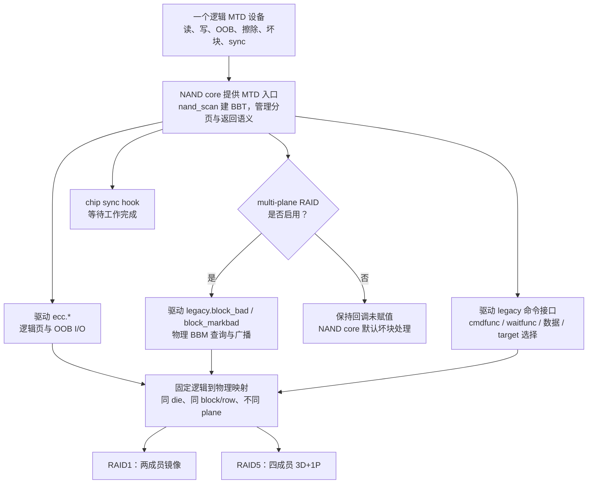
```mermaid
flowchart TB
    M["一个逻辑 MTD 设备<br/>读、写、OOB、擦除、坏块、sync"]
    M --> C["NAND core 提供 MTD 入口<br/>nand_scan 建 BBT，管理分页与返回语义"]
    C --> E["驱动 ecc.*<br/>逻辑页与 OOB I/O"]
    C --> G{"multi-plane RAID<br/>是否启用？"}
    G -->|"是"| B["驱动 legacy.block_bad / block_markbad<br/>物理 BBM 查询与广播"]
    G -->|"否"| D["保持回调未赋值<br/>NAND core 默认坏块处理"]
    C --> O["驱动 legacy 命令接口<br/>cmdfunc / waitfunc / 数据 / target 选择"]
    C --> S["chip sync hook<br/>等待工作完成"]
    E --> R["固定逻辑到物理映射<br/>同 die、同 block/row、不同 plane"]
    B --> R
    O --> R
    R --> P1["RAID1：两成员镜像"]
    R --> P5["RAID5：四成员 3D+1P"]
```

### 1.3 接口范围确定后的设计选择

parity 和 data 的位置由代码中的固定公式确定，不在 OOB 或其他介质区保存
页号、映射表或 manifest。取消 RAID 软件 CRC、持久化 generation、
提交清单、OOB commit 阶段和清单扫描。

保留：

- `Q3N_ENABLE_MULTIPLANE_RAID=0|1`，默认 1。
- 宏 0 的串行 `D0..D6,P` 地址、容量与后台 parity 调度。
- 宏 1 的同 die 多-plane RAID1/RAID5，`raid_level=1|5` 默认 5。
- NAND core 提供 MTD 入口，驱动实现 ECC 页/OOB 回调。
- 控制器 LDPC、OOB byte 0 的 BBM、标准 RAM BBT。
- 原始物理 main/OOB/LDPC 持久化，不增加 FTL 或事务日志。

**固定地址解决“parity 在哪里”，不证明“全部成员已经写完”。**
因此本方案不保证多页/多-plane 掉电原子性，不承诺自动识别或回滚所有未完成
写入。上层负责事务完整性与掉电后的数据有效性判定。

为避免把未完成写入拿来重建，采用保守策略：驱动只对本次运行中已确认全部
成员写成功的条带自动恢复。该恢复资格仅在 RAM 中保存，重启后为 UNKNOWN；
不是新的介质元数据。重启后健康数据可正常读取，但 UNKNOWN 条带遇到数据
不可纠时不自动 XOR 或镜像回退。第 8 节解释这一限制。

## 2. 基线、几何与模式

- 当前分支：`codex/multiplane-page-raid1-raid5`，实现基线 `22b9519`。
- Linux 7.0.12，QEMU 11.0.2；2 die × 4 plane。
- 每 plane 247 blocks，每 block 1600 pages，物理 main page 为 16384 B。
- 每物理页 1664 B OOB：128 B logical OOB 和 1536 B 控制器 LDPC。
- 参考分支 `codex/nand-core-ecc-read-retry` 的 `4d2726b` 仅提供
  NAND scan、ECC callbacks、精确几何补丁的参考；不整体合并其 profile。

令 `B = data_blocks_per_plane`，保持当前 pool 值：

| 模式 | 逻辑 writesize | 逻辑 pages/block | erasesize | 逻辑 blocks |
| --- | --- | --- | --- | --- |
| 宏 0：串行 | 16384 | 1400 | 22937600 | B × 7 |
| 宏 1：RAID1 | 16384 | 1600 | 26214400 | B × 4 |
| 宏 1：RAID5 | 49152 | 1600 | 78643200 | B × 2 |

`size = erasesize × logical_blocks`。使用精确除法、取模和带溢出检查的
64 位运算。RAID5 只接受 48 KiB 对齐的整页写，不跨请求缓存小写。

三种布局均在加载前选择，运行期间不可切换；不同布局不得混用同一镜像。
去掉清单后无法从介质自识别 profile，启动参数必须与写入时一致。
旧介质不自动转换；默认用独立 fresh NAND 验收。串行兼容指地址、容量、
接口和调度兼容，不再承诺解释旧清单或继承其保护状态。

## 3. 接口分层与初始化

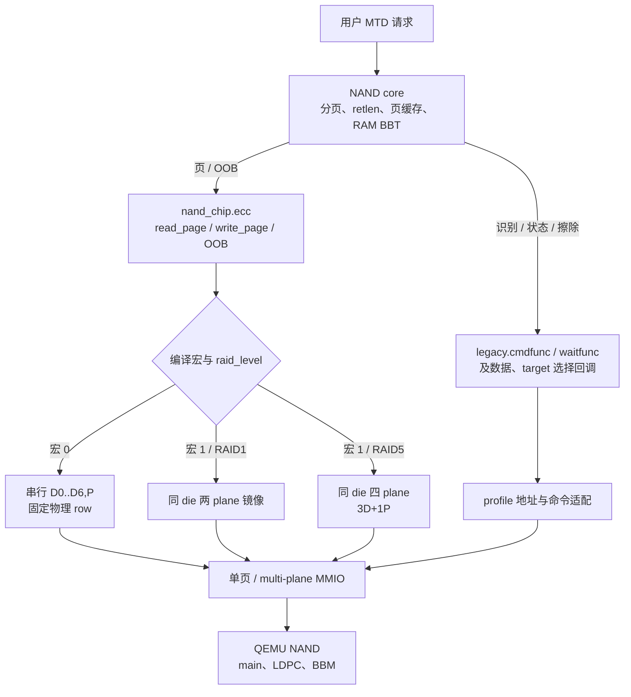
```mermaid
flowchart TD
    U["用户 MTD 请求"] --> C["NAND core<br/>分页、retlen、页缓存、RAM BBT"]
    C -->|"页 / OOB"| E["nand_chip.ecc<br/>read_page / write_page / OOB"]
    C -->|"识别 / 状态 / 擦除"| O["legacy.cmdfunc / waitfunc<br/>及数据、target 选择回调"]
    E --> M{"编译宏与 raid_level"}
    M -->|"宏 0"| S["串行 D0..D6,P<br/>固定物理 row"]
    M -->|"宏 1 / RAID1"| R1["同 die 两 plane 镜像"]
    M -->|"宏 1 / RAID5"| R5["同 die 四 plane<br/>3D+1P"]
    S --> T["单页 / multi-plane MMIO"]
    R1 --> T
    R5 --> T
    O --> A["profile 地址与命令适配"]
    A --> T
    T --> H["QEMU NAND<br/>main、LDPC、BBM"]
```

驱动持有 `nand_chip`、`nand_controller`，通过 `nand_to_mtd(chip)`
取得唯一 MTD，不再赋值任何 MTD I/O 回调。
legacy 命令适配层模拟与逻辑几何一致的 READID/STATUS/RESET；
控制器 ID 寄存器不能直接冒充 NAND READID 字节流。
一个逻辑 target 覆盖全部逻辑容量，物理 die 分布由 mapper 处理。

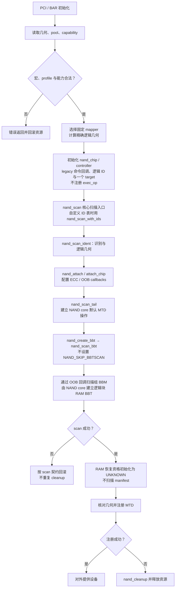
```mermaid
flowchart TD
    P["PCI / BAR 初始化"] --> G["读取几何、pool、capability"]
    G --> V{"宏、profile 与能力合法？"}
    V -->|"否"| F["错误返回并回滚资源"]
    V -->|"是"| I["选择固定 mapper<br/>计算精确逻辑几何"]
    I --> N["初始化 nand_chip / controller<br/>legacy 命令回调、逻辑 ID 与一个 target<br/>不注册 exec_op"]
    N --> Scan["nand_scan 核心扫描入口<br/>自定义 ID 表时用 nand_scan_with_ids"]
    Scan --> Ident["nand_scan_ident：识别与逻辑几何"]
    Ident --> Attach["nand_attach / attach_chip<br/>配置 ECC / OOB callbacks"]
    Attach --> Tail["nand_scan_tail<br/>建立 NAND core 默认 MTD 操作"]
    Tail --> Create["nand_create_bbt → nand_scan_bbt<br/>不设置 NAND_SKIP_BBTSCAN"]
    Create --> BBT["通过 OOB 回调扫描组 BBM<br/>由 NAND core 建立逻辑块 RAM BBT"]
    BBT --> OK{"scan 成功？"}
    OK -->|"否"| Fail["按 scan 契约回滚<br/>不重复 cleanup"]
    OK -->|"是"| RAM["RAM 恢复资格初始化为 UNKNOWN<br/>不扫描 manifest"]
    RAM --> Reg["核对几何并注册 MTD"]
    Reg --> Done{"注册成功？"}
    Done -->|"是"| Ready["对外提供设备"]
    Done -->|"否"| Clean["nand_cleanup 并释放资源"]
```

宏 1 缺少 multi-plane capability 必须拒绝；宏 0 的普通读写不要求该能力。
注销阻止新请求、排空 worker，再注销 MTD、cleanup 和释放资源。

### 3.1 必须使用 nand_scan 与核心 BBT

初始化必须经过 `nand_scan` 的完整识别、attach、tail 和坏块扫描流程，
成功后才调用 `mtd_device_register` 或对应分区注册接口。
不能仅填充 mtd_info 后直接注册，也不能跳过 scan 后自行构造一套 BBT。

Linux 7.0.12 中 `nand_scan(chip, 1)` 是
`nand_scan_with_ids(chip, 1, NULL)` 的包装；本虚拟逻辑设备需要自定义
ID 表时可使用 `nand_scan_with_ids(chip, 1, logical_ids)`，两者走相同的
`nand_base.c` 初始化路径，不是另写一套扫描器。
`1` 表示一个逻辑 target，不是仅扫描一个物理 die。

- 不设置 `NAND_SKIP_BBTSCAN`；让 `nand_scan_tail` 调用 `nand_create_bbt`，
  再由 `nand_bbt.c` 的 `nand_scan_bbt` 扫描并建立标准 RAM BBT。
- 不设置 `NAND_BBT_USE_FLASH`，不引入 flash BBT 镜像或额外保留块。
  坏块信息通过物理 BBM 持久化，每次初始化重新扫描生成 RAM BBT。
- 在核心开始 BBT 扫描前完成逻辑几何、BBM byte 0、标记页规则及
  OOB 回调配置。BBT 的索引、条目数和边界必须基于逻辑块几何，
  非二次幂计算依赖第 10 节的 core/BBT 补丁，不能等扫描后才修正。
- 核心扫描所用的 OOB-only 读取路径必须可用；组 BBM 读取直接访问物理
  标记，不依赖 main ECC、parity 或 RAM 恢复资格，也不使用 RAID 回退
  隐藏某个物理成员的坏标记。
- BBT 分配或扫描发生错误时 probe 失败，不注册 MTD；物理 BBM 传输错误
  原样传播，不能伪装成全 FF 好块。扫描失败按核心回滚契约清理；
  扫描成功但注册失败则调用 `nand_cleanup`。

### 3.2 多-plane 坏块信息如何进入核心 BBT

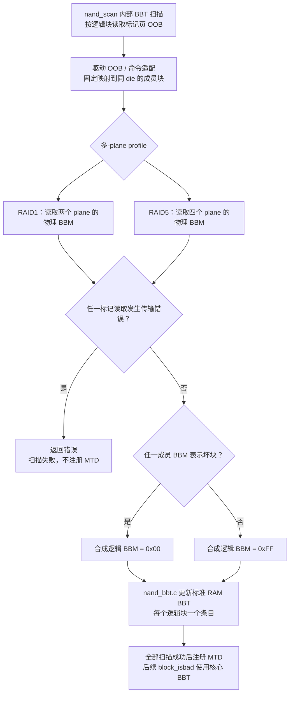
```mermaid
flowchart TB
    Scan["nand_scan 内部 BBT 扫描<br/>按逻辑块读取标记页 OOB"]
    Scan --> Read["驱动 OOB / 命令适配<br/>固定映射到同 die 的成员块"]
    Read --> Mode{"多-plane profile"}
    Mode --> R1["RAID1：读取两个 plane 的物理 BBM"]
    Mode --> R5["RAID5：读取四个 plane 的物理 BBM"]
    R1 --> Error{"任一标记读取发生传输错误？"}
    R5 --> Error
    Error -->|"是"| Fail["返回错误<br/>扫描失败，不注册 MTD"]
    Error -->|"否"| Bad{"任一成员 BBM 表示坏块？"}
    Bad -->|"是"| B["合成逻辑 BBM = 0x00"]
    Bad -->|"否"| G["合成逻辑 BBM = 0xFF"]
    B --> Core["nand_bbt.c 更新标准 RAM BBT<br/>每个逻辑块一个条目"]
    G --> Core
    Core --> Ready["全部扫描成功后注册 MTD<br/>后续 block_isbad 使用核心 BBT"]
```

例如 RAID5 的逻辑块 leb 0 对应 Die 0 内 Plane 0–3 的 Block 0；
其中任一成员坏，核心 BBT 的 leb 0 条目即为坏。
RAID1 的 leb 0 对应 Plane 0/1 的 Block 0，leb 1 对应 Plane 2/3 的
Block 0；两组各占一个逻辑 BBT 条目。
不因 RAID 可以恢复单页就把已标坏成员所属的逻辑块报告为好块。

驱动负责成员 BBM 的读取、合成和标坏广播；`nand_base.c` / `nand_bbt.c`
负责 BBT 生命周期、MTD 坏块查询和标准 markbad 路径。
驱动不覆盖 MTD `_block_isbad` / `_block_markbad`，不维护与核心竞争的
私有坏块表。第 8 节 RAM 恢复资格是条带写入状态，不是 BBT，二者不可混用。

### 3.3 驱动 block_bad / block_markbad 与核心 BBT 的分工

多-plane 模式采用驱动实现 `chip->legacy.block_bad` 和
`chip->legacy.block_markbad`、NAND core 管理 BBT 的方案。
这两个是 nand_chip 的底层回调，不是 MTD `_block_isbad/_block_markbad`，
也不是 `ecc.*` 字段；普通页与 OOB I/O 仍按第 4 节接入 ECC 回调。
这两个回调的实现和注册都受 `Q3N_ENABLE_MULTIPLANE_RAID` 编译条件保护；
宏为 0 时不注册，避免串行模式错误复用多-plane 成员映射和广播语义。

**只实现两个 block 回调不够：初始化 BBT 扫描仍必须提供 OOB 读取路径。**
本地 Linux 7.0.12 的 `nand_bbt.c:scan_block_fast` 通过
`mtd_read_oob` 读取标记页，不调用 `legacy.block_bad`。

| 接口 / 核心组件 | 责任与调用时机 |
| --- | --- |
| 驱动 `legacy.block_bad(chip, ofs)` | 将逻辑字节偏移映射到成员块，检查约定标记页；任一成员坏返回正值，全好返回 0，读取错误返回负 errno。用于核心无 BBT 的 BBM 查询路径，不作为初始化扫描入口 |
| 驱动 `legacy.block_markbad(chip, ofs)` | 对逻辑块全部成员的约定标记页广播 BBM 写入；全部成功返回 0，失败返回负 errno；不自行更新或分配核心 BBT |
| 驱动 `ecc.read_oob(chip, page)` | 按逻辑页映射读取成员 OOB，合成 BBM 到 chip 的 OOB 缓冲；供核心初始化 BBT 扫描和普通 OOB 读取使用 |
| 驱动 `ecc.write_oob` | 保留用户 OOB/BBM 写入入口；与 block_markbad 共用底层成员 BBM 写入逻辑，但不是自定义 block_markbad 必须调用的上层接口 |
| `nand_scan` / `nand_create_bbt` | 组织扫描并创建核心 RAM BBT，成功后才允许注册 MTD |
| 核心坏块查询 | 已有 chip->bbt 时直接查表，不要求每次再调用驱动 block_bad |
| 核心标坏路径 | 调用驱动 block_markbad 写物理标记，随后按核心契约更新 BBT 并返回结果 |

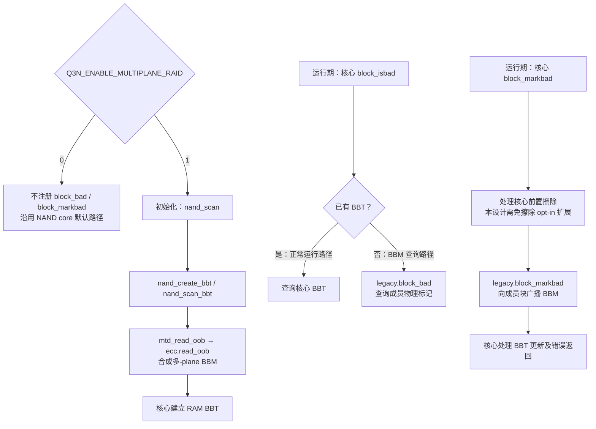
```mermaid
flowchart TB
    Mode{"Q3N_ENABLE_MULTIPLANE_RAID"}
    Mode -->|"0"| Default["不注册 block_bad / block_markbad<br/>沿用 NAND core 默认路径"]
    Mode -->|"1"| Init
    Init["初始化：nand_scan"] --> Scan["nand_create_bbt / nand_scan_bbt"]
    Scan --> OOB["mtd_read_oob → ecc.read_oob<br/>合成多-plane BBM"]
    OOB --> Create["核心建立 RAM BBT"]
    Query["运行期：核心 block_isbad"] --> Has{"已有 BBT？"}
    Has -->|"是：正常运行路径"| Table["查询核心 BBT"]
    Has -->|"否：BBM 查询路径"| Bad["legacy.block_bad<br/>查询成员物理标记"]
    Mark["运行期：核心 block_markbad"] --> Pre["处理核心前置擦除<br/>本设计需免擦除 opt-in 扩展"]
    Pre --> Write["legacy.block_markbad<br/>向成员块广播 BBM"]
    Write --> Update["核心处理 BBT 更新及错误返回"]
```

两个 block 回调和 ECC OOB 回调应复用同一套成员映射、标记页规则和
底层 BBM helper，避免初始化扫描结果与运行期查询不一致。
`ofs` 是逻辑字节偏移，不能当作物理页号或用物理 erase_shift 直接取块；
按精确逻辑 erasesize 取得逻辑块，再映射到同 die 的两个或四个成员块。
底层回调不递归调用同一设备的 `mtd_block_isbad/markbad`，也不重复获取
核心已持有的设备锁。

标坏部分成员失败不能报告全部成功；应尽可能完成其余成员标记并保留首个
写入错误。核心可能仍将 RAM BBT 标坏，返回值不代表物理 BBM 写入全部成功；
重启后仍以实际物理 BBM 重扫结果为准。不能以回调成功伪装标记已持久化。

**自定义 block_markbad 不会阻止核心前置擦除。**
`nand_block_markbad_lowlevel` 在调用它之前已尝试擦除；为满足保留 main、
LDPC 和其余 OOB 的约束，仍需第 11 节的默认关闭、仅本驱动启用的免擦除扩展。
不设置 `NAND_BBT_NO_OOB_BBM` 来绕过擦除，因为它也会跳过物理 BBM 标坏调用。
用户直接 OOB 写 BBM 后同步核心 BBT 的契约也仍需保留，不能仅靠这两个回调解决。

### 3.4 命令接口选择：cmdfunc + waitfunc，不注册 exec_op

本方案采用 NAND core 的 legacy 命令路径，保留 `nand_controller` 用于
核心协调与 attach_chip，但 `controller.ops->exec_op` 不赋值。
Linux 7.0.12 的 `nand_erase_op` 在存在 exec_op 时优先走 exec 路径，
不会因 exec_op 返回“不支持擦除”而自动回退到 cmdfunc。
因此不能同时注册 exec_op，又假设只有擦除会调用 legacy 回调。

**legacy 是内核命令接口形式，不是串行 RAID 布局。**
RAID1/RAID5 的成员仍位于同 die、相同 block/row、不同 plane；
ERASE2 触发一次 multi-plane 擦除，不改成逐成员单块擦除。
普通页数据仍由 ecc.read_page/write_page 直接编排 multi-plane MMIO。

| 驱动 legacy 回调 | 本设计职责 |
| --- | --- |
| cmdfunc | 处理 READID、STATUS、RESET 和核心实际需要的命令；ERASE1 保存逻辑块地址，ERASE2 校验待执行状态并发起组擦除 |
| waitfunc | 有界等待操作完成，检查全部选中成员；完成后返回 NAND 状态字节，成员擦除失败置 NAND_STATUS_FAIL，超时/传输异常返回负 errno |
| select_chip | 实现逻辑 target 0 的选择与 -1 的取消选择；不能把逻辑 target 号直接当物理 die 号 |
| read_byte / read_buf | 提供 READID/STATUS 等命令的数据流；覆盖扫描和默认 helper 实际调用的数据读取路径 |
| write_buf 及其他必要 hooks | 按选用的默认 helper、feature 命令等实际调用补齐；不使用的功能须明确禁用或拒绝，不能返回伪造成功 |

自定义 cmdfunc/select_chip 不依赖默认 cmd_ctrl 实现；若保留任何依赖
cmd_ctrl 的默认函数，则必须提供相应 hook。不能只写 ERASE1/ERASE2
而让 nand_scan 的识别、复位、状态及数据访问落入不可用默认函数。
扫描前的命令回调必须就绪，不能全部延迟到识别之后的 attach_chip 才安装。

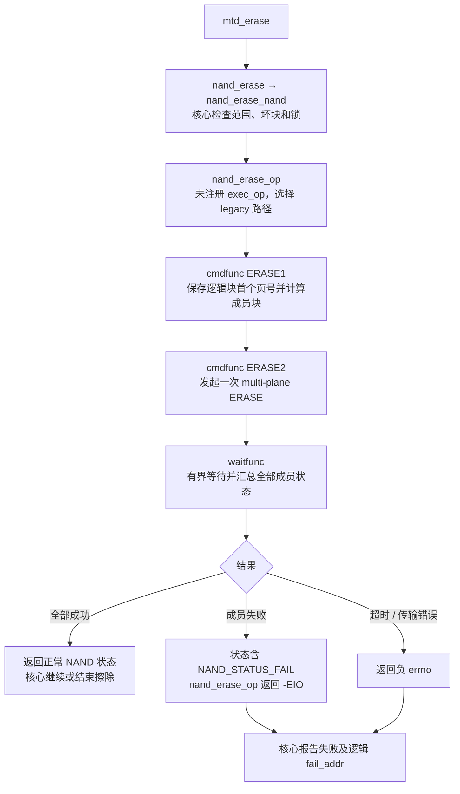
```mermaid
flowchart TB
    M["mtd_erase"] --> N["nand_erase → nand_erase_nand<br/>核心检查范围、坏块和锁"]
    N --> E["nand_erase_op<br/>未注册 exec_op，选择 legacy 路径"]
    E --> C1["cmdfunc ERASE1<br/>保存逻辑块首个页号并计算成员块"]
    C1 --> C2["cmdfunc ERASE2<br/>发起一次 multi-plane ERASE"]
    C2 --> W["waitfunc<br/>有界等待并汇总全部成员状态"]
    W --> R{"结果"}
    R -->|"全部成功"| OK["返回正常 NAND 状态<br/>核心继续或结束擦除"]
    R -->|"成员失败"| Bad["状态含 NAND_STATUS_FAIL<br/>nand_erase_op 返回 -EIO"]
    R -->|"超时 / 传输错误"| Err["返回负 errno"]
    Bad --> Out["核心报告失败及逻辑 fail_addr"]
    Err --> Out
```

cmdfunc 返回 void，不能直接向核心返回 errno：地址错误、无有效 ERASE1
就收到 ERASE2、发起失败等必须保存到本次操作的错误状态，由 waitfunc
返回，且不得发起错误地址的擦除。新操作/RESET 应按状态机清理旧状态，
超时后必须确认硬件停止或复位完成再复用命令槽，不能把旧完成状态当成新成功。
READID/STATUS 缓冲与待擦除地址分开保存，状态命令不能覆盖待完成操作结果。

ERASE1 的 page 为逻辑 target 内页号；用精确 pages_per_block 得到逻辑块，
再按 profile 映射成员。第 10 节精确几何补丁必须同时覆盖
nand_erase_nand 和 nand_erase_op 的移位计算，改用 legacy 不消除该依赖。
第 11 节免前置擦除、worker 排空和页缓存失效要求同样保留。

## 4. ECC 回调契约

| 接口 | 职责 |
| --- | --- |
| `ecc.read_page` | 读取完整逻辑页；使用 LDPC 与第 8 节资格规则决定是否恢复 |
| `ecc.write_page` | 固定映射并编程；多-plane 全成员成功后返回 0，无 OOB commit |
| `ecc.read_oob/write_oob` | 公开 OOB 与组 BBM；不写映射、CRC 或提交记录 |
| `ecc.read_page_raw/write_page_raw` | 显式实现或拒绝，不能以普通 ECC 回调假冒 RAW |
| `ecc.read_oob_raw/write_oob_raw` | 与公开 OOB 使用相同访问边界 |
| `legacy.cmdfunc / waitfunc` | 命令与完成状态；ERASE1/ERASE2 适配 multi-plane 擦除，不注册 exec_op |
| `legacy.select_chip / read_byte / read_buf` 等 | 扫描和默认 helper 所需 target 选择及数据流；具体范围见第 3.4 节 |

`page` 为逻辑 target 内页号。RAID5 一次 read_page 必须填满 49152 B
的 D0/D1/D2；非整页用户读取由 NAND core 截取，任何必要 data 最终不可恢复
均使完整逻辑页失败。关闭 subpage read，设置 `NAND_NO_SUBPAGE_WRITE`。

正常读取返回最大 bitflips，累计真实 LDPC corrected_bits。
恢复成功返回值至少为 bitflip_threshold，由 MTD 转为 -EUCLEAN；
不要从 read_page 直接返回 -EUCLEAN。
不可恢复每逻辑页增加一次 ecc_stats.failed，再返回非负值，让 NAND core
生成 -EBADMSG。传输异常返回 -EIO/-ETIMEDOUT 等负错误。
write_page 失败的当前逻辑页不计入成功 retlen。

不引入新的 read-retry 档位或软件 CRC。移除 CRC 后，LDPC 无法检出的静默
错误、错误地址和合法但陈旧的数据缺少端到端校验，不能承诺识别所有数据损坏。

## 5. 固定页映射

**本设计的 RAID1/RAID5 使用多-plane：一个逻辑页的冗余成员分布在
同一 die 的不同 plane、相同 block_in_plane 和 page_row。**
不是将数据和 parity 依次放在同一 plane 的多个连续 page row。
第 5.1 节仅记录宏 0 的旧串行兼容分支；第 5.2–5.5 节描述宏 1 的
multi-plane 布局，其中第 5.5 节直接展示逻辑页与物理页的对应关系。

统一物理地址公式：

```text
lane           = die * 4 + plane
physical_block = lane * blocks_per_plane + block_in_plane
physical_page  = physical_block * 1600 + page_row
```

### 5.1 仅宏 0：旧串行 D0..D6,P 兼容布局

保留现有逻辑块到物理块的映射。块内：

```text
leb            = logical_page / 1400
page_in_leb    = logical_page % 1400
stripe_in_leb  = page_in_leb / 7
data_slot      = page_in_leb % 7
data_row       = stripe_in_leb * 8 + data_slot
parity_row     = stripe_in_leb * 8 + 7
```

每组连续 8 个物理页是 7D+1P。写完 D6 后排队生成 parity，parity 位置
无需保存到 OOB。仅当 D0..D6 都已知写入成功且 parity program 成功，
RAM 状态才能成为 PROTECTED。不能因“D6 写过”就假设前六页已完成。

### 5.2 RAID1

```text
leb            = logical_page / 1600
page_row       = logical_page % 1600
mirror_set     = leb % 4
die            = mirror_set / 2
primary_plane  = (mirror_set % 2) * 2
mirror_plane   = primary_plane + 1
block_in_plane = leb / 4
```

每个逻辑页对应同一 die、相同 block_in_plane/page_row 的两份副本。
按逻辑页奇偶轮换首选副本。正常写要求两成员都成功。

示例：Die 0 中各 plane 的 Block 0、page row 0。
逻辑页 A（页号 0、leb 0）与 B（页号 1600、leb 1）各为 16 KiB，
属于不同逻辑块，并非连续逻辑页。

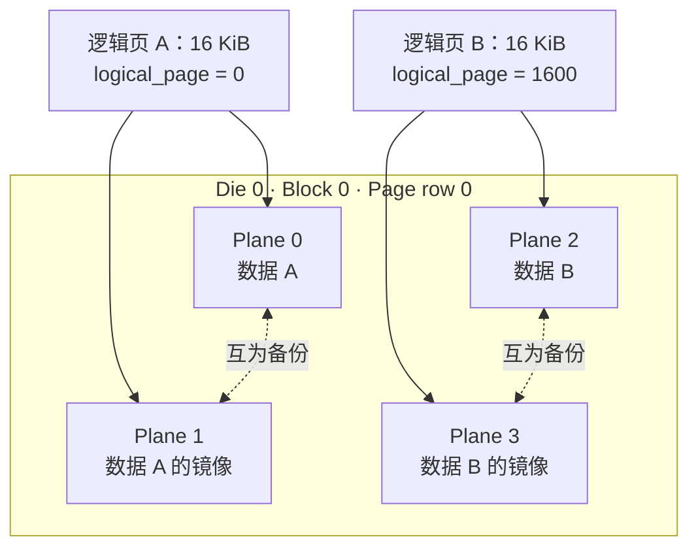
```mermaid
flowchart TB
    A["逻辑页 A：16 KiB<br/>logical_page = 0"]
    B["逻辑页 B：16 KiB<br/>logical_page = 1600"]
    subgraph DIE["Die 0 · Block 0 · Page row 0"]
        P0["Plane 0<br/>数据 A"]
        P1["Plane 1<br/>数据 A 的镜像"]
        P2["Plane 2<br/>数据 B"]
        P3["Plane 3<br/>数据 B 的镜像"]
    end
    A --> P0
    A --> P1
    B --> P2
    B --> P3
    P0 <-.->|"互为备份"| P1
    P2 <-.->|"互为备份"| P3
```

固定镜像对为 Plane 0/1 和 Plane 2/3；每份数据占两份物理空间，
冗余布局容量利用率为 50%（不含保留块等开销）。

### 5.3 RAID5

```text
leb            = logical_page / 1600
page_row       = logical_page % 1600
die            = leb % 2
block_in_plane = leb / 2
stripe_id      = leb * 1600 + page_row
parity_plane   = stripe_id % 4
data_planes   = 除 parity_plane 外的 plane，按编号升序映射 D0、D1、D2
P              = D0 XOR D1 XOR D2
```

轮转公式固定在代码中，不能用运行期自增计数器代替。
对 leb 0（die 0、block_in_plane 0）：

| page_row | plane 0 | plane 1 | plane 2 | plane 3 |
| --- | --- | --- | --- | --- |
| 0 | P | D0 | D1 | D2 |
| 1 | D0 | P | D1 | D2 |
| 2 | D0 | D1 | P | D2 |
| 3 | D0 | D1 | D2 | P |

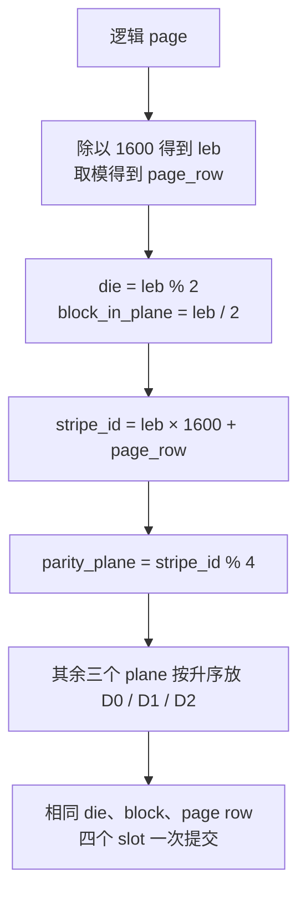
```mermaid
flowchart TD
    L["逻辑 page"] --> B["除以 1600 得到 leb<br/>取模得到 page_row"]
    B --> Die["die = leb % 2<br/>block_in_plane = leb / 2"]
    Die --> Stripe["stripe_id = leb × 1600 + page_row"]
    Stripe --> P["parity_plane = stripe_id % 4"]
    P --> D["其余三个 plane 按升序放 D0 / D1 / D2"]
    D --> Group["相同 die、block、page row<br/>四个 slot 一次提交"]
```

### 5.4 RAID5 数据拆分与轮转示例

以逻辑页 0 为例：一个 48 KiB 逻辑页拆成三个 16 KiB 数据片段，
逐字节 XOR 生成一个 16 KiB parity，写到同一 die、block、page row。

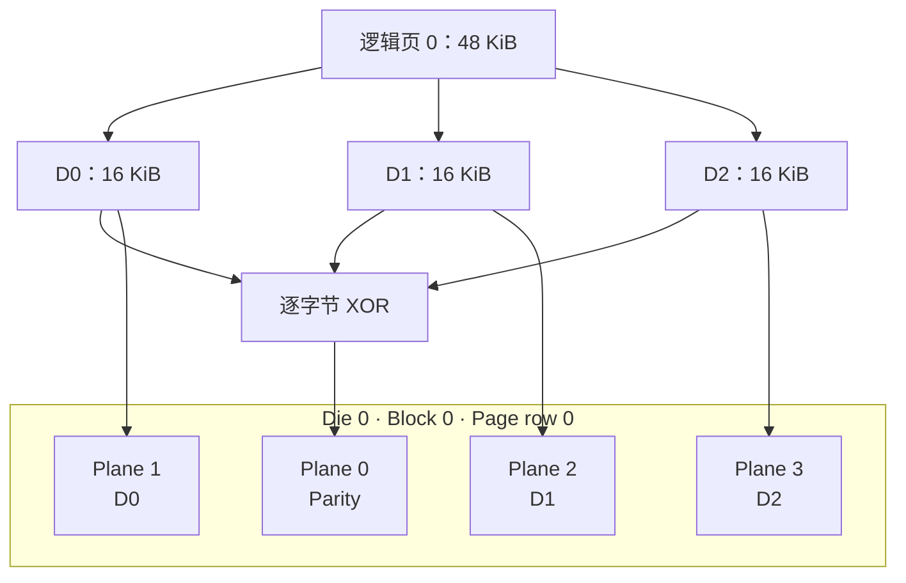
```mermaid
flowchart TB
    L["逻辑页 0：48 KiB"]
    L --> D0["D0：16 KiB"]
    L --> D1["D1：16 KiB"]
    L --> D2["D2：16 KiB"]
    D0 --> X["逐字节 XOR"]
    D1 --> X
    D2 --> X
    subgraph DIE["Die 0 · Block 0 · Page row 0"]
        P0["Plane 0<br/>Parity"]
        P1["Plane 1<br/>D0"]
        P2["Plane 2<br/>D1"]
        P3["Plane 3<br/>D2"]
    end
    X --> P0
    D0 --> P1
    D1 --> P2
    D2 --> P3
```

下面展示 Die 0、Block 0 的前四个 row。A、B、C、D 分别表示
逻辑页 0、1、2、3；A0/A1/A2 是 A 的三个数据片段，其余同理。
每个 row 是独立的 3D+1P 条带，图中上下顺序仅表示物理 row 顺序。

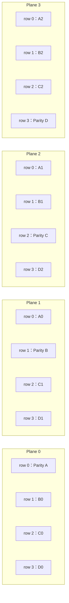
```mermaid
flowchart LR
    subgraph P0["Plane 0"]
        direction TB
        A0["row 0：Parity A"]
        B0["row 1：B0"]
        C0["row 2：C0"]
        D0["row 3：D0"]
        A0 ~~~ B0 ~~~ C0 ~~~ D0
    end
    subgraph P1["Plane 1"]
        direction TB
        A1["row 0：A0"]
        B1["row 1：Parity B"]
        C1["row 2：C1"]
        D1["row 3：D1"]
        A1 ~~~ B1 ~~~ C1 ~~~ D1
    end
    subgraph P2["Plane 2"]
        direction TB
        A2["row 0：A1"]
        B2["row 1：B1"]
        C2["row 2：Parity C"]
        D2["row 3：D2"]
        A2 ~~~ B2 ~~~ C2 ~~~ D2
    end
    subgraph P3["Plane 3"]
        direction TB
        A3["row 0：A2"]
        B3["row 1：B2"]
        C3["row 2：C2"]
        D3["row 3：Parity D"]
        A3 ~~~ B3 ~~~ C3 ~~~ D3
    end
```

例如 A1 不可纠时，可按 `A1 = Parity A XOR A0 XOR A2` 重建，前提是
该组具有第 8 节定义的 RAM 恢复资格，且全部必要来源可正常读取。
冗余布局容量利用率为 75%（不含保留块等开销）。

RAID1 与 RAID5 均由代码计算成员位置，不需要 manifest；但固定位置不证明
写入完整，恢复仍受第 8 节限制。同 die 内的冗余不保护整个 die 失效。

### 5.5 逻辑页到多-plane 物理页的对应关系

这里的逻辑页是 NAND core 传给 `ecc.read_page/write_page` 的完整页。
物理页用四元组 `(die, plane, block_in_plane, page_row)` 标识；
不同 plane 中相同的 row 是不同物理页，不能仅用 row 当作全局物理页号。
图中容量均指 main 数据，不包含物理 OOB/LDPC。

#### RAID1：一个 16 KiB 逻辑页对应两个 16 KiB 物理页

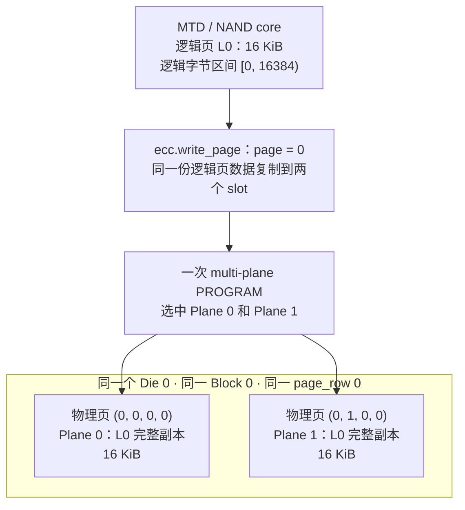
```mermaid
flowchart TB
    L["MTD / NAND core<br/>逻辑页 L0：16 KiB<br/>逻辑字节区间 [0, 16384)"]
    L --> ECC["ecc.write_page：page = 0<br/>同一份逻辑页数据复制到两个 slot"]
    ECC --> MP["一次 multi-plane PROGRAM<br/>选中 Plane 0 和 Plane 1"]
    subgraph DIE["同一个 Die 0 · 同一 Block 0 · 同一 page_row 0"]
        P0["物理页 (0, 0, 0, 0)<br/>Plane 0：L0 完整副本<br/>16 KiB"]
        P1["物理页 (0, 1, 0, 0)<br/>Plane 1：L0 完整副本<br/>16 KiB"]
    end
    MP --> P0
    MP --> P1
```

| 逻辑页号 | 所属逻辑块 / row | 物理页一 | 物理页二 | main 物理占用 |
| --- | --- | --- | --- | --- |
| L0 | leb 0 / row 0 | (0, 0, 0, 0) | (0, 1, 0, 0) | 32 KiB |
| L1 | leb 0 / row 1 | (0, 0, 0, 1) | (0, 1, 0, 1) | 32 KiB |
| L1599 | leb 0 / row 1599 | (0, 0, 0, 1599) | (0, 1, 0, 1599) | 32 KiB |
| L1600 | leb 1 / row 0 | (0, 2, 0, 0) | (0, 3, 0, 0) | 32 KiB |

L0 的两个副本位于两个 plane 的 row 0，不是同一 plane 的 row 0/1。
L1 使用同一镜像对的下一行；到下一个逻辑块才按公式切换镜像对。
读取正常情况下选择一份副本，满足恢复资格时可回退到另一份，
不要求为了普通读取始终同时读两份副本。

#### RAID5：一个 48 KiB 逻辑页对应四个 16 KiB 物理页

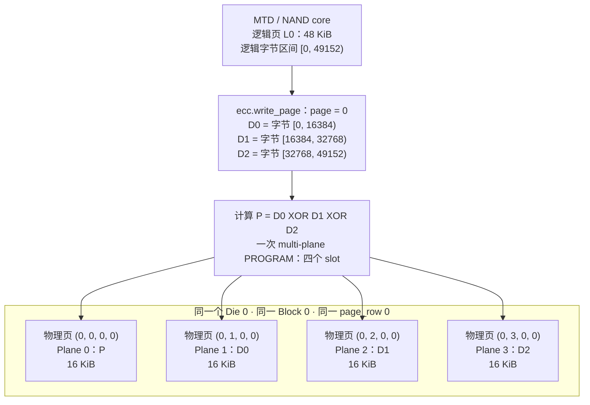
```mermaid
flowchart TB
    L["MTD / NAND core<br/>逻辑页 L0：48 KiB<br/>逻辑字节区间 [0, 49152)"]
    L --> ECC["ecc.write_page：page = 0<br/>D0 = 字节 [0, 16384)<br/>D1 = 字节 [16384, 32768)<br/>D2 = 字节 [32768, 49152)"]
    ECC --> MP["计算 P = D0 XOR D1 XOR D2<br/>一次 multi-plane PROGRAM：四个 slot"]
    subgraph DIE["同一个 Die 0 · 同一 Block 0 · 同一 page_row 0"]
        P0["物理页 (0, 0, 0, 0)<br/>Plane 0：P<br/>16 KiB"]
        P1["物理页 (0, 1, 0, 0)<br/>Plane 1：D0<br/>16 KiB"]
        P2["物理页 (0, 2, 0, 0)<br/>Plane 2：D1<br/>16 KiB"]
        P3["物理页 (0, 3, 0, 0)<br/>Plane 3：D2<br/>16 KiB"]
    end
    MP --> P0
    MP --> P1
    MP --> P2
    MP --> P3
```

**D0、D1、D2 是同一个逻辑页内部的三个片段，不是三个逻辑页。**
parity 不占用用户逻辑页号；它占用该 row 上剩余 plane 的物理页。

| 逻辑页号 | die / block / row | Plane 0 的物理页内容 | Plane 1 的物理页内容 | Plane 2 的物理页内容 | Plane 3 的物理页内容 |
| --- | --- | --- | --- | --- | --- |
| L0 | 0 / 0 / 0 | P(L0) | L0.D0 | L0.D1 | L0.D2 |
| L1 | 0 / 0 / 1 | L1.D0 | P(L1) | L1.D1 | L1.D2 |
| L2 | 0 / 0 / 2 | L2.D0 | L2.D1 | P(L2) | L2.D2 |
| L3 | 0 / 0 / 3 | L3.D0 | L3.D1 | L3.D2 | P(L3) |
| L1600 | 1 / 0 / 0 | P(L1600) | L1600.D0 | L1600.D1 | L1600.D2 |

表格的一行就是一个逻辑页对应的四个物理页，每页 main 物理占用 64 KiB。
L1600 整组映射到 Die 1，不是把 L0 的备份放到 Die 1。
读取时按固定映射取出三个数据片段并拼成同一个 48 KiB 逻辑页；
只有需要且允许重建时才使用 parity。

上述箭头表示一次 multi-plane 命令包含的成员，不表示逐成员串行 PROGRAM。
底层命令的数据装载/完成时序由控制器定义；一次命令也不等于掉电原子提交。
两种 RAID 都要检查全部必需成员的结果，且保留第 8 节的恢复限制。

## 6. 写入流程：无 manifest 阶段

正常 program 前检查坏块、页对齐和 RAM 状态，将相关恢复资格失效。
保持 NAND 擦除后写入约束；失败后不能通过原地补写假定恢复一致性，
应由上层迁出仍需保留的数据，再擦除整个逻辑块/组并重写。

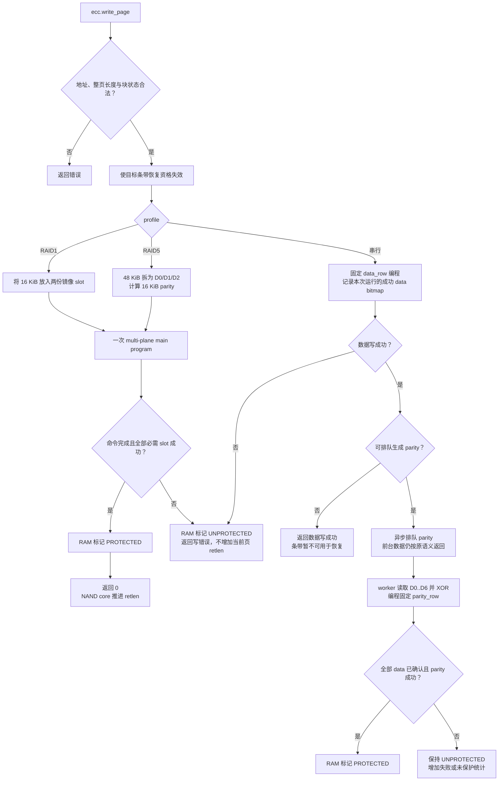
```mermaid
flowchart TD
    W["ecc.write_page"] --> Check{"地址、整页长度与块状态合法？"}
    Check -->|"否"| Reject["返回错误"]
    Check -->|"是"| State["使目标条带恢复资格失效"]
    State --> Mode{"profile"}
    Mode -->|"RAID1"| Mirror["将 16 KiB 放入两份镜像 slot"]
    Mode -->|"RAID5"| XOR["48 KiB 拆为 D0/D1/D2<br/>计算 16 KiB parity"]
    Mirror --> MP["一次 multi-plane main program"]
    XOR --> MP
    MP --> OK{"命令完成且全部必需 slot 成功？"}
    OK -->|"是"| Protected["RAM 标记 PROTECTED"]
    Protected --> Success["返回 0<br/>NAND core 推进 retlen"]
    OK -->|"否"| Failed["RAM 标记 UNPROTECTED<br/>返回写错误，不增加当前页 retlen"]
    Mode -->|"串行"| Data["固定 data_row 编程<br/>记录本次运行的成功 data bitmap"]
    Data --> DataOK{"数据写成功？"}
    DataOK -->|"否"| Failed
    DataOK -->|"是"| Last{"可排队生成 parity？"}
    Last -->|"否"| DataDone["返回数据写成功<br/>条带暂不可用于恢复"]
    Last -->|"是"| Queue["异步排队 parity<br/>前台数据仍按原语义返回"]
    Queue --> Worker["worker 读取 D0..D6 并 XOR<br/>编程固定 parity_row"]
    Worker --> POK{"全部 data 已确认且 parity 成功？"}
    POK -->|"是"| SP["RAM 标记 PROTECTED"]
    POK -->|"否"| SF["保持 UNPROTECTED<br/>增加失败或未保护统计"]
```

多-plane 写入只有 main program 阶段，控制器继续自动生成成员 LDPC；
不额外写 logical OOB，不产生 manifest/header CRC/提交记录。
main program 任一 slot 失败或超时，整逻辑页写返回错误。
逐 slot 状态仍保留用于定位失败，但它不在介质中提供持久事务证明。

串行 parity 排队或写入失败不撤销已持久化 data；其条带保持未保护。
sync 仍等待已经排队的工作结束，见第 11 节。

## 7. 读取、LDPC 与重建

健康 data 优先按固定地址读取；不是通过 parity/镜像来判定哪次写入有效。
RAID5 填满整个 48 KiB 页后才返回。parity 单独失效时三个健康 data 仍可读。

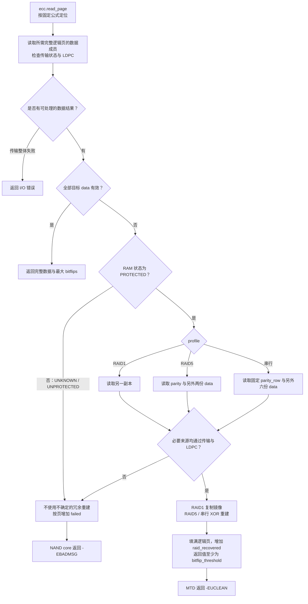
```mermaid
flowchart TD
    R["ecc.read_page<br/>按固定公式定位"] --> Data["读取所需完整逻辑页的数据成员<br/>检查传输状态与 LDPC"]
    Data --> IO{"是否有可处理的数据结果？"}
    IO -->|"传输整体失败"| Err["返回 I/O 错误"]
    IO -->|"有"| Good{"全部目标 data 有效？"}
    Good -->|"是"| Return["返回完整数据与最大 bitflips"]
    Good -->|"否"| Known{"RAM 状态为 PROTECTED？"}
    Known -->|"否：UNKNOWN / UNPROTECTED"| Bad["不使用不确定的冗余重建<br/>按页增加 failed"]
    Known -->|"是"| Mode{"profile"}
    Mode -->|"RAID1"| Peer["读取另一副本"]
    Mode -->|"RAID5"| Sources["读取 parity 与另外两份 data"]
    Mode -->|"串行"| Serial["读取固定 parity_row 与另外六份 data"]
    Peer --> Valid{"必要来源均通过传输与 LDPC？"}
    Sources --> Valid
    Serial --> Valid
    Valid -->|"否"| Bad
    Valid -->|"是"| Rebuild["RAID1 复制镜像<br/>RAID5 / 串行 XOR 重建"]
    Rebuild --> Recovered["填满逻辑页，增加 raid_recovered<br/>返回值至少为 bitflip_threshold"]
    Recovered --> EUC["MTD 返回 -EUCLEAN"]
    Bad --> EBAD["NAND core 返回 -EBADMSG"]
```

多个 data 失效，或目标失效且必要来源也失效，均不可恢复。
没有 data CRC 时，重建结果只有 RAID 假设和来源 LDPC 作为依据，
不能宣称又通过了“目标 CRC 校验”。
两份都通过 LDPC 的镜像若被读到内容不同，不任意选一份作为权威；
报告完整性失败。parity 方程成立也不能单独证明历史事务已提交。

## 8. 掉电、部分写入与 RAM 状态

RAM 按条带保存恢复资格（以及串行的成功 data bitmap）：

| 状态 | 含义 | data 健康读取 | 自动恢复 |
| --- | --- | --- | --- |
| UNKNOWN | 启动后未确认该条带 | 允许，不能证明历史提交完整 | 禁止 |
| UNPROTECTED | 已知写入进行中/失败，或串行 parity 未完成 | 按成员读取，不承诺事务完整性 | 禁止 |
| PROTECTED | 本次运行已确认全部 data 与冗余成员写成功 | 允许 | 允许单成员恢复 |

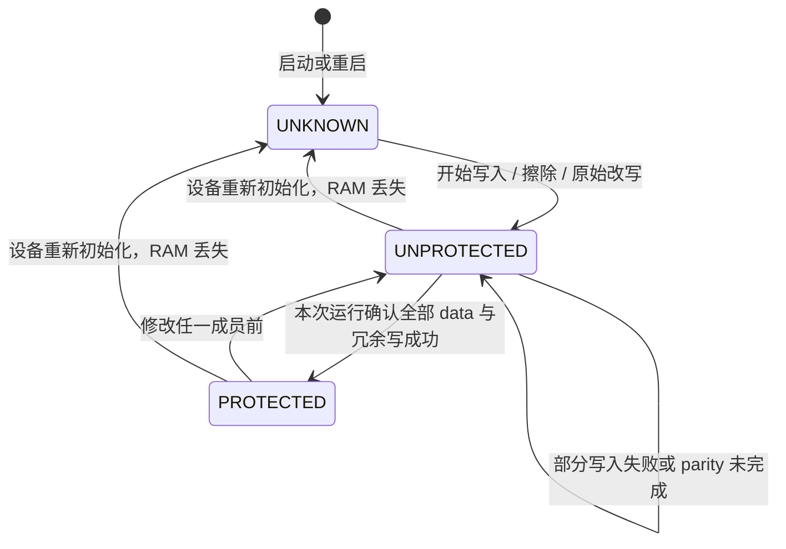
```mermaid
stateDiagram-v2
    [*] --> UNKNOWN: 启动或重启
    UNKNOWN --> UNPROTECTED: 开始写入 / 擦除 / 原始改写
    PROTECTED --> UNPROTECTED: 修改任一成员前
    UNPROTECTED --> PROTECTED: 本次运行确认全部 data 与冗余写成功
    UNPROTECTED --> UNPROTECTED: 部分写入失败或 parity 未完成
    PROTECTED --> UNKNOWN: 设备重新初始化，RAM 丢失
    UNPROTECTED --> UNKNOWN: 设备重新初始化，RAM 丢失
```

此 RAM 状态不落盘，也不以 OOB 标志、外部 bitmap 文件或隐藏日志替代 manifest。
不做启动时的提交清单扫描，不用“parity 非 0xff”作为有效性证明：
parity 可以合法地全为 0xff，擦除态也可能通过 LDPC 的特殊判断。

正常已写条带的数据会持久化；但即使正常关机，重新加载驱动后也没有持久化的
保护资格。因此首版不承诺“重启后直接恢复已损坏成员”。
若必须同时要求无介质元数据和跨重启自动恢复，需要额外的上层有效性契约，
或接受无法区分撕裂写的风险；本设计不默认采用后一种假设。

已知写失败后的 data 仍可部分物理可读，不代表该逻辑页原子提交。
掉电后可能看到一部分新 data、一部分擦除态或失败内容。
驱动不得把这些情况统一伪装为空页或宣称自动回滚成功。

## 9. OOB 与 RAW

物理页布局不变：

```text
main:                     0x0000..0x3fff
logical OOB[0] / BBM:      0x4000
控制器 LDPC:              0x4001..0x4600
logical OOB[1..127]:       0x4601..0x467f
```

取消 manifest 后，logical OOB[1..127] 不再被 RAID 写入。
新介质默认保持 0xff；旧内容不解析也不据此判断布局。
不因此扩大多-plane 用户 OOB 接口。

| 模式 | 目标 oobsize | oobavail | 语义 |
| --- | --- | --- | --- |
| 串行 | 128 | 0 | 保留 PLACE/RAW 公共 OOB，驱动不再自动写旧 RAID 清单 |
| RAID1/RAID5 | 1 | 0 | 仅组 BBM 的公开视图 |

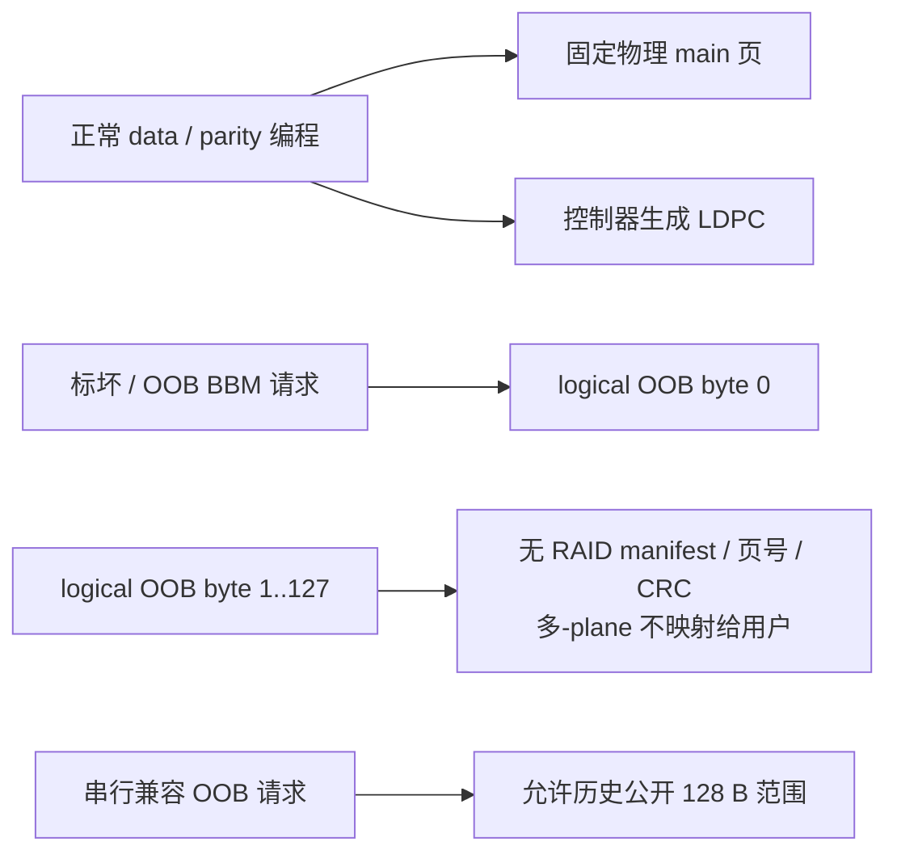
```mermaid
flowchart LR
    Normal["正常 data / parity 编程"] --> Main["固定物理 main 页"]
    Normal --> LDPC["控制器生成 LDPC"]
    Mark["标坏 / OOB BBM 请求"] --> BBM["logical OOB byte 0"]
    Spare["logical OOB byte 1..127"] --> Unused["无 RAID manifest / 页号 / CRC<br/>多-plane 不映射给用户"]
    Serial["串行兼容 OOB 请求"] --> Public["允许历史公开 128 B 范围"]
```

ECC layout 不将 LDPC 声明为用户 OOB。`ecc.size=1024`、
`ecc.strength=40`、`ecc.bytes=0`，steps 为 16 或 48；
bytes=0 仅表示公开 OOB 不含控制器的 LDPC。

多-plane raw main 首版返回 -EOPNOTSUPP，raw OOB 仅访问 1 B BBM。
串行 RAW main 兼容目标仍需要真正绕过 LDPC 的可协商控制器命令；
当前 ABI 无此能力，未来需实现或明确拒绝，不能将 normal ECC 回调别名为 raw。
raw read 不校正/恢复/更新 ECC 统计，raw program 不自动重生成 LDPC。
任何 raw main 改写都使相关条带的 RAM 恢复资格失效。

## 10. 精确几何与 NAND core 补丁

Linux 7.0.12 仍用 page_shift、phys_erase_shift 和掩码计算地址；
48 KiB 页及 1400/1600 页块均不能仅靠改 ID/memorg 接入。

参考并适配：

1. `linux/patches/0001-mtd-rawnand-add-exact-geometry-helpers.patch`。
2. `linux/patches/0002-mtd-rawnand-use-exact-geometry-in-NAND-core.patch`。
3. `linux/patches/0003-mtd-rawnand-use-exact-geometry-in-NAND-BBT.patch`。
4. `linux/patches/0004-mtd-rawnand-add-q3n-core-hooks.patch`。
5. `linux/patches/0005-mtd-rawnand-fix-exact-page-columns.patch`。

覆盖 page/column/target、跨块、最后页、OOB、擦除与 BBT。
普通二次幂 NAND 保留原快路径；MTD core、UBI、UBIFS 不添加 RAID 分支。
补丁通过版本化脚本可重复应用，不以手改 work/linux 代替交付。

## 11. 擦除、BBT 与串行同步

BBT 按逻辑块维护。RAID1 任一镜像成员 BBM 为坏、RAID5 任一组成员为坏，
均报告逻辑坏块；标坏广播到全部成员。串行按原物理块映射处理。
BBT 必须由第 3 节的 nand_scan 核心路径创建并管理；启动时重扫物理 BBM，
不是恢复 manifest，也不是由驱动在 scan 之后再扫描并替换核心 BBT。
OOB-only BBM 更新须同步 RAM BBT，不能等待下次重启才生效。

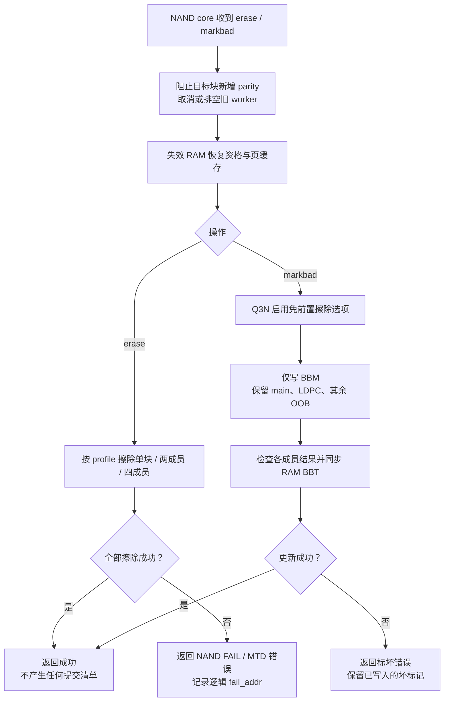
```mermaid
flowchart TD
    U["NAND core 收到 erase / markbad"] --> Stop["阻止目标块新增 parity<br/>取消或排空旧 worker"]
    Stop --> Invalidate["失效 RAM 恢复资格与页缓存"]
    Invalidate --> Type{"操作"}
    Type -->|"erase"| Erase["按 profile 擦除单块 / 两成员 / 四成员"]
    Erase --> EOK{"全部擦除成功？"}
    EOK -->|"是"| Done["返回成功<br/>不产生任何提交清单"]
    EOK -->|"否"| Fail["返回 NAND FAIL / MTD 错误<br/>记录逻辑 fail_addr"]
    Type -->|"markbad"| Skip["Q3N 启用免前置擦除选项"]
    Skip --> OOB["仅写 BBM<br/>保留 main、LDPC、其余 OOB"]
    OOB --> BBT["检查各成员结果并同步 RAM BBT"]
    BBT --> MOK{"更新成功？"}
    MOK -->|"是"| Done
    MOK -->|"否"| MF["返回标坏错误<br/>保留已写入的坏标记"]
```

NAND core 默认 markbad 前擦除，需默认关闭、由 Q3N 选择启用的免擦除扩展，
不能只依赖 legacy.block_markbad。当前 core 补丁已实现该 opt-in 扩展。

串行继续异步 parity；当前 NAND core 的 nand_sync 只获取/释放设备锁，
不会等待驱动 worker。当前 core 补丁增加默认 NULL 的 `nand_chip_ops.sync`
hook；Q3N 使用该 hook，而不覆盖 MTD _sync。

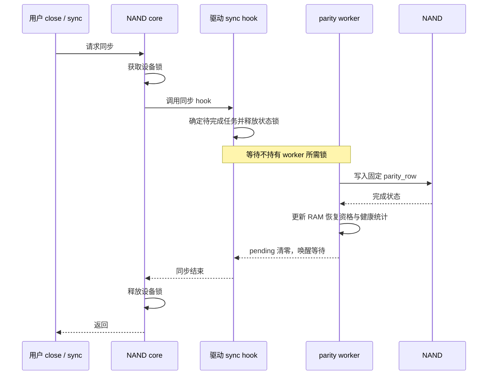
```mermaid
sequenceDiagram
    participant U as 用户 close / sync
    participant C as NAND core
    participant D as 驱动 sync hook
    participant W as parity worker
    participant H as NAND
    U->>C: 请求同步
    C->>C: 获取设备锁
    C->>D: 调用同步 hook
    D->>D: 确定待完成任务并释放状态锁
    Note over D,W: 等待不持有 worker 所需锁
    W->>H: 写入固定 parity_row
    H-->>W: 完成状态
    W->>W: 更新 RAM 恢复资格与健康统计
    W-->>D: pending 清零，唤醒等待
    D-->>C: 同步结束
    C->>C: 释放设备锁
    C-->>U: 返回
```

锁顺序：core 设备/控制器锁 → 驱动状态锁 → MMIO。
worker 不重新获取 core 锁；等待期间释放 worker 所需状态锁。
故障注入须失效 NAND core 页缓存，但模拟单成员读故障不应清除已有
PROTECTED 资格，否则无法检验恢复路径。raw 改写、erase、重新初始化
则必须失效该资格。

## 12. 文件与实施边界

用户已要求按本设计实施；以下为实现边界，完成情况以实施清单和测试结果为准。

| 文件/组件 | 当前职责 |
| --- | --- |
| main.c / priv.h | nand_chip/controller 生命周期、profile 与 RAM 状态 |
| main.c | legacy 命令状态机、ECC 适配与逻辑页编排；不实现 exec_op |
| map.c / mp.c | 保留固定地址计算和 multi-plane 传输 |
| raid.c | 保留 XOR/镜像逻辑，删除新旧 manifest、软件 CRC、持久 generation |
| sched.c | 保留串行调度，去掉清单依赖，维护 RAM data bitmap |
| linux/patches 与脚本 | 精确几何、BBM 免擦除、sync/BBT 通知 |
| QEMU ABI | 保留 main/OOB/LDPC 与 RAID 无关的 multi-plane 命令 |
| 测试与 README | 删除清单相关断言，加入固定映射与 UNKNOWN 限制验收 |

已存在的 raw NAND 介质格式头属于 QEMU 物理存储管理，不作为 RAID 提交依据，
本次不删除它。BBM 和控制器 LDPC 同样不属于被取消的 manifest。

## 13. 验收矩阵与限制

- 三模式正确注册 NAND core，驱动不覆盖 MTD I/O callbacks。
- 固定公式覆盖首尾页、跨块、两 die 分布、RAID1 两组镜像、
  RAID5 parity 0/1/2/3 轮转与串行 parity_row。
- 正常 data/parity 写不产生任何 RAID OOB program；
  允许控制器更新 LDPC，BBM/OOB 请求单独计数。
- 多-plane 全成功才写成功；部分失败/超时使 RAM 状态不可恢复；
  不再测试“无 manifest 自动回滚”。
- PROTECTED 条带单故障恢复并报告 EUCLEAN；必要来源双故障报告 EBADMSG；
  直接验证数据、errno、retlen 和统计，不只看 shell marker。
- 重启后状态为 UNKNOWN；健康 data 持久化可读，
  单目标失败明确拒绝自动恢复，不用擦除态 parity 误恢复。
- 无清单的写中掉电只验证边界与错误处理，不宣称旧值/新值原子切换。
- 串行已写 data 可读、D6 排队失败、parity 失败、sync/close、
  P0>P1>P2、erase/markbad/remove 并发均有回归。
- 公开 OOB 与 BBM 正确，markbad 保留 main/LDPC；
  地址错误、静默损坏和历史事务有效性不由软件 CRC 兜底。
- 非二次幂 core/BBT 与普通 nandsim 回归通过，无未调查的锁错误或 RCU stall。

本方案以较简单的固定映射和一次 main program 换取较弱的事务判定能力。
它取消 manifest，但不取消 parity、LDPC 或 BBM。
跨重启损坏恢复与掉电原子性均不是本方案的默认保证。
