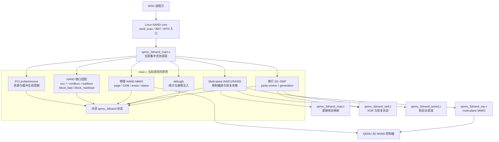
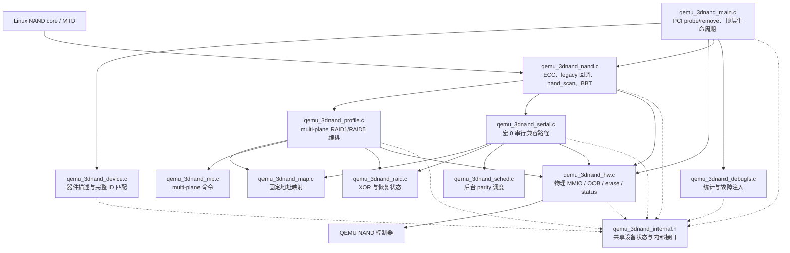
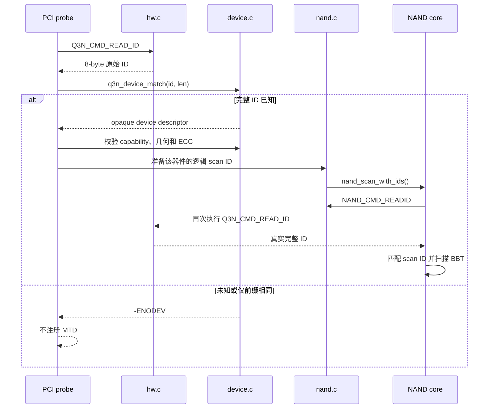
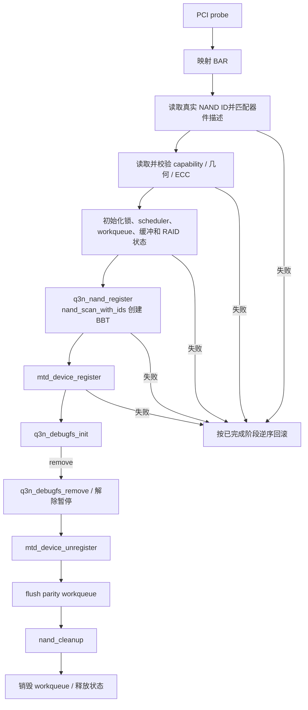

# QEMU 3D NAND Linux 驱动按功能拆分设计

日期：2026-09-13

状态：已确认，等待实现计划评审

## 1. 背景与目标

当前 Linux 驱动的 `qemu_3dnand_main.c` 接近 3000 行，同时承担 PCI
生命周期、控制器 MMIO、NAND core 接口、串行 RAID、multi-plane RAID、
后台 parity、debugfs 和故障注入。共享状态和调用关系集中在一个翻译单元中，
不利于后续增加器件描述或独立修改某条数据路径。

本次重构目标如下：

- 只重构 Linux 驱动的组织结构，不重构 QEMU 控制器实现。
- 按功能拆分 `.c` 文件，形成单向、可说明的依赖关系。
- 保持 MTD/NAND 对外接口、介质布局、容量、OOB、BBT、错误码和 RAID 行为不变。
- 保留 `Q3N_ENABLE_MULTIPLANE_RAID=0|1` 两种编译配置。
- 将器件定义和完整 NAND ID 匹配放入独立的器件模块，便于后续增加非 YMTC
  器件。
- 新建或重构后的普通函数原则上不超过 50 个有效代码行。

唯一允许的外部行为修正是 QEMU `Q3N_CMD_READ_ID` 返回值与首个器件描述一致，
由当前的 `2c d7 90 a6 51 33 4e 44` 改为：

```text
9c d7 98 a6 51 33 4e 44
```

## 2. 非目标

- 不改变 RAID1/RAID5 的固定逻辑页到物理页映射。
- 不改变连续逻辑块在两个 die 间的现有分布。
- 不增加 manifest、介质 CRC、FTL 或持久化恢复状态。
- 不重新设计 `map.c`、`mp.c`、`raid.c` 和 `sched.c` 中已有算法。
- 不增加尚无实际器件需求的通用厂商 ops 框架。
- 不把内部重构扩展成 QEMU 控制器侧的文件拆分。
- 不新增串行 RAID 功能；宏 0 只保持现有兼容行为。

## 3. 当前代码架构逻辑视图



主要问题不是已有算法文件不够多，而是 `main.c` 仍是所有功能的共同所有者，
导致 PCI 生命周期、NAND 回调和 RAID 实现相互可见。

## 4. 方案比较与选择

### 4.1 采用方案：按职责拆分，共享单一设备状态

移动现有函数并建立内部 API；各模块共享一个 `struct qemu_3dnand`，不在纯重构
阶段引入子系统对象图。该方案能显著缩小 `main.c`，同时保留现有锁和资源生命
周期。

### 4.2 未采用：子系统 context + ops

为 NAND、profile、serial 和 debugfs 分配独立 context，边界最强，但需要迁移
大量共享状态，并改变 worker、锁和错误回滚关系。该方案超出行为不变重构范围。

### 4.3 未采用：只拆 MMIO 和 debugfs

风险较低，但 ECC、NAND core、multi-plane 和串行 parity 仍会留在 `main.c`，
不能解决主要维护问题。

## 5. 目标架构逻辑视图



依赖方向必须保持自上而下：`main/nand/debugfs` 可以调用数据路径模块，数据路径
模块可以调用基础算法和硬件模块；`hw/map/mp/raid/sched` 不得反向调用 NAND、
debugfs 或 PCI 生命周期。

## 6. 文件职责和接口边界

| 文件 | 责任 | 不得承担的责任 |
| --- | --- | --- |
| `qemu_3dnand_main.c` | module parameter、PCI probe/remove、顶层初始化与统一错误回滚 | 页 I/O、RAID 算法、debugfs 属性实现 |
| `qemu_3dnand_internal.h` | 完整 `struct qemu_3dnand`、私有元数据结构、锁契约、跨模块声明 | 控制器公开 ABI、函数实现 |
| `qemu_3dnand_device.c` | YMTC 描述表、完整 ID 匹配、器件约束校验、生成运行时 scan ID | 控制器寄存器访问、NAND core 注册 |
| `qemu_3dnand_hw.c` | 基础寄存器访问、READID、物理 page/OOB/erase/status、控制器 fault 命令 | 逻辑地址、RAID、MTD 语义 |
| `qemu_3dnand_nand.c` | OOB layout、ECC/legacy 回调、attach、`nand_scan_with_ids`、MTD 注册 | parity 算法、物理布局公式 |
| `qemu_3dnand_profile.c` | multi-plane RAID1/RAID5 读写、恢复资格、成员 BBM 合成和广播 | PCI/debugfs、串行后台 parity |
| `qemu_3dnand_serial.c` | 宏 0 的串行 D0..D6/P、generation、parity worker 和兼容 MTD helper | multi-plane descriptor 编排 |
| `qemu_3dnand_debugfs.c` | 统计读取、故障注入入口、debugfs 创建与移除 | 初始化资源所有权、页布局 |
| `qemu_3dnand.h` | 与 QEMU 共享的寄存器、命令、capability 和介质 ABI | 厂商器件表、驱动共享状态 |
| `qemu_3dnand_priv.h` | 现有映射、RAID、scheduler、multi-plane 算法类型和可测试 API | PCI/NAND core 对象 |

`qemu_3dnand_device.c` 中的 descriptor 保持私有。其他模块通过窄接口取得名称、
验证结果和运行时 `nand_flash_dev`，不直接依赖 descriptor 字段布局。未来确有
厂商特定命令时，再基于实际差异增加 quirk 或 ops。

## 7. 器件识别和扩展

首个器件记录为：

```text
名称：YMTC QEMU 3D NAND
完整 ID：9c d7 98 a6 51 33 4e 44
```

器件描述至少包含：

- 厂商和型号名称；
- 完整 ID 和 ID 长度；
- 必需 capability；
- die/plane 数量；
- page、物理 OOB、pages-per-block 约束；
- ECC step、strength、LDPC bytes/steps 约束；
- 可用的 multi-plane RAID 能力。

识别流程如下：



匹配必须使用 descriptor 声明的全部 ID 字节，不能只比较厂商字节或前缀。
Linux 驱动不再在 `cmdfunc(NAND_CMD_READID)` 中伪造 ID。

## 8. 函数长度和可维护性约束

- 本次新增或迁移后的普通函数不超过 50 个有效代码行。
- 函数签名、空行和纯注释不计入有效代码行；函数体中的实际语句和控制结构计入。
- 长 `probe` 拆为硬件发现、几何解析、公共状态初始化、缓冲分配和子系统注册。
- 长 parity worker 拆为等待、调度获取、读取重建、提交和收尾阶段。
- 长 ECC/OOB 回调拆为参数/映射准备、传输、结果合成和统计更新。
- debugfs 按 fault、RAID、scheduler 和硬件统计分组注册。
- 不允许用没有独立语义的单行 wrapper 规避限制。
- 新增仓库内检查脚本，对本次重构涉及的 Linux 驱动实现文件执行 50 行检查。
- 若将来确有无法拆分的函数，必须在检查脚本允许列表中按函数名记录理由；本次
  重构不预留例外。

## 9. 共享状态和锁契约

纯重构阶段继续使用一个 `struct qemu_3dnand`，避免改变内存生命周期。结构体
移到 `qemu_3dnand_internal.h`，按以下域分组：设备/PCI、NAND core、硬件几何、
multi-plane profile、串行 parity、缓冲区、统计/debugfs。

- 名称带 `_locked` 的物理操作要求调用方持有 `mtd_lock`，自身不得重复加锁。
- NAND ECC/legacy 回调构成上层锁边界，再调用 profile 或 serial 子系统。
- parity worker 保持现有 scheduler 与 `mtd_lock` 的获取/释放顺序。
- `q3n_sched` 继续只使用自身 spinlock。
- `hw.c`、`map.c` 和 `mp.c` 不获取 NAND core 的设备锁。
- `debugfs.c` 修改共享故障状态时继续遵守对应的 mutex/atomic/READ_ONCE 契约。
- 跨模块 API 在声明旁注明调用方是否必须持锁，不能仅依赖函数实现推断。

## 10. 初始化、扫描和清理顺序



`nand_scan` 可能立即调用 READID、OOB 和 ECC 回调，因此器件描述、硬件几何、
所有回调依赖的缓冲和锁必须在扫描前就绪。MTD 必须在 BBT 创建成功后注册。

## 11. 迁移顺序

1. 建立重构前双宏构建和运行测试基线。
2. 新增 `internal.h`，只移动共享结构和内部声明。
3. 新增 `device.c` 和器件匹配测试；修正 QEMU READID 后完成 Linux/QEMU 联调。
4. 移出 `hw.c`，保持所有 `_locked` 调用点和错误返回不变。
5. 移出 `profile.c`，逐项验证 RAID1/RAID5 映射、恢复和 BBM。
6. 移出 `serial.c`，验证宏 0 能构建且不注册 multi-plane 坏块回调。
7. 移出 `nand.c`，重新验证 `nand_scan`、BBT、ECC/OOB、erase 和 sync。
8. 移出 `debugfs.c`，验证文件名、权限、统计值和 fault 行为不变。
9. 将 `main.c` 收敛为顶层生命周期，统一错误回滚并检查函数长度。
10. 更新 overlay、Makefile、测试路径和架构文档，执行完整验证矩阵。

每一步先移动一个职责组，构建和测试通过后再进入下一步，避免一次大规模搬移后
无法定位链接、锁或生命周期回归。

## 12. 兼容性不变量

除 READID 修正外，下列行为必须与重构前一致：

- `Q3N_ENABLE_MULTIPLANE_RAID=1` 默认启用；RAID1/RAID5 由 `raid_level` 选择。
- multi-plane RAID 的成员始终位于同一 die、同 block/row、不同 plane。
- RAID1 为 16 KiB 逻辑页，RAID5 为 48 KiB 逻辑页。
- 固定 parity/mirror 映射、恢复资格和重启后 UNKNOWN 语义不变。
- multi-plane 模式才注册 `legacy.block_bad/block_markbad`；宏 0 不接管。
- `nand_scan_with_ids` 创建标准 RAM BBT，驱动不维护竞争 BBT。
- 擦除继续使用 `cmdfunc + waitfunc`，不注册 `exec_op`。
- OOB 仍只公开 BBM，main/LDPC 数据和其余物理 OOB保持保护。
- probe、失败回滚和 remove 不泄漏 workqueue、NAND 或 debugfs 资源。
- 现有 debugfs 文件名、权限和统计含义不变。

## 13. 验证矩阵

| 配置 | 编译验证 | 自动测试 | 运行验证 |
| --- | --- | --- | --- |
| multi-plane=1, RAID1 | 完整 Linux 内核和模块构建 | KUnit、函数长度、器件匹配 | RAID1 smoke |
| multi-plane=1, RAID5 | 完整 Linux 内核和模块构建 | KUnit、映射、恢复和 overlay | RAID5、KUnit、持久化 smoke |
| multi-plane=0 | 完整 Linux 内核和模块构建 | 生成物不包含/不注册 multi-plane 坏块回调 | 现有串行 smoke 仅在重构前基线可通过时作为门禁 |
| QEMU | 完整 QEMU 构建 | controller READID 精确为 YMTC ID | 与 Linux `nand_scan` 联调 |
| 未知/近似 ID | Linux 器件单元测试 | 完整 ID 不匹配并返回 `-ENODEV` | 不注册 MTD |

公共静态门禁还包括 `git diff --check`、core patch 可重复应用测试、overlay 测试和
脚本结构测试。最终对照重构前记录，比较 MTD size/writesize/erasesize/oobsize、
BBT 扫描结果、RAID 映射、ECC 错误和 debugfs 统计。

## 14. 验收标准

- Linux 驱动按第 6 节完成文件拆分，依赖方向无环。
- `qemu_3dnand_main.c` 只保留顶层生命周期，不再包含页 I/O、RAID 或 debugfs
  实现。
- 首个 YMTC 器件由 `device.c` 的完整 ID 表匹配，未知 ID 不注册 MTD。
- QEMU 和 Linux 对 `9c d7 98 a6 51 33 4e 44` 的 READID 结果一致。
- 本次新增和迁移函数通过 50 行自动检查且无例外。
- 宏 0、宏 1 均完整构建；RAID1、RAID5 和持久化运行测试通过。
- 没有改变第 12 节列出的兼容性不变量。
